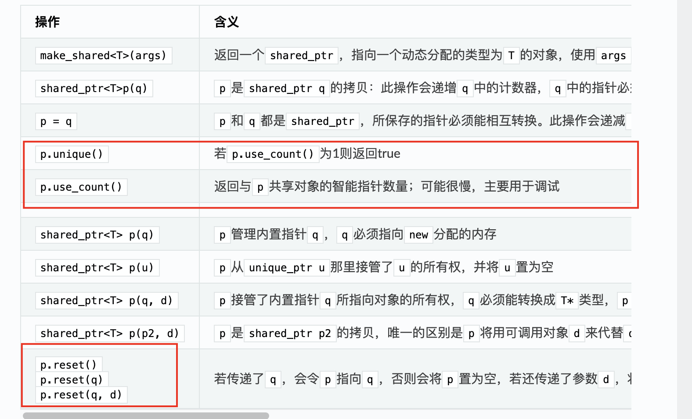

# 智能指针

## 类型

为了更容易且更安全地使用动态内存，新的标准库提供了智能指针类型来管理动态对象：

- `shared_ptr`：允许多个指针指向同个对象
- `unique_ptr`：“独占”所指向的对象
- `weak_ptr`：弱引用，指向`shared_ptr`所管理的对象

## C++类管理动态生存期资源的表现：行为像值或者指针

通常管理类外资源的类需要通过析构函数来释放对象所分配的资源，根据“三/五原则”它也必须自定义拷贝构造函数和拷贝赋值运算符（`delete`拷贝构造函数和拷贝赋值运算符也算自定义的一种）

==对于管理类外资源的类==，根据如何拷贝指针成员我们可以大致分为如下三类：

- 既不像值也不像指针的类：`IO`类型和`unique_ptr`这种不允许拷贝和赋值的类
- 行为像值的类：标准库容器和`string`类
- 行为像指针的类：`shared_ptr`

## shared_ptr和unique_ptr共有的操作

| 操作                                  | 含义                                                         | 备注 |
| ------------------------------------- | ------------------------------------------------------------ | ---- |
| `shared_ptr<T> sp` `unique_ptr<T> up` | 空智能指针，可以指向类型为`T`的对象                          |      |
| `p`                                   | 将`p`作为一个条件判断，若`p`指向一个对象则为true             |      |
| `*p`                                  | 解引用`p`，获得它指向的对象                                  |      |
| `p->mem`                              | 等价于`(*p).mem`                                             |      |
| `p.get()`                             | 返回`p`中保存的指针，要小心使用，如果智能指针释放了其对象，返回的指针所指向的对象也就消失了 |      |
| `swap(p,q)` `p.swap(q)`               | 交换`p`和`q`中的指针                                         |      |

## shared_ptr独有的操作



## 智能指针与异常

如果使用智能指针，那么即使程序块过早结束，那么智能指针类也能确保在内存不再需要时将其释放：

```
void f() {
    shared_prt<int> sp(new int(42));  // 分配一个新对象
    // 这段代码抛出异常, 且在f中未被捕获
}   // 函数结束时shared_ptr自动释放内存
```

与之相对的是，如果使用内置指针管理内存 ，且在`new`之后在对应的`delete`之前发生了异常，则内存不会被释放：

```c++
void f() {
    int *pi = new int(42);  // 动态分配一个新对象
    // 这段代码抛出异常, 且在f中未被捕获
    delete pi;              // 抛出异常后不会走到这里, 这块内存不会被释放
}
```

## unique_ptr

### 1. 简介

一个`unique_ptr`“拥有”它所指向的对象，与`shared_ptr`不同，某个时刻只能有一个`unique_ptr`指向一个给定对象。当`unique_ptr`被销毁时，它所指向的对象也被销毁。

### 2. 提供的操作

| 操作                                        | 含义                                                         | 备注 |
| ------------------------------------------- | ------------------------------------------------------------ | ---- |
| `unique_ptr<T> u1`                          | 空`unique_ptr`对象，`u1`调用`delete`来释放它的指针           |      |
| `unique_ptr<T, D> u2`                       | 空`unique_ptr`对象，`u2`会使用一个类型为`D`的可调用对象来释放它的指针 |      |
| `unique_ptr<T, D> u(d)`                     | 空`unique_ptr`对象，指向类型为`T`的对象，用类型为`D`的对象`d`来代替`delete` |      |
| `u = nullptr`                               | 释放`u`指向的对象，将`u`置为空                               |      |
| `u.release()`                               | ==`u`放弃对指针的控制权，返回指针，并将`u`置为空==           |      |
| `u.reset()` `u.reset(q)` `u.reset(nullptr)` | ==释放`u`指向的对象，如果提供了内置指针`q`，令`u`指向这个对象；否则将`u`置为空== |      |

> Tips：`reset()`方法接受一个可选的指针参数，令`unique_ptr`重新指向给定的指针，如果`unique_ptr`不为空，则它原来指向的对象将被释放。调用`release()`方法会切断`unique_ptr`和它原来管理的对象之间的联系，`release()`方法返回的指针通常被用来初始化另一个智能指针或者给另一个智能指针赋值。如果我们不用另一个智能指针来保存`release()`返回的指针，那么我们的程序就必须负责资源的释放。

虽然我们不能拷贝或赋值`unique_ptr`，但是我们可以通过`release`或`reset`将指针的所有权从一个非`const`的`unique_ptr`转移到另一个`unique_ptr`：

```c++
// release()将指针所有权从p1转向p2, 并将p1置为空
unique_ptr<string> p1(new string("tomocat"));
unique_ptr<string> p2(p1.release());

// 将所有权从p3转向p2
unique_ptr<string> p3(new string("cat"));
p2.reset(p3.release());
```

不能拷贝`unique_ptr`有一个例外：我们可以拷贝或赋值将要被销毁的`unique_ptr`，最常见的例子就是从函数返回一个`unique_ptr`：

```c++
unique_ptr<int> clone(int p) {
    // 正确: 从int*创建一个unique_ptr<int>
    return unique_ptr<int>(new int(p));
}

// 还可以返回一个局部对象的拷贝
unique_ptr<int> clone(int p) {
    unique_ptr<int> ret(new int(p));
    // ...
    return ret;
}
```

## weak_ptr

### 1. 简介

> Tips：一旦最后一个指向对象的`shared_ptr`被销毁，即使有`weak_ptr`指向对象，该对象也还是会被释放。

`weak_ptr`是一种不控制所指向对象生存期的智能指针，它指向一个`shared_ptr`管理的对象，但是将一个`weak_ptr`绑定到一个`shared_ptr`不会改变`shared_ptr`的引用计数。

### 2. 提供的操作

| 操作                | 含义                                                         | 备注 |
| ------------------- | ------------------------------------------------------------ | ---- |
| `weak_ptr<T> w`     | 空`weak_ptr`，可以指向类型为`T`的对象                        |      |
| `weak_ptr<T> w(sp)` | 与`shared_ptr sp`指向相同对象的`weak_ptr`                    |      |
| `w = p`             | `p`可以是一个`shared_ptr`或是一个`weak_ptr`，赋值后`w`和`p`共享对象 |      |
| `w.reset()`         | 将`w`置为空                                                  |      |
| `w.use_count()`     | 与`w`共享对象的`shared_ptr`数量                              |      |
| `w.expired()`       | 若`w.use_count()`为0则返回true                               |      |
| `w.lock()`          | ==如果`expired`为true，返回一个空`shared_ptr`，否则返回一个指向`w`的`shared_ptr`== |      |

### 3. 访问对象

由于对象可能不存在，因此我们不能直接使用`weak_ptr`访问对象，必须调用`lock`函数检查指向的对象是否仍存在：

```c++
// 初始化一个weak_ptr
auto p = make_shared<int>(42);
weak_ptr<int> wp(p);

// 判断weak_ptr指向的对象是否仍存在
if (shared_ptr<int> np = wp.lock()) {
    // do something
}
```

## 智能指针与动态数组

标准库提供了一个可以管理`new`分配数组的`unique_ptr`版本，对应的操作如下：

> Tips：指向动态数组的`unique_ptr`不支持成员访问运算符（点和箭头运算符），其他`unique_ptr`操作不变。

| 操作                   | 含义                                           |
| ---------------------- | ---------------------------------------------- |
| `unique_ptr<T[]> u`    | `u`可以指向一个动态分配的数组，数组元素类型为T |
| `unique_ptr<T[]> u(p)` | `u`可以指向内置指针`p`所指向的动态分配的数组   |
| `u[i]`                 | 返回`u`拥有的数组中位置`i`处的对象             |

```c++
// up指向10个未初始化的int数组, 当up销毁它管理的指针时会自动使用delete[]
unique_ptr<int[]> up(new int[10]);

// 使用下标运算符来访问数组元素
for (size_t i = 0; i != 10; ++i) {
    up[i] = i;
}
```

`shared_ptr`不支持管理动态数组，强行管理的话必须提供自己定义的删除器：

```c++
// 定义一个shared_ptr管理int数组, 传递一个lambda表达式作为删除器
shared_ptr<int> sp(new int[10], [](int *p) { delete[] p; });

// shared_ptr未定义下标运算符, 并且不支持指针的算数运算
for (size_t i = 0; i != 10; ++i) {
    *(sp.get() + i) = i;
}

// 使用lambda释放数组
sp.reset();
```
