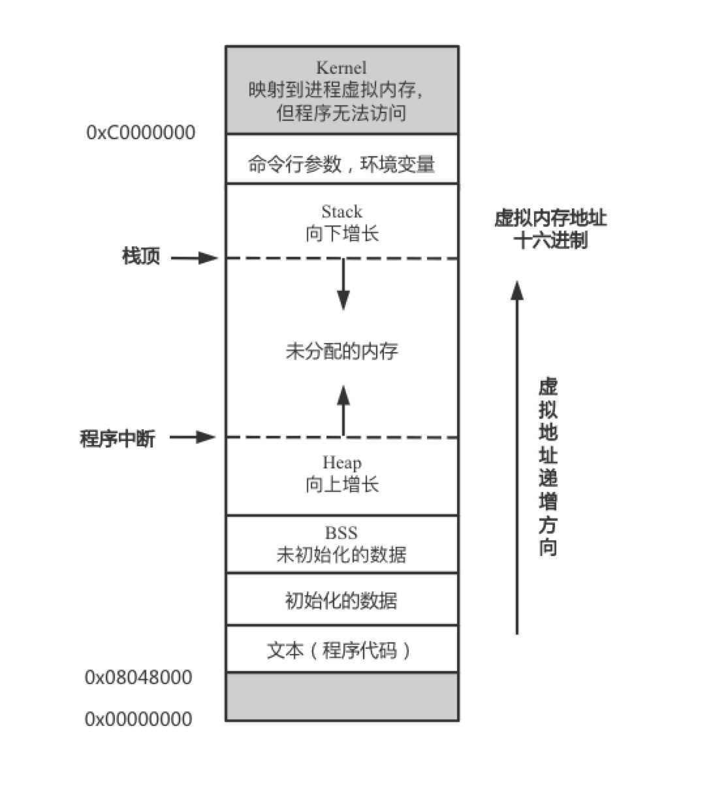

# C++中内存分配

## Linux 虚拟内存分区



Linux 虚拟内存按照虚拟地址从低到高增长方向可以分为五区：

### 1. 代码段（Text Segment）

代码段存放程序执行代码的一段内存区域，这部分区域的大小在程序运行前就已经确定，并且内存区域通常属于只读（不过某些架构也允许修改程序）。代码段中的指令包括操作码和被操作对象（或对象地址引用）。

* 只读变量：只包含在代码段中
* 局部变量：在栈区分配内存空间并引用
* 全局变量：引用 BSS 段或 Data 段中的地址

> TODO：C++ 中只读变量与常量的区别？通过代码验证什么样的内容是只读变量，什么样的内容是常量，它们分别存储在哪个区。

### 2. 数据段（Data Segment）

静态内存分配，存放静态变量、初始化的全局变量和常量。

### 3. Block Started by Symbol（BSS Segment）

静态内存分配，包含了程序中未初始化的全局变量，==在内存中 BSS 段全部置为零==。

### 4. 堆（heap）

动态内存分配，当进程调用 malloc 等函数分配内存时，堆会扩张用于存放新申请的变量，使用 free 等函数释放内存时，被释放的内存从堆中删除。

### 5. 栈（stack）

存放函数的局部变量（即在函数括弧`{}`中定义的变量），除此之外在函数被调用时参数也会被压入栈中，函数调用结束后函数的返回值也会被存放在栈中。

另外，栈具有后进先出的特点，经常用于保存/恢复调用现场，这也是我们在程序 crash 时打印 stack 的原因。

## C++程序的内存分配

一个由 C/C++ 编译的程序占用的内存分为如下几个部分：

* 栈区（stack）：由编译器自动分配释放，存放函数的参数值、局部变量值等，其操作方式类似于数据结构中的栈（后进先出）。
* 堆区（heap）：操作系统维护的一块可供动态分配的特殊内存，程序运行时调用`malloc()`从堆上申请内存，调用`free()`返还内存。注意它与数据结构中的堆不一样，分配方式倒是类似于链表。
* 自由存储区（free store）：一般由程序员主动申请（new）和释放（delete），如果程序员忘记释放申请的内存则可能存在内存泄漏，这些内存只能等到程序结束后被操作系统自动回收。
* 全局区/静态区（static）：全局变量和静态变量的存储时放在一起的，初始化的全局变量和静态变量在一块区域，未初始化的全局变量和未初始化的静态变量在相邻的另一块区域，程序结束后由操作系统释放。
* 常量存储区：存放不允许修改的常量（不过也可以通过非正当手段修改）。
* 程序代码区：存储函数体（类的成员函数和全局函数）的二进制代码。

```c++
int  a = 0;  // 全局初始化区
char *p1;    // 全局未初始化区

int  main() {
    int  b;           // 栈区
    char  s[]="abc";  // 栈区
    char  *p2;        // 栈区

    char  *p3 = "123456";  // "123456"在常量区, p3 在栈区

    static int c = 0;      // 全局初始化区
}
```

## C++和 Linux 内存分区的区别

对于运行在 Linux 上的 C++ 程序， C++ 和 Linux 虚拟内存的内存分布中栈区、堆区和程序代码区是相互对应的。Linux 虚拟内存中 data 段存储了 C++已经初始化的全局变量和静态变量和常量，BSS 段存储了未初始化的全局变量和静态变量，这些未初始化的数据在程序执行前会自动被操作系统置零。

## 自由存储区 free store 与堆 heap 的区别

很多编译器的`new`和`delete`都是通过`malloc`和`free`来实现的，那么有一个问题：

> Q：以`malloc`实现的`new`，所申请的内存是在堆上还是在自由存储区上？

* 堆：C 语言和操作系统的术语，指的是操作系统维护的一块提供动态分配功能的特殊内存（可以通过`malloc`和`free`来动态地申请和释放内存）。
* 自由存储区：C++ 的术语，指的是通过`new`和`delete`动态分配和释放内存的内存区域。

> A：C++ 编译器默认使用堆来实现自由存储，即缺省的全局运算符`new`和`delete`是通过`malloc`和`free`来实现的。这时候以`malloc`实现的`new`既可以说是在堆上也可以说在自由存储区上（前者是具象的概念，后者是抽象的概念）。不过程序员可以通过重载`new`操作符来使用其他内存实现自由存储，此时自由存储区和堆就不是同一个概念了。

## 堆栈区别

| 区别     | 栈                                                           | 堆                                                           |
| -------- | ------------------------------------------------------------ | ------------------------------------------------------------ |
| 管理方式 | 编译器自动分配释放                                           | 程序员分配释放，容易产生内存泄漏                             |
| 空间大小 | 一般都是有一定的空间大小限制的（比如 1M），不过我们可以调整   | 在 32 位系统下堆内存可以达到 4G 大小，空间足够大                 |
| 碎片问题 | 不存在碎片问题                                               | 存在内存碎片问题                                             |
| 生长方向 | 栈向着内存地址减小的方向生长（向下）                         | 堆向着内存地址增加的方向生长（向上）                         |
| 分配方式 | 静态分配由编译器完成（比如分配局部变量），动态分配由 malloc 函数进行分配（但是编译器会帮我们释放） | 只有动态分配而无静态分配                                     |
| 分配效率 | 栈是操作系统提供的数据结构，计算机会在底层对栈提供支持（比如分配专门的寄存器存放栈的地址，压栈出栈都有专门的指令执行），分配效率较高 | 堆是 C/C++函数库提供的，实现机制比较复杂（比如为了分配一块内存，库函数会按照一定的算法在堆内存中搜索可用的足够大的空间，当没有合适的空间（比如内存碎片太多）时可能通过系统调用去增加堆段的内存空间），分配效率较低 |
| 系统响应 | 只要栈的剩余空间大于所申请空间就可以分配成功，否则会抛出栈溢出的异常 | 操作系统存在一个记录空闲内存地址的链表，分配堆内存时会遍历链表寻找第一个空间大于所申请空间的堆节点，然后将该节点从空闲节点链表中删除，并将该节点的空间分配给程序。大多数系统还会在这块内存空间中的首地址记录本次分配的大小，这样 delete 语句才能正确释放本内存空间。由于找到的堆节点大小不一定正好等于申请内存的大小，因此系统会自动将多余的部分重新放入空闲链表中 |
| 存储内容 | 在函数调用时，第一个入栈的是函数调用语句的下一条可执行语句的地址，然后是函数的各个参数，最后是函数中的局部变量。本次函数调用结束后，按照先进后出的方式依次弹出局部变量、函数参数和栈顶指针。程序根据栈顶指针指向的地址继续运行 | 一般在堆的头部用一个字节存放堆的大小，堆中的具体内容由程序员安排 |
| 内存越界 | 栈内存越界情况大多出现在数组下标超过数组定义长度，后果导致覆盖其他变量 | 堆内存越界主要是操作的内存超过了 calloc/malloc/new 等在堆上分配内存的内存大小，后果导致下次 calloc/malloc/new 抛出`_int_malloc`错误（引起 abort） |

和栈相比，堆存在如下缺点：

* 由于大量 new/delete 的使用容易产生大量的内存碎片
* 没有专门的系统支持，分配效率较低
* 可能引发用户态和核心态的切换

因此在平时编程过程中我们应该尽量使用栈空间，不过栈空间不是那么灵活，在分配大量内存空间时使用堆空间更好一点。

## 静态内存、栈内存和堆

* 静态内存：用于保存局部`static`、类`static`数据成员和定义在任何函数之外的变量
* 栈内存：保存定义在函数内的非`static`对象

分配在静态内存或者栈内存的对象由编译器自动创建和销毁，对于栈对象仅在其定义的程序块运行时才存在，`static`对象在使用之前分配，在程序结束时销毁。

C++ 程序还拥有一个内存池（被称为自由空间`free store`或者堆`heap`，两者的区别在前面已经描述了），程序用内存池来存储动态分配的对象，当动态对象不再使用时，我们的代码必须显式销毁他们。

## Reference

[1] <https://blog.csdn.net/u013007900/article/details/79338653>

[2] <https://chenqx.github.io/2014/09/25/Cpp-Memory-Management/>

[3] <https://www.cnblogs.com/QG-whz/p/5060894.html>
