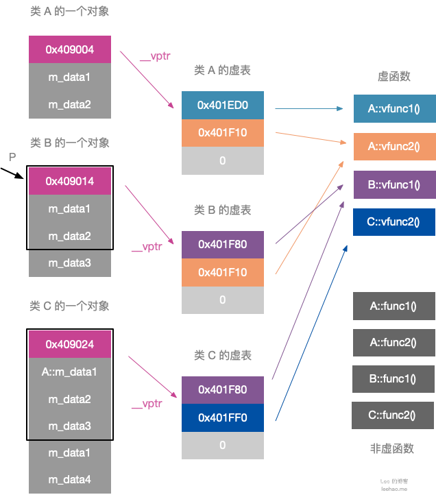

# 虚函数表与动态绑定

## 虚函数

面向对象语言具有三个最基本的特征：封装、继承和多态，在 C++ 中多态指的是当我们使用基类的指针或者引用调用一个虚函数成员时会执行动态绑定，由于我们直到运行时才能直到到底调用哪个版本的虚函数，**因此所有的虚函数都必须有定义**。

> 虚函数定义：在 C++ 语言中，基类将类型相关的函数与派生类不做改变直接继承的函数区别对待。对于某些函数，基类希望它的派生类各自定义适合自身的版本，此时基类就将这些函数声明成虚函数（virtual function）。

## 多态类型

在 C++ 中多态类型指的是声明或继承了至少一个虚函数的类型，反之则为非多态类型。

> typeid 运算符：当运算对象不属于类类型或者是一个不包含任何虚函数的类时，typeid 运算符返回运算对象的静态类型；当运算对象是定义了至少一个虚函数的类的左值时，typeid 的结果直到运行时才能求得。

### 1. 非多态类型

对于非多态类型的变量，其类型信息都可以在编译期间确定，比如：

```c++
#include <iostream>
#include <typeinfo>

struct Cat {
    void foo() {}
};

Cat cat;

int  main() {
    // 可以在编译时确定 cat 的类型为 Cat, 由于 Cat 有三个字符, 因此输出"3Cat"
    std::cout << typeid(cat).name() << std::endl;

    // 可以在编译时确定 A::foo 在内存中的地址
    cat.foo();

    // 尽管 A 为空，但由于需要在内存中确定 a 的地址，因此 A 类型对象所占空间为 1 个字节
    std::cout << sizeof(cat) << std::endl;
}


// 输出:
3Cat
1
```

### 2. 多态类型

对于多态类型（定义了至少一个虚函数的类类型），它的一些信息必须直到运行时才可以确定，例如它的动态类型、调用的虚函数地址等。

```c++
#include <iostream>
#include <typeinfo>

// 基类
struct Base {
    virtual std::string foo() { return "Base::foo"; }
};

// 派生类
struct SubClass : Base {
    std::string foo() override { return "SubClass::foo"; }
};

int  main() {
    SubClass sub_class;

    // pb 静态类型是 Base*, 动态类型是 sub_class*
    Base *pb = &sub_class;

    // decltype 返回静态类型, 因此输出 4Base
    std::cout << "typeid(decltype(*pb)).name(): " << typeid(decltype(*pb)).name() << std::endl;
    // typeid 返回动态类型, 因此输出 8SubClass
    std::cout << "typeid(*pb).name(): " << typeid(*pb).name() << std::endl;

    // 调用 SubClass::foo()(动态绑定), 输出 SubClass::foo
    std::cout << pb->foo() << std::endl;
}

// 输出:
typeid(decltype(pb)).name(): 4Base
typeid(pb).name(): 8SubClass
SubClass::foo
```

## 虚函数表

为了实现 C++ 多态，C++ 使用了动态绑定的技术，而实现动态绑定依赖的便是虚函数表。

> 动态绑定定义：我们可以使用相同的代码处理基类的指针或引用，运行时会根据基类指针或引用的动态类型去调用对应的虚函数版本

### 1. 类的虚函数表

* 包含虚函数的类都包含虚表
* 如果一个类继承了包含虚函数的基类，那么它也包含虚表（因为它会继承基类的虚函数）

举个例子，类 A 包含虚函数`vfunc1()`和`vfunc2()`，则类 A 会包含一个虚表：

```c++
class A {
 public:
    virtual void vfunc1();
    virtual void vfunc2();
    void func1();
    void func2();
 private:
    int m_data1, m_data2;
};
```

A 的虚表中包含它所有虚函数的函数指针，需要注意的是虚函数指针的赋值发生在编译器的编译阶段，即编译期间就可以构造虚表。


### 2. 虚表指针

> 虚函数表是属于类而非某个具体对象的，因此一个类只需要一个虚表即可。

为了指定对象的虚表，对象内部包含一个虚函数表的指针（编译器在类中添加的`*__vptr`指针）来指向自己使用的虚表，当类的对象被创建时便自动将该指针的地址指向类的虚表：


### 3. 虚函数表实例

假设类 A 是基类，类 B 继承类 A，类 C 又继承类 B：

```c++
class A {
 public:
    virtual void vfunc1();
    virtual void vfunc2();
    void func1();
    void func2();
 private:
    int m_data1, m_data2;
};

class B : public A {
 public:
    virtual void vfunc1();
    void func1();
 private:
    int m_data3;
};

class C: public B {
 public:
    virtual void vfunc2();
    void func2();
 private:
    int m_data1, m_data4;
};
```

它们三者的对象模型如下：



由于三个类都包含虚函数，因此编译器为每个类都创建了虚表，这三个类的对象都拥有一个虚表指针`*__vptr`，用来指向自己所属类的虚表：

* 类 A 包含两个虚函数，因此类 A 的虚表包含两个指针，分别指向`A::vfunc1()`和`A::vfunc2()`
* 类 B 继承自类 A 且覆盖了`A::vfunc1()`函数，因此类 B 的虚表中两个指针分别指向`B::vfunc1()`和`A::vfunc2()`
* 类 C 继承自类 B 且覆盖了`A::vfunc2()`函数，因此类 C 的虚表中两个指针分别指向`A::vfunc1()`和`C::vfunc2()`

虽然上图的对象模型看起来比较复杂，但是我们仅需理清如下两个原则即可以快速在脑海里绘制出对应的对象模型：

* 编译器为包含虚函数的对象生成了虚表指针`*__vptr`，它指向了对象所属类的虚函数表
* 虚函数表包含了它所属类的所有虚函数指针，该指针会指向其继承的最近一个类的虚函数

### 4. 虚函数表实现动态绑定实例

考虑如下例子：

```c++
int main() {
    B b;
    A *p = &b;
    p->vfunc1();
}
```

> 注意：虽然 p 是基类指针且只能指向基类 A 部分，但是虚表指针`*__vptr`本身就属于基类部分，因此指针 p 可以访问到派生类 B 的虚函数表。

对于指针 p，它的静态类型是`A*`，动态类型是`B*`。程序执行到`p->vfunc1()`这一步时会发现 p 是一个指针且调用的函数是虚函数，会执行如下步骤：

* 根据对象的虚表指针`*__vptr`访问对象 b 所属类的虚表
* 在虚表中查找所调用函数对应的条目，即找到`B::vfunc1()`
* 根据虚函数表中的函数指针调用函数

## 虚函数内存模型

假设 A 类为基类，B 类为派生类，那么基类 A 的指针（或引用）可以实际指向派生类 B 的对象，这意味着我们在编译期间无法通过其声明类型来指定其实际类型，也就无法确定应该调用哪个版本的虚函数。由于程序中每个函数在内存中都有唯一对应的地址，因此我们可以将虚函数的地址作为成员变量放在对象之中，这样就可以在运行时通过访问这个成员变量获取到实际虚函数的地址。

> 现代 C++ 编译器都采用了表格驱动的对象模型，即这个成员变量通常是一个虚表指针`*__vptr`，它指向了这个类的虚函数表。对于每一个多态类型，虚函数表存放了该类的所有虚函数，每个虚函数的偏移量在基类和派生类中均相同，这使得虚函数相对于表格首地址的偏移量可以在编译期间确定。虚函数表的首地址存储在该多态类型的每一个对象中，被称为虚表指针`vptr`，**这个虚表指针始终位于对象的起始地址**。

使用多态类型的引用或者指针调用虚函数时，首先通过虚表指针和偏移量计算出虚函数的地址，然后进行调用。

### 1. 单继承内存模型

#### 1.1 派生类虚函数都继承自基类

假设有基类 A 和派生类 B 如下：

```c++
struct A {
    int ax;   // 成员变量
    virtual void f0() {}
    virtual void f1() {}
};

struct B : public A {
    int bx;                 // 成员变量
    void f0() override {};  // 重写 f0 虚函数
};
```

对象模型如下：

```bash
struct A
 object                                            A VTable (不完整)
     0 - vptr_A -------------------------------->  +--------------+
     8 - int ax                                    |    A::f0()   |
sizeof(A): 16    align: 8                          +--------------+
                                                   |    A::f1()   |
                                                   +--------------+

struct B
 object                                         
     0 - struct A                                  B VTable (不完整)
     0 -   vptr_A ------------------------------>  +--------------+
     8 -   int ax                                  |    B::f0()   |
    12 - int bx                                    +--------------+
sizeof(B): 16    align: 8                          |    A::f1()   |
                                                   +--------------+
```

由于派生类 B 重写了`f0()`虚函数，因此它在虚表中将`A::f0()`覆盖为`B::f0()`。当类 A 的指针或引用调用`f(0)`虚函数时：

* 若动态类型为 A：其虚函数表偏移量为`offset0`的位置为`A::f0()`
* 若动态类型为 B：其虚函数表偏移量为`offset0`的位置为`B::f0()`

例如：

```c++
A a;
B b;
A &a_ra = a;
A &a_rb = b;
a_ra.f0();  // call (a_ra->vptr_A + offset0) --> A::f0()
a_rb.f0();  // call (a_rb->vptr_A + 0ffset0) --> B::f0()
```

#### 1.2 派生类新增了自己的虚函数

在前面例子中，派生类 B 中的虚函数都是从基类 A 继承而来的，如果派生类 B 中出现了基类 A 中没有的虚函数，那么新的虚函数会被附加在虚函数表的最后，不会对与基类重合的部分造成影响。例如派生类 B 中新增了虚函数`B::f2()`，那么对象模型如下：

```bash
struct B
 object                                         
     0 - struct A                                  B VTable (不完整)
     0 -   vptr_A ------------------------------>  +--------------+
     8 -   int ax                                  |    B::f0()   |
    12 - int bx                                    +--------------+
sizeof(B): 16    align: 8                          |    A::f1()   |
                                                   +--------------+
                                                   |    B::f2()   |
                                                   +--------------+
```

#### 1.3 RTTI

多态类型除了需要在运行时确定虚函数地址外，还需要提供运行时类型信息（Run-Time Type Identification，RTTI）的支持。g++将类型信息添加到虚表之中，并且将其放在虚函数表前以避免虚函数表长度对其位置的影响。例如：

```c++
 struct B                                          B VTable (不完整)
 object                                            +--------------+
     0 - struct A                                  |  RTTI for B  |
     0 -   vptr_A ------------------------------>  +--------------+
     8 -   int ax                                  |    B::f0()   |
    12 - int bx                                    +--------------+
sizeof(B): 16    align: 8                          |    A::f1()   |
                                                   +--------------+
                                                   |    B::f2()   |
                                                   +--------------+
```

#### 1.4 总结

上述的解决方案可以很好地处理单链继承的情况。

> 单链继承：每一个派生类类型都包含它的直接基类，并且没有第二个直接基类。

在单链继承中，每一个派生类类型都包含了其积累类型的数据以及虚函数，这些虚函数按照继承顺序依次排列在同一张虚函数表中，因此无论这个派生类包含多少个间接基类都只需要一个虚表指针。由于每一个派生类都只有一个直接基类，因此其数据在内存中也是线性分布的，这意味着**派生类与它所有的基类类型都具有相同的起始地址**。

例如 B 继承 A，C 继承 B，定义如下：

```c++
struct A {
    int ax;
    virtual void f0() {}
};

struct B : public A {
    int bx;
    virtual void f1() {}
};

struct C : public B {
    int cx;
    void f0() override {}
    virtual void f2() {}
};
```

内存模型如下：

```bash
                                                      C VTable（不完整)
struct C                                              +------------+
object                                                | RTTI for C |
    0 - struct B                            +-------> +------------+
    0 -   struct A                          |         |   C::f0()  |
    0 -     vptr_A -------------------------+         +------------+
    8 -     int ax                                    |   B::f1()  |
   12 -   int bx                                      +------------+
   16 - int cx                                        |   C::f2()  |
sizeof(C): 24    align: 8                             +------------+
```

从上图可以看出，使用一个类型是 A 或者 B 的指针（或引用）指向实际类型 C 时，它的起始地址仍然指向 C 的起始地址。当然并非所有派生类都是单链继承的，它们的起始地址和基类的起始地址不一定始终相同。

### 2. 多继承内存模型

#### 2.1 内存模型

假设类型 C 同时继承了基类 A 和基类 B，它们的定义如下：

```c++
struct A {
    int ax;
    virtual void f0() {}
};

struct B {
    int bx;
    virtual void f1() {}
};

struct C : public A, public B {
    int cx;
    void f0() override {}
    void f1() override {}
};
```

与单链继承不同，由于 A 和 B 完全独立，因此它们的虚函数没有顺序关系，即`f0()`和`f1()`有着相同的虚函数表偏移量。另外基类 A 和基类 B 中的成员变量也是无关的，因此 A 和 B 在 C 中必须处于两个不相交的内存区域，在 C 中需要包含两个虚表指针分别对它们的虚函数进行索引。

内存布局如下：

```c++
                                                C Vtable (7 entities)
                                                +--------------------+
struct C                                        | offset_to_top (0)  |
object                                          +--------------------+
    0 - struct A (primary base)                 |     RTTI for C     |
    0 -   vptr_A -----------------------------> +--------------------+       
    8 -   int ax                                |       C::f0()      |
   16 - struct B                                +--------------------+
   16 -   vptr_B ----------------------+        |       C::f1()      |
   24 -   int bx                       |        +--------------------+
   28 - int cx                         |        | offset_to_top (-16)|
sizeof(C): 32    align: 8              |        +--------------------+
                                       |        |     RTTI for C     |
                                       +------> +--------------------+
                                                |    Thunk C::f1()   |
                                                +--------------------+
```

* 派生类 C 将基类 A 作为主基类，即把 A 的虚表指针作为 C 的内存起始地址
* 虚表指针`vptr_B`指向的区域在格式上也必须是一个完整的虚函数表，因此为`vptr_B`创建对应虚表 B 放在虚表 A 之后

#### 2.2 offset_to_top 偏移量

在多重继承中，派生类 C 不同的直接基类处于不同的位置，因此将它们转化成实际类型时`this`指针的偏移量也不相同。由于实际类型在编译期间是未知的，因此实体`offset_to_top`表示的就是动态类型起始地址到静态类型起始地址的偏移量，在向上动态转换到实际类型时，`this`指针加上`offset_to_top`偏移量就可以得到实际类型的起始地址。

#### 2.3 Thunk

dump 虚函数表可以发现`Thunk C::f1()`和`C::f1()`地址不同，假设一个类型 B 的指针指向了实际类型 C 的对象，那么这个指针的起始地址在`C+16`处。当我们调用`p->f1()`时会由于 this 指针多出 16 字节的偏移量导致错误。因此在调用`f1()`之前必须将 this 指针调整到正确的位置，`Thunk`的作用正是将 this 指针调整到正确的位置（减少 16 字节偏移量）然后再去调用函数`f1()`。

### 3. 构造与析构过程

在多态类型的构造和析构过程中，所调用的虚函数并不是最终的实际类型的对应函数，而是当前已经创建了的（或者尚未析构）类型的对应函数 。假设我们有基类 A 和派生类 B，它们在构造和析构都会调用对应的虚函数：

```c++
#include <iostream>

struct A {
    virtual void f0() { std::cout << "A" << std::endl; }

    A() { this->f0(); }

    virtual ~A() { this->f0(); }
};

struct B : public A {
    virtual void f0() { std::cout << "B" << std::endl; }

    B() { this->f0(); }

    ~B() override { this->f0(); }
};

int main() {
    B b;
    return 0;
}

// 输出:
A
B
B
A
```

上述程序会依次调用`A::A()`、`B::B()`、`B::~B()`和`A::~A()`。原因在于在构造 A 时 B 中重写的虚函数还不可使用，因此应该调用`A::f0()`。在析构的时候由于 B 先析构，在 B 析构析构之后 B 中重写的虚函数自然也无法使用，因此也应该调用`A::f0()`。

在程序运行过程中，这一过程是 通过动态修改对象的虚表指针来实现的：根据 C++中继承类的构造顺序，对于类 B 的对象首先构造基类 A 再构造 B。在构造基类 A 时，对象自身的虚表指针指向 A 的虚表，在构造完 A 后启动 B 的构造，此时虚表指针被修改为指向 B 的虚表。析构过程与此相反。

## 虚继承的内存模型

### 1. 虚继承

尽管在派生类列表中同一个基类只能出现一次，但实际上派生类可以多次继承同一个类：

* 派生类可以通过它的两个直接基类分别继承同一个间接基类
* 直接继承某个基类，然后通过另一个基类再一次间接继承该类

在默认情况下，派生类含有继承链上每个类对应的子部分。如果某个类在派生过程中出现了多次，则派生类中将包含该类的多个子对象。

> 举个例子，IO 标准库的`istream`和`ostream`分别继承了一个名为`base_ios`的抽象基类，派生类包含基类多个子对象的情况对于形如`iostream`的类显然是行不通的。一个`iostream`对象肯定希望在同一个缓冲区中进行读写操作，也会要求条件状态能同时反映输入和输出操作的情况。假如`iostream`对象中真的包含`base_ios`的两份拷贝，则上述的共享行为就无法实现了。

在 C++中我们通过**虚继承**的机制解决问题。虚继承的目的是令某个类作出声明，承诺愿意共享它的基类。这种机制下，无论虚基类在继承体系中出现了多少次，在派生类中都只包含唯一一个共享的虚基类子对象。

### 2. 实例

下面展示了一个经典的菱形虚继承关系，为了避免重复包含 A 中的成员，类型 B 和类型 C 分别虚继承 A，类型 D 继承了类型 B 和 C：

```c++
struct A
{
    int ax;
    virtual void f0() {}
    virtual void bar() {}
};

struct B : virtual public A           /****************************/
{                                     /*                          */
    int bx;                           /*             A            */
    void f0() override {}             /*           v/ \v          */
};                                    /*           /   \          */ 
                                      /*          B     C         */
struct C : virtual public A           /*           \   /          */
{                                     /*            \ /           */
    int cx;                           /*             D            */ 
    void f0() override {}             /*                          */
};                                    /****************************/

struct D : public B, public C
{
    int dx;
    void f0() override {}
};
```

对于类型 A 而言，由于虚继承影响的是子类，不会对父类造成影响，因此 A 的内存布局和虚函数表都没有改变：

```bash
                                                   A VTable
                                                   +------------------+
                                                   | offset_to_top(0) |
struct A                                           +------------------+
 object                                            |    RTTI for A    |
     0 - vptr_A -------------------------------->  +------------------+
     8 - int ax                                    |      A::f0()     |
sizeof(A): 16    align: 8                          +------------------+
                                                   |      A::bar()    |
                                                   +------------------+
```

类型 B 和类型 C 没有本质的区别，因此我们只看类型 B 的内存模型。对于类型 B 而言我们无法在编译时知道它的基类 A 在内存中的偏移量，因此我们需要在虚函数表中额外提供一个实体`vbase_offset`来表明运行时它的基类 A 所在的位置，这个实体位于`offset_to_top`上方。

* 通过基类 A 指针（或引用）调用实际类型为派生类 B 的对象虚函数：根据`offset_to_top`找到派生类 B 对象的起始地址，然后根据偏移量找到虚函数地址
* 在派生类 B 的对象中调用 A 声明但 B 没有重写的虚函数：通过`vbase_offset`找到基类 A 的起始地址（这里`vptr_A = vptr_B + vbase_offset`），然后根据偏移量找到虚函数地址

> 当使用虚基类 A 的指针（或引用）调用虚函数时，每一个函数对`this`指针的偏移量调整可能是不同的，它们被记录在**镜像位置的`vcall_offset`**中：
>
> * 调用`A::bar()`时，`this`指针指向的是`vptr_A`，正式函数所属的类 A 的位置，因此不需要调整，镜像位置中`vcall_offset`值是 0
> * 调用`B::f0()`时，镜像位置中`vcall_offset`值为-16，因此我们需要将`this`指针向前调整 16 字节

```bash
                                          B VTable
                                          +---------------------+
                                          |   vbase_offset(16)  |
                                          +---------------------+
                                          |   offset_to_top(0)  |
struct B                                  +---------------------+
object                                    |      RTTI for B     |
    0 - vptr_B -------------------------> +---------------------+
    8 - int bx                            |       B::f0()       |
   16 - struct A                          +---------------------+
   16 -   vptr_A --------------+          |   vcall_offset(0)   |x--------+
   24 -   int ax               |          +---------------------+         |
                               |          |   vcall_offset(-16) |o----+   |
                               |          +---------------------+     |   |
                               |          |  offset_to_top(-16) |     |   |
                               |          +---------------------+     |   |
                               |          |      RTTI for B     |     |   |
                               +--------> +---------------------+     |   |
                                          |     Thunk B::f0()   |o----+   |
                                          +---------------------+         |
                                          |       A::bar()      |x--------+
                                          +---------------------+
```

类型 D 的虚表更加复杂，但是虚表中的实体还是之前那些，这里不做赘述：

```bash
                                          D VTable
                                          +---------------------+
                                          |   vbase_offset(32)  |
                                          +---------------------+
struct D                                  |   offset_to_top(0)  |
object                                    +---------------------+
    0 - struct B (primary base)           |      RTTI for D     |
    0 -   vptr_B  ----------------------> +---------------------+
    8 -   int bx                          |       D::f0()       |
   16 - struct C                          +---------------------+
   16 -   vptr_C  ------------------+     |   vbase_offset(16)  |
   24 -   int cx                    |     +---------------------+
   28 - int dx                      |     |  offset_to_top(-16) |
   32 - struct A (virtual base)     |     +---------------------+
   32 -   vptr_A --------------+    |     |      RTTI for D     |
   40 -   int ax               |    +---> +---------------------+
sizeof(D): 48    align: 8      |          |       D::f0()       |
                               |          +---------------------+
                               |          |   vcall_offset(0)   |x--------+
                               |          +---------------------+         |
                               |          |   vcall_offset(-32) |o----+   |
                               |          +---------------------+     |   |
                               |          |  offset_to_top(-32) |     |   |
                               |          +---------------------+     |   |
                               |          |      RTTI for D     |     |   |
                               +--------> +---------------------+     |   |
                                          |     Thunk D::f0()   |o----+   |
                                          +---------------------+         |
                                          |       A::bar()      |x--------+
                                          +---------------------+  
```

### 3. 虚继承下的构造与析构过程

假设四个类型 A、B、C 和 D 有如下的菱形继承关系：

```c++
struct A
{
    int ax;
    virtual void f0() {}
    virtual void bar() {}
};

struct B : virtual public A           /****************************/
{                                     /*                          */
    int bx;                           /*             A            */
    void f0() override {}             /*           v/ \v          */
};                                    /*           /   \          */
                                      /*          B     C         */
struct C : virtual public A           /*           \   /          */
{                                     /*            \ /           */
    int cx;                           /*             D            */
    virtual void f1() {}              /*                          */
};                                    /****************************/


struct D : public B, public C
{
    int dx;
    void f0() override {}
};
```

类型 B 的内存布局如下，其中虚基类 A 对实际类型 B 对象的首地址偏移量为 16：

```bash
                                          B VTable
                                          +---------------------+
                                          |   vbase_offset(16)  |
                                          +---------------------+
                                          |   offset_to_top(0)  |
struct B                                  +---------------------+
object                                    |      RTTI for B     |
    0 - vptr_B -------------------------> +---------------------+
    8 - int bx                            |       B::f0()       |
   16 - struct A                          +---------------------+
   16 -   vptr_A --------------+          |   vcall_offset(0)   |x--------+
   24 -   int ax               |          +---------------------+         |
                               |          |   vcall_offset(-16) |o----+   |
                               |          +---------------------+     |   |
                               |          |  offset_to_top(-16) |     |   |
                               |          +---------------------+     |   |
                               |          |      RTTI for B     |     |   |
                               +--------> +---------------------+     |   |
                                          |     Thunk B::f0()   |o----+   |
                                          +---------------------+         |
                                          |       A::bar()      |x--------+
                                          +---------------------+
```

类型 D 的内存布局如下，其中 A 对 B 首地址的偏移量为 32：

```bash
                                          D VTable
                                          +---------------------+
                                          |   vbase_offset(32)  |
                                          +---------------------+
struct D                                  |   offset_to_top(0)  |
object                                    +---------------------+
    0 - struct B (primary base)           |      RTTI for D     |
    0 -   vptr_B  ----------------------> +---------------------+
    8 -   int bx                          |       D::f0()       |
   16 - struct C                          +---------------------+
   16 -   vptr_C  ------------------+     |   vbase_offset(16)  |
   24 -   int cx                    |     +---------------------+
   28 - int dx                      |     |  offset_to_top(-16) |
   32 - struct A (virtual base)     |     +---------------------+
   32 -   vptr_A --------------+    |     |      RTTI for D     |
   40 -   int ax               |    +---> +---------------------+
sizeof(D): 48    align: 8      |          |       D::f0()       |
                               |          +---------------------+
                               |          |   vcall_offset(0)   |x--------+
                               |          +---------------------+         |
                               |          |   vcall_offset(-32) |o----+   |
                               |          +---------------------+     |   |
                               |          |  offset_to_top(-32) |     |   |
                               |          +---------------------+     |   |
                               |          |      RTTI for D     |     |   |
                               +--------> +---------------------+     |   |
                                          |     Thunk D::f0()   |o----+   |
                                          +---------------------+         |
                                          |       A::bar()      |x--------+
                                          +---------------------+   
```

观察上面实际类型为 B 和 D 对象的内存布局可以发现：

* 如果实际类型为 B，那么 A 对 B 的首地址的偏移量为 16
* 如果实际类型为 D，那么 A 对 B 的首地址的偏移量为 32

这和 B 自身的虚函数表冲突，如果在 D 中构建 B 时还是使用 B 自身的虚函数表就会由于偏移量的不同导致错误。解决这一问题的方法就是在对象构造、析构阶段，会用到多少种虚表就生成多少种虚指针：例如上述的菱形继承模型中 D 内部含有的 B（B-in-D）和 D 内部含有的 C（C-in-D）的虚表与 B、C 的虚表不同，因此需要生成额外的两张虚表。

由于 B-in-D 也是 B 类型的一种布局，而 B 的一个虚表对应两个虚指针（`vptr_B`和`vptr_A`），因此`B-in-D`也有两个虚指针。在构造或者析构`D::B`时，其对象的内存布局和虚表布局如下：

```bash
                                          B-in-D VTable
                                          +---------------------+
                                          |   vbase_offset(32)  |
                                          +---------------------+
struct D (Constructing/Deconstructing B)  |   offset_to_top(0)  |
object                                    +---------------------+
    0 - struct B (primary base)           |      RTTI for B     |
    0 -   vptr_B -----------------------> +---------------------+
    8 -   int bx                          |       B::f0()       |
   16 - struct C                          +---------------------+
   16 -   vptr_C                          |   vcall_offset(0)   |x--------+
   24 -   int cx                          +---------------------+         |
   28 - int dx                            |   vcall_offset(-32) |o----+   |
   32 - struct A (virtual base)           +---------------------+     |   |
   32 -   vptr_A --------------+          |  offset_to_top(-32) |     |   |
   40 -   int ax               |          +---------------------+     |   |
sizeof(D): 48    align: 8      |          |      RTTI for B     |     |   |
                               +--------> +---------------------+     |   |
                                          |     Thunk B::f0()   |o----+   |
                                          +---------------------+         |
                                          |       A::bar()      |x--------+
                                          +---------------------+
```

同样的，在`C-in-D`中也会有两个虚指针（`vptr_C`和`vptr_A`），在最终的 D 中还包含三个虚指针，总计 7 个不同的虚指针，它们分别指向三张虚表的 7 个不同位置。因此编译器为类型 D 生成了三个不同的虚表和 7 个不同的虚指针，7 个虚指针合并到一起的表被称为虚表的表（Virtual Table Table，简称 VTT）。显然只有当一个类的父类是继承了虚基类的类型时，编译器才会为它创建 VTT。

## 探索

理解虚函数表和动态内存最好的方法还是自己 dump 出内存中对象的内存模型和对应的虚函数表。

### 1. clang++导出内存模型和虚表模型

我们可以使用 clang++编译器导出`main.cpp`中类型的内存模型和虚表模型：

```bash
clang++ -cc1 -emit-llvm -fdump-record-layouts -fdump-vtable-layouts  main.cpp
```

需要注意，类型至少定义了一个变量，否则会被编译器优化掉。例如，有继承关系`A<-B<-C`，需要 至少定义一个`C`类型的对象。

### 2. g++导出继承结构

使用 g++导出继承结构的指令如下：

```bash
g++ -fdump-lang-class -c main.cpp
```

由于 g++的 dump 出的名称是其内部表示，因此还需要使用`c++filt`导出具有一定可读性的文档：

```bash
cat [g++导出的文档] | c++filt -n > [具有一定可读性的输出文档]
```

### 3. gdb 跟踪调试

此外，还可以通过 gdb 跟踪内存、寄存器的变化，观察虚函数、`Thunk`的寻址过程，以及`this`指针的变化。

## 总结

我们把这种运行时基类指针或引用经过虚表调用虚函数的过程称为动态绑定，也被称为运行时多态（区别于函数重载和泛型编程的静态多态）。

* 虚函数地址通过虚指针索引的虚函数表在运行时确定
* 虚函数表中不仅存储了虚函数地址，还存储了类型 RTTI 的地址、距实际类型首地址偏移量等信息
* 虚函数的调用可能涉及到`this`指针的变更，需要`Thunk`等方式实现
* 对于虚基类的派生类，虚基类的偏移量由实际类型决定，因此在运行时才可以确定虚基类的地址
* 在多态类型的构造和析构过程中，通过修改虚指针使其指向不同的虚表，可以实现在不同的阶段调用不同的虚函数
* 对于虚继承的情况，由于同一类型的虚表在不同具体类型中可以不同，因此在构造和析构过程中需要通过 VTT 传递正确的虚表

## Reference

[1] <https://zhuanlan.zhihu.com/p/41309205>

[2] <https://leehao.me/>
