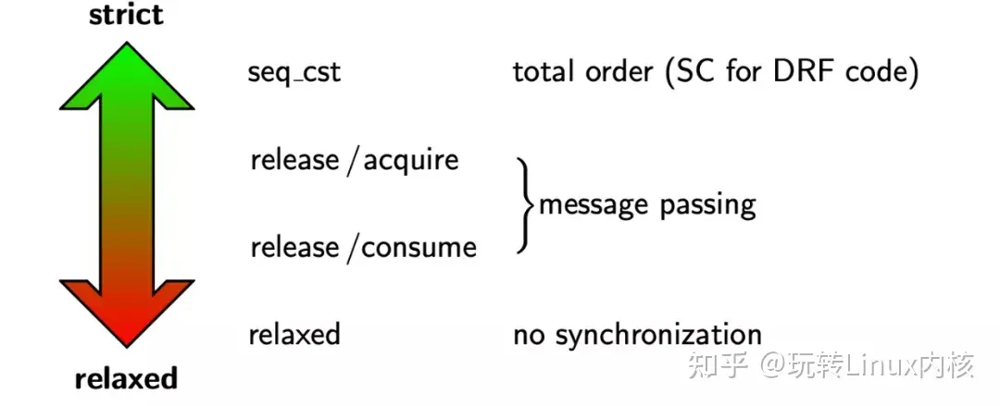

# 内存顺序

C++ 的内存模型规定了 6 种内存顺序，每种内存顺序要求同步的操作都不一样（当然对性能的影响也不一样），并且有些内存顺序是可以 / 需要配合使用的。

## 指令乱序

编译器优化或者 CPU 指令流水线为了最大程序优化执行效率会产生指令乱序。

举个例子：

```c++
int a=0，int b=1;
void func(){
    a=b+22;
    b=22;
}
```

实际的指令结果如下：

```bash
代码没有被编译器优化，按照正常指令执行：
movl    b (% rip), % eax ; 将 b 读入 % eax
addl    $22, % eax ; % eax 加 22, 即 b + 22
movl    % eax, a (% rip) ; % 将 % eax 写回至 a, 即 a = b + 22
movl    $22, b (% rip) ; 设置 b = 22
优化后：
movl    b (% rip), % eax ; 将 b 读入 % eax
movl    $22, b(%rip) ; b = 22
addl    $22, % eax ; % eax 加 22
movl    % eax, a (% rip) ; 将 b + 22 的值写入 a, 即 a = b + 2
```

## 简介

C++ memory order 是对 atomic 操作的一种约束，通常这个 atomic 变量是多线程共享的，所以我们要约定当前 CPU 操作这个变量的顺序。

> 我们谈到 memory order 都是针对共享变量的，这个变量可以是 atomic 也可以是 non-atomic 的，但是一定是共享的。对于线程私有变量我们不讨论他的 order，因为它不会被 reorder，即使被 reorder 也是符合它在当前线程中执行的语意，这点是通过 CPU 和编译器保证的。

C++11 在标准库引入了 memory model，使得我们可以在高级语言层面实现对在多处理器中多线程共享内存交互的控制，从而可以在语言层面忽略 compiler 和 CPU arch 的不同多线程编程影响，这意味着 C++11 的多线程可以跨平台了。

## memory order

> 内存顺序模型用于描述编程语言在 ** 多线程编程中对共享内存的访问顺序 **，本质上指在 ** 单线程情况下 CPU 指令在多大程度上会发生指令重排（reorder）**。

首先不同 CPU 体系架构的内存顺序模型是不一样的，但是大体上分为两种：

* Total Store Order：x86_64 和 Sparc
* Weakly Ordered：Armv8、PowerPC 和 MIPS

其中 Total Store Order 指的是强顺序模型，这是一种接近程序顺序的顺序模型。其中的 Total 内存在（写操作）上是有一个全局顺序的（所有人看到的顺序是一样的），这就好比于在内存上的每个 Store 动作都必须有一个排队，而且这个排队顺序和你的程序顺序直接相关。TSO 模型有利于多线程程序的编写，对程序员更加友好，但是对芯片实现者不友好。CPU 为了 TSO 的承诺会牺牲一些并发上的控制。

弱内存模型（简称 WMP，Weak Memory Ordering），将是否要求强制顺序的要求交给了程序员。换句话说 CPU 不去保证这个顺序模型（除非他们在一个 CPU 上有依赖），程序员要主动插入内存屏障指令来强化这个 “可见性”。ARMv8、PowerPC 和 MIPS 等体系结构都是弱内存模型。每种弱内存模型的体系结构架构都有自己的内存屏障指令，语意也不完全相同。**弱内存模型下，硬件实现起来比较简单，处理器执行的效率也高，只要没有显式的屏障指令，CPU 就可以对局部指令进行 reorder 以提高执行效率。**

## C++11 内存模型

对于多线程程序开发而言，对并发的数据访问我们一般需要做同步操作，可以使用 mutex、semaphore、conditional 等重量级方案对共享数据进行保护。但为了实现更高的并发，需要使用共享变量做通信（Message Passing），这就对程序员要求很高了，程序员必须时刻清楚自己在做什么。另外不同的编程语言对内存模型都有自己的规范，例如 C/C++ 和 Java 等不同的编程语言都有定义内存模型相关规范。

> memory order 的问题即使因为指令重排导致内存可见顺序发生变化引起的，在单线程执行起来的时候是没有任何问题的，但是放到多核 / 多线程执行的时候就出现问题了，为了效率引入的额外复杂逻辑弊端就出现了。

C++11 引入 memory order 的意义使得我们拥有了一个和运行平台无关且和编译器无关的标准库，让我们可以在 high level language 层面实现多处理器对共享内存的交互式控制。这 **意味着我们的多线程程序可以跨平台了**，我们可以借助内存模型写出更好更安全的并发代码。

C++11 使用 memory order 来描述 memory model，而用来联系 memory order 的是 atomic 变量，atomic 操作可以用 `load ()` 和 `release ()` 语意来描述。

一个简单的 atomic 变量赋值可以描述为：

```c++
atomic_var1.store (atomic_var2.load()); // atomic variables
     vs
var1 = var2;                            // regular variables
```

为了更好地描述内存模型，我们需要熟悉 4 种关系术语。

### 1. sequenced-before

**同一个线程内**，语句 A 的执行顺序在语句 B 之前，那么就成立 A sequenced-before B。它不仅仅表示两个操作之间的先后顺序，还表示了操作结果之间的可见性关系。两个操作 A 和 B，如果成立 A sequenced-before B，那么处理表示操作 A 的顺序在 B 之前，还表示了操作 A 的结果操作 B 可见。

例如语句 A 是 sequenced-before 语句 B 的：

```c++
r2 = x.load(std::memory_order_relaxed); // A
y.store(42, std::memory_order_relaxed); // B
```

### 2. happens-before

happens-before 表示 **不同线程之间的操作先后顺序**，如果 A happends-before B，则 A 的内存状态将在 B 操作执行之前就可见。happends-before 关系满足传递性，非自反性和非对称性，happends-before 包含了 inter-thread happens before 和 synchronizes-with 两种关系。

### 3. synchronizes-with

synchronizes-with 关系强调的是变量被修改之后的传播关系（propagate），即如果一个线程修改某变量之后的结果能被其他线程可见，那么就是满足 synchronizes-with 关系的。另外 synchronizes-with 可以被认为是跨线程的 happends-before 关系。显然满足 synchronizes-with 关系的操作一定满足 happends-with 关系了。

### 4. carries dependency

同一个线程内，表达式 A sequenced-before 表达式 B，并且表达式 B 的值是受表达式 A 的影响的一种关系，被称之为 carries dependency。这个很好理解，例如：

```c++
int *a = &var1;
int *b = &var2;
c = *a + *b;
```

## C++ memory order

C/C++ 11 标准中提供了 6 种 memory order，用来描述内存模型：

```c++
enum memory_order {
    memory_order_relaxed,
    memory_order_consume,
    memory_order_acquire,
    memory_order_release,
    memory_order_acq_rel,
    memory_order_seq_cst
};
```

每种 memory order 的规则可以简单描述为：

* `memory_order_relaxed`：不对执行顺序做任何保证
* `memory_order_consume`：本线程中，所有后续有关本原子类型的操作，必须在本原子操作完成之后执行
* `memory_order_acquire`：本线程中，所有后续的读操作必须在本条原子操作完成后执行
* `memory_order_release`：本线程中，所有之前的写操作完成后才能执行本条原子操作
* `memory_order_acq_rel`：同时包含 `memory_order_acquire` 和 `memory_order_release` 标记
* `memory_order_seq_cst`：全部存储都按顺序执行



## memory_order_relaxed

只保证原子操作 `load ()` 和 `release ()` 的原子性，不影响这个同步点前后的内存操作。这是原子操作中最宽松的内存顺序，无法解决上述例子的同步问题。

```c++
std::atomic<int> x = 0;     // global variable
std::atomic<int> y = 0;     // global variable
    
Thread-1:                                  Thread-2:
r1 = y.load(memory_order_relaxed); // A    r2 = x.load(memory_order_relaxed); // C
x.store(r1, memory_order_relaxed); // B    y.store(42, memory_order_relaxed); // D
```

在上面的多线程例子执行中是可能出现 `r2 == r1 == 42`，这是因为 CPU 在执行的时候允许局部指令重排 reorder，D 可能在 C 之前执行，如果执行顺序是 D -> A -> B -> C，就会出现 `r2 == r1 == 42`。

如果某个操作只要求是原子操作，除此之外不需要其他同步的保障，那么就可以使用 relaxed ordering。

程序计数器是一种典型的应用场景：

```c++
#include <cassert>
#include <vector>
#include <iostream>
#include <thread>
#include <atomic>

std::atomic<int> cnt = {0};
void f()
{
    for (int n = 0; n < 1000; ++n) {
        cnt.fetch_add(1, std::memory_order_relaxed);
    }
}
int main()
{
    std::vector<std::thread> v;
    for (int n = 0; n < 10; ++n) {
        v.emplace_back(f);
    }
    for (auto& t : v) {
        t.join();
    }
    assert(cnt == 10000);    // never failed
    return 0;
}
```

cnt 是共享的全局变量，多个线程并发地对 cnt 执行 RMW （Read Modify Write） 院子操作，这里只保证 cnt 读写的原子性，其他依赖 cnt 的地方不保证任何同步。

### 2. memory order consume

**consume 要配合 release 一起使用**，很多时候线程间只想针对有依赖关系的操作进行同步，除此之外线程中其他操作顺序并不关心，这个时候就很适合使用 consume 来完成这个操作，例如：

```c++
b = *a;
c = *b
```

第二行的变量 c 依赖第一行的执行结果，因此这两行代码时 `carries dependency` 关系，显然由于 consume 是针对有明确依赖关系的语句来限定其执行顺序的一种内存顺序，而 relaxed 则不提供任何顺序保证，所以 consume order 要比 relaxed order 要更加 strong。

```c++
#include <thread>
#include <atomic>
#include <cassert>
#include <string>

std::atomic<std::string*> ptr;
int data;

void producer()
{
    std::string* p  = new std::string("Hello");
    data = 42;
    ptr.store(p, std::memory_order_release);
}

void consumer()
{
    std::string* p2;
    while (!(p2 = ptr.load(std::memory_order_consume)))
        ;
    assert(*p2 == "Hello");  // never fires: *p2 carries dependency from ptr
    assert(data == 42);      // may or may not fire: data does not carry dependency from ptr
}

int main()
{
    std::thread t1(producer);
    std::thread t2(consumer);
    t1.join();
    t2.join();
}
```

其中 `assert (*p2 =="Hello")` 永远不会失败，但是 `assert (data == 42)` 可能会失败，这是因为：

* p2 和 ptr 有直接依赖关系，但是 data 和 ptr 无直接依赖关系
* 尽管线程 1 中 data 赋值在 `ptr.store ()` 之前，但是线程 2 看到的 data 值还是不确定的。

### 3. memory order acquire

acquire 和 release 也必须放到一起使用，release 和 acquire 构成了 synchronize-with 关系，也就是同步关系。在这个关系下，线程 A 中所有发生在 release x 之前的值的写操作，对线程 B 的 acquire x 之后的任何操作都可见。

```c++
#include <thread>
#include <atomic>
#include <cassert>
#include <string>
#include <iostream>

std::atomic<bool> ready{ false };
int data = 0;
std::atomic<int> var = {0};

void sender()
{
    data = 42;                                              // A
    var.store(100, std::memory_order_relaxed);              // B
    ready.store(true, std::memory_order_release);           // C
}
void receiver()
{
    while (!ready.load(std::memory_order_acquire))          // D
        ;
    assert(data == 42);  // never failed                    // E
    assert(var == 100);  // never failed                    // F
}

int main()
{
    std::thread t1(sender);
    std::thread t2(receiver);
    t1.join();
    t2.join();
}
```

上面的例子中：

* sender 线程中 data = 42 是 sequence-before 原子变量 ready 的
* sender 和 receiver 在 C 和 D 处发生了同步
* 线程 sender C 之前的所有读写对 receiver 都是可见的，release 和 acquire 组合在一起比 release 和 consume 更加 strong

### 4. memory order release

release order 一般不单独使用，它和 acquire 和 consume 组成两种独立的内存顺序搭配。

### 5. memory order acq_rel

acq_rel 是 acquire 和 release 的叠加：

> A read-modify-write operation with this memory order is both an acquire operation and a release operation. No memory reads or writes in the current thread can be reordered before or after this store. All writes in other threads that release the same atomic variable are visible before the modification and the modification is visible in other threads that acquire the same atomic variable.

继续看例子：

```c++
#include <thread>
#include <atomic>
#include <cassert>
#include <vector>
 
std::vector<int> data;
std::atomic<int> flag = {0};
 
void thread_1()
{
    data.push_back(42);
    flag.store(1, std::memory_order_release);
}
 
void thread_2()
{
    int expected=1;
    while (!flag.compare_exchange_strong(expected, 2, std::memory_order_acq_rel)) {
        expected = 1;
    }
}
 
void thread_3()
{
    while (flag.load(std::memory_order_acquire) < 2)
        ;
    assert(data.at(0) == 42); // will never fire
}
 
int main()
{
    std::thread a(thread_1);
    std::thread b(thread_2);
    std::thread c(thread_3);
    a.join(); b.join(); c.join();
}
```

### 6. memory order seq_cst

`seq_cst` 表示顺序一致性内存模型，在这个模型约束下不仅同一个线程内的执行结果是和程序顺序一致的， 每个线程间互相看到的执行结果和程序顺序也保持顺序一致。显然，`seq_cst` 的约束是最强的，这意味着要牺牲性能为代价。

```c++
atomic int x (0);               atomic int y (0);
    x. store (1, seq cst );     ||      y. store (1, seq cst );
    int r1 = y.load( seq cst ); ||      int r2 = x.load( seq cst );
                assert (r1 == 1 || r2 == 1);
```

看例子：

```c++
#include <thread>
#include <atomic>
#include <cassert>
 
std::atomic<bool> x = {false};
std::atomic<bool> y = {false};
std::atomic<int> z = {0};
 
void write_x()
{
    x.store(true, std::memory_order_seq_cst);
}
 
void write_y()
{
    y.store(true, std::memory_order_seq_cst);
}
 
void read_x_then_y()
{
    while (!x.load(std::memory_order_seq_cst))
        ;
    if (y.load(std::memory_order_seq_cst)) {
        ++z;
    }
}
 
void read_y_then_x()
{
    while (!y.load(std::memory_order_seq_cst))
        ;
    if (x.load(std::memory_order_seq_cst)) {
        ++z;
    }
}
 
int main()
{
    std::thread a(write_x);
    std::thread b(write_y);
    std::thread c(read_x_then_y);
    std::thread d(read_y_then_x);
    a.join(); b.join(); c.join(); d.join();
    assert(z.load() != 0);  // will never happen
}
```

## Reference

[1] <https://zhuanlan.zhihu.com/p/669908979>
[2] <https://www.zhihu.com/question/24301047/answer/558907242>
