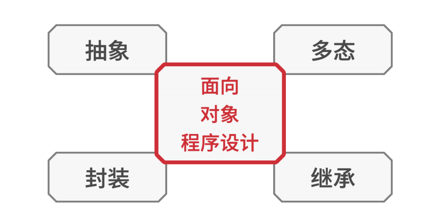
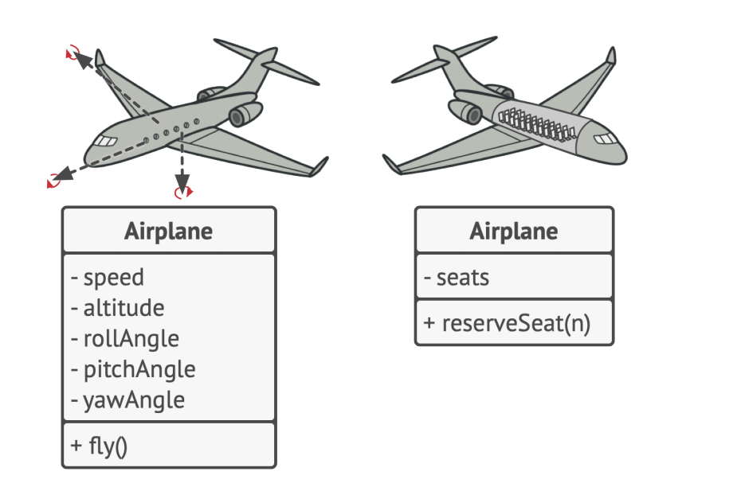
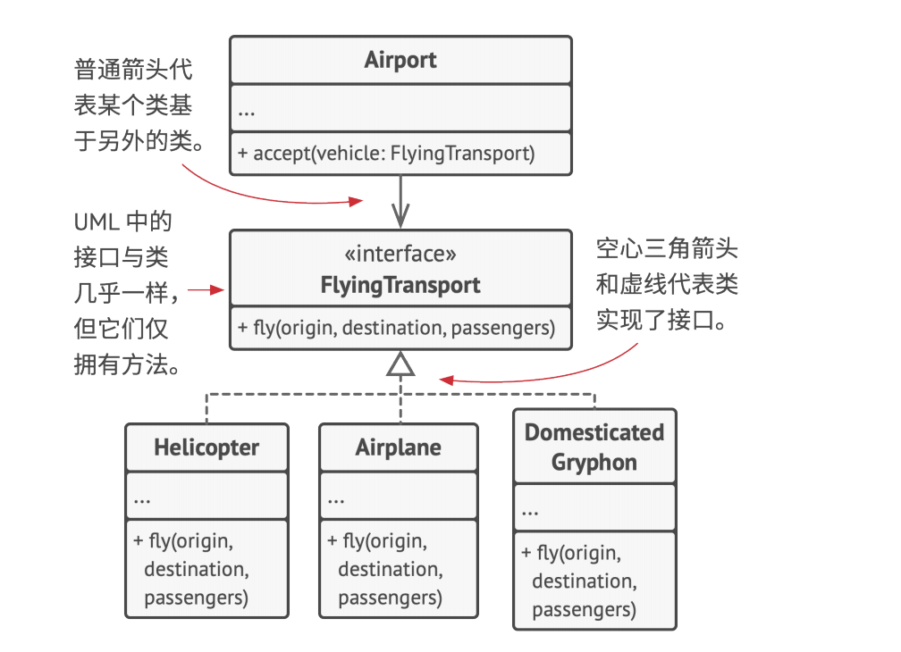
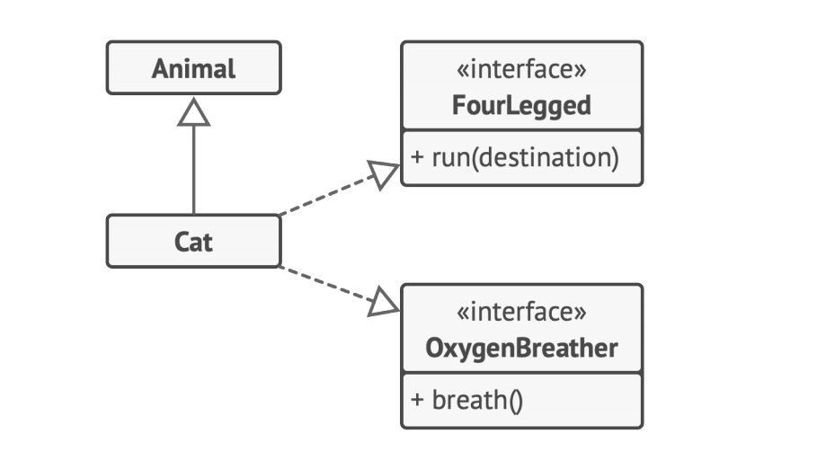
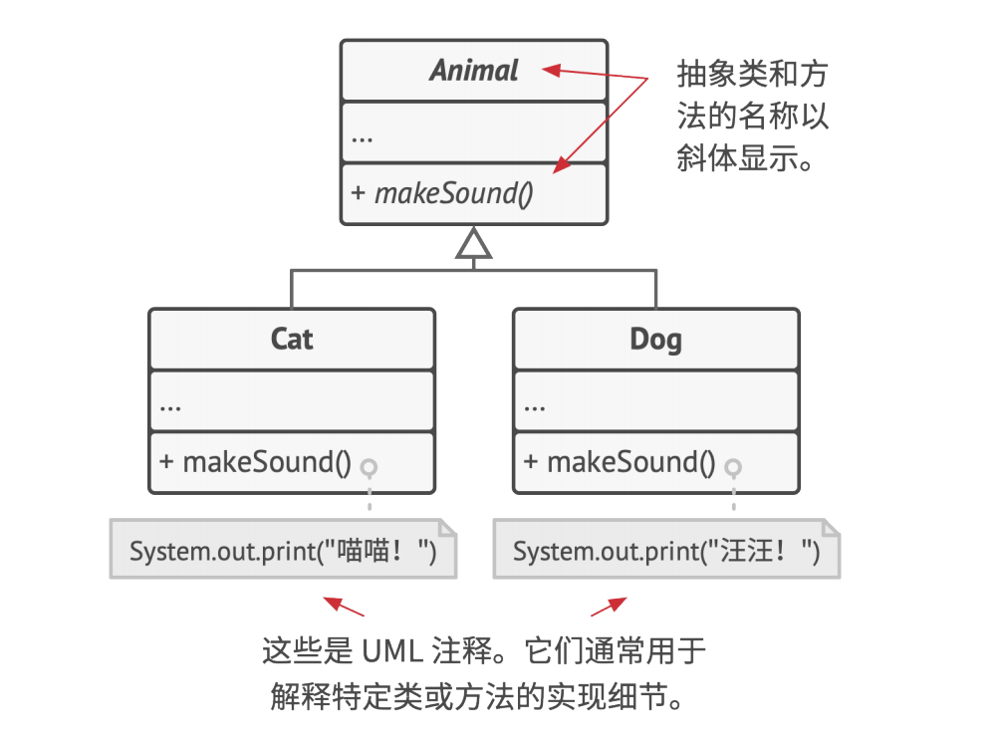
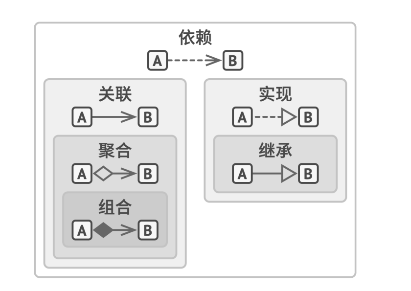

# 继承、封装和多态

面向对象程序设计的四个基本概念使其区别于其他程序设计范式。

## 抽象

> 抽象是一种反映真实世界对象或现象中特定内容的模型，它能高精度地反映所有与特定内容相关的详细信息，同时忽略其他内容。

当使用面向对象程序设计的理念开发一款程序时，你会将大部分时间用于根据真实世界对象来设计程序中的对象。但是，程序中的对象并不需要能够百分之百准确地反映其原型（极少情况下才需要做到这一点）。实际上，你的对象只需模拟真实对象的特定属性和行为即可，其他内容可以忽略。

例如， 飞行模拟器和航班预订程序中都可能会包含一个飞机（Airplane 类）。但是前者需包含与实际飞行相关的详细信息，而后者则只关心座位图和哪些座位可供预订。

## 封装

> 封装是指一个对象对其他对象隐藏其部分状态和行为，而仅向程序其他部分暴露有限的接口的能力。

如果想要启动一辆车的发动机，你只需转动钥匙或按下按钮即可，无需打开引擎盖手动接线、转动曲轴和气缸并启动发动机的动力循环。这些细节都隐藏在引擎盖下，你只会看到一些简单的接口：启动开关、方向盘和一些踏板。该示例讲述了什么是对象的**接口**——它是对象的公有部分，能够同其他对象进行交互。

封装某个内容意味着使用关键字 private 私有 来对其进行修饰，这样仅有其所在类中的方法才能访问这些内容。还有一种限制程度较小的**关键字 protected 保护 ，其所修饰的对象仅允许父类访问其类中的成员**。

绝大部分编程语言的接口和抽象类（或方法）都基于抽象和封装的概念。在现代面向对象的编程语言中，接口机制（通常使用 interface 或 protocol 关键字来声明）允许你定义对象之间的交互协议。这也是接口仅关心对象行为，以及你不能在接口中声明成员变量的原因之一。

> 由于接口（interface）这个词代表对象的公有部分，而在绝大部分编程语言中又有 interface 类型，因此很容易造成混淆。在这里我将对此进行说明。

假 如 你 的 航空运输（FlyingTransport） 接 口 中 有 一 个 fly(origin, destination, passengers) 方法 （即以起点、 终点以及乘客为参数的飞行方法）。 在设计航空运输模拟器时， 你可以对 机场（Airport）类做出限制， 使其仅与实现了航空运输接口的对象进行交互。 此后， 你可以确保传递给机场对象的任何对象——无论是 飞机 、 直升机（Helicopter ）还是可怕的 家养狮鹫（DomesticatedGryphon）都能到达或离开这种类型的机场。

## 继承

> 继承是指在根据已有类创建新类的能力。

继承最主要的好处是代码复用。如果你想要创建的类与已有的类差异不大，那也没必要重复编写相同的代码。你只需扩展已有的类并将额外功能放入生成的子类（它会继承父类的成员变量和方法）中即可。

使用继承后，子类将拥有与其父类相同的接口。如果父类中声明了某个方法，那么你将无法在子类中隐藏该方法。**你还必须实现所有的抽象方法**，即使它们对于你的子类而言没有意义。

在绝大多数编程语言中，子类仅能对一个父类进行扩展。另一方面，任何类都可以同时实现多个接口。但是正如我之前提到的那样，如果父类实现了某个接口，那么其所有子类都必须实现该接口。

## 多态

> 多态是指程序能够检测对象所属的实际类，并在当前上下文不知道其真实类型的情况下调用其实现的能力。

让我们看一些动物的例子。绝大部分动物（Animals）可以发出声音。我们需要所有子类都重写基类的发出声音（makeSound）方法，让每个子类都发出正确的声音，因此我们可以马上将其声明为抽象。这让我们得以忽略父类中该方法的所有默认实现，从而强制要求所有子类自行提供该方法的实现。

## 对象之间的关系

* **依赖**：对类 B 进行修改会影响到类 A 。

* **关联**：对象 A 知道对象 B。类 A 依赖于类 B。

* **聚合**：对象 A 知道对象 B 且由 B 构成。类 A 依赖于类 B。

* **组合**：对象 A 知道对象 B、由 B 构成而且管理着 B 的生命周期。类 A 依赖于类 B。

* **实现**：类 A 定义的方法由接口 B 声明。对象 A 可被视为对象 B。类 A 依赖于类 B。

* **继承**： 类 A 继承类 B 的接口和实现， 但是可以对其进行扩展。对象 A 可被视为对象 B。类 A 依赖于类 B。
