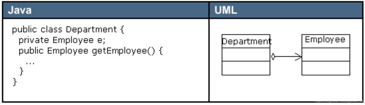
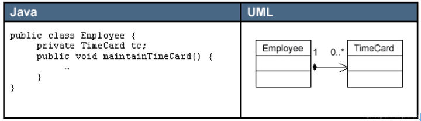

# 继承与组合的选择

## 问题

在类的设计过程中，应该选择继承还是组合？

## 解析

### 1. 通过 public 继承实现 is-a 关系

> Effective C++：Make sure public inheritance models "is-a".
>
> * “public 继承”意味着“is-a”，适用于 base class 身上的每一件事情一定也适用于 derived class 身上，因为每一个 derived class 对象也都是一个 base class 对象。

is-a 并非是唯一存在于 classes 之间的关系。另两个常见的关系是 has-a（有一个）和 is-implemented-in-terms-of（根据某物实现出）。将上述这些重要的相互关系中的任何一个误塑为 is-a 而造成的错误设计，在 C++中并不罕见。所以你应该确定你确实了解这些个“class 相互关系”之间的差异，并直到如何在 C++中更好地塑造它们。

### 2. 通过聚合实现 has-a 关系

组合意味着 has-a（有一个）或者 is-implemented-in-terms-of（根据某物实现出）

聚合（Aggregation）是关联关系的一种特例，它体现的是整体与部分的拥有关系，即 “has a” 的关系。此时整体与部分之间是可分离的，它们可以具有各自的生命周期，部分可以属于多个整体对象，也可以为多个整体对象共享，所以聚合关系也常称为共享关系。例如，公司部门与员工的关系，一个员工可以属于多个部门，一个部门撤消了，员工可以转到其它部门。

在 UML 图中，聚合关系用空心菱形加实线箭头表示，空心菱形在整体一方，箭头指向部分一方，如下图所示。

### 3. 通过组合实现 contains a 关系

组合（Composition）也是关联关系的一种特例，它同样体现整体与部分间的包含关系，即 “contains a” 的关系。但此时整体与部分是不可分的，部分也不能给其它整体共享，作为整体的对象负责部分的对象的生命周期。这种关系比聚合更强，也称为强聚合。如果`A`组合`B`，则`A`需要知道`B`的生存周期，即可能`A`负责生成或者释放`B`，或者`A`通过某种途径知道`B`的生成和释放。

例如，人包含头、躯干、四肢，它们的生命周期一致。当人出生时，头、躯干、四肢同时诞生。当人死亡时，作为人体组成部分的头、躯干、四肢同时死亡。

在 UML 图中，组合关系用实心菱形加实线箭头表示，实心菱形在整体一方，箭头指向部分一方，如下图所示。

