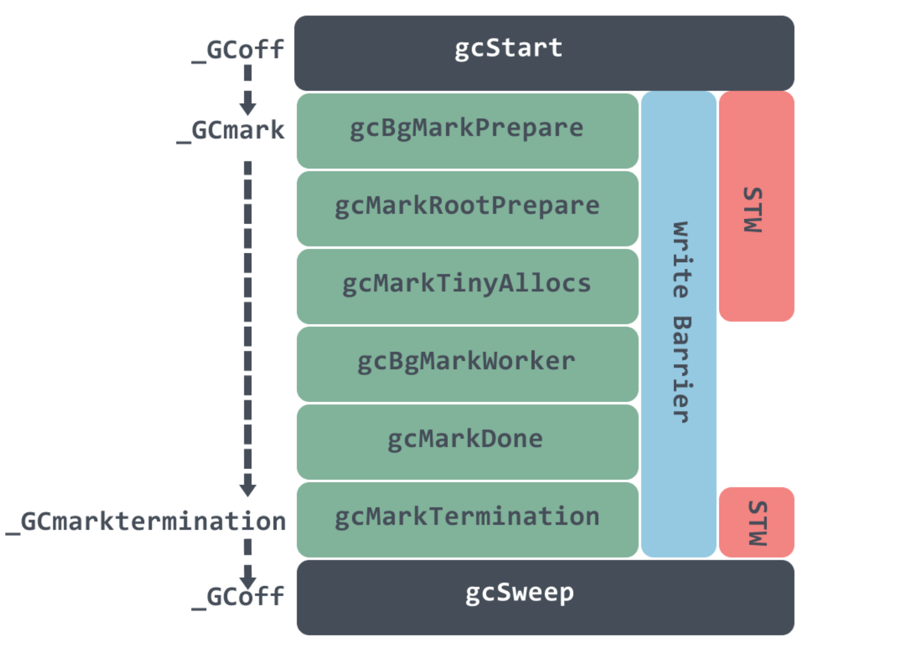

# GC 记忆点

## Golang GC 算法：三色标记法

### 1. 引入原因

传统的“标记清除”、“标记重整”和“标记复制”垃圾回收算法都会在 GC 时暂停整个程序（STW）。

三色标记法有灰色的中间态，可以实现增量垃圾回收。其中后台标记阶段不需要 STW，清除时间很短（需要 STW）。

* 白色：未搜索
* 灰色：正在搜索的对象，但是对象还有一个或者多个引用没搜索
* 黑色：搜索完，所有的引用已经扫描完

### 2. 过程

开始时将所有对象着色成白色，然后从`GC Root`出发逐步将所有“可达”对象变成灰色再到黑色，最终所有的白色对象即是“不可达”对象。

* 初始时所有对象都是白色对象
* 从`GC Root`对象出发，扫描所有可达对象并标记为灰色，放入待处理队列
* 从队列取出一个灰色对象并标记为黑色，将其引用对象标记为灰色放入队列
* 重复上一步骤，直到灰色对象队列为空
* 此时所有剩下的白色对象就是垃圾对象

### 3. 优点

* 不需要暂停整个程序进行 GC，只需要短暂的 STW

### 4. 缺点

* 垃圾对象产生速度过快，可能导致无法及时回收
* 线程切换和上下文切换的消耗使得 GC 整体成本上升

## 读写屏障技术

### 1. 原因

三色标记法存在并发性问题（GC 线程一边回收，用户程序一边在建立引用关系），可能导致错误回收非垃圾对象。

### 2. 错误回收非垃圾对象的场景

下面两个条件**同时满足**就会错误回收非垃圾对象的问题：

* 条件 1：某一黑色对象引用白色对象
* 条件 2：对于某个白色对象，所有和它存在可达关系的灰色对象丢失了访问它的可达路径

### 3. 解决方法

* 方法一：GC 时停止所有的赋值器线程（STW）
* 方法二：赋值器屏障技术（令赋值器在进行指针写操作时同步垃圾回收器）不破坏三色不变性

### 4. 三色不变性

* 强三色不变性：黑色对象永远不会指向白色对象
* 弱三色不变性：黑色对象指向的白色对象至少包含一条由灰色对象经过白色对象的可达路径

### 5. 写屏障技术

GC 中使用的内存读写屏障技术指的是编译器会在编译期间生成一段代码，该代码在运行期间用户**读取、创建或更新对象指针**时会拦截内存读写操作，相当于一个 hook 调用，根据 hook 时机不同可分为不同的屏障技术。

> 读操作比较频繁，因此读屏障性能不佳，Golang 中都是写屏障。

历史发展：

* go1.7 之前使用插入写屏障
* 删除写屏障
* go1.8 混合写屏障：GCroot 对象包含了栈对象，如果运行时要在所有 GC Root 对象上开启插入写屏障从而影响性能，之前的做法是 GC 前 STW 对整个栈进行 re-scan，这回消耗 10~100 毫秒

### 6. 启动时机

三色标记法结合读写屏障技术使得垃圾回收器`Collector`避免了 STW，因此后续提到的增量式垃圾回收和并发式垃圾回收都是基于三色标记法和读写屏障技术的。为了保证三色不变性，**我们需要在垃圾回收前打开写屏障，在本轮垃圾回收过程中用户所有对内存的写操作都需要被写屏障拦截**。

## 增量式垃圾回收和并发式垃圾回收

结论：

* 三色标记法的中间状态让 Golang 实现了增量式垃圾回收，不需要长时间的 STW
* 混合写屏障技术让 Golang 可以实现并发式垃圾回收（保证了弱三色不变性）

## GolangGC 发展历程

* `go v1.1`：标记-清除法，整个过程都需要 STW
* `go v1.3`：标记-清除法，标记过程仍然需要 STW 但清除过程并行化，gc pause 约几百 ms
* `go v1.5`：引入插入写屏障技术的三色标记法，仅在堆空间启动插入写屏障，全部扫描后需要 STW 重新扫描栈空间，gc pause 耗时降到 100ms 以下
* `go v1.8`：引入混合写屏障技术的三色标记法，仅在堆空间启动混合写屏障，不需要在 GC 结束后对栈空间重新扫描，gc pause 时间降低至 0.5ms 以下

## GC 四个阶段

Golang GC 属于并发式垃圾回收（意味着不需要长时间的 STW，GC 大部分执行过程是和用户代码并行的），根据`runtime/mgc.go`文件中的文档可以将 GC 分为四个阶段：

* 清除终止（Sweep Termination）
  * STW
  * 清扫上一轮没回收的内存管理单元 span（防止本轮是强制开始 GC 的）
* 标记（Mark）
  * GC 状态从`_GCoff`切换到`_GCmark`，开启写屏障和用户程序协助线程，将根对象添加到队列中
  * 恢复用户程序（Start The World），标记线程（mark workers）和用户程序协助线程（mutator assiste）进程会开始并发标记内存中的对象，混合写屏障将被删除的指针和新指针都标记成灰色，新创建的对象会被直接标记成黑色
  * 后台并发标记
  * 分布式终止算法确认不再有根标记作业和灰色对象，确认后进行标记终止阶段
* 标记终止（Mark Termination）
  * STW
  * GC 状态`_GCmark`切换至`_GCmarktermination`
* 清除（Sweep）：将状态切换到`_GCoff`，恢复用户程序，后台并发清理所有的内存管理单元 span

在 GC 过程中会有两种后台任务（G），包括标记任务和清扫任务。可以同时执行的标记任务约是 P 数量的四分之一，即 go 所说的 25%CPU 用于 GC 的依据。清扫任务会在程序启动后运行，进入清扫阶段时唤醒。

## GC 触发时机

* 堆内存每次增长 100%就会触发 GC
* 两分钟没 GC 会强制 GC
* 调用`runtime.GC`强制开始 GC，阻塞直到此轮 GC 结束

