# Golang 调度器

## 被废弃的 goroutine 调度器

Go 目前使用的调度器是 2012 年重新设计的，因为之前的调度器性能存在问题，所以使用 4 年就被废弃了，那么我们先来分析一下被废弃的调度器是如何运作的？

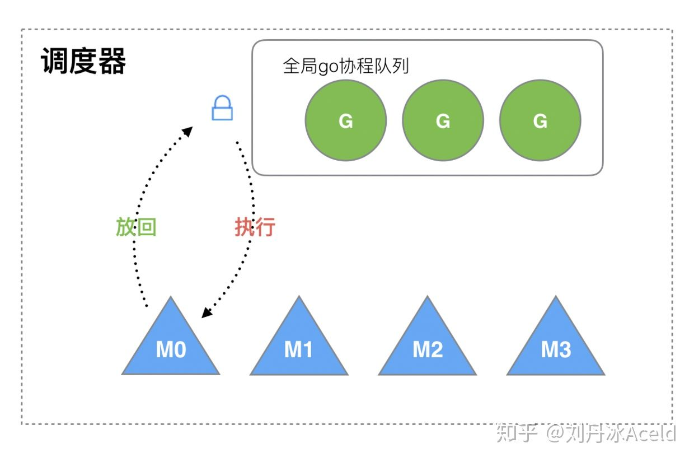

M 想要执行或者放回 G 都需要访问全局 G 队列，并且 M 有多个，影刺全局 G 队列是有互斥锁进行保护的。

缺点：

* 创建、销毁、调度 G 都需要每个 M 获取锁，这就形成了**激烈的锁竞争**。
* M 转移 G 会造成**延迟和额外的系统负载**。比如当 G 中包含创建新协程的时候，M 创建了 G’，为了继续执行 G，需要把 G’交给 M’执行，也造成了**很差的局部性**，因为 G’和 G 是相关的，最好放在 M 上执行，而不是其他 M'。
* 系统调用(CPU 在 M 之间的切换)导致频繁的线程阻塞和取消阻塞操作增加了系统开销。

## Goroutine 调度器 GMP 模型的设计思想

面对之前调度器的问题，Go 设计了新的调度器。

在新调度器中，出列 M(thread)和 G(goroutine)，又引进了 P(Processor)。

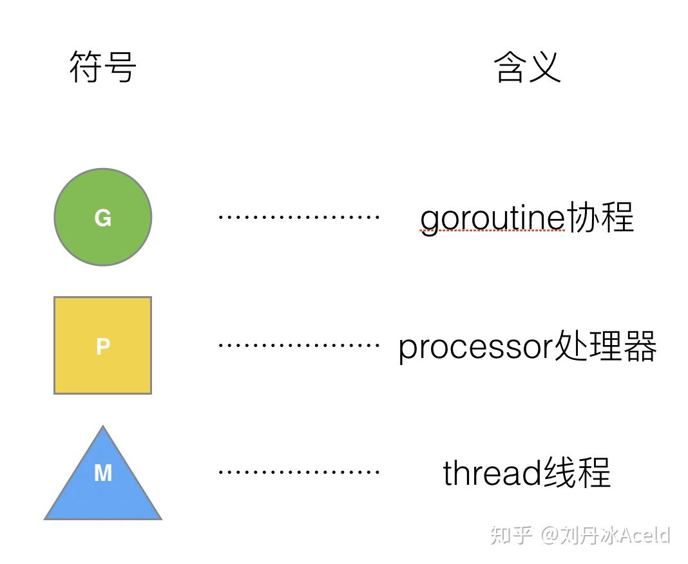

**Processor，它包含了运行 goroutine 的资源**，如果线程想运行 goroutine，必须先获取 P，P 中还包含了可运行的 G 队列。

### 1. GMP 模型

在 Go 中，**线程是运行 goroutine 的实体，调度器的功能是把可运行的 goroutine 分配到工作线程上**。

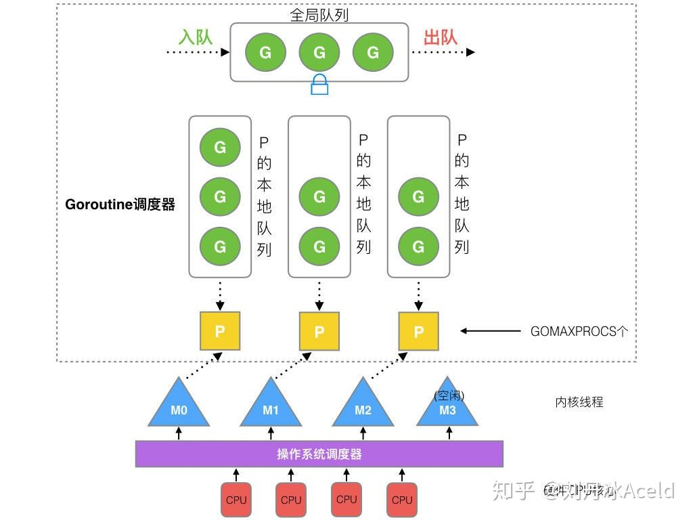

* **全局队列（Global Queue）**：存放等待运行的 G
* **P 的本地队列**：和全局队列类似，存放的也是等待运行的 G，存的数量有限（不超过 256），新建 G'时，G'优先加入到 P 的本地队列，如果队列满了，则会把本地队列中一半的 G 移动到全局队列。
* P 列表：所有的 P 都在程序启动时创建，并保存在数组中，最多有`GOMAXPROCS`(可配置)个。
* M：线程想运行任务就得获取 P，从 P 的本地队列获取 G，P 队列为空时，M 也会尝试从全局队列**拿**一批 G 放到 P 的本地队列，或从其他 P 的本地队列**偷**一半放到自己 P 的本地队列。M 运行 G，G 执行之后，M 会从 P 获取下一个 G，不断重复下去。

**Goroutine 调度器和 OS 调度器是通过 M 结合起来的，每个 M 都代表了 1 个内核线程，OS 调度器负责把内核线程分配到 CPU 的核上执行**。

## P 数量和 M 数量

### 1. P 的数量

根据环境变量`$GOMAXPROCS`或者`runtime.GOMAXPROCS()`决定。这意味着在程序执行的任意时刻都只有`$GOMAXPROCS`个 goroutine 在同时运行。

### 2. M 数量

* go 语言启动时会限制 M 最大数量，默认是 1000（内核很难支持如此多的线程数，所以可以忽略这个限制）
* runtime/debug 中的 SetMaxThreads 函数可以设置 M 的最大数量
* 一个 M 阻塞了，会创建新的 M

M 与 P 的数量没有绝对关系，一个 M 阻塞，P 就会去创建或者切换另一个 M，所以，即使 P 的默认数量是 1，也有可能会创建很多个 M 出来。

## P 与 M 何时创建

* P 何时创建：在确定了 P 的最大数量 n 后，运行时系统会根据这个数量创建 n 个 P。
* M 何时创建：没有足够的 M 来关联 P 并运行其中的可运行的 G。比如所有的 M 此时都阻塞住了，而 P 中还有很多就绪任务，就会去寻找空闲的 M，而没有空闲的，就会去创建新的 M。

## 调度器的设计策略

### 1. 复用线程

避免频繁的创建、销毁线程，而是对线程的复用。

* work stealing 机制：当本线程无可运行的 G 时，尝试从其他线程绑定的 P 偷取 G，而不是销毁线程。
* hand off 机制：当本线程因为 G 进行系统调用阻塞时，线程释放绑定的 P，把 P 转移给其他空闲的线程执行。

### 2. 利用并行

`GOMAXPROCS`设置 P 的数量，最多有`GOMAXPROCS`个线程分布在多个 CPU 上同时运行。`GOMAXPROCS`也限制了并发的程度，比如`GOMAXPROCS = 核数/2`，则最多利用了一半的 CPU 核进行并行。

### 3. 抢占

在 coroutine 中要等待一个协程主动让出 CPU 才执行下一个协程，在 Go 中，一个 goroutine 最多占用 CPU 10ms，防止其他 goroutine 被饿死，这就是 goroutine 不同于 coroutine 的一个地方。

### 4. 全局 G 队列

在新的调度器中依然有全局 G 队列，但功能已经被弱化了，当 M 执行 work stealing 从其他 P 偷不到 G 时，它可以从全局 G 队列获取 G。

## go func()调度流程

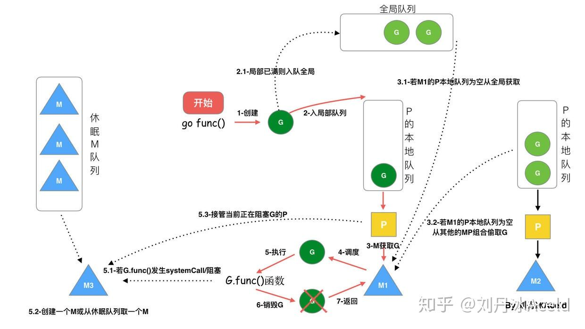

结论：

* 我们通过 go func()创建 goroutine
* 有两个存储 G 的队列，一个是局部调度器 P 的本地队列、一个是全局 G 队列。新创建的 G 会先保存在 P 的本地队列中，如果 P 的本地队列已经满了就会保存在全局的队列中；
* G 只能运行在 M 中，一个 M 必须绑定一个 P，M 与 P 是`1:1`关系。M 从 P 的本地队列中弹出来一个可执行状态的 G 进行执行，如果 P 的本地队列为空，就会向其他的 MP 组合偷取一个可执行的 G 进行执行。
* 当 M 执行某一个 G 时如果发生了 syscall 或者其他阻塞操作，M 就会阻塞，如果当前有一些 G 在执行，runtime 会把这个线程 M 从 P 中摘除（detach），然后再创建一个新的操作系统的线程（如果有空闲的线程就可以复用该线程）来服务于 P。
* 当 M 系统调用结束时，这个 G 就会尝试获取一个空闲 P 执行，并放入到这个 P 的本地队列。如果获取不到 P，那么这个线程 M 就会变成休眠状态加到空闲线程中，然后这个 G 会被放到全局队列中。

## 调度器的生命周期

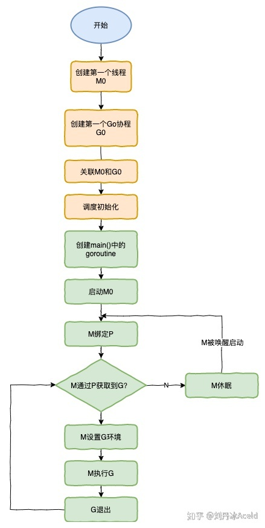

## M0

`M0`是启动程序后的编号为 0 的主线程，这个 M 对应的实例会在全局变量 runtime.m0 中，不需要在 heap 上分配，M0 负责执行初始化操作和启动第一个 G， 在之后 M0 就和其他的 M 一样了。

## G0（调度或者系统调用）

`G0`是每次启动一个 M 都会第一个创建的 gourtine，G0 仅用于负责调度的 G，G0 不指向任何可执行的函数, 每个 M 都会有一个自己的 G0。在调度或系统调用时会使用 G0 的栈空间, 全局变量的 G0 是 M0 的 G0。

## 例子

我们跟踪一段代码：

```go
package main

import "fmt"

func main() {
    fmt.Println("Hello world")
}
```

1. runtime 创建最初的 m0 和 g0，并将两者关联
2. 调度器初始化：初始化 m-、栈、垃圾回收，以及创建初始化由 GOMAXPROCS 个 P 构成的 P 列表
3. 示例代码中的 main 函数是`main.main`，`runtime`中也有 1 个 main 函数——`runtime.main`，代码经过编译后，`runtime.main`会调用`main.main`，程序启动时会为`runtime.main`创建 goroutine，称它为 main goroutine 吧，然后把 main goroutine 加入到 P 的本地队列。
4. 启动 m0，m0 已经绑定了 P，会从 P 的本地队列获取 G，获取到 main goroutine
5. G 拥有栈，M 根据 G 中的栈信息和调度信息设置环境
6. M 运行 G
7. G 退出，再次回到 M 获取可运行的 G，重复下去直到 main.main 退出，`runtime.main`执行 Defer 和 Panic 处理，或调用`runtime.exit`退出程序。

调度器的生命周期几乎占满了一个 Go 程序的一生，`runtime.main`的 goroutine 执行之前都是为调度器做准备工作，`runtime.main`的 goroutine 运行，才是调度器的真正开始，直到`runtime.main`结束而结束。

## 可视化 GMP 编程

有两种方式可以查看一个程序的 GMP 信息。

### 1. go tool trace

trace 记录了运行时的信息，能提供可视化的 Web 页面。

简单测试：

main 函数创建 trace，trace 会运行在单独的 goroutine 中，然后 main 打印"Hello World"退出。

```go
package main

import (
    "os"
    "fmt"
    "runtime/trace"
)

func main() {

    //创建 trace 文件
    f, err := os.Create("trace.out")
    if err != nil {
        panic(err)
    }

    defer f.Close()

    //启动 trace goroutine
    err = trace.Start(f)
    if err != nil {
        panic(err)
    }
    defer trace.Stop()

    //main
    fmt.Println("Hello World")
}
```

运行程序：

```bash
$ go run trace.go 
Hello World
```

会得到一个`trace.out`，然后我们用一个工具打开来分析这个文件：

```bash
$ go tool trace trace.out 
2020/02/23 10:44:11 Parsing trace...
2020/02/23 10:44:11 Splitting trace...
2020/02/23 10:44:11 Opening browser. Trace viewer is listening on http://127.0.0.1:33479
```

我们可以通过浏览器打开`http://127.0.0.1:33479`网址，点击`view trace` 能够看见可视化的调度流程。

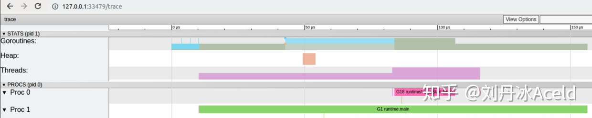

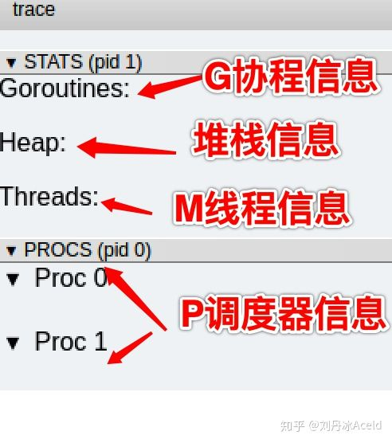

#### 1.1 G 信息

点击 Goroutines 那一行可视化的数据条，我们会看到一些详细的信息。

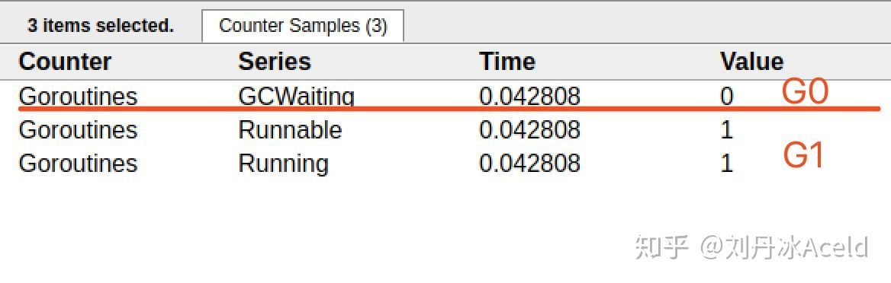

一共有两个 G 在程序中，一个是特殊的 G0，是每个 M 必须有的一个初始化的 G，这个我们不必讨论。

其中 G1 应该就是 main goroutine(执行 main 函数的协程)，在一段时间内处于可运行和运行的状态。

#### 1.2 M 信息

点击 Threads 那一行可视化的数据条，我们会看到一些详细的信息。

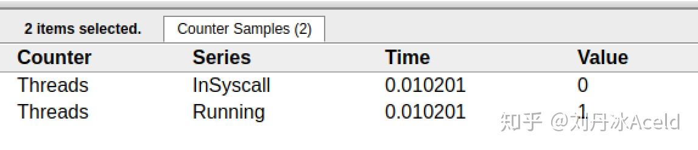

一共有两个 M 在程序中，一个是特殊的 M0，用于初始化使用，这个我们不必讨论。

#### 1.3 P 信息

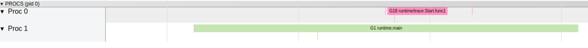

G1 中调用了`main.main`，创建了`trace goroutine g18`。G1 运行在 P1 上，G18 运行在 P0 上。

这里有两个 P，我们知道，一个 P 必须绑定一个 M 才能调度 G。

我们在来看看上面的 M 信息。

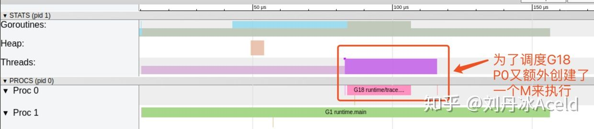

我们会发现，确实 G18 在 P0 上被运行的时候，确实在 Threads 行多了一个 M 的数据，点击查看如下：

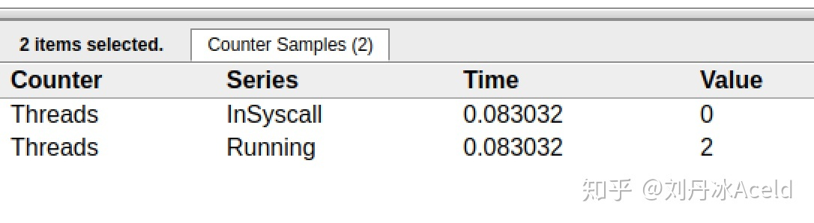

多了一个 M2 应该就是 P0 为了执行 G18 而动态创建的 M2.

### 2. Debug trace

```go
package main

import (
    "fmt"
    "time"
)

func main() {
    for i := 0; i < 5; i++ {
        time.Sleep(time.Second)
        fmt.Println("Hello World")
    }
}
```

编译：

```bash
go build trace2.go
```

通过 Debug 方式运行：

```bash
$ GODEBUG=schedtrace=1000 ./trace2 
SCHED 0ms: gomaxprocs=2 idleprocs=0 threads=4 spinningthreads=1 idlethreads=1 runqueue=0 [0 0]
Hello World
SCHED 1003ms: gomaxprocs=2 idleprocs=2 threads=4 spinningthreads=0 idlethreads=2 runqueue=0 [0 0]
Hello World
SCHED 2014ms: gomaxprocs=2 idleprocs=2 threads=4 spinningthreads=0 idlethreads=2 runqueue=0 [0 0]
Hello World
SCHED 3015ms: gomaxprocs=2 idleprocs=2 threads=4 spinningthreads=0 idlethreads=2 runqueue=0 [0 0]
Hello World
SCHED 4023ms: gomaxprocs=2 idleprocs=2 threads=4 spinningthreads=0 idlethreads=2 runqueue=0 [0 0]
Hello World
```

* `SCHED`：调试信息输出标志字符串，代表本行是 goroutine 调度器的输出；
* `0ms`：即从程序启动到输出这行日志的时间；
* `gomaxprocs`: P 的数量，本例有 2 个 P, 因为默认的 P 的属性是和 cpu 核心数量默认一致，当然也可以通过 GOMAXPROCS 来设置；
* `idleprocs`: 处于 idle 状态的 P 的数量；通过 gomaxprocs 和 idleprocs 的差值，我们就可知道执行 go 代码的 P 的数量；
* t`hreads: os threads/M`的数量，包含 scheduler 使用的 m 数量，加上 runtime 自用的类似 sysmon 这样的 thread 的数量；
* `spinningthreads`: 处于自旋状态的 os thread 数量；
* `idlethread`: 处于 idle 状态的 os thread 的数量；
* `runqueue=0`： Scheduler 全局队列中 G 的数量；
* `[0 0]`: 分别为 2 个 P 的 local queue 中的 G 的数量。

## GO 调度器调度场景全解析

### 1. 场景一

P 拥有 G1，M1 获取 P 后开始运行 G1，G1 使用`go func()`创建了 G2，为了局部性 G2 优先加入到 P1 的本地队列。

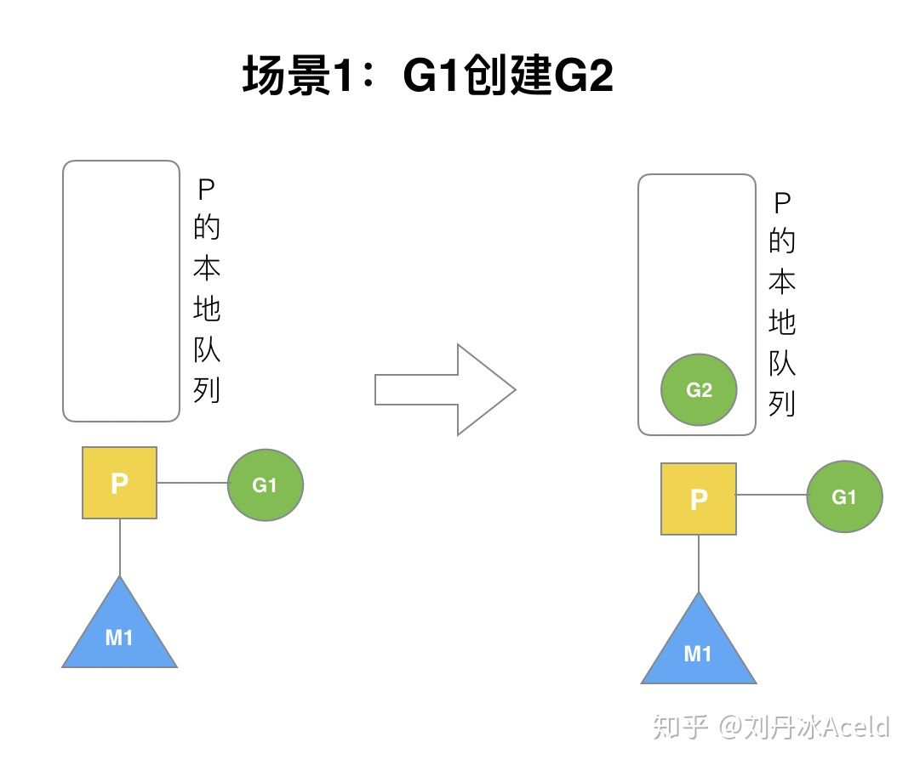

### 2. 场景 2

G1 运行完成后(函数：`goexit`)，M 上运行的 goroutine 切换为 G0，G0 负责调度时协程的切换（函数：`schedule`）。从 P 的本地队列取 G2，从 G0 切换到 G2，并开始运行 G2(函数：`execute`)。实现了线程 M1 的复用。

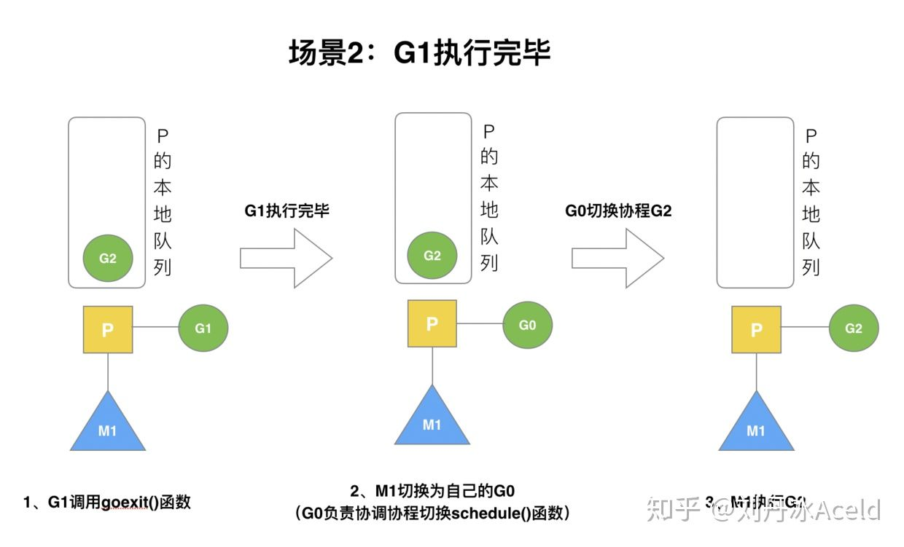

### 3. 场景 3

假设每个 P 的本地队列只能存 3 个 G。G2 要创建了 6 个 G，前 3 个 G（G3, G4, G5）已经加入 p1 的本地队列，p1 本地队列满了。

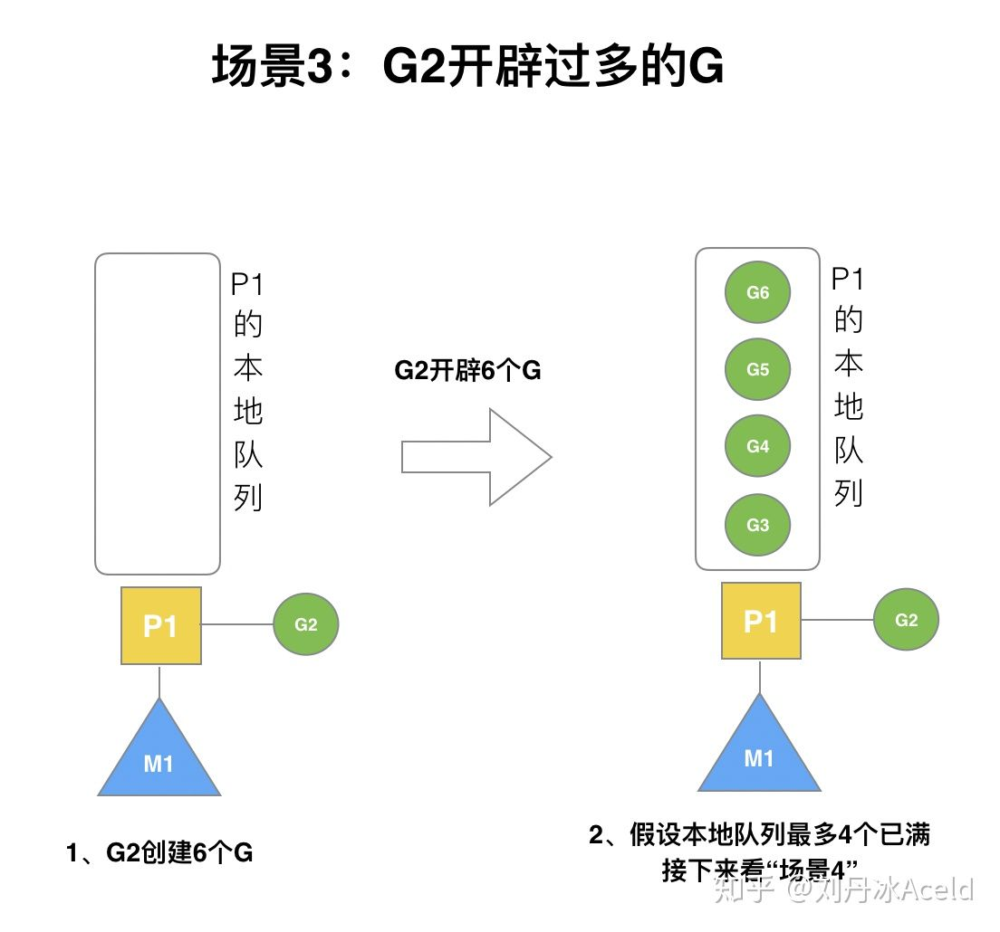

### 4. 场景 4

G2 在创建 G7 的时候，发现 P1 的本地队列已满，需要执行**负载均衡**（把 P1 中本地队列中前一半的 G，还有新创建 G**转移**到全局队列）

> （实现中并不一定是新的 G，如果 G 是 G2 之后就执行的，会被保存在本地队列，利用某个老的 G 替换新 G 加入全局队列）

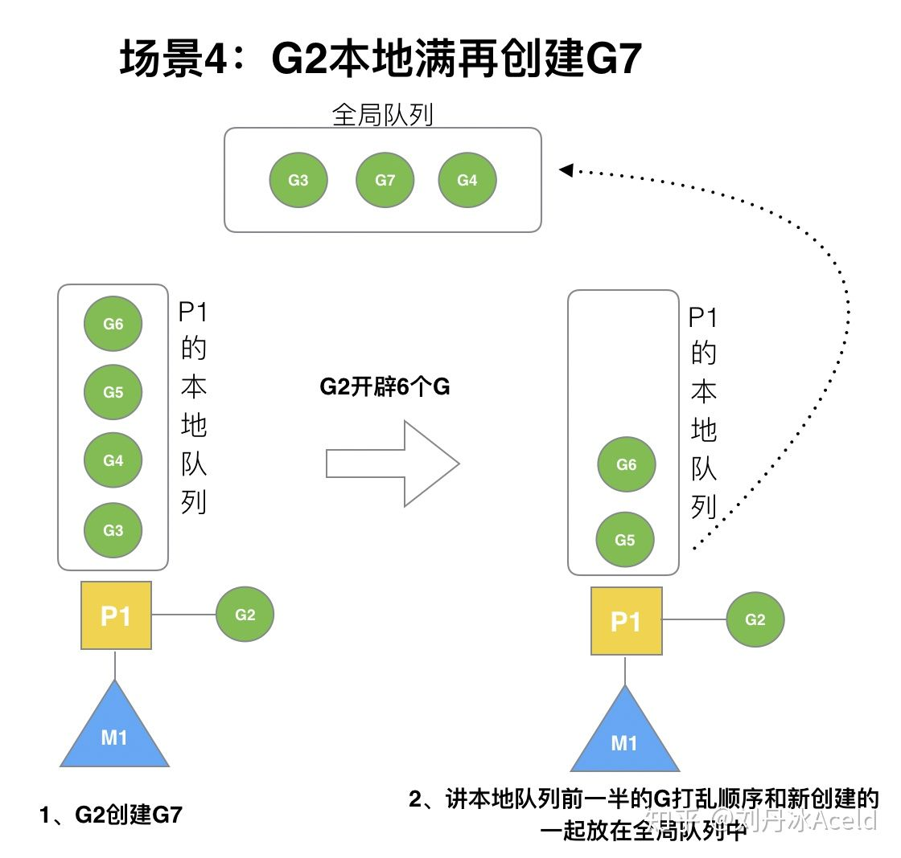

这些 G 被转移到全局队列时，会被打乱顺序。所以 G3,G4,G7 被转移到全局队列。

### 5. 场景 5

G2 创建 G8 时，P1 的本地队列未满，所以 G8 会被加入到 P1 的本地队列。

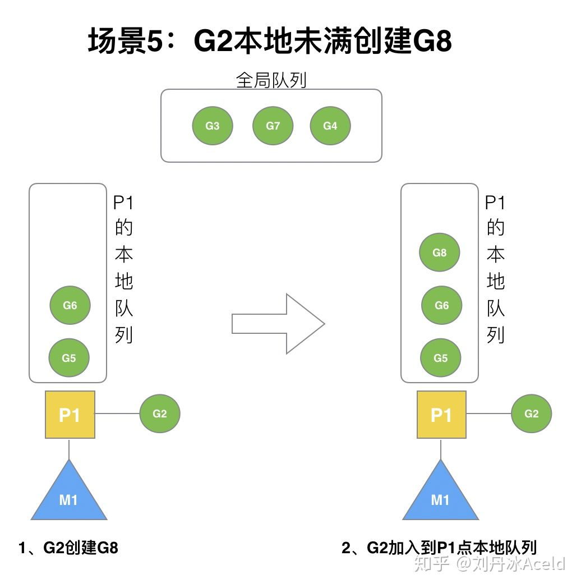

G8 加入到 P1 点本地队列的原因还是因为 P1 此时在与 M1 绑定，而 G2 此时是 M1 在执行。所以 G2 创建的新的 G 会优先放置到自己的 M 绑定的 P 上。

### 6. 场景六

规定：**在创建 G 时，运行的 G 会尝试唤醒其他空闲的 P 和 M 组合去执行**。

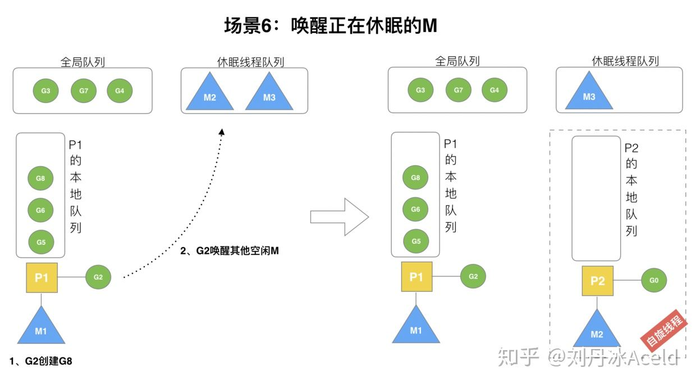

### 7. 场景 7

M2 尝试从全局队列(简称“GQ”)取一批 G 放到 P2 的本地队列（函数：`findrunnable()`）。M2 从全局队列取的 G 数量符合下面的公式：

```go
n = min(len(GQ)/GOMAXPROCS + 1, len(GQ/2))
```

至少从全局队列取 1 个 g，但每次不要从全局队列移动太多的 g 到 p 本地队列，给其他 p 留点。这是**从全局队列到 P 本地队列的负载均衡**。

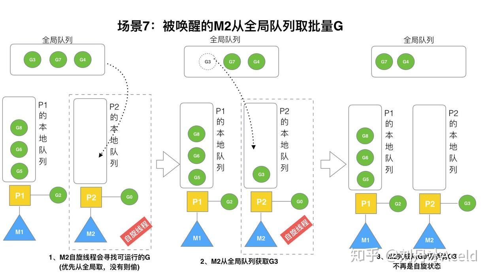

假定我们场景中一共有 4 个 P（GOMAXPROCS 设置为 4，那么我们允许最多就能用 4 个 P 来供 M 使用）。所以 M2 只从能从全局队列取 1 个 G（即 G3）移动 P2 本地队列，然后完成从 G0 到 G3 的切换，运行 G3。

### 8. 场景 8

假设 G2 一直在 M1 上运行，经过 2 轮后，M2 已经把 G7、G4 从全局队列获取到了 P2 的本地队列并完成运行，全局队列和 P2 的本地队列都空了,如场景 8 图的左半部分。

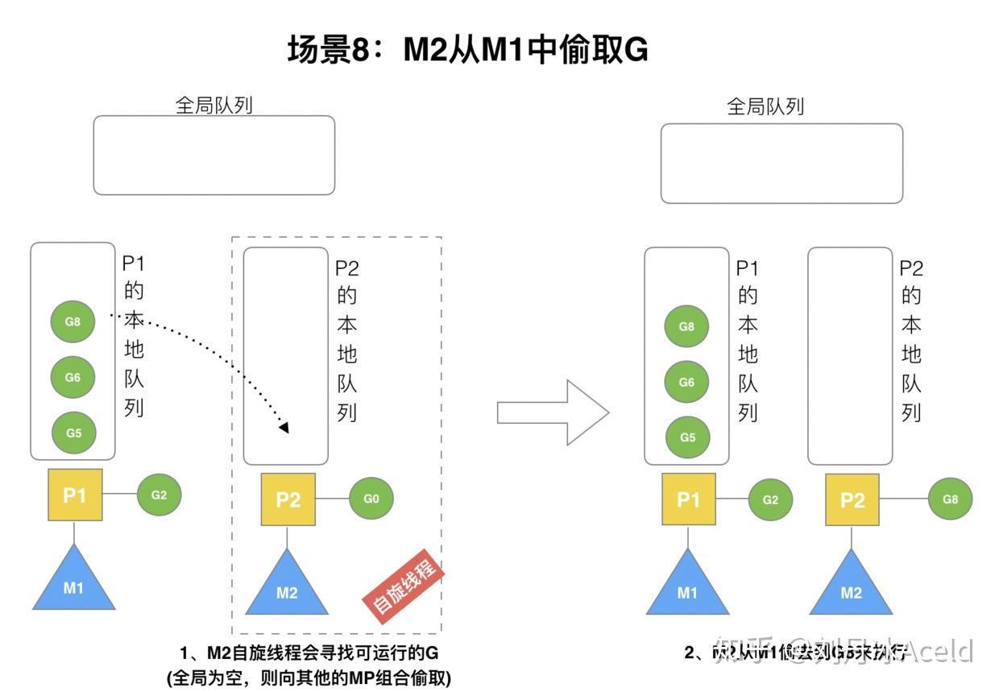

**全局队列已经没有 G，那 m 就要执行 work stealing(偷取)：从其他有 G 的 P 哪里偷取一半 G 过来，放到自己的 P 本地队列**。P2 从 P1 的本地队列尾部取一半的 G，本例中一半则只有 1 个 G8，放到 P2 的本地队列并执行。

### 9. 场景 9

G1 本地队列 G5、G6 已经被其他 M 偷走并运行完成，当前 M1 和 M2 分别在运行 G2 和 G8，M3 和 M4 没有 goroutine 可以运行，M3 和 M4 处于**自旋状态**，它们不断寻找 goroutine。

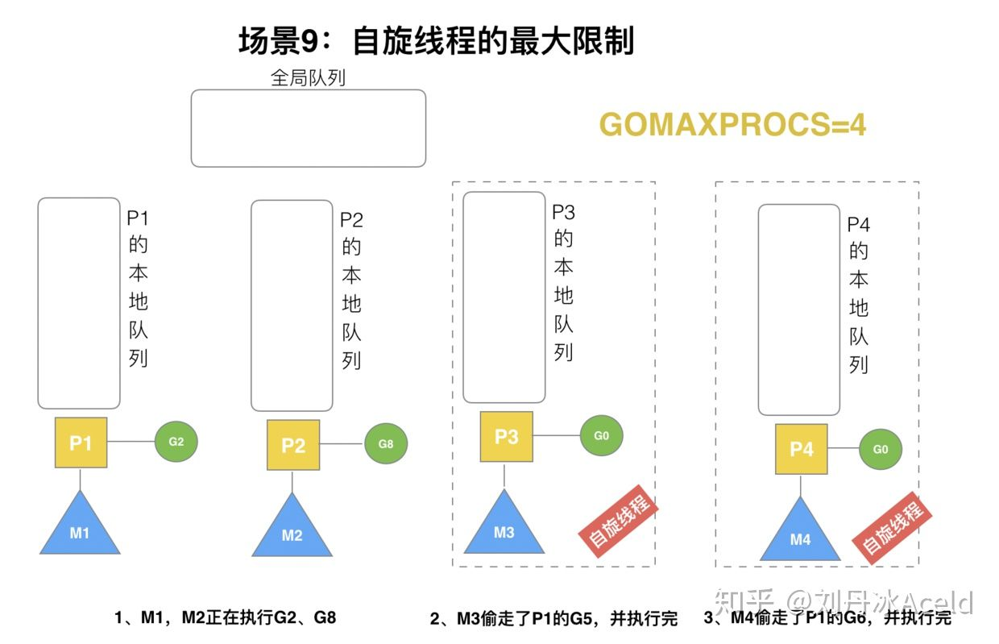

为什么要让 m3 和 m4 自旋，自旋本质是在运行，线程在运行却没有执行 G，就变成了浪费 CPU. 为什么不销毁现场，来节约 CPU 资源。因为创建和销毁 CPU 也会浪费时间，我们**希望当有新 goroutine 创建时，立刻能有 M 运行它**，如果销毁再新建就增加了时延，降低了效率。当然也考虑了过多的自旋线程是浪费 CPU，所以系统中最多有`GOMAXPROCS`个自旋的线程(当前例子中的`GOMAXPROCS`=4，所以一共 4 个 P)，多余的没事做线程会让他们休眠。

### 10. 场景十

假定当前除了 M3 和 M4 为自旋线程，还有 M5 和 M6 为空闲的线程（没有得到 P 的绑定，注意我们这里最多就只能够存在 4 个 P，所以 P 的数量应该永远是 M>=P, 大部分都是 M 在抢占需要运行的 P）。

G8 创建了 G9，G8 进行了**阻塞的系统调用**，M2 和 P2 立即解绑，P2 会执行以下判断：如果 P2 本地队列有 G、全局队列有 G 或有空闲的 M，P2 都会立马唤醒 1 个 M 和它绑定，否则 P2 则会加入到空闲 P 列表，等待 M 来获取可用的 p。

本场景中，P2 本地队列有 G9，可以和其他空闲的线程 M5 绑定。

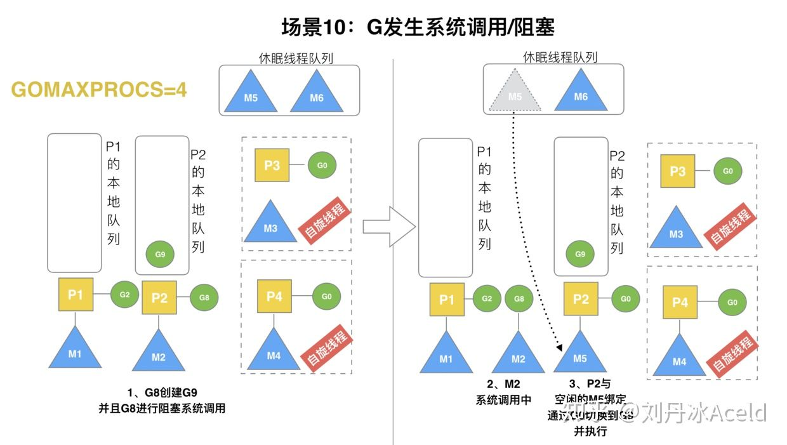

### 11. 场景 11

G8 创建了 G9，假如 G8 进行了**非阻塞系统调用**。

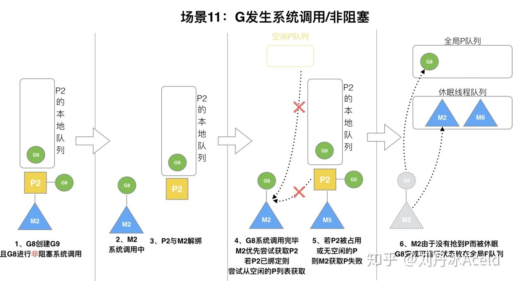


M2 和 P2 会解绑，但 M2 会记住 P2，然后 G8 和 M2 进入**系统调用**状态。当 G8 和 M2 退出系统调用时，会尝试获取 P2，如果无法获取，则获取空闲的 P，如果依然没有，G8 会被记为可运行状态，并加入到全局队列,M2 因为没有 P 的绑定而变成休眠状态(长时间休眠等待 GC 回收销毁)。

## 总结

总结，Go 调度器很轻量也很简单，足以撑起 goroutine 的调度工作，并且让 Go 具有了原生（强大）并发的能力。**Go 调度本质是把大量的 goroutine 分配到少量线程上去执行，并利用多核并行，实现更强大的并发。**

## Reference

[1] <https://zhuanlan.zhihu.com/p/323271088>
