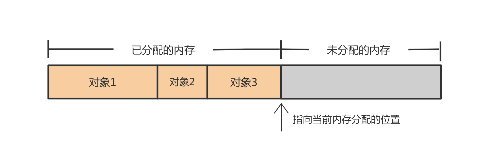
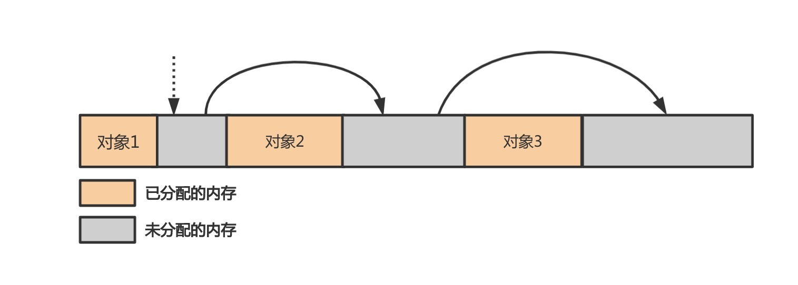
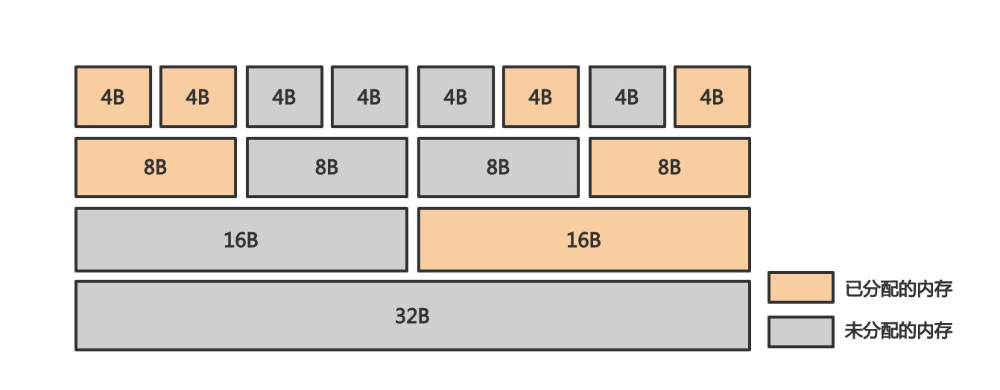
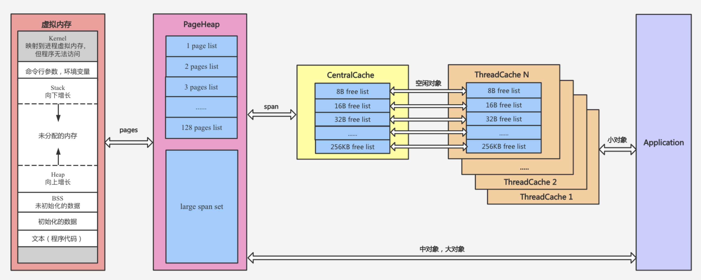
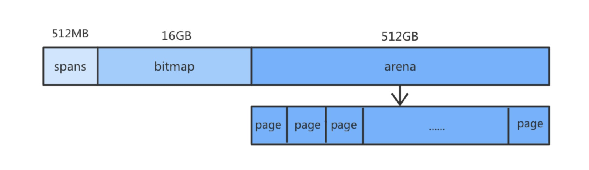
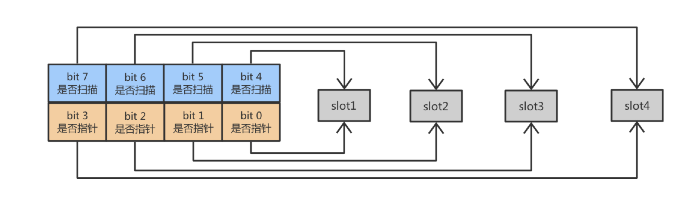
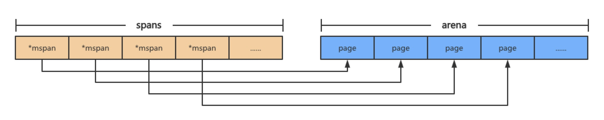

# 内存管理记忆点

## 分段栈和连续栈

### 1. 分段栈

Go1.3 版本之前，随着 goroutine 调用函数层级的深入或者局部变量越来越多时，运行时会调用 runtime.morestack 和 runtime.newstack 创建一个新的栈空间，这些栈空间是不连续的，此时 goroutine 的**多个栈空间是通过双向链表**管理的。

> 问题：goroutine 栈满时，任何函数调用都会触发栈扩容，函数返回时会触发栈收缩，循环调用函数可能导致栈频繁分配和释放，造成巨大的额外开销（热分裂`hot_split`问题）。

为了解决热分裂问题，Go1.2 版本将栈的初始化内存从 4KB 增加到 8KB，后来采用连续栈之后初始栈大小减小至 2KB

### 2. 连续栈

> 通过栈扩容实现。

## 栈内存管理

### 1. 栈扩容

* 通过`runtime.morestack`检查当前 goroutine 栈内存是否充足
* 栈内存不足时，通过调用`runtime.newstack`进行扩容（二倍？）
* 分配新栈空间调用`runtime.stackalloc`
* goroutine 状态会切换到`runtime.stackfree`状态同时进行栈拷贝
* 将指向旧栈对应变量的指针指向新栈，调用`runtime.stackfree`销毁并回收旧栈的内存空间

### 2. 栈缩容

* 触发条件：goroutine 运行中，当栈区的空间使用率不超过 1/4 时，会触发栈缩容
* 缩容前会进行一堆前置检查，都通过了才进行缩容
* 在垃圾回收时，通过`runtime.shrinkstack`进行栈缩容
* 栈缩容时，新栈大小会是旧栈的一半，当新栈低于程序的最低限制(2KB)，缩容就会停止
* 缩容的时候也会调用`runtime.copystack`进行拷贝，也会开辟新栈空间
* 调整指针指向

## Golang 的堆和栈

golang 的堆栈分配是通过 Compiler 进行分析，然后让 GC 进行管理的。

* 静态分配到栈上，性能一定比动态分配到堆上好
* 每个 Go 版本的逃逸分析都会有所不同（会改变，会优化）
* 直接通过 go build -gcflags ‘-m -l’ 就可以看到逃逸分析的过程和结果
* 指针到处乱飞不一定是最好的，要用对地方

## 逃逸分析

### 1. 概念

逃逸分析是一种确定指针动态范围的方法，简单来说就是分析在程序的哪些地方可以访问到该指针。

通俗地讲，逃逸分析就是确定一个变量要放堆上还是栈上，规则如下：

* 是否有在其他地方（非局部）被引用。只要有可能被引用了，那么它一定分配到堆上。否则分配到栈上
* 即使没有被外部引用，但对象过大，无法存放在栈区上。依然有可能分配到堆上

> 需要注意的是 Golang 在编译时确定逃逸，而不是在运行时。

### 2. 为什么需要逃逸分析

其实就是为了尽可能在栈上分配内存，我们可以反过来想，如果变量都分配到堆上了会出现什么事情？例如：

* GC 压力不断增大
* 申请、分配、回收内存的系统开销增大（相对于栈）
* 动态分配产生一定量的内存碎片

其实总的来说，就是频繁申请、分配堆内存是有一定 “代价” 的。会影响应用程序运行的效率，间接影响到整体系统。因此 “按需分配” 最大限度的灵活利用资源，才是正确的治理之道。这就是为什么需要逃逸分析的原因。

### 3. 如何查看某个变量是否逃逸

#### 3.1 编译器命令

而指令集 -gcflags 用于将标识参数传递给 Go 编译器，涉及如下：

* -m 会打印出逃逸分析的优化策略，实际上最多总共可以用 4 个 -m，但是信息量较大，一般用 1 个就可以了
* -l 会禁用函数内联，在这里禁用掉 inline 能更好的观察逃逸情况，减少干扰

```bash
go build -gcflags '-m -l' main.go
```

#### 3.2 反编译命令查看

```bash
go tool compile -S main.go
```

### 4. 例子

#### 4.1 指针

`GetUserInfo()`方法返回指针对象，产生了非局部引用，那么就会将对象分配到堆上而非栈上，否则`GetUserInfo()`方法执行结束局部变量就会被回收从而触发 bug。

```go
package main

type User struct {
 ID     int64
 Name   string
 Avatar string
}

func GetUserInfo() *User {
 return &User{
  ID: 666666,
  Name: "sim lou",
  Avatar: "https://www.baidu.com/avatar/666666",
 }
}


func main()  {
 u := GetUserInfo()
 println(u.Name)
}
```

看编译器命令执行结果：

```go
$go build -gcflags '-m -l' escape_analysis.go 
# command-line-arguments
./escape_analysis.go:13:11: &User literal escapes to heap
```

然而不是所有指针都会分配在堆上，例如：

```go
func PrintStr()  {
 str := new(string)
 *str = "hello world"
}

func main()  {
 PrintStr()
}
```

看编译器逃逸分析的结果：

```bash
$go build -gcflags '-m -l' escape_analysis3.go             
# command-line-arguments
./escape_analysis3.go:4:12: PrintStr new(string) does not escape
```

可以看到该对象被分配到栈上了，最核心的一点就是这个指针有没有被作用域之外引用，而这里作用域仍然保留在`main()`函数中，因此没有发生逃逸。

#### 2. 不确定类型 interface{}

```go
func main()  {
 str := new(string)
 *str = "hello world"
 fmt.Println(*str)
}
```

执行命令观察一下，如下：

```bash
 $go build -gcflags '-m -l' escape_analysis4.go
# command-line-arguments
./escape_analysis4.go:6:12: main new(string) does not escape
./escape_analysis4.go:8:13: main ... argument does not escape
./escape_analysis4.go:8:14: *str escapes to heap
```

可以看到 str 命令逃逸到了堆上，也就是在堆上分配内存。但是上个案例它还在栈上，我们只是多加了一行`fmt.Println(*Str)`。

`Println`函数原型为：

```go
func Println(a ...interface{}) (n int, err error)
```

因为其形参为`interface{}`类型，在编译阶段编译器无法确定其具体的类型，因此会产生逃逸最终分配到堆上。

如果你有兴趣追源码的话，可以看下内部的 reflect.TypeOf(arg).Kind() 语句，其会造成堆逃逸，而表象就是 interface 类型会导致该对象分配到堆上。

## 内存分配算法

### 1. 线性分配

线性分配算法是最简单的内存分配算法，通过一个指针指向空闲内存的首地址。当用户程序申请内存时，根据用户申请内存的大小返回指针后面相应大小的区域，并更新指针。这种方法有两个卓越的优点：

* 实现成本低
* 分配速度快



但这种简单粗暴的算法也有显著的缺点，比如当已分配内存的对象`2`成为垃圾对象时，我们无法回收对象`2`的内存用于下一个对象的分配。


### 2. 空闲链表分配

空闲链表`Free-List`会用一个链表存储所有的空闲内存，当用户程序申请内存时，扫描空闲内存链表并取出大小满足要求的内存块。已分配内存的对象成为垃圾对象时，对应的内存块会重新插入到空闲链表中。



一般而言空闲链表中有很多的内存块都可以满足用户程序申请内存块的大小要求，依据选取策略的不同我们将空闲链表分配划分为如下几种：

* 首先匹配`First-Fit`：从空闲链表头部开始扫描，返回第一个满足大小的空闲内存块
* 最佳匹配`Best-Fit`：遍历空闲链表，返回满足大小的最小空闲内存块
* 最差匹配`Worst-Fit`：遍历空闲链表，如果找不到正好符合大小的空闲内存块，从最大的空闲内存块中分配
* 隔离匹配`Segregated-Fit`：将空闲内存分为多个存储固定大小的链表，首先根据用户程序申请的内存大小确定合适的链表，再从链表中获取空闲内存块

隔离匹配综合了其他匹配方法的优势，减少了对空闲内存块的遍历，`Golang`的内存分配策略也是基于该匹配方法实现的。隔离匹配会将内存分割成`4B`、`8B`、`16B`和`32B`等多个链表，比如当我们向内存分配器申请`8B`的内存时，内存分配器会从第二个链表中找到空闲的内存块。



## golang 内存管理前身：tcmalloc

### 1. 简介

`tcmalloc`全称为`thread-caching malloc`，是`google`推出的一种内存管理器。按照对象所占内存空间的大小，`tcmalloc`将对象划分为三类：

* 小对象：$(0, 256KB]$
* 中对象：$(256KB, 1MB]$
* 大对象：$(1MB, +\infty)$



相关概念：

* `Page`：`tcmalloc`将虚拟地址空间划分为多个大小相同的页`Page`（大小为`8KB`）
* `Span`：单个`Span`可能包含一个或多个`Page`，是`tcmalloc`向操作系统申请内存的基本单位
* `Size Class`：对于`256KB`以内的小对象，`tcmalloc`按照大小划分了不同的`Size Class`，比如`8`字节、`16`字节和`32`字节等，以此类推。应用程序申请小对象需要的内存时，`tcmalloc`会将申请的内存向上取整到某个`Size Class`的大小
* `ThreadCache`：每个线程自己维护的缓存，里面对于每个`Size Class`都有一个单独的`FreeList`，缓存了`n`个还未被应用程序使用的空闲对象，由于不同线程的`ThreadCache`是相互独立的，因此小对象从`ThreadCache`中的`FreeList`中存储或者回收时是不需要加锁的，提升了执行效率
* `CentralCache`：同样对于每个`Size Class`都维护了一个`Central Free List`来缓存空闲对象，作为各个`ThreadCache`获取空闲对象，每个线程从`CentralCache`中取用或者回收对象是需要加锁的，为了平摊加锁解锁的时间开销，一般一次会取用或者回收多个空闲对象
* `PageHeap`：当`Centralache`中的空闲对象不够用时会向`PageHeap`申请一块内存然后再拆分成各个`Size Class`添加到对应的`CentralFreeist`中。`PageHeap`对不同内存块`Span`的大小采用了不同的缓存策略：`128 Page`以内的`Span`每个大小都用一个链表来缓存，超过`128 Page`的`Span`存储在一个有序`set`中

### 2. 小对象分配

对于小于等于`256KB`的小对象，分配流程如下：

* 将对象大小向上取整到对应的`Size Class`
* 如果`FreeList`非空则直接移除`FreeList`第一个空闲对象并返回，分配结束
* 如果`FreeList`为空，从`CentralCache`中该`SizeClass`对应的`CentralFreeList`加锁一次性获取一堆空闲对象（如果`CentralFreeList`也为空的则向`PageHeap`申请一个`Span`拆分成`Size Class`对应大小的空闲对象，放入`CentralFreeList`中），将这堆对象（除第一个对象外）放到`ThreadCache`中`Size Class`对应的`FreeList`，返回第一个对象，分配结束

回收流程如下：

* 应用程序调用`free()`或者`delete`触发回收
* 将该对象对应的内存插入到`ThreadCache`中该`Size Class`对应的`FreeList`中
* 仅当满足一定条件时，`ThreadCache`中的空闲对象才会回到`CentralCache`中作为线程间的公共缓存

### 2. 中对象分配

对于超过`256KB`但又不超过`1MB`（即`128 Pages`）的中对象，分配流程如下：

* 将该对象所需要的内存向上取整到`k(k <=128)`个`Page`，因此最多会产生`8KB`的内存碎片
* 从`PageHeap`中的`k pages list`的链表中开始按顺序找到一个非空的链表（假如是`n pages list, n>=k`），取出这个非空链表中的一个`span`并拆分成`k pages`和`n-k pages`的两个`span`，前者作为分配结果返回，后者插入到`n-k pages list`
* 如果一直找到`128 pages list`都没找到非空链表，则把这次分配当成大对象分配

### 3. 大对象分配

对于超过`128 pages`的大对象，分配策略如下：

* 将该对象所需要的内存向上取整到`k`个`page`
* 搜索`large span set`，找到不小于`k`个`page`的最小`span`（假如是`n pages`），将该`span`拆成`k pages`和`n-k pages`的两个`span`，前者作为结果返回，后者根据是否大于`128 pages`选择插入到`n-k pages list`或者`large span set`
* 如果找不到合适的`span`，使用`sbrk`或者`mmap`向系统申请新的内存生成新的`span`，再执行一次大对象的分配算法

## Golang 内存

### 1. 四个对象

`Golang`的内存管理包含内存管理单元、线程缓存、中心缓存和页堆四个重要的组件，分别对应`runtine.mspan`、`runtime.mcache`、`runtime.mcentral`和`runtime.mheap`。

每一个`Go`程序在启动时都会向操作系统申请一块内存（仅仅是虚拟的地址空间，并不会真正分配内存），在`X64`上申请的内存会被分成`512M`、`16G`和`512G`的三块空间，分别对应`spans`、`bitmap`和`arena`。



* `arena`：堆区，运行时该区域每`8KB`会被划分成一个页，存储了所有在堆上初始化的对象
* `bitmap`：标识`arena`中哪些地址保存了对象，`bitmap`中一个字节的内存对应`arena`区域中`4`个指针大小的内存，并标记了是否包含指针和是否扫描的信息（一个指针大小为`8B`，因此`bitmap`的大小为`512GB/(4*8)=16GB`）



* `spans`：存放`mspan`的指针，其中每个`mspan`会包含多个页，`spans`中一个指针（`8B`）表示`arena`中某一个`page`（`8KB`），因此`spans`的大小为`512GB/(1024)=512MB`



### 2. 对象分级与多级缓存

`golang`内存管理是在`tcmalloc`基础上实现的，同样实现了对象分级：

* 微对象：$(0, 16B)$
* 小对象：$[16B, 32KB]$
* 大对象：$(32KB, +\infty)$

> 类似于绝大多数对象是“朝生夕死”的，绝大对数对象的大小都小于`32KB`，对不同大小的对象分级管理并针对性实现对象的分配和回收算法有助于提升程序执行效率。

同样`golang`的内存管理也实现了`Thread Cache`、`Central Cache`和`PageHeap`的三级缓存，这样做的好处包括：

* 对于小对象的分配可以直接从`Thread Cache`获取对应的内存空间，并且每个`Thread Cache`是独立的因此无需加锁，极大提高了内存申请的效率
* 绝对多数对象都是小对象，因此这种做法可以保证大部分内存申请的操作是高效的

## Reference

[1] <https://blog.csdn.net/qq_43407977/article/details/120139762>

[2] <https://louyuting.blog.csdn.net/article/details/102846449>
