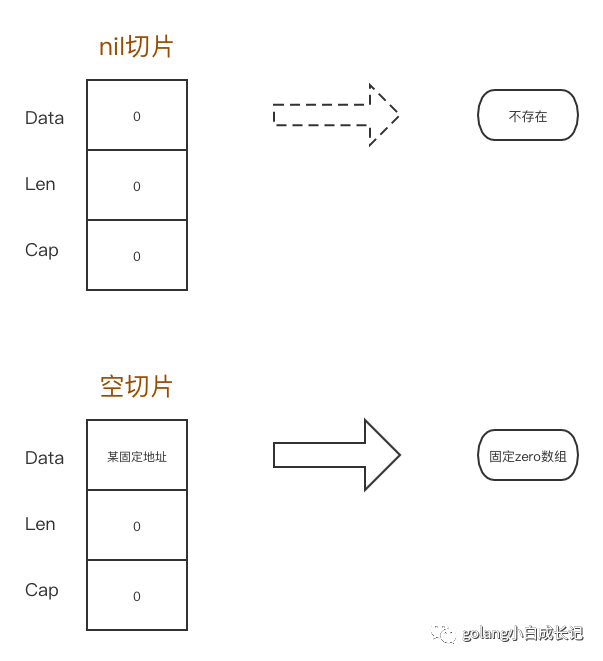

# nil 切片和空切片区别

## 总结

- **nil 切片和空切片指向的地址不一样。nil 空切片引用数组指针地址为 0（无指向任何实际地址）**
- **空切片的引用数组指针地址是有的，且固定为一个值**

## 切片 Slice 的数据结构

```
type SliceHeader struct {
 Data uintptr  // 引用数组指针地址
 Len  int      // 切片的目前使用长度
 Cap  int      // 切片的容量
}
```

## 解析

nil 切片和空切片最大的区别在于**指向的数组引用地址是不一样的**。

```
package main

import (
    "fmt"
    "reflect"
    "unsafe"
)

func main() {

    var s1 []int
    s2 := make([]int, 0)
    s3 := make([]int, 0)

    fmt.Printf("s1 pointer:%+v, s2 pointer:%+v, s3 pointer:%+v, \n", *(*reflect.SliceHeader)(unsafe.Pointer(&s1)), *(*reflect.SliceHeader)(unsafe.Pointer(&s2)), *(*reflect.SliceHeader)(unsafe.Pointer(&s3)))
    fmt.Printf("%v\n", (*(*reflect.SliceHeader)(unsafe.Pointer(&s1))).Data == (*(*reflect.SliceHeader)(unsafe.Pointer(&s2))).Data)
    fmt.Printf("%v\n", (*(*reflect.SliceHeader)(unsafe.Pointer(&s2))).Data == (*(*reflect.SliceHeader)(unsafe.Pointer(&s3))).Data)
}
```

执行结果：

```
$go build
$./go-test 
s1 pointer:{Data:0 Len:0 Cap:0}, s2 pointer:{Data:824634912448 Len:0 Cap:0}, s3 pointer:{Data:824634912448 Len:0 Cap:0}, 
false
true
```

可以看到：

- **nil 切片和空切片指向的地址不一样。nil 空切片引用数组指针地址为 0（无指向任何实际地址）**

- **空切片的引用数组指针地址是有的，且固定为一个值，它是一个 zero 数组**

  

  

## Reference

[1] <https://blog.csdn.net/ilini/article/details/115518988>
