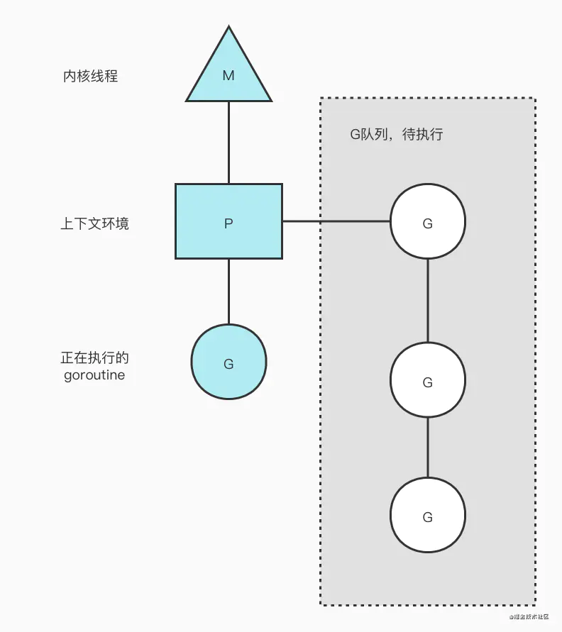

# GMP

## 线程模型

Golang 的线程模型是多对多模型，可以充分利用多核 CPU 提升运行性能。

## GMP 模型

* G：goroutine，基于协程建立的用户态线程
* M：Machine，它直接关联一个 os 内核线程，用于执行 G
* P：processor，P 里面一般会存当前 goroutine 运行的上下文环境（函数指针，堆栈地址及地址边界），P 会对自己管理的 goroutine 队列做一些调度

## 线程和协程的区别

线程是由 CPU 进行抢占式调度的，协程由用户态调度是协作式的，一个协程让出 CPU 后才会执行下一个协程。

> go1.14 后实现了非协作的抢占式调度。

* 轻量（几 KB）
* 调度更灵活（runtime）
