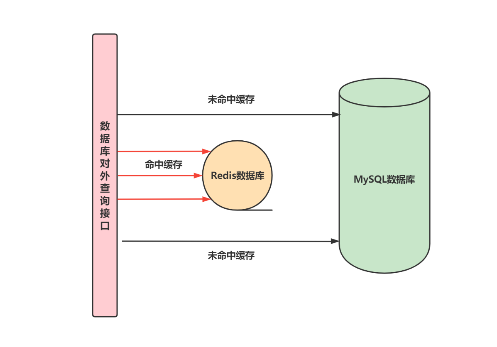

# 如何保证 Redis 缓存一致性

## 使用 Redis 缓存的背景

### 1. 总结

不同存储的速度是有区别的，缓存就是将低速存储的结果临时保存在高速存储中，提高查询效率。在数据库场景下，更廉价、高效但可靠性稍低的 redis 可以给更昂贵、较慢、可靠性强的 MySQL 作缓存。

### 2. 需要 Redis 缓存的原因

关系型数据库如 MySQL 往往支持完整的 ACID 特性（即原子性、一致性、隔离性和持久性），架构比较复杂并且性能普遍较低，高并发的查询需求会给 MySQL 带来较大压力，造成数据库系统的延迟甚至不稳定性。

根据局部性原理，80%的请求会落到 20%的热点数据上，在读多写少的场景下，增加一层缓存非常有助于提高数据库系统吞吐量和健壮性。通常我们会使用 Redis 作为 MySQL 的缓存，我们称在 Redis 中查找到数据为缓存命中，此时直接使用 redis 中的数据。如果缓存未命中则再从 MySQL 中读取数据，如此便可以帮助 MySQL 分担请求减轻压力。

### 3. 数据一致性问题

当 MySQL 数据更新时，Redis 缓存中的数据就会出现和 MySQL 数据不一致的问题。

## 解决方法

### 1. 方案一：设置 Redis 过期时间

我们可以设置 Redis 过期时间，假设我们设置过期时间为 10 秒，那么可以保障 Redis 返回的数据至少是 10 秒前有效的数据。当 MySQL 更新时 Redis 不做处理，等缓存过期失效时再从 Redis 拉取缓存。

优点：

* 开发成本低，容易实现
* 管理成本低，不容易出问题

缺点：

* 完全依赖过期时间，过期时间太短时造成缓存频繁失效，过期时间太长则容易造成较长时间不一致

### 2. 方案二：设置 Redis 过期时间 + 更新 MySQL 时尝试删除

第二种方案不仅设置 Redis 过期市场，而且在更新 MySQL 时尝试删除 Redis，如果删除成功那么下次访问该数据时会直接查询 MySQL 数据，然后再将更新后的数据写入 Redis 作为缓存，完成了数据同步。

优点：

* 开发成本低，仅仅是在方案一的基础上增加了删除逻辑
* 相对于方案一而言，数据不一致的时间更短

缺点：

* 更新 MySQL 成功但删除 Redis 失败时会退化到方案一
* 在高并发场景下，业务 server 需要和 MySQL 还有 Redis 同时尽心个链接，损耗了双倍的连接资源，容易造成连接数过多的问题

### 3. 方案三：更新 MySQL 后通过消息队列更新 Redis

在更新 MySQL 后我们可以将更新 Redis 操作交给消息队列，由消息队列来保障可靠性，此外需要搭建一个消费服务订阅消息队列来异步更新 Redis 数据。

优点：

* 使用消息队列时只需要将更新 Redis 操作的消息发送给消息队列，不必关心结果，解耦了缓存更新逻辑
* 消息队列本身具有可靠性，在投递成功的前提下，通过手动提交等手段去消费，可以保证更新操作至少在 Redis 中执行一次

不足：

* 时序性问题：假设有两台业务服务器同时修改了某个值，比如服务器 A 将该值修改成 A，服务器 B 将该值修改成 B，如果 MySQL 先执行服务器 A 的请求再执行服务器 B 的请求那么该值最终结果是 B，由于网络传输本身有一定延迟，所以消息队列可能先收到更新成 B 的请求再收到更新成 A 的请求，因此 Redis 最终结果可能时 B，此时 MySQL 和 Redis 中的数据就存在不一致问题
* 需要引入消息队列和消费服务，开发成本较高
* 依旧存在消耗更多客户端连接数的问题

### 4. 方案四：解析 MySQL 日志，实现完全解耦

我们可以订阅 MySQL 的 binlog 日志，解析日志内容后更新到 redis。

优点：

* 在同步服务压力不大情况下，延迟较低
* 和业务完全解耦，在更新 MySQL 时不需要作额外操作
* 解决了时序性问题，可靠性强

缺点：

* 需要单独搭建一个同步服务，并且引入 binlog 同步机制，成本较大
* 同步服务如果压力比较大或者崩溃，那么在较长时间内 Redis 中都是老旧数据

## 方案选择

* 首先确认产品上对延迟性的要求，如果要求极高那么就不要使用缓存
* 通常来说方案一就可以满足需求，因为使用缓存方案一般都是读多写少的场景，业务上对延迟具有一定的包容性
* 如果想增加更新时的即时性，那么就选择方案二，不过需要注意的时删除 Redis 老数据不要作为关键操作而影响业务核心主流程
* 方案三和方案四适用于对延迟要求比较高的业务，区别在于前者是推模式，后者是拉模式，而后者具有更强的可靠性且无时序性问题

## Reference

[1] <https://www.zhihu.com/question/319817091/answer/2116467691>
