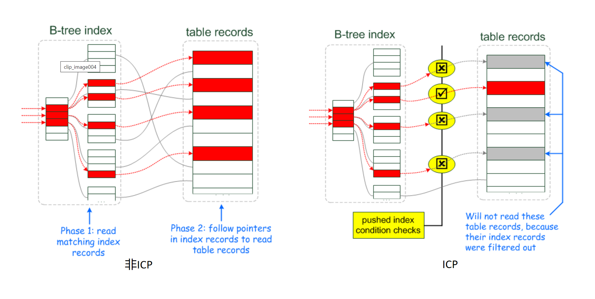

# MySQL 慢查询优化

## 慢查询原因

SQL 慢查询的原因包括：

* 硬件问题：网络速度慢、内存不足、I/O 吞吐量小和磁盘空间满等
* 缺少索引/索引失效
* 数据过多：对数据分库分表
* 服务器调优及各个参数设置：调整`my.conf`

## 索引失效

MySQL 索引失效的核心原理在于：

* MySQL 查询优化器认为全表扫描比使用索引更好（比如表数据量太小或者使用了`like %a`的全匹配）
* 无法根据值去检索索引对应的 B-Tree（比如使用函数引入不确定）

### 1. 函数操作引起的索引失效

```sql
# 不走索引的 sql
select * from t1 where date(c) = '2019-05-21';
# 走索引的 sql
select * from t1 where c >= '2019-05-21 00:00:00' and c <= '2019-05-21 23:59:59';
```

原因在于索引树种存储的是列的实际值`2019-05-21 00:00:00`，因此用`2019-05-21`去搜索时定位不到索引树中的值，因此进行全表扫描。

### 2. 隐式转换

```sql
# 不走索引的 sql
select * from t1 where a = 1000;
# 走索引的 sql
select * from t1 where a = '1000';
```

字段`a`的存储类型为`varchar`，在查询条件中误以为是数值型漏写单引号而发生隐式转换，导致走了全表扫描。

### 3. 模糊查询

like 有最左匹配原则

```sql
# 不走索引的 sql
select * from t1 where a like '%1111%';
# 走索引的 sql
select * from t1 where a like '1111%';
```

### 4. 范围查询太大

```sql
# 不走索引的 sql
select * from t1 where b>=1 and b <= 2000;
# 拆分后走索引
select * from t1 where b>=1 and b <= 1000;
select * from t1 where b>=1001 and b <= 2000;
```

查询优化器会根据检索比例、表大小、I/O 块大小等进行评估是否使用索引。比如单次查询的数据量过大，优化器将不走索引。

遇到此类操作时，应该在执行之前对 SQL 做 explain 分析，确定能走索引，再进行操作，否则不但可能导致操作缓慢，在做更新或者删除时，甚至会导致表所有记录锁住，十分危险。

### 5. 计算操作

```sql
# 不走索引的 sql
select * from t1 where b - 1 =1000;
# 走索引的 sql
select * from t1 where b = 1000 + 1;
```

一般需要对条件字段做计算时，建议通过程序代码实现，而不是通过 MySQL 实现。如果在 MySQL 中计算的情况避免不了，那必须把计算放在等号后面。

### 6. 索引无法存储 null 值

> Q：为什么索引无法存储 null 值
>
> A：索引是有序的，NULL 值是不确定值因此无法确定其应该放在索引树的哪个叶子节点位置。

单列索引无法存储 null 值，符合索引无法存储全为 null 的数据。查询时如果用到了`is null`条件时，不能使用索引只能全表扫描。

解决方法：把 NULL 值转换成一个特殊值，在 WHERE 条件用该特殊值来定位 NULL。

### 7. 不适合键值较少的列

假如索引列`index`有 5 个键值对，全表有一万条数据，那么`Where index = 1`要访问表中的 2000 个数据块加上索引块。假设每 10 条数据是一个数据块，那么全表扫描只需要访问 1000 个数据块。由于全表扫描访问的数据块更少，因此不会使用索引。

> 注意当 MySQL 优化器估计使用全表扫描要比使用索引快时就不会使用索引。而且键值较少的列违背了索引的离散性原则，这种列本来就不应该拿来做索引。

### 8. 条件中包含 or

如果查询条件中包含 or，即使条件带索引也不会使用（这也是为什么尽量少使用 or 的原因）。

要想既使用 or 又让索引生效，那么需要将 or 条件中每个列都设置为索引。

### 9. 表数据量太少

如果表中数据量太少的话，mysql 查询优化器会认为走索引查询效率低，全表扫描效率更高。

## 数据集

我们使用的原始数据如下（注意 uid 是可重复的）：

```sql
-- 创建数据库
CREATE DATABASE test;
use test;

-- 创建 users 表, 并以 id 为主键 
CREATE TABLE users (
  id int,
  uid int,
  name varchar(255),
  address varchar(255),
  city varchar(255),
  PRIMARY KEY (`id`)
) ENGINE=InnoDB AUTO_INCREMENT=1 DEFAULT CHARSET=utf8;

-- 插入数据
INSERT INTO users VALUES (1, 23, 'jack', 'hangzhou', 'hangzhou');
INSERT INTO users VALUES (2, 31, 'joker',  'beijing', 'beijing');
INSERT INTO users VALUES (3, 55, 'cat',  'shanghai', 'shanghai');
INSERT INTO users VALUES (4, 72, 'dog',  'chongqing', 'chongqing');
INSERT INTO users VALUES (5, 102, 'lee',  'sichuan', 'sichuan');
INSERT INTO users VALUES (6, 312, 'john',  'baoding', 'baoding');
INSERT INTO users VALUES (7, 9823, 'rick',  'kaifeng', 'kaifeng');
INSERT INTO users VALUES (8, 9823, 'alpha',  'guilin', 'guilin');
INSERT INTO users VALUES (9, 9823, 'yang',  'dali', 'dali');
INSERT INTO users VALUES (10, 12313, 'chen',  'taian', 'taian');

-- 建立[uid,name]联合索引, 包含了 uid 列的索引但是不包含 name 列索引（最左匹配原则）
ALTER TABLE `users` ADD INDEX uid_name (`uid`, `name`);
```

## MySQL 执行计划信息

 MySQL 可以通过 explain 关键字查看执行计划信息，这是我们进行 SQL 调优的主要手段。

```bash
mysql> explain select * from users where uid = 10;
+----+-------------+-------+------------+------+---------------+----------+---------+-------+------+----------+-------+
| id | select_type | table | partitions | type | possible_keys | key      | key_len | ref   | rows | filtered | Extra |
+----+-------------+-------+------------+------+---------------+----------+---------+-------+------+----------+-------+
|  1 | SIMPLE      | users | NULL       | ref  | uid_name      | uid_name | 5       | const |    1 |   100.00 | NULL  |
+----+-------------+-------+------------+------+---------------+----------+---------+-------+------+----------+-------+
1 row in set, 1 warning (0.00 sec)
```

### 1. SelectType 字段

| 类型         | 含义                            |
| ------------ | ------------------------------- |
| SIMPLE       | 简单查询（不使用 UNION 或子查询） |
| PRIMAY       | 最外层查询，主查询              |
| SUBQUERY     | 子查询中第一个 SELECT            |
| DERIVED      | 子查询在 FROM 子句中              |
| UNION        | UNION 中第二个或后面的语句       |
| UNION RESULT | UNION 的结果                     |

### 2. Table 字段

正在访问的表名。

### 3. Type 字段

性能从坏到好为：

* `ALL`：全数据表扫描，遍历全表找到匹配行
* `index`：全索引表扫描，只遍历索引树
* `range`：对索引列进行范围查找，常用于`between`、`<`和`>`的查询
* `ref`：非唯一性索引扫描，根据索引查找一个值或多个值
* `eq_ref`：唯一性索引扫描，常用于 primary key 或 unique key 索引扫描
* `const`：表最多有一个匹配行时，在这行的列值可被优化器认为是常量，例如将主键置于 where 子句中
* `system`：表仅有一行，是`const`联结类型的特例
* `null`：优化器在优化过程中分解语句，执行时甚至不用访问表或索引

### 4. PossibleKeys 字段

可能使用的索引。

### 5. Key 字段

真实使用的索引。

### 6. KeyLen 字段

索引字节长度。

### 7. Rows 字段

MysQL 预估为了找到所需的行而要读取的行数。

### 8. Extra 字段

| 类型                  | 含义                                                         |
| --------------------- | ------------------------------------------------------------ |
| Using index           | 使用覆盖索引（一个索引包含所有需要查询的字段的值），避免访问表 |
| Using where           | 在存储引擎检索行后再进行过滤                                 |
| Using temporary       | 对查询结果使用临时表，常见于排序和分组查询                   |
| Using filesort        | 对查询结果使用一个外部索引排序，而不是按索引次序从表里读取行 |
| Using index condition | MySQL5.6 后加入的新特性，会先条件过滤索引找到所有符合索引条件的数据行，然后用 where 子句中其他条件取过滤数据行 |

## Extra 字段与 where 子句的关系

各式各样的 where 条件，在处理时分成三种情况：

* index key：where 子句中确定索引连续范围的查询条件（由于范围包含起始和终止位置，因此 index key 也被拆分为 index first key 和 index last key），即**用索引来确定扫描范围**
* index filter：使用 index key 确定了扫描范围后，在此范围内如果有一些记录可以使用索引条件进行过滤，那么就被称为 index filter，即**用索引来进行 where 条件过滤**
* table filter：where 子句中的条件无法使用索引进行处理时，只能**访问 table 进行条件过滤**

在 MySQL5.6 之前并不区分 index filter 与 table filter，统一将 index first key 与 index last key 确定的范围回表读取完整记录，然后返回给 Server 层进行过滤。

在 MySQL5.6 之后，index filter 与 table filter 分离，index filter 下降到 InnoDB 的索引层面进行过滤，减少了回表和返回 Server 层记录的 io 开销，提高了执行效率。

MySQL5.6 后的 ICP 技术，其实就是 index filter 技术，只不过由于 MYSQL 的架构原因（分为 Server 层和 Storage Engine 层）才有所谓的“下推”说法。ICP 本质上就是将原先在 Server 层 table filter 中可以进行 index filter 的部分，优化到 Storage Engine 层使用 index filter 进行处理，不需要回表进行 table filter。

### 1. Using where

Extra 字段中出现`Using where`表示全表扫描或者在查询使用索引的情况下，还有部分查询条件不在索引字段中。

#### 1.1 非索引列查询

当 where 子句中的列不是索引字段时，需要进行全表扫描后使用 where 过滤数据。例如我们用联合索引`[uid,name]`非前导列 name 作为 where 查询条件：

```bash
mysql> explain select * from users where name = 'lee';
+----+-------------+-------+------------+------+---------------+------+---------+------+------+----------+-------------+
| id | select_type | table | partitions | type | possible_keys | key  | key_len | ref  | rows | filtered | Extra       |
+----+-------------+-------+------------+------+---------------+------+---------+------+------+----------+-------------+
|  1 | SIMPLE      | users | NULL       | ALL  | NULL          | NULL | NULL    | NULL |   10 |    10.00 | Using where |
+----+-------------+-------+------------+------+---------------+------+---------+------+------+----------+-------------+
1 row in set, 1 warning (0.00 sec)
```

#### 1.2 索引列范围查询

唯一性索引：

```bash
mysql> explain select * from users where id < 10 and id > 5;
+----+-------------+-------+------------+-------+---------------+---------+---------+------+------+----------+-------------+
| id | select_type | table | partitions | type  | possible_keys | key     | key_len | ref  | rows | filtered | Extra       |
+----+-------------+-------+------------+-------+---------------+---------+---------+------+------+----------+-------------+
|  1 | SIMPLE      | users | NULL       | range | PRIMARY       | PRIMARY | 4       | NULL |    4 |   100.00 | Using where |
+----+-------------+-------+------------+-------+---------------+---------+---------+------+------+----------+-------------+
1 row in set, 1 warning (0.00 sec)
```

非唯一性索引：

```bash
mysql> explain select * from users where uid < 100;
+----+-------------+-------+------------+------+---------------+------+---------+------+------+----------+-------------+
| id | select_type | table | partitions | type | possible_keys | key  | key_len | ref  | rows | filtered | Extra       |
+----+-------------+-------+------------+------+---------------+------+---------+------+------+----------+-------------+
|  1 | SIMPLE      | users | NULL       | ALL  | uid_name      | NULL | NULL    | NULL |   10 |    40.00 | Using where |
+----+-------------+-------+------------+------+---------------+------+---------+------+------+----------+-------------+
1 row in set, 1 warning (0.00 sec)
```

#### 1.3 索引列查询 + 非索引列查询

当 where 子句中同时包含索引条件和非索引条件时，MySQL 会先通过索引字段在存储引擎返回行数据，然后再通过 where 过滤数据。

```bash
mysql> explain select * from users where uid = 10 and address = 'beijing';
+----+-------------+-------+------------+------+---------------+----------+---------+-------+------+----------+-------------+
| id | select_type | table | partitions | type | possible_keys | key      | key_len | ref   | rows | filtered | Extra       |
+----+-------------+-------+------------+------+---------------+----------+---------+-------+------+----------+-------------+
|  1 | SIMPLE      | users | NULL       | ref  | uid_name      | uid_name | 5       | const |    1 |    10.00 | Using where |
+----+-------------+-------+------------+------+---------------+----------+---------+-------+------+----------+-------------+
1 row in set, 1 warning (0.00 sec)
```

### 2. Using index

using index 表示访问索引就可以获取到所需数据，不需要通过索引回表。（Extra 字段显示 NULL 时表示需要回表）

#### 2.1 查询的列被索引覆盖 + 索引前导列查询

where 子句条件是索引前导列`uid`，查询的列被联合索引`[uid, name]`覆盖：

```bash
mysql> explain select uid, name from users where uid = 10;
+----+-------------+-------+------------+------+---------------+----------+---------+-------+------+----------+-------------+
| id | select_type | table | partitions | type | possible_keys | key      | key_len | ref   | rows | filtered | Extra       |
+----+-------------+-------+------------+------+---------------+----------+---------+-------+------+----------+-------------+
|  1 | SIMPLE      | users | NULL       | ref  | uid_name      | uid_name | 5       | const |    1 |   100.00 | Using index |
+----+-------------+-------+------------+------+---------------+----------+---------+-------+------+----------+-------------+
1 row in set, 1 warning (0.00 sec)
```

#### 2.2 查询的列是主键 + 索引前导列查询

在 Innodb 存储引擎中，辅助索引的 B-Tree 叶子结点存储着主键的值，因此通过联合索引`[uid,name]`的前导列`uid`查询主键`id`时不需要回表从而提高查询速度：

```bash
mysql> explain select id from users where uid = 8;
+----+-------------+-------+------------+------+---------------+----------+---------+-------+------+----------+-------------+
| id | select_type | table | partitions | type | possible_keys | key      | key_len | ref   | rows | filtered | Extra       |
+----+-------------+-------+------------+------+---------------+----------+---------+-------+------+----------+-------------+
|  1 | SIMPLE      | users | NULL       | ref  | uid_name      | uid_name | 5       | const |    1 |   100.00 | Using index |
+----+-------------+-------+------------+------+---------------+----------+---------+-------+------+----------+-------------+
1 row in set, 1 warning (0.00 sec)
```

### 3. Using where; Using index

#### 3.1 查询的列被索引覆盖 + 索引非前导列查询

where 子句条件是`name`，它是联合索引`[uid,name]`中的非前导列，此时无法直接通过索引查找来查询到符合条件的数据：

```bash
mysql> explain select uid, name from users where name = 'a';
+----+-------------+-------+------------+-------+---------------+----------+---------+------+------+----------+--------------------------+
| id | select_type | table | partitions | type  | possible_keys | key      | key_len | ref  | rows | filtered | Extra                    |
+----+-------------+-------+------------+-------+---------------+----------+---------+------+------+----------+--------------------------+
|  1 | SIMPLE      | users | NULL       | index | NULL          | uid_name | 773     | NULL |   10 |    10.00 | Using where; Using index |
+----+-------------+-------+------------+-------+---------------+----------+---------+------+------+----------+--------------------------+
1 row in set, 1 warning (0.00 sec)
```

#### 3.2 查询的列被索引覆盖 + 索引前导列范围查询

where 子句条件是索引前导列`uid`的范围查询，查询的列被联合索引`[uid, name]`覆盖：

```bash
mysql> explain select uid, name from users where uid > 3 and uid < 6;
+----+-------------+-------+------------+-------+---------------+----------+---------+------+------+----------+--------------------------+
| id | select_type | table | partitions | type  | possible_keys | key      | key_len | ref  | rows | filtered | Extra                    |
+----+-------------+-------+------------+-------+---------------+----------+---------+------+------+----------+--------------------------+
|  1 | SIMPLE      | users | NULL       | range | uid_name      | uid_name | 5       | NULL |    1 |   100.00 | Using where; Using index |
+----+-------------+-------+------------+-------+---------------+----------+---------+------+------+----------+--------------------------+
1 row in set, 1 warning (0.00 sec)
```

### 4. Using index condition

Using Index Pushdown（ICP）是 MySQL5.6 以上版本中的新特性，是一种再存储引擎曾使用索引过滤数据的优化方式。它会先条件过滤索引，过滤完索引后找到所有符合索引条件的数据行，随后用 where 子句中的其他条件去过滤这些数据行。



如上图所示，ICP 思想是存储引擎在访问索引时候检查 where 子句中的索引列条件（pushed index condition checks，推送的索引条件检查），如果索引元组中的数据不满足推送的条件就过滤掉该条数据记录。ICP 尽可能把 index condition 的处理从 Server 曾下推到 Storage Engine 层，由 Storage Engine 层使用索引条件过滤掉不合适的数据，仅返回符合 index condition 条件的数据给 Server 层，这样就可以减少 io 次数从而提高查询语句性能。

> MySQL5.6 之前并不区分 Index Filter 与 Table Filter，统统将 Index First Key 与 Index Last Key 范围内的索引记录回表读取完整记录。MySQL5.6 之后推出的 ICP 技术将原先在 Server 层 table filter 中可以进行 index filter 的部分，优化到 Storage Engine 层使用 index filter 进行处理，不需要回表进行 table filter。

当我们在 where 子句中用`id`索引列确定了扫描范围后，如果 where 子句中还有其他的索引列条件（`[uid,name]`联合索引的前导列 uid），那么 Extra 字段就会出现 Using index condition：

```bash
mysql> explain select * from users where id > 2 and id < 10 and uid = 20;
+----+-------------+-------+------------+------+------------------+----------+---------+-------+------+----------+-----------------------+
| id | select_type | table | partitions | type | possible_keys    | key      | key_len | ref   | rows | filtered | Extra                 |
+----+-------------+-------+------------+------+------------------+----------+---------+-------+------+----------+-----------------------+
|  1 | SIMPLE      | users | NULL       | ref  | PRIMARY,uid_name | uid_name | 5       | const |    1 |    70.00 | Using index condition |
+----+-------------+-------+------------+------+------------------+----------+---------+-------+------+----------+-----------------------+
1 row in set, 1 warning (0.00 sec)
```

更进一步，如果我们在 where 子句中用`id`索引列确定了扫描范围后，where 子句中同时出现了索引列条件和非索引列条件，那么 Extra 字段就会出现 Using index condition 和 Using where：

```bash
mysql> explain select * from users where id > 2 and id < 10 and uid = 10 and address = 'a';
+----+-------------+-------+------------+------+------------------+----------+---------+-------+------+----------+------------------------------------+
| id | select_type | table | partitions | type | possible_keys    | key      | key_len | ref   | rows | filtered | Extra                              |
+----+-------------+-------+------------+------+------------------+----------+---------+-------+------+----------+------------------------------------+
|  1 | SIMPLE      | users | NULL       | ref  | PRIMARY,uid_name | uid_name | 5       | const |    1 |    10.00 | Using index condition; Using where |
+----+-------------+-------+------------+------+------------------+----------+---------+-------+------+----------+------------------------------------+
1 row in set, 1 warning (0.00 sec)
```

### 5. NULL

#### 5.1 查询的列未被索引覆盖 + 索引列查询

联合索引前导列查询：

```bash
mysql> explain select * from users where uid = 10;
+----+-------------+-------+------------+------+---------------+----------+---------+-------+------+----------+-------+
| id | select_type | table | partitions | type | possible_keys | key      | key_len | ref   | rows | filtered | Extra |
+----+-------------+-------+------------+------+---------------+----------+---------+-------+------+----------+-------+
|  1 | SIMPLE      | users | NULL       | ref  | uid_name      | uid_name | 5       | const |    1 |   100.00 | NULL  |
+----+-------------+-------+------------+------+---------------+----------+---------+-------+------+----------+-------+
1 row in set, 1 warning (0.00 sec)
```

主键列查询：

```bash
mysql> explain select * from users where id = 10;
+----+-------------+-------+------------+-------+---------------+---------+---------+-------+------+----------+-------+
| id | select_type | table | partitions | type  | possible_keys | key     | key_len | ref   | rows | filtered | Extra |
+----+-------------+-------+------------+-------+---------------+---------+---------+-------+------+----------+-------+
|  1 | SIMPLE      | users | NULL       | const | PRIMARY       | PRIMARY | 4       | const |    1 |   100.00 | NULL  |
+----+-------------+-------+------------+-------+---------------+---------+---------+-------+------+----------+-------+
1 row in set, 1 warning (0.00 sec)
```

## Innodb B+Tree 索引使用建议

由于不同的存储引擎和不同的索引类型差异较大，这里只讨论最常用的 Innodb 中 B+Tree 索引的使用建议。

我们使用的原始数据如下：

```sql
-- 创建数据库
CREATE DATABASE test;
use test;

-- 创建 users 表, 并以 id 为主键 
CREATE TABLE users (
  id int,
  uid int,
  name varchar(255),
  address varchar(255),
  city varchar(255),
  PRIMARY KEY (`id`)
) ENGINE=InnoDB AUTO_INCREMENT=1 DEFAULT CHARSET=utf8;

-- 插入数据
INSERT INTO users VALUES (1, 23, '张三', '天津之眼', '杭州');
INSERT INTO users VALUES (2, 31, '李四',  '大烟袋街', '北京');
INSERT INTO users VALUES (3, 55, '王五',  '王府井', '上海');
INSERT INTO users VALUES (4, 72, '赵六',  '广州塔', '重庆');
INSERT INTO users VALUES (5, 102, '甲',  '九寨沟', '四川');
INSERT INTO users VALUES (6, 312, '乙',  '黄山', '保定');
INSERT INTO users VALUES (7, 558, '丙',  '雷音寺', '开封');
INSERT INTO users VALUES (8, 1025, '丁',  '长城', '桂林');
INSERT INTO users VALUES (9, 9823, '戊',  '天坛', '大理');
INSERT INTO users VALUES (10, 12313, '己',  '体育馆', '泰安');

-- 建立[uid,name]联合索引, 包含了 uid 列的索引但是不包含 name 列索引（最左匹配原则）
ALTER TABLE `users` ADD INDEX uid_name (`uid`, `name`);
```

### 1. 联合索引遵循最左匹配原则

最左匹配指的就是：

* 如果不是按照索引最左列开始查找则无法使用该联合索引
* 联合索引中如果精确匹配最左列且范围匹配另一列，则可以使用该联合索引
* 联合索引中如果范围匹配某一列，则该列右边所有列都无法使用该联合索引

where 子句中仅使用`uid`列时可以使用联合索引`uid_name`：

```bash
mysql> explain select * from users where uid = 55;
+----+-------------+-------+------------+------+---------------+----------+---------+-------+------+----------+-------+
| id | select_type | table | partitions | type | possible_keys | key      | key_len | ref   | rows | filtered | Extra |
+----+-------------+-------+------------+------+---------------+----------+---------+-------+------+----------+-------+
|  1 | SIMPLE      | users | NULL       | ref  | uid_name      | uid_name | 5       | const |    1 |   100.00 | NULL  |
+----+-------------+-------+------------+------+---------------+----------+---------+-------+------+----------+-------+
1 row in set, 1 warning (0.00 sec)
```

where 子句中仅使用`name`列时不可以使用联合索引`uid_name`，执行的是全表扫描：

```bash
mysql> explain select * from users where name = '甲';
+----+-------------+-------+------------+------+---------------+------+---------+------+------+----------+-------------+
| id | select_type | table | partitions | type | possible_keys | key  | key_len | ref  | rows | filtered | Extra       |
+----+-------------+-------+------------+------+---------------+------+---------+------+------+----------+-------------+
|  1 | SIMPLE      | users | NULL       | ALL  | NULL          | NULL | NULL    | NULL |   10 |    10.00 | Using where |
+----+-------------+-------+------------+------+---------------+------+---------+------+------+----------+-------------+
1 row in set, 1 warning (0.00 sec)
```

where 子句中同时使用`uid`列和`name`列是可以使用联合索引`uid_name`的：

```bash
mysql> explain select * from users where name = '甲' and uid = 7;
+----+-------------+-------+------------+------+---------------+----------+---------+-------------+------+----------+-------+
| id | select_type | table | partitions | type | possible_keys | key      | key_len | ref         | rows | filtered | Extra |
+----+-------------+-------+------------+------+---------------+----------+---------+-------------+------+----------+-------+
|  1 | SIMPLE      | users | NULL       | ref  | uid_name      | uid_name | 773     | const,const |    1 |   100.00 | NULL  |
+----+-------------+-------+------------+------+---------------+----------+---------+-------------+------+----------+-------+
1 row in set, 1 warning (0.00 sec)
```

### 2. 范围查询太大时无法使用索引

当范围查询中查询的范围较大时，MySQL 查询优化器认为走索引查询不如全表扫描，因此不会使用索引：

```bash
mysql> explain select * from users where uid > 2;
+----+-------------+-------+------------+------+---------------+------+---------+------+------+----------+-------------+
| id | select_type | table | partitions | type | possible_keys | key  | key_len | ref  | rows | filtered | Extra       |
+----+-------------+-------+------------+------+---------------+------+---------+------+------+----------+-------------+
|  1 | SIMPLE      | users | NULL       | ALL  | uid_name      | NULL | NULL    | NULL |   10 |   100.00 | Using where |
+----+-------------+-------+------------+------+---------------+------+---------+------+------+----------+-------------+
1 row in set, 1 warning (0.00 sec)
```

当范围查询中查询的范围较小时，仍然可以使用索引：

```sql
mysql> explain select * from users where uid > 10000;
+----+-------------+-------+------------+-------+---------------+----------+---------+------+------+----------+-----------------------+
| id | select_type | table | partitions | type  | possible_keys | key      | key_len | ref  | rows | filtered | Extra                 |
+----+-------------+-------+------------+-------+---------------+----------+---------+------+------+----------+-----------------------+
|  1 | SIMPLE      | users | NULL       | range | uid_name      | uid_name | 5       | NULL |    1 |   100.00 | Using index condition |
+----+-------------+-------+------------+-------+---------------+----------+---------+------+------+----------+-----------------------+
1 row in set, 1 warning (0.00 sec)
```

### 3. 索引作为表达式的一部分时无法使用索引

索引作为表达式的一部分时会失效：

```bash
mysql> explain select * from users where uid + 1 = 8;
+----+-------------+-------+------------+------+---------------+------+---------+------+------+----------+-------------+
| id | select_type | table | partitions | type | possible_keys | key  | key_len | ref  | rows | filtered | Extra       |
+----+-------------+-------+------------+------+---------------+------+---------+------+------+----------+-------------+
|  1 | SIMPLE      | users | NULL       | ALL  | NULL          | NULL | NULL    | NULL |   10 |   100.00 | Using where |
+----+-------------+-------+------------+------+---------------+------+---------+------+------+----------+-------------+
1 row in set, 1 warning (0.00 sec)
```

如果非要使用表达式时，最好将计算过程写在等号右边，此时可以使用索引：

```sql
mysql> explain select * from users where uid = 8 - 1;
+----+-------------+-------+------------+------+---------------+----------+---------+-------+------+----------+-------+
| id | select_type | table | partitions | type | possible_keys | key      | key_len | ref   | rows | filtered | Extra |
+----+-------------+-------+------------+------+---------------+----------+---------+-------+------+----------+-------+
|  1 | SIMPLE      | users | NULL       | ref  | uid_name      | uid_name | 5       | const |    1 |   100.00 | NULL  |
+----+-------------+-------+------------+------+---------------+----------+---------+-------+------+----------+-------+
1 row in set, 1 warning (0.00 sec)
```

### 4. 在索引上应用函数时无法使用索引

在索引上使用函数时索引会失效：

```bash
mysql> explain select * from users where abs(uid) = 8;
+----+-------------+-------+------------+------+---------------+------+---------+------+------+----------+-------------+
| id | select_type | table | partitions | type | possible_keys | key  | key_len | ref  | rows | filtered | Extra       |
+----+-------------+-------+------------+------+---------------+------+---------+------+------+----------+-------------+
|  1 | SIMPLE      | users | NULL       | ALL  | NULL          | NULL | NULL    | NULL |   10 |   100.00 | Using where |
+----+-------------+-------+------------+------+---------------+------+---------+------+------+----------+-------------+
1 row in set, 1 warning (0.00 sec)
```

### 5. 少用 select *，通过覆盖索引提高查询速度

在 Innode 存储引擎中主键索引为聚焦索引（数据库表中数据的物理顺序和键值的逻辑顺序相同），如下图为例辅助索引叶子节点数据区保存的是主键索引的关键字，因此使用辅助索引时需要先通过辅助索引找到主键索引的关键字，然后再检索一次主键索引找到数据：


MySQL 中覆盖索引指的是需要查询的列通过索引项的信息可以直接返回，可以提高查询效率。如果使用了覆盖索引，那么 Extra 中会显示 using index。

覆盖索引包含两种情况：

* 查询的列在联合索引中
* 查询的列是主键

#### 5.1 查询的列在联合索引中

where 条件中查询`uid`字段，使用了`uid_name`联合索引，因此查询 name 列时可以提高查询速度：

```bash
mysql> explain select uid, name from users where uid = 8;
+----+-------------+-------+------------+------+---------------+----------+---------+-------+------+----------+-------------+
| id | select_type | table | partitions | type | possible_keys | key      | key_len | ref   | rows | filtered | Extra       |
+----+-------------+-------+------------+------+---------------+----------+---------+-------+------+----------+-------------+
|  1 | SIMPLE      | users | NULL       | ref  | uid_name      | uid_name | 5       | const |    1 |   100.00 | Using index |
+----+-------------+-------+------------+------+---------------+----------+---------+-------+------+----------+-------------+
1 row in set, 1 warning (0.00 sec)
```

#### 5.2 查询的列是主键

在 Innodb 存储引擎中，辅助索引的 B-Tree 叶子结点存储着主键 id 的值，因此查询 id 列时可以直接返回从而提高查询速度：

```bash
mysql> explain select id from users where uid = 8;
+----+-------------+-------+------------+------+---------------+----------+---------+-------+------+----------+-------------+
| id | select_type | table | partitions | type | possible_keys | key      | key_len | ref   | rows | filtered | Extra       |
+----+-------------+-------+------------+------+---------------+----------+---------+-------+------+----------+-------------+
|  1 | SIMPLE      | users | NULL       | ref  | uid_name      | uid_name | 5       | const |    1 |   100.00 | Using index |
+----+-------------+-------+------------+------+---------------+----------+---------+-------+------+----------+-------------+
1 row in set, 1 warning (0.00 sec)
```

### 6. order by 子句中用 Index 方式排序

MySQL 中 order by 有 filesort 和 index 两种排序方式：

* filesort：在内存中排序，需要占用 CPU 资源；查询结果太大时还会产生临时文件，需要在磁盘中排序，由于大量 IO 操作导致耗时过长
* index：使用索引扫描，由于索引本身就是有序的，因此不需要再次进行排序

#### 6.1 index 场景

* order by 子句使用索引最左前列

```bash
mysql> explain select uid from users order by uid;
+----+-------------+-------+------------+-------+---------------+----------+---------+------+------+----------+-------------+
| id | select_type | table | partitions | type  | possible_keys | key      | key_len | ref  | rows | filtered | Extra       |
+----+-------------+-------+------------+-------+---------------+----------+---------+------+------+----------+-------------+
|  1 | SIMPLE      | users | NULL       | index | NULL          | uid_name | 773     | NULL |   10 |   100.00 | Using index |
+----+-------------+-------+------------+-------+---------------+----------+---------+------+------+----------+-------------+
1 row in set, 1 warning (0.01 sec)

mysql> explain select id from users order by id;
+----+-------------+-------+------------+-------+---------------+---------+---------+------+------+----------+-------------+
| id | select_type | table | partitions | type  | possible_keys | key     | key_len | ref  | rows | filtered | Extra       |
+----+-------------+-------+------------+-------+---------------+---------+---------+------+------+----------+-------------+
|  1 | SIMPLE      | users | NULL       | index | NULL          | PRIMARY | 4       | NULL |   10 |   100.00 | Using index |
+----+-------------+-------+------------+-------+---------------+---------+---------+------+------+----------+-------------+
1 row in set, 1 warning (0.00 sec)
```

* where 子句和 order by 子句使用条件列组合满足索引最左前列

```bash
mysql> explain select uid, name from users where uid = 10 order by name;
+----+-------------+-------+------------+------+---------------+----------+---------+-------+------+----------+--------------------------+
| id | select_type | table | partitions | type | possible_keys | key      | key_len | ref   | rows | filtered | Extra                    |
+----+-------------+-------+------------+------+---------------+----------+---------+-------+------+----------+--------------------------+
|  1 | SIMPLE      | users | NULL       | ref  | uid_name      | uid_name | 5       | const |    1 |   100.00 | Using where; Using index |
+----+-------------+-------+------------+------+---------------+----------+---------+-------+------+----------+--------------------------+
1 row in set, 1 warning (0.00 sec)
```

#### 6.2 filesort 场景

* 检查的行过多且没有使用覆盖索引

```bash
mysql> explain select uid, address from users order by uid;
+----+-------------+-------+------------+------+---------------+------+---------+------+------+----------+----------------+
| id | select_type | table | partitions | type | possible_keys | key  | key_len | ref  | rows | filtered | Extra          |
+----+-------------+-------+------------+------+---------------+------+---------+------+------+----------+----------------+
|  1 | SIMPLE      | users | NULL       | ALL  | NULL          | NULL | NULL    | NULL |   10 |   100.00 | Using filesort |
+----+-------------+-------+------------+------+---------------+------+---------+------+------+----------+----------------+
1 row in set, 1 warning (0.00 sec)
```

* order by 子句使用了不同索引

```bash
mysql> explain select uid, id from users order by id, uid;
+----+-------------+-------+------------+-------+---------------+----------+---------+------+------+----------+-----------------------------+
| id | select_type | table | partitions | type  | possible_keys | key      | key_len | ref  | rows | filtered | Extra                       |
+----+-------------+-------+------------+-------+---------------+----------+---------+------+------+----------+-----------------------------+
|  1 | SIMPLE      | users | NULL       | index | NULL          | uid_name | 773     | NULL |   10 |   100.00 | Using index; Using filesort |
+----+-------------+-------+------------+-------+---------------+----------+---------+------+------+----------+-----------------------------+
1 row in set, 1 warning (0.00 sec)
```

* 对索引列同时使用了 asc 和 desc

```bash
mysql> explain select uid, name from users order by uid asc, name desc;
+----+-------------+-------+------------+-------+---------------+----------+---------+------+------+----------+-----------------------------+
| id | select_type | table | partitions | type  | possible_keys | key      | key_len | ref  | rows | filtered | Extra                       |
+----+-------------+-------+------------+-------+---------------+----------+---------+------+------+----------+-----------------------------+
|  1 | SIMPLE      | users | NULL       | index | NULL          | uid_name | 773     | NULL |   10 |   100.00 | Using index; Using filesort |
+----+-------------+-------+------------+-------+---------------+----------+---------+------+------+----------+-----------------------------+
1 row in set, 1 warning (0.00 sec)
```

* where 子句和 order by 子句使用了不同的索引

```bash
mysql> explain select id, uid from users where uid = 10 order by id;
+----+-------------+-------+------------+------+---------------+----------+---------+-------+------+----------+------------------------------------------+
| id | select_type | table | partitions | type | possible_keys | key      | key_len | ref   | rows | filtered | Extra                                    |
+----+-------------+-------+------------+------+---------------+----------+---------+-------+------+----------+------------------------------------------+
|  1 | SIMPLE      | users | NULL       | ref  | uid_name      | uid_name | 5       | const |    1 |   100.00 | Using where; Using index; Using filesort |
+----+-------------+-------+------------+------+---------------+----------+---------+-------+------+----------+------------------------------------------+
1 row in set, 1 warning (0.00 sec)
```

* where 子句或 order by 子句中索引列使用了表达式

```bash
mysql> explain select uid from users order by abs(uid);
+----+-------------+-------+------------+-------+---------------+----------+---------+------+------+----------+-----------------------------+
| id | select_type | table | partitions | type  | possible_keys | key      | key_len | ref  | rows | filtered | Extra                       |
+----+-------------+-------+------------+-------+---------------+----------+---------+------+------+----------+-----------------------------+
|  1 | SIMPLE      | users | NULL       | index | NULL          | uid_name | 773     | NULL |   10 |   100.00 | Using index; Using filesort |
+----+-------------+-------+------------+-------+---------------+----------+---------+------+------+----------+-----------------------------+
1 row in set, 1 warning (0.00 sec)
```

* where 子句和 order by 子句中使用条件列组合满足索引最左前列，但 where 子句使用了条件查询

```bash
mysql> explain select uid, name from users where uid > 10 order by name;
+----+-------------+-------+------------+-------+---------------+----------+---------+------+------+----------+------------------------------------------+
| id | select_type | table | partitions | type  | possible_keys | key      | key_len | ref  | rows | filtered | Extra                                    |
+----+-------------+-------+------------+-------+---------------+----------+---------+------+------+----------+------------------------------------------+
|  1 | SIMPLE      | users | NULL       | index | uid_name      | uid_name | 773     | NULL |   10 |   100.00 | Using where; Using index; Using filesort |
+----+-------------+-------+------------+-------+---------------+----------+---------+------+------+----------+------------------------------------------+
1 row in set, 1 warning (0.00 sec)
```

* order by 子句或者它和 where 子句的组合没有满足索引最左前列

```bash
mysql> explain select name from users order by name;
+----+-------------+-------+------------+-------+---------------+----------+---------+------+------+----------+-----------------------------+
| id | select_type | table | partitions | type  | possible_keys | key      | key_len | ref  | rows | filtered | Extra                       |
+----+-------------+-------+------------+-------+---------------+----------+---------+------+------+----------+-----------------------------+
|  1 | SIMPLE      | users | NULL       | index | NULL          | uid_name | 773     | NULL |   10 |   100.00 | Using index; Using filesort |
+----+-------------+-------+------------+-------+---------------+----------+---------+------+------+----------+-----------------------------+
1 row in set, 1 warning (0.00 sec)
```

* 使用 left join 时用右边表字段排序

```bash
# 左边表字段排序
mysql> explain select t1.uid, t2.name from users as t1 left join users as t2 on t1.id = t2.id order by t1.uid;
+----+-------------+-------+------------+--------+---------------+----------+---------+------------+------+----------+-------------+
| id | select_type | table | partitions | type   | possible_keys | key      | key_len | ref        | rows | filtered | Extra       |
+----+-------------+-------+------------+--------+---------------+----------+---------+------------+------+----------+-------------+
|  1 | SIMPLE      | t1    | NULL       | index  | NULL          | uid_name | 773     | NULL       |   10 |   100.00 | Using index |
|  1 | SIMPLE      | t2    | NULL       | eq_ref | PRIMARY       | PRIMARY  | 4       | test.t1.id |    1 |   100.00 | NULL        |
+----+-------------+-------+------------+--------+---------------+----------+---------+------------+------+----------+-------------+
2 rows in set, 1 warning (0.00 sec)

# 右边表字段排序
mysql> explain select t1.uid, t2.name from users as t1 left join users as t2 on t1.id = t2.id order by t2.uid;
+----+-------------+-------+------------+--------+---------------+----------+---------+------------+------+----------+----------------------------------------------+
| id | select_type | table | partitions | type   | possible_keys | key      | key_len | ref        | rows | filtered | Extra                                        |
+----+-------------+-------+------------+--------+---------------+----------+---------+------------+------+----------+----------------------------------------------+
|  1 | SIMPLE      | t1    | NULL       | index  | NULL          | uid_name | 773     | NULL       |   10 |   100.00 | Using index; Using temporary; Using filesort |
|  1 | SIMPLE      | t2    | NULL       | eq_ref | PRIMARY       | PRIMARY  | 4       | test.t1.id |    1 |   100.00 | NULL                                         |
+----+-------------+-------+------------+--------+---------------+----------+---------+------------+------+----------+----------------------------------------------+
2 rows in set, 1 warning (0.00 sec)
```

### 7. 避免产生临时表

临时表是 MySQL 封装复杂查询逻辑的一种方法，可以分为磁盘临时表和内存临时表。使用临时表时往往意味着 MySQL 查询语句将应用程序的逻辑转移到了数据库级别，由于查询语句的复杂性可能导致查询效率低下。

### 8. 避免在 where 条件使用 or

建立 address 索引，如此 uid 和 address 都是索引列：

```bash
ALTER TABLE `users` ADD INDEX address (`address`);
```

此时在 where 条件中使用 or 连接两个索引条件仍然是执行全表扫描：

```bash
mysql> explain select uid, name from users where uid < 50 or address = 'a';
+----+-------------+-------+------------+------+------------------+------+---------+------+------+----------+-------------+
| id | select_type | table | partitions | type | possible_keys    | key  | key_len | ref  | rows | filtered | Extra       |
+----+-------------+-------+------------+------+------------------+------+---------+------+------+----------+-------------+
|  1 | SIMPLE      | users | NULL       | ALL  | uid_name,address | NULL | NULL    | NULL |   10 |    40.00 | Using where |
+----+-------------+-------+------------+------+------------------+------+---------+------+------+----------+-------------+
1 row in set, 1 warning (0.00 sec)
```

这种情况下应该使用 union 来优化查询性能：

```bash
mysql> explain select uid, name from users where uid < 50 union select uid, name from users where address = 'a';
+----+--------------+------------+------------+-------+---------------+----------+---------+-------+------+----------+--------------------------+
| id | select_type  | table      | partitions | type  | possible_keys | key      | key_len | ref   | rows | filtered | Extra                    |
+----+--------------+------------+------------+-------+---------------+----------+---------+-------+------+----------+--------------------------+
|  1 | PRIMARY      | users      | NULL       | range | uid_name      | uid_name | 5       | NULL  |    2 |   100.00 | Using where; Using index |
|  2 | UNION        | users      | NULL       | ref   | address       | address  | 768     | const |    1 |   100.00 | NULL                     |
| NULL | UNION RESULT | <union1,2> | NULL       | ALL   | NULL          | NULL     | NULL    | NULL  | NULL |     NULL | Using temporary          |
+----+--------------+------------+------------+-------+---------------+----------+---------+-------+------+----------+--------------------------+
3 rows in set, 1 warning (0.00 sec)
```

## Reference

[1] <https://www.cnblogs.com/wangxusummer/p/5329813.html>

[2] <https://www.cnblogs.com/kerrycode/p/9909093.html>

[3] <https://www.jianshu.com/p/9927a2307329>

[4] <https://www.cnblogs.com/wy123/p/7366486.html>

[5] <https://www.cnblogs.com/my_life/articles/10221132.html>
