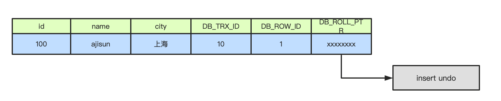
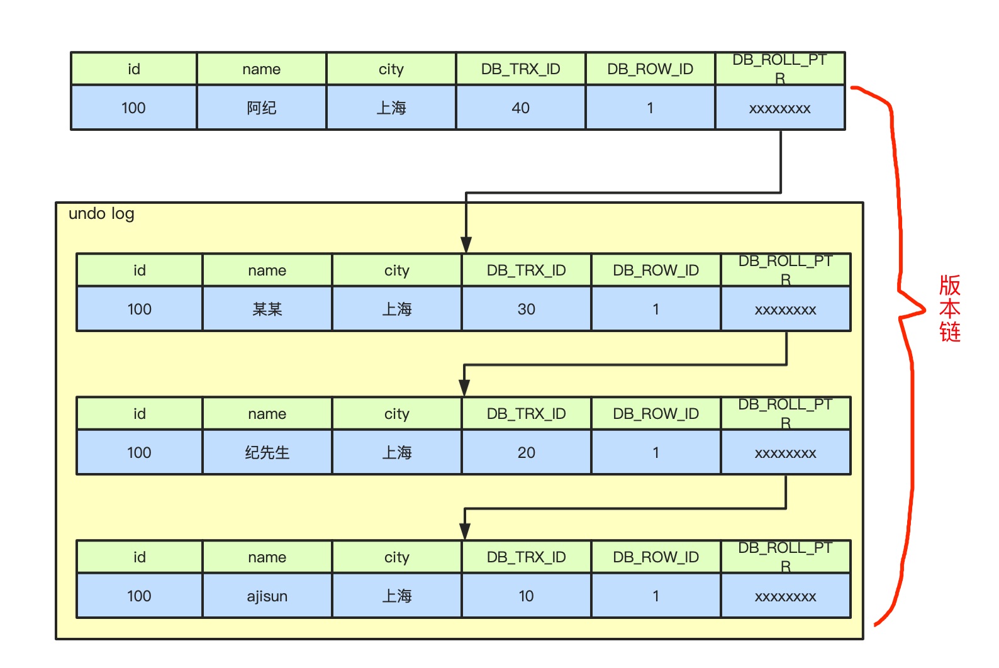

# MVCC

## 概念

MVCC（Mutil-Version Concurrency Control），就是多版本并发控制。MVCC 是一种并发控制的方法，一般在数据库管理系统中，实现对数据库的并发访问。在我看来，**他无非就是乐观锁的一种实现方式**。在 Java 编程中，如果把乐观锁看成一个接口，MVCC 便是这个接口的一个实现类而已。

在 Mysql 的 InnoDB 引擎中就是指在已提交读（READ COMMITTD）和可重复读（REPEATABLE READ）这两种隔离级别下的事务对于 SELECT 操作会访问版本链中的记录的过程。

## 数据

首先我们有一张表，业务字段如下：

```bash
-- id 只是一个普通字段，并不是主键
mysql> select * from ajisun;
+------+--------+--------+
| id   | name   | city   |
+------+--------+--------+
| 100  | ajisun | 上海    |
+------+--------+--------+
1 row in set (0.00 sec)
```

## 当前读与快照读

当前读获取的数据是最新数据，而且在读取时不能被其他修改的，所以会对读取的记录加锁来控制。如下：

```sql
select * from ajisun where id > 1 lock in share mode;
或者
select * from ajisun where id >1 for update;
```

简单的 select 查询就是快照读，不加锁非阻塞读，降低数据库的开销。

但是快照读在隔离级别是串行化级别是没有意义的，因为串行化的 sql 都是排队执行的，不存在并发，所以就会变成当前读。

快照读，顾名思义读取的是一份快照数据，所以读到的并不一定是最新数据，可能是历史数据。

## MVCC 实现原理

**mvcc 的实现原理主要是依赖三个隐藏字段，undo 日志，read view**。

#### 1. 隐藏字段

除了我们正常业务涉及的字段外，InnoDB 在内部向数据库表中添加三个隐藏字段：

- DB_TRX_ID：6-byte 的事务 ID。插入或更新行的最后一个事务的事务 ID
- DB_ROLL_PTR：7-byte 的回滚指针。就是指向对应某行记录的上一个版本，在 undo log 中使用。
- DB_ROW_ID：6-byte 的隐藏主键。如果数据表中没有主键，那么 InnoDB 会自动生成单调递增的隐藏主键（表中有主键或者非 NULL 的 UNIQUE 键时都不会包含 DB_ROW_ID 列）

 如上面的表没有设计 primary key，其中 id/name/city 是我们的业务字段，那么加上隐藏字段应该如下：


#### 2. undo log 和版本链

undo log 就是回滚日志，在 insert/update/delete 变更操作的时候生成的记录方便回滚。

当进行 insert 操作的时候，产生的 undo log 只有在事务回滚的时候需要，如果不回滚在事务提交之后就会被删除。

当进行 update 和 delete 的时候，产生的 undo log 不仅仅在事务回滚的时候需要，在快照读的时候也是需要的，所以不会立即删除，只有等不再用到这个日志的时候才会被 mysql purge 线程统一处理掉（delete 操作也只是打一个删除标记，并不是真正的删除）。

所谓的版本链就是多个事务操作同一条记录的时候都会生成一个 undo 日志，这些 undo 日志通过回滚指针串联在一起。

例如现在一个事务 id10 向表中插入一条记录，如下：



现在有第二个事务 id=20 的事物来修改这条记录，name 改成“纪先生”，此事务会对数据库中这条记录加排他锁，然后把这行记录拷贝到 undo log 中，拷贝完成之后修改这行记录 name 为“纪先生”，同时修改隐藏字段的事务 id 为当前事务 20 的 id，回滚指针指向刚刚复制在 undo log 中的位置提交事务，释放锁。

其他事务对这行记录修改也是这样的操作流程，所有事务拷贝的副本都是放在 undo log 的表头，这样就形成了一个版本链（**版本链的头节点就是当前记录的最新值**），如下：



#### 3. **ReadView**

ReadView 是事务快照读的时候产生的数据读视图，在该事务执行快照读的那一刻，会生成一个数据系统当前的快照，记录并维护系统当前活跃事务的 id，事务的 id 值是递增的。

ReadView 的最大作用就是判断数据的可见性，当某个事务执行快照读的时候，会对此记录创建一个 ReadView 的视图，在整个事务期间根据某些条件判断该事务能够看到的版本链上的哪条历史数据。

可见性的判断主要是通过四个全局属性，他们分别是：

- m_ids：表示在生成 ReadView 时当前系统中活跃事务的事务 id 列表。

- m_low_limit_id：表示在生成 ReadView 时当前系统应该分配给下一个事务的事务 id（也就是还未分配的事务 id 即最大事务 id+1）
- m_up_limit_id：表示在生成 ReadView 时当前系统中活跃的读写事务中最小的 事务 id ，也就是 m_ids 中的最小值。
- m_creator_trx_id：表示生成该 ReadView 的事务的 事务 id

访问某条记录的时候就是根据这四个字段来判断记录的某条版本是否可见：

1. 如果被访问记录的版本事务 ID 与 ReadView 中的 m_creator_trx_id 值相同，那么表示当前事务访问的是自己修改过的记录，那么该版本对当前事务可见；
2. 如果被访问版本的 事务 ID 小于 ReadView 中的 m_up_limit_id 的值，那么表示生成该版本的事务在当前事务生成 ReadView 前已经提交，所以该版本可以被当前事务访问。
3. 如果被访问版本的事务 ID 大于 ReadView 中的 m_low_limit_id 值，那么表示生成该版本的事务在当前事务生成 ReadView 后才开启，所以该版本不可以被当前事务访问。
4. 如果被访问版本的 事务 ID 在 ReadView 的 m_up_limit_id 和 m_low_limit_id 之间，那就需要判断一下版本的事务 ID 是不是在 m_ids 列表中，如果在，说明创建 ReadView 时生成该版本的事务还是活跃的，该版本不可以被访问；如果不在，说明创建 ReadView 时生成该版本的事务已经被提交，该版本可以被访问。

**如果某个版本对当前事务不可见，那么顺着版本链找到下个版本记录，然后继续上面的对比规则，直到找到版本链中的最后一个版本，如果最后一个版本都不可见，那么该条记录对此事务完全不可见，也就查不到这个记录。**

### **RC 和 RR 的隔离级别下快照读有什么区别（也就是生成 ReadView 的不同）**

先说结论：READ-COMMITTED（RC）和 REPEATABLE-READ（RR）级别下 ReadView 不同原因就是**生成的时机不同**。

- 在 READ- UNCOMMITTED 隔离级别下，可以读取到其他事务未提交的数据，直接读最新的就行了，不存在快照读 ReadView。

- 在 SERIALIZABLE 隔离级别下，通过加锁的方式让所有 sql 都串行化执行了，也是读最新的，不存在快照读 ReadView。
- RR 级别下某个事务对某条记录的第一次快照读会创建 ReadView，生成的时候 ReadVie 中就记录了其四个属性。此后在调用快照读的时候还是使用的同一个 ReadView，不会重新生成。所以只要当前事务在其他事务提交更新之前使用过快照读，那么之后的快照读使用的都是同一个 ReadView，所以对之后的修改不可见。
- 在 RC 级别下，事务中每次快照读都会新生成一个快照和 ReadView，这就是我们在 RC 级别下可以看到别的事务提交更新的原因。

## 总结

- mvcc 是多版本并发控制，通过生成记录的历史版本解决幻读问题，并提高数据库的性能，无锁实现读写并发操作。
- mvcc 的实现主要是通过三个隐藏字段，undo log 以及 readView 实现的。
- 三个隐藏字段分别是隐藏主键，事务 ID，回滚指针。
- undo log 是各个事务修改同一条记录的时候生成的历史记录，方便回滚，同时会生成一条版本链。
- readView 是事务在进行快照读的时候生成的记录快照，用于判断数据的可见性。
- readView 可见性判断规则。

## Reference

[1] <https://blog.csdn.net/GoldSunJG/article/details/122552262>
