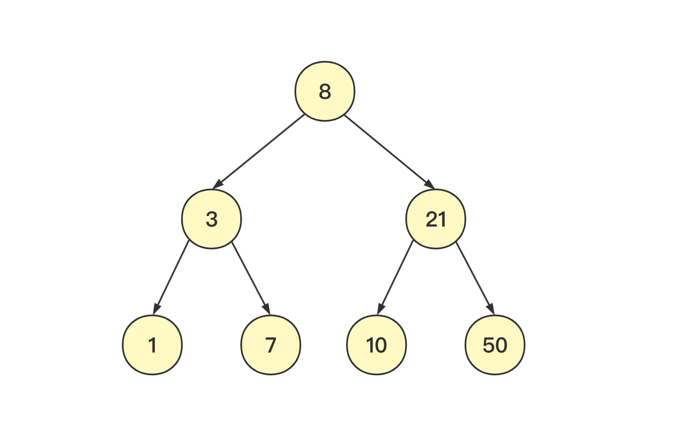
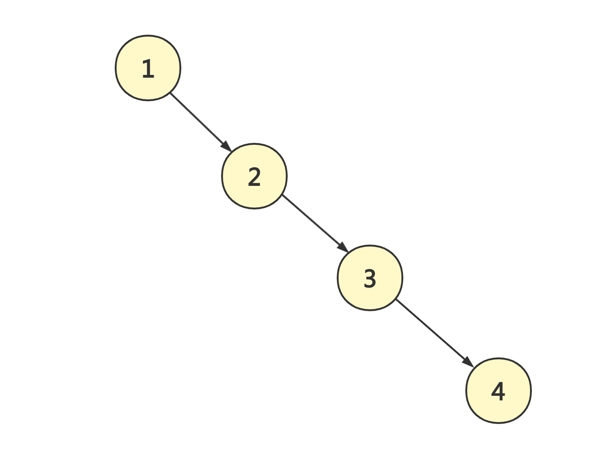
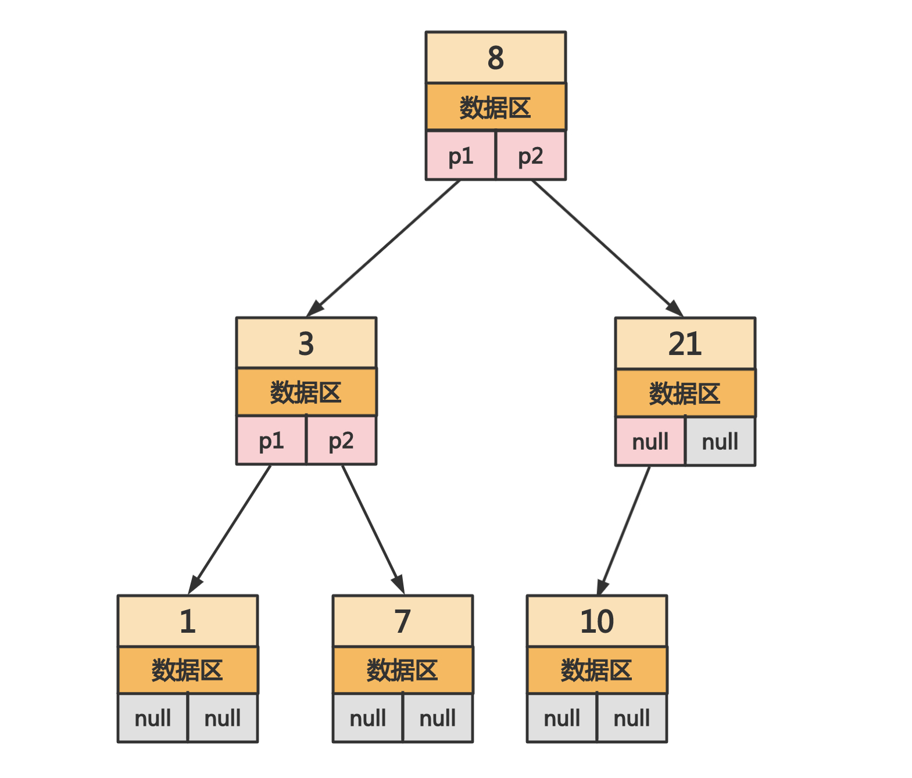
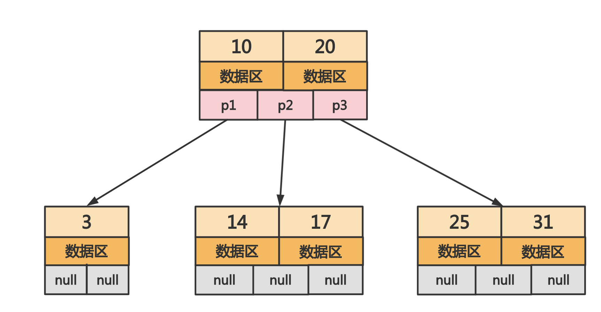
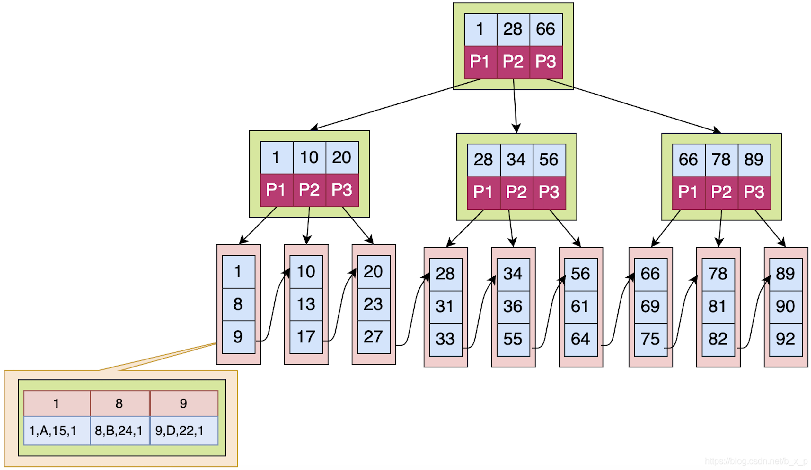
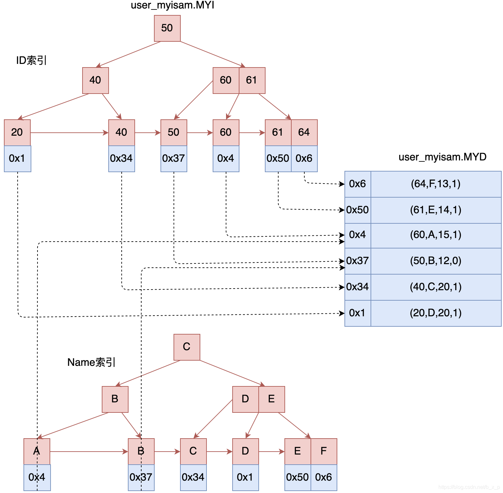
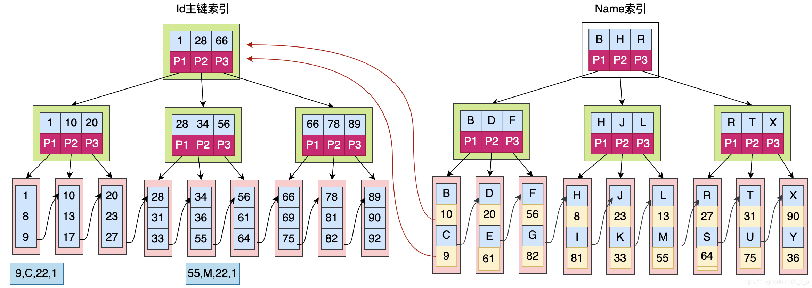

# MySQL 中的索引

## 注意事项

MySQL 建立索引可以提高数据查询速度，但会相应降低速度增删改的效率。注意事项如下：

* B+Tree 的索引主要作用在 where 子句和 order by 子句

* 索引列的数据长度在满足业务要求的情况下尽可能小
* 索引并不是越多越好，冗余或者无用索引会占用磁盘空间且影响增删改的效率
* 对于 where 子句中`like a%`、`like %a%`和`like %a`而言，后两者是无法使用索引的，第一种取决于索引列的离散性，当列离散性较差时查询优化器觉得通过索引查询性能更差就会执行全表扫描
* where 子句中`IN`可以使用索引，`NOT IN`不会使用索引
* 少用`select *`，尽可能指明需要查询的列
* where 条件中使用函数时索引可能失效，这和列的离散性相关
* 联合索引中如果不是按照索引最左列开始查找则无法使用该联合索引
* 联合索引中如果精确匹配最左列且范围匹配另一列，则可以使用该联合索引
* 联合索引中如果范围匹配某一列，则该列右边所有列都无法使用该联合索引

## 索引

### 1. 定义

索引(Index)是帮助 MySQL 高效获取数据的数据结构，可以加速对表中数据行的检索。

### 2. 作用

举个执行`select * from table where id = 20`的例子，在没有索引的条件下需要对数据进行全表扫描找到 id 等于 13 的数据。

对 id 列建立索引后，可以在 id 列索引通过二分查找找到 id=20 对应行的地址，大大加快查找速度。

### 3. 索引类型

MySQL 目前主要提供如下几种索引类型：FULLTEXT、HASH、BTREE 和 RTREE。在未特别指明的情况下，MySQL 索引一般指的是 B+Tree 索引。

#### 3.1 FULLTEXT

全文索引，目前只有 MyISAM 引擎支持，不过目前只有 CHAR、VARCHAR 和 TEXT 列上才可以创建全文索引。全文索引并不是和 MyISAM 一起诞生的，它的出现主要是为了解决类似`WHERE name LIKE "%word%"`这类针对文本的模糊查询效率较低的问题。

#### 3.2 BTREE

BTREE 索引就是将索引值按照一定的算法存入一个二叉树中，每次查询都是从树的入口 root 开始依次遍历 node 获取 leaf，这是 MySQL 中默认和最常用的索引类型。BTREE 具有范围查找和前缀查找的能力，对于有 N 节点的 B 树，检索一条记录的复杂度为$O(LogN)$，相当于二分查找。

#### 3.3 HASH

由于 HASH 的唯一（几乎 100%的唯一）及类似键值对的形式，很适合作为索引。HASH 索引可以一次定位，不需要像树形索引那样逐层查找，因此具有极高的效率。但是，这种高效是有条件的，即只在`=`和`in`条件下高效，对于范围查询、排序及组合索引仍然效率不高。

> HASH 只能做等于查找，无论多大的 Hash 表，查找复杂度都是$O(1)$。

#### 3.4 RTREE

RTREE 在 MySQL 中很少使用，仅支持 geometry 数据类型，相比于 BTREE，它的优势在于范围查找。

### 4. 索引种类

* 普通索引：仅加速查询
* 唯一索引：加速查询 + 列值唯一（可以有 null）
* 主键索引：加速查询 + 列值唯一（不可以有 null） + 单个表中仅有一个主键
* 组合索引：多列值组成一个索引，专门用于组合搜索，其效率大于索引合并
* 全文索引：对文本的内容进行分词，进行搜索

## B+Tree（见 Reference[2]）

### 1. 二叉树

在理想情况下二叉树确实可以实现数据的加速检索，如下图所示：



二叉树查找本质上就是二分查找，以根节点 8 为例，左子树的值都比 8 小，右子树的值都比 8 大。n 个数据的检索需要的时间复杂度为$$log_2n$$。不过要达到这种理想情况需要提前知道所有的值才能构造出最佳的二叉树。

举个例子，假如我们按顺序插入`[1,2,3,4]`的序列，那么二叉树以第一个插入的数据作为根节点，建立的二叉树如下，这种情况下的二叉树查找等价于线性查找。（当我们查找数据 4 时需要遍历所有的结点，即全表扫描）



### 2. 二叉平衡树

平衡二叉树指的是子节点高度差不超过 1 的二叉树。例如下图中数据为 21 的节点，它的左节点高度为 1，右节点高度为 0，高度差为 1。其他节点的高度差都为 0，因此满足平衡二叉树的定义。

> 数据区存放的是节点值对应的行数据。



平衡二叉树满足查找时间复杂度为$$O(log_2n)$$，但是存在如下缺点：

* 搜索效率不佳：一般而言在树结构中数据所处的深度决定了搜索时的 IO 次数（MySQL 中将每个节点设置为一页大小，因此单次 IO 读取一页/一个节点），数据量较大时查询效率低下
* 搜索效率不稳定：当数据量比较大时，单次查询的时间复杂度在$$O(1)$$和$$O(log_2n)$$之间，极其不稳定
* 单个节点存储的数据太少，浪费操作系统和磁盘数据的交换特性：操作系统和磁盘是以页为单位（一页大小为 4K）进行数据交换的（单次 IO 操作系统会将一页数据加载进内存），平衡二叉树单个节点中仅保存一个关键字、一个数据区和两个子节点的引用，浪费了加载的 4K 内容

### 3. 多路平衡查找树（Balance Tree）

多路平衡查找树是一棵绝对平衡的多叉树，其中绝对平衡指的是所有的叶子节点都处于同一高度。例如下图是 2-3 树，即每个节点存储 2 个关键字且有 3 路。

> 对于 m-n 树而言，关键字个数 m = 路数 n - 1。



#### 3.1 优点

MySQL 为了更好地利用磁盘的预读能力，将页大小（即节点大小）设置为 16K，单次 IO 会将一个节点的 16K 内容都加载到内存中。

相比于二叉平衡树而言，多路平衡查找树单个节点可以存储更多的关键字，大大减少了数据搜索的 IO 次数。

#### 3.2 缺点

多路平衡查找树每次改变关键字时都会导致树结构发生很大的变化，这个过程会浪费大量时间。因此 MySQL 需要谨慎创建合适的索引，创建冗余索引时在对数据进行新增、删除和修改时会浪费大量性能。（**这正是为什么在 MySQL 中不要将所有字段都创建索引的原因**）

### 4. B+Tree

B+ Tree 基本沿袭了 B Tree 的设计思路，只不过数据检索时使用的左闭合区间，以根节点为例：

* P1 指向`[1,28)`区间内的关键字
* P2 指向`[28, 66)`区间内的关键字
* P3 指向`[66,+∞)`区间内的关键字

> 由此可见，B+Tree 中关键字个数和路数是相等的。



## B Tree 与 B+Tree 的区别

* B+Tree 中所有数据均存储在叶子节点中，因此数据检索速度是比较稳定的；而 B Tree 关键字可能落在非叶子节点上，命中该节点时可以直接返回数据
* B+Tree 中叶子节点不会保存子节点的引用，也没有必要
* B+Tree 中叶子节点是顺序排列的，且相邻的节点具有顺序引用的关系

## MySQL 选择 B+Tree 的原因

1. B+Tree 沿袭了 B Tree 的主要优点（相比于二叉平衡树可以通过增加节点存储关键字数量，大幅降低树的高度）
2. B+Tree 全表扫描的能力更强：根据索引进行全表扫描时，B Tree 需要遍历整棵树，而 B+Tree 只需要遍历所有叶子节点即可（尤其是叶子结点之间具有顺序引用的关系）
3. B+Tree 磁盘读写能力更强：B+Tree 的非叶子节点不保存行数据，因此单个非叶子节点保存的关键字要比 B Tree 更多；另外 B+Tree 的叶子节点不保存子节点引用，因此叶子节点可以保存更多的关键字和数据
4. B+Tree 排序能力更强：由于 B+Tree 的叶子节点具有顺序引用的关系，因此天然具有排序能力
5. B+Tree 查询性能更稳定：无论搜索什么数据，查询 IO 次数总是相同的

## MySQL 存储引擎

mysql5.5 版本前默认使用 MyISAM 引擎，5.5 之后默认使用 innodb 引擎。

### 1. MYISAM 存储引擎

MYISAM 存储引擎中一张表包含三个文件：

* `.frm`文件：表定义
* `.myd`：数据文件
* `myi`：索引文件

在 MYISAM 中主键索引和辅助索引没有主次之分，如下图所示 ID 索引和 Name 索引查找数据的方式是一样的：



### 2. Innodb 存储引擎

Innodb 存储引擎中一张表包含两个文件：

* `.frm`文件：表定义
* `.ibd`文件：数据和索引文件

在 Innode 存储引擎中，主键索引为聚焦索引（数据库表中数据的物理顺序和键值的逻辑顺序相同），如下图为例辅助索引叶子节点数据区保存的是主键索引的关键字，因此使用辅助索引时需要先通过辅助索引找到主键索引的关键字，然后再检索一次主键索引找到数据：



### 3. 使用 Innodb 作为默认存储引擎的原因

MyISAM 存储引擎在主键索引和辅助索引的叶子结点都存放数据行指针，一旦发生数据变更就需要重新维护所有的索引。

## 创建索引原则

### 1. 列的离散性原则

离散性计算公式为：`count(distinct column_name) / count(*)`，离散性越高说明通过索引最终确定的范围越小，因此最终扫描的行也越少。

### 2. 最左匹配原则

索引关键字对比时一定是从左往右依次对比且不可跳过，例如索引类型为字符串时使用`like %a`索引会失效，因为`%`表示全匹配不需要索引。

### 3. 最少空间原则

前面提到 MySQL 中一个节点的大小为固定的一页。当关键字占用的空间越小时每个节点保存的关键字个数也就越多，单次查询的 IO 次数也就越少。因此创建索引的关键字尽可能占用比较少的空间。

## 联合索引

### 1. 联合索引的选择原则

* 经常使用的列优先（最左匹配原则）
* 离散度高的列优先（列的离散性原则）
* 宽度小的列优先（最少空间原则）

### 2. 联合索引的冗余索引

举个平常经常遇到的问题作为例子，例如经常使用如下查询时：

```sql
select * from users where name = ?;
select * from users where name = ? and age = ?;
```

为了加快查询速度，建立 sql 索引如下：

```sql
create index idx_name on users(name);
create index idx_name_age on users(name, age);
```

在上面的联合索引`[name, age]`中，根据最左匹配原则`idx_name`为冗余索引，因为`where name = ?`条件同样可以使用索引`idx_name_age`进行检索。冗余索引会增加维护`B+Tree`平衡时的性能消耗，并且占用更多的磁盘空间。

## 覆盖索引

覆盖索引指的是需要查询的列通过索引项的信息可以直接返回，可以提高查询效率。


以上图的索引为例，根据我们的查询 SQL 不同，查询效率也大相径庭：

```sql
# 根据辅助索引 name 列找到主键索引 id 值，然后根据 id 值在主键索引找到对应的行数据，需要扫描辅助索引 name 和主键索引 id 各一次
select * from users where name = ?;

# 根据辅助索引 name 列就可以获取 id 值，因此住需要扫描辅助索引 name 一次
select id from users where name = ?;

# 假如需要获取除 id、name 列外的其他字段值，仍然需要扫描辅助索引 name 和主键索引 id 各一次
select id, age from users where name = ?;
```

> 在 SQL 中尽量不要使用`select *`，其中一个原因就是在使用到覆盖索引的情况下不需要进入数据区就能直接返回结果，提高了查询效率。在用不到覆盖索引的情况下也尽可能不要使用`select *`，因为在行数据量特别多时会加大数据的网络传输量。

## order by 与索引

MySQL 中 order by 有两种排序方式：

* filesort：在内存中排序，需要占用 CPU 资源；查询结果太大时还会产生临时文件，需要在磁盘中排序，由于大量 IO 操作导致耗时过长
* backward index scan：使用索引扫描，由于索引本身就是有序的，因此不需要再次进行排序

### 1. where 与单字段 order by

当 order by 子句中只有单个字段时，形如：

```sql
SELECT [column1],[column2],…. FROM [TABLE] WHERE [columnX] = [value] ORDER BY [sort]
```

举个例子：

```sql
select * from users where id = 10000 order by name desc;
```

这种情况下可以建立联合索引`[id, name]`来优化。

> 虽然这种情况下使用联合索引`[id,name]`查询效率最高，但是在这个场景下考虑下面两种建立索引的情况：
>
> * 只对`id`列建索引：会使用`id`索引检索数据，但是需要额外的 filesort 操作，效率上不如联合索引
> * 只对`name`列建索引：不会使用索引，等价于全表扫描+filesort

### 2. where 与多字段 order by

当 order by 子句中有多个字段时，形如：

```sql
SELECT [column1],[column2],…. FROM [TABLE] WHERE [columnX] = [value] ORDER BY [sort1],[sort2]
```

举个例子：

```sql
select * from users where id = 10000 order by name, gender desc;
```

这种情况可以建立联合索引`[id, name, gender]`来优化查询速度。

### 3. 总结

SQL 中 where 执行顺序在 order by 子句之前，只有 where 子句中使用了索引时 order by 子句才能使用索引扫描提高排序速度。

## Reference

[1] <https://www.cnblogs.com/lfs2640666960/p/9147768.html>

[2] <https://blog.csdn.net/b_x_p/article/details/86434387>

[3] <https://www.cnblogs.com/yqzc/p/12541917.html>
