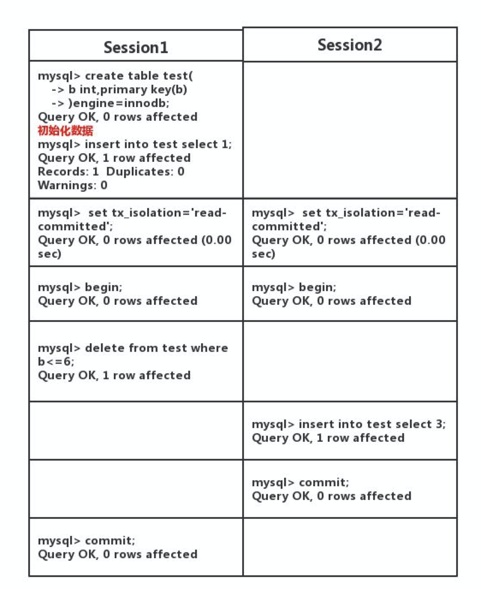
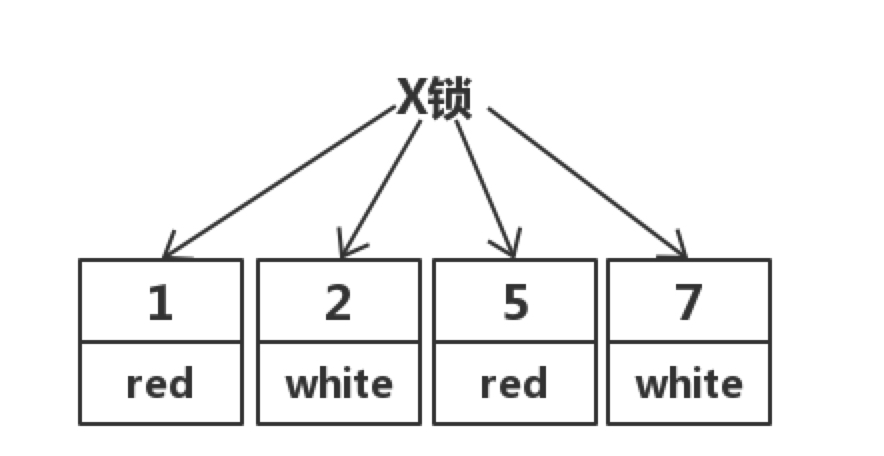
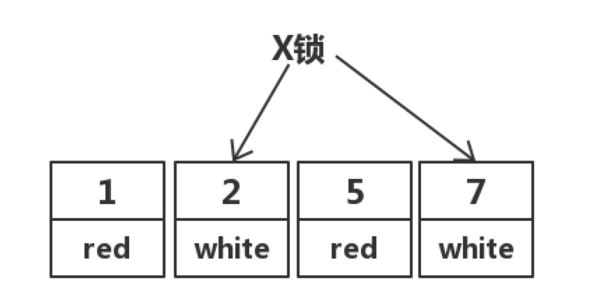
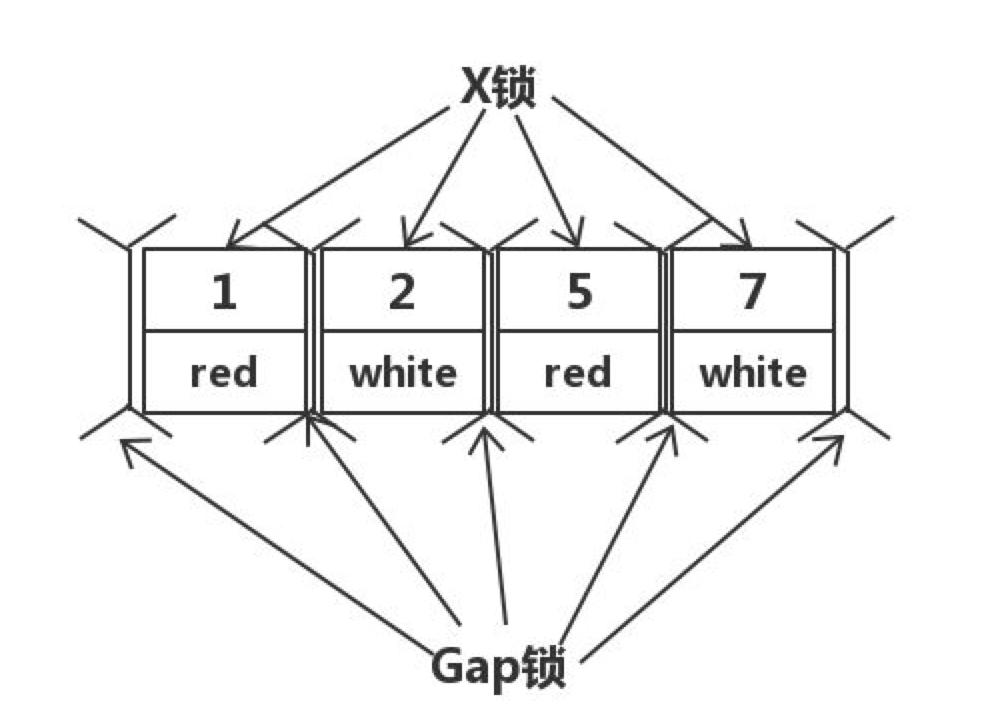
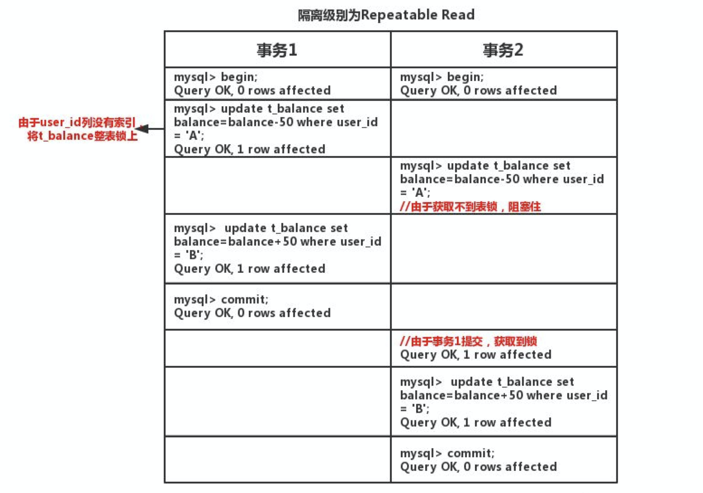

# 事务

## 事务的四大特性 ACID

* **原子性（Atomicity）**：一个事务（transaction）中的所有操作，要么全部完成，要么全部不完成，不会结束在中间某个环节。事务在执行过程中发生错误，会被恢复（Rollback）到事务开始前的状态，就像这个事务从来没有执行过一样。
* **一致性（Consistency）**：在事务开始之前和事务结束以后，数据库的完整性没有被破坏。
* **隔离性（Isolation）**：数据库允许多个并发事务同时对其数据进行读写和修改的能力，隔离性可以防止多个事务并发执行时由于交叉执行而导致数据的不一致。事务隔离分为不同级别，包括读未提交（Read uncommitted）、读提交（read committed）、可重复读（repeatable read）和串行化（Serializable）。
* **持久性（Durability）**：事务处理结束后，对数据的修改就是永久的，即便系统故障也不会丢失。

## 事务并发问题

### 1. 三种事务并发问题

1. **脏读：事务 A 读取了事务 B 更新的数据，然后 B 回滚操作，那么 A 读取到的数据是脏数据**
2. **不可重复读：事务 A 多次读取同一数据，事务 B 在事务 A 多次读取的过程中，对数据作了更新并提交，导致事务 A 多次读取同一数据时，结果 不一致。**
3. **幻读：系统管理员 A 将数据库中所有学生的成绩从具体分数改为 ABCDE 等级，但是系统管理员 B 就在这个时候插入了一条具体分数的记录，当系统管理员 A 改结束后发现还有一条记录没有改过来，就好像发生了幻觉一样，这就叫幻读。**

> **不可重复读的和幻读很容易混淆，不可重复读侧重于修改，幻读侧重于新增或删除。解决不可重复读的问题只需锁住满足条件的行，解决幻读需要锁表**

### 2. 并发问题解决方案

| 事务隔离级别                 | 脏读 | 不可重复读 | 幻读 |
| ---------------------------- | ---- | ---------- | ---- |
| 读未提交（read-uncommitted） | 是   | 是         | 是   |
| 读已提交（read-committed）   | 否   | 是         | 是   |
| 可重复读（repeatable-read）  | 否   | 否         | 是   |
| 串行化（serializable）       | 否   | 否         | 否   |

### 3. 实现方式

1. **事务隔离级别为读提交时，写数据只会锁住相应的行**
2. **事务隔离级别为可重复读时，如果检索条件有索引（包括主键索引）的时候，默认加锁方式是 next-key 锁；如果检索条件没有索引，更新数据时会锁住整张表。一个间隙被事务加了锁，其他事务是不能在这个间隙插入记录的，这样可以防止幻读。**
3. **事务隔离级别为串行化时，读写数据都会锁住整张表**
4. **隔离级别越高，越能保证数据的完整性和一致性，但是对并发性能的影响也越大。**

## 事务与锁的关系

### 1. 锁：提高事务并发能力同时避免事务并发问题

锁是为了解决 Transaction 并发导致的 Anomaly（比如幻读 Phantom）问题。如果没有并发（当然也就没有锁的必要），每个 transaction 都是顺序执行，那么就没有任何数据和逻辑的不一致问题（Anomaly），但这会导致效率（throughput）极其低。比如：transaction A 只对 a 记录读写，transaction B 只对 b 记录读写。顺次执行就是浪费效率，降低 throughput。

### 2. 不同锁应用场景：小锁未必比大锁好

用锁可以让 transaction 并发，同时解决相应的 Anomaly。但锁的粒度比较大时同样会降低 throughput，比如表锁甚至 database 锁。还是上面那个案例，如果 a 和 b 记录都在同一个表中，表锁会降低效率。

所以，我们用颗粒（Granularity）较小的锁，比如行锁。

但颗粒较小的锁也会带来麻烦。因为 transaction 不一定只涉及单条记录，可以是一个 range，也可能是多个单条记录的集合。而且有些场景，用大锁比小锁 throughput 反而高，比如：你的 update 就是更改整个表的某个 colunm，这时，用多个行锁还不如一个简单的大锁效率高。

所以每种锁都有优缺点，适合不同场景，解决不同的 Anomaly。

## 事务隔离级别

### 1. 隔离级别类型

> 在 Oracle，SqlServer 中都是选择**读已提交(Read Commited)**作为默认的隔离级别，MySQL 默认使用**可重复读(Repeatable Read)**。
>
> 我们在项目中一般用**读已提交(Read Commited)**这个隔离级别。

事务隔离分为不同级别，包括

* 读未提交（Read uncommitted）
* 读提交（read committed）
* 可重复读（repeatable read）
* 串行化（Serializable）

### 2. 为什么 MySQL 默认使用可重复读(Repeatable Read)而不是读已提交(Read Commited)

这是因为 MySQL 的主从复制是基于 binlog（记录数据库更改的文件）复制的，它包含三种格式：

* statement:记录的是修改 SQL 语句
* row：记录的是每行实际数据的变更
* mixed：statement 和 row 模式的混合

那 Mysql 在 5.0 这个版本以前，binlog 只支持`STATEMENT`这种格式！而这种格式在**读已提交(Read Commited)**这个隔离级别下主从复制是有 bug 的，因此 Mysql 将**可重复读(Repeatable Read)**作为默认的隔离级别！

举个例子，我们在主（master）上执行如下事务：



此时在主（master）上查询`test`输出如下：

```sql
select * from test；
+---+
| b |
+---+
| 3 |
+---+
1 row in set
```

但是在从（slave）中查询`test`输出如下：

```sql
Empty set
```

这样就出现了主从不一致的 bug，原因在于在 master 上执行的顺序是先删后插。但是此时 binlog 为 STATEMENT 格式，它记录的顺序就是先插后删。

从（slave）同步的是 binlog，因此从机和主机执行顺序不一样，进而出现主从不一致的问题。

解决方法有两种：

1. 将隔离级别设置为「可重复读」（**Repeatable Read**），这样在该隔离级别下引入间隙锁。当 Session 1 执行 delete 语句时会锁住间隙。那么 Session2 执行插入语句就会阻塞住。
2. 将 binlog 格式改为「row」，此时是基于行的复制，自然不会出现 sql 执行顺序不一样的问题。然而这个格式在 MysQL5.1 之后才引入。因此由于历史原因，MySQL 将默认的隔离级别设置为「可重复读」（Repeatable Read），保证主从复制不出问题。

### 3. 互联网项目为什么默认隔离级别是读已提交

那么，当我们了解完 mysql 选**可重复读(Repeatable Read)**作为默认隔离级别的原因后，接下来我们将其和**读已提交(Read Commited)**进行对比，来说明为什么在互联网项目为什么将隔离级别设为**读已提交(Read Commited)**！

ok，我们先明白一点！项目中是不用**读未提交(Read UnCommitted)**和**串行化(Serializable)**两个隔离级别，原因有二：

* 采用**读未提交(Read UnCommitted)**,一个事务读到另一个事务未提交读数据，这个不用多说吧，从逻辑上都说不过去！即脏读、幻读、不可重复读问题都有，主要是脏读不能容忍。
* 采用**串行化(Serializable)**是强一致性，性能不佳。

也就是说，我们该纠结都只有一个问题，究竟隔离级别是用读已经提交呢还是可重复读？接下来对这两种级别进行对比，讲讲我们为什么选**读已提交(Read Commited)**作为事务隔离级别！

假设表结构如下：

```sql
 CREATE TABLE `test` (
    `id` int(11) NOT NULL,
    `color` varchar(20) NOT NULL,
    PRIMARY KEY (`id`)
) ENGINE=InnoDB
```

数据如下：

```
+----+-------+
| id | color |
+----+-------+
|  1 |  red  |
|  2 | white |
|  5 |  red  |
|  7 | white |
+----+-------+
```

#### 3.1 理由一：在「可重复读」隔离级别下，存在间隙锁，导致出现死锁的几率比「读已提交」大的多

例如执行语句：

```sql
select * from test where id <3 for update;
```

在「可重复读」隔离级别下，存在间隙锁，可以锁住(2,5)这个间隙，防止其他事务插入数据！而在「读已提交」隔离级别下，不存在间隙锁，其他事务是可以插入数据！

> 在「读已提交」隔离级别下并不是不会出现死锁，只是出现几率比「可重复读」低而已！

#### 3.2 理由二：在「可重复读」级别下，条件未命中索引会锁表，而在「读已提交」下只锁行

例如执行语句：

```sql
update test set color = 'blue' where color = 'white'; 
```

在「读已提交」隔离级别下，其先走聚簇索引，进行全部扫描。加锁如下：



但在实际中，MySQL 做了优化，在 MySQL Server 过滤条件，发现不满足后，会调用 unlock_row 方法，把不满足条件的记录放锁。实际加锁如下：



然而，在「可重复读」隔离级别下，走聚簇索引，进行全部扫描，最后会将整个表锁上，如下所示：



### 4. 读已提交不是存在「不可重复读」和「幻读」问题么？

首先**读已提交（Read Commited）**和**可重复读（Repeatable Read）**都存在「幻读」的问题，因此我们只需要考虑「不可重复读」的问题。

因为这个问题在大部分场景下都是可以接受的，毕竟数据都已经提交了，读出来本身就没有太大问题。

Oracle 的默认隔离级别就是读已提交，没有多少人会改 Oracle 的默认隔离级别。

## Innode 中 ACID 具体如何实现

### 1. 利用 undo log 保证原子性

`undo log`名为回滚日志，是实现原子性的关键，当事务回滚时能够撤销所有已经成功执行的 sql 语句，他需要记录你要回滚的相应日志信息。

* 当你 delete 一条数据的时候，就需要记录这条数据的信息，回滚的时候，insert 这条旧数据
* 当你 update 一条数据的时候，就需要记录之前的旧值，回滚的时候，根据旧值执行 update 操作
* 当年 insert 一条数据的时候，就需要这条记录的主键，回滚的时候，根据主键执行 delete 操作

### 2. 利用 redo log 保证持久性

**背景**：只修改一个页面里的一个字节，就要将整个页面刷入磁盘，太浪费资源了。毕竟一个页面 16kb 大小，你只改其中一点点东西，就要将 16kb 的内容刷入磁盘，听着也不合理。毕竟一个事务里的 SQL 可能牵涉到多个数据页的修改，而这些数据页可能不是相邻的，也就是属于随机 IO。显然操作随机 IO，速度会比较慢。

于是，决定采用`redo log`解决上面的问题。当做数据修改的时候，不仅在内存中操作，还会在`redo log`中记录这次操作。当事务提交的时候，会将`redo log`日志进行刷盘(`redo log`一部分在内存中，一部分在磁盘上)。当数据库宕机重启的时候，会将`redo log`中的内容恢复到数据库中，再根据`undo log`和`binlog`内容决定回滚数据还是提交数据。

采用 redo log 的好处？`redo log`进行刷盘比对数据页刷盘效率高，具体表现如下：

* `redo log`体积小，毕竟只记录了哪一页修改了啥，因此体积小，刷盘快。
* `redo log`是一直往末尾进行追加，属于顺序 IO。效率显然比随机 IO 来的快。

### 3. 利用锁和 MVCC 机制保证隔离性

假如表`t_balance`有如下数据：

| id   | user_id | balance |
| ---- | ------- | ------- |
| 1    | A       | 200     |
| 2    | B       | 0       |

其中 id 是主键，user_id 为账户名，balance 为余额。还是以转账两次为例，如下图所示：



至于 MVCC,即多版本并发控制(Multi Version Concurrency Control),一个行记录数据有多个版本对快照数据，这些快照数据在`undo log`中。

如果一个事务读取的行正在做 DELELE 或者 UPDATE 操作，读取操作不会等行上的锁释放，而是读取该行的快照版本。

### 4. 通过原子性、持久性、隔离性来保证一致性

如果你在事务里故意写出违反约束的代码，一致性还是无法保证的。例如，你在转账的例子中，你的代码里故意不给 B 账户加钱，那一致性还是无法保证。因此，还必须从应用层角度考虑。

从应用层面，通过代码判断数据库数据是否有效，然后决定回滚还是提交数据！

## Reference

[1] <https://blog.csdn.net/truelove12358/article/details/122945793>

[2] <https://blog.csdn.net/WantFlyDaCheng/article/details/103047348>

[3] <https://www.zhihu.com/question/464248235/answer/1942390967>
