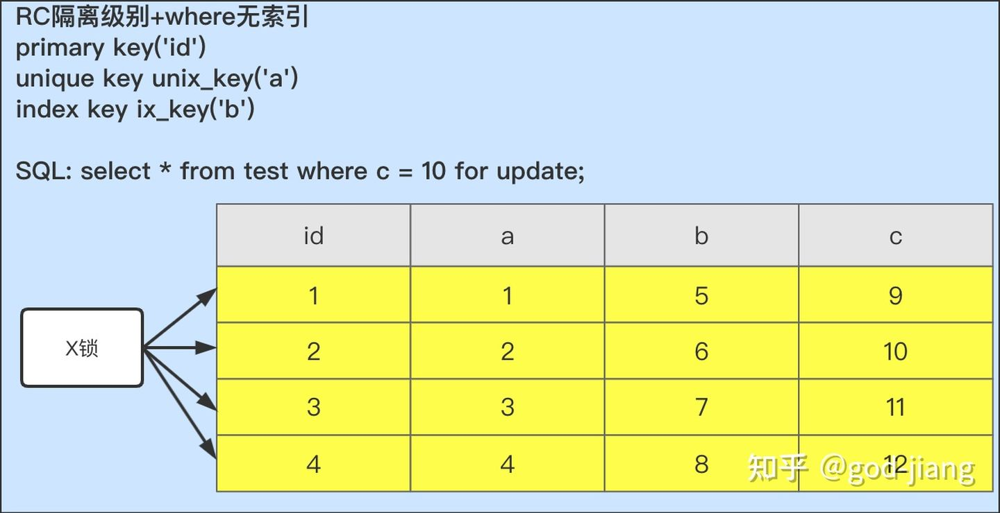

# S 锁和 X 锁

## 行锁

MySQL 的行锁又分为共享锁（S 锁）和排他锁（X 锁）。

## 快照读与当前读

**一般普通的 select 语句，InnoDB 不加任何锁，我们称之为快照读**：

```sql
select * from test;
```

**通过加 S 锁和 X 锁的 select 语句或者插入/更新/删除操作，我们称之为当前读**：

```sql
select * from test lock in share mode;
select * from test for update;
insert into test values(…);
update test set …;
delete from test …;
```

> **以上的当前读，读取的都是记录的最新版本。对读取记录都会加锁，除了第一条语句 lock in share mode 是对记录加 S 锁（共享锁）外，其他的操作都是加 X 锁（排他锁）**。

## X 锁与 S 锁

**shared lock 和 exclusive lock（共享锁和排他锁，也叫读锁和写锁，即 read lock 和 write lock）**。

* 读锁是共享的，或者说是相互不阻塞的
* 写锁是排他的，一个写锁会阻塞其他的写锁和读锁

## 两阶段协议锁

传统的关系型数据库加锁都要遵循一个原则：两阶段锁原则。

两阶段锁是将锁的操作分为两个阶段，加锁阶段和解锁阶段，并且保证加锁阶段和解锁阶段不相交。

分享一个例子说明两阶段锁协议：

|                                              |                                          |
| -------------------------------------------- | ---------------------------------------- |
| 事务 A                                        | 事务 B                                    |
| begin;                                       |                                          |
| update test set name=‘god-jiang’ where id=1; |                                          |
|                                              | begin;                                   |
|                                              | delete from test where name=‘god-jiang’; |
| commit;                                      |                                          |

事务 A 执行完 update 语句后，手上持有着 name='god-jiang’的 X 锁，而事务 B 执行 delete 语句删除 name='god-jiang’记录的时候会阻塞，直到事务 A 执行 commit 之后，事务 B 才会执行 delete。

也就是说，**在 InnoDB 存储引擎中，行锁是在需要的时候加上的，但并不是不需要了就立刻释放行锁，而是要等到事务结束的时候才释放，这个就是两阶段锁协议。**

## 事务隔离级别

不同事务隔离级别对应的行锁也是不同的，所以我们需要先了解事务的隔离级别后，再来演示不同隔离级别的行锁如何加上去。

MySQL 的 4 种隔离级别：

* READ UNCOMMITTED（读未提交）：任何一个事务当中，都可以看见其他事务的执行情况，会出现脏读现象
* READ COMMITTED（读已提交，简称：RC）：在当前事务中只能看见已经提交事务的执行结果，当同一事务在读取期间出现新的 commit 操作，会出现不可重复读现象。
* REPEATABLE READ（可重复读，简称：RR）：这是 MySQL 默认的隔离级别，得益于 MVCC，它能在同一事务在多实例并发读取数据时看到相同的数据行，消除了脏读、不可重复读，默认不会出现幻读（MySQL 的行锁+间隙锁解决了快照读的幻读，未解决当前读的幻读）。
* SERIALIZABLE（串行）：MySQL 的最高隔离级别，通过加锁，强制事务执行顺序，保证不会出现幻读问题。

## 加锁分析（以下默认是 RC 隔离级别并且都是当前读）

这里我挑选出 RC 隔离级别下三种常见情况分析 SQL 如何加锁：

* RC 隔离级别，where 字段没有索引
* RC 隔离级别，where 字段有唯一索引
* RC 隔离级别，where 字段有普通索引

**以下加锁分析默认表名为 test，主键为 id，唯一索引为 a，普通索引为 b，无索引为 c。**

#### 1. RC 隔离级别+where 无索引



由于 c 字段没有索引，SQL 将会进行全表扫描。这个时候的所有记录，都会加上 X 锁。

**为什么不是只在 c=10 的记录上加锁呢？**

这是因为在 MySQL 中，如果 where 条件不能通过索引快速过滤，那么在 MySQL 的 server 层就会将所有记录都加锁然后调用 InnoDB 存储引擎查询，因此也就把所有记录都锁上了。

总结：**没有索引的情况下，InnoDB 的当前读会对所有记录都加锁。所以在实际开发中，如果是当前读或者是插入/更新/删除等操作一定要使用索引，否则会产生大量的锁等待**。

#### 2. RC 隔离级别+where 唯一索引


由于 a 字段有唯一索引，因此通过 MySQL 的 server 层会选择走 a 列的索引进行过滤，找到 a=2 记录后，将唯一索引上 a=2 的索引记录加上 X 锁，同时读取主键 id 并找到聚集索引树给 id=2 的记录加上 X 锁。

总结：**如果查询的条件是唯一索引，那么 SQL 在满足的唯一索引的记录上加 X 锁，并且在对应的聚集索引上加 X 锁**。

#### 3. RC 隔离级别+where 普通索引


由于 b 字段有普通索引，所以在满足 b=2 的所有记录上都加上了 X 锁，同时对应的聚集索引记录也加上了 X 锁。与唯一索引对比，唯一索引查询最多有一行记录上锁，而普通索引会把满足条件的所有记录上锁。

总结：如果查询的条件是普通索引，那么 SQL 会在满足条件的非唯一索引记录加上 X 锁，并且会在它们对应的聚集索引上加 X 锁。

## 总结

**在 RC 隔离级别下，我们更新数据，插入数据，删除数据都要尽可能走索引，不然会使所有的记录都被加上 X 锁，假如在线上操作的话，会严重影响业务**。

## Reference

[1] <https://blog.csdn.net/weixin_37686415/article/details/114711276>
