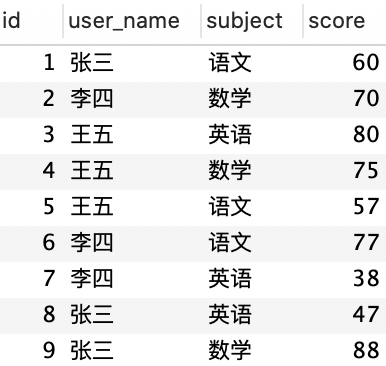
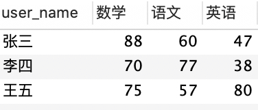

# 行转列

## 数据集

```sql
CREATE TABLE student (
  id int,
  user_name varchar(255),
  subject varchar(255),
  score int,
  PRIMARY KEY (`id`)
) ENGINE=InnoDB AUTO_INCREMENT=1 DEFAULT CHARSET=utf8;

INSERT INTO student VALUES (1, '张三', '语文', 60);
INSERT INTO student VALUES (2, '李四', '数学', 70);
INSERT INTO student VALUES (3, '王五', '英语', 80);
INSERT INTO student VALUES (4, '王五', '数学', 75);
INSERT INTO student VALUES (5, '王五', '语文', 57);
INSERT INTO student VALUES (6, '李四', '语文', 77);
INSERT INTO student VALUES (7, '李四', '英语', 38);
INSERT INTO student VALUES (8, '张三', '英语', 47);
INSERT INTO student VALUES (9, '张三', '数学', 88);
```

## 问题背景

在数据分析时经常需要对 SQL 查询结果进行行转列，例如分析学生成绩时我们需要转化成更直观的结果。

转化前：



转化后：



## 方法

#### 1. case when

相当于自己手动构造一些列：

```sql
SELECT user_name ,
    MAX(CASE subject WHEN '数学' THEN score ELSE 0 END ) 数学,
    MAX(CASE subject WHEN '语文' THEN score ELSE 0 END ) 语文,
    MAX(CASE subject WHEN '英语' THEN score ELSE 0 END ) 英语
FROM student
GROUP BY user_name;
```

#### 2. pivot

mysql 不支持 pivot 关键字进行行转列，但其他引擎下可以尝试：

```sql
SELECT *
FROM student
PIVOT (
    SUM(score) FOR subject IN (语文, 数学, 英语)
)
```
