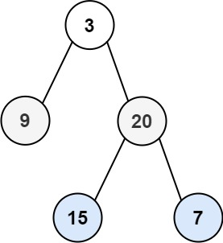

# 102. 二叉树的层序遍历

## 题目

难度:

给你二叉树的根节点 root，返回其节点值的 **层序遍历**。（即逐层地，从左到右访问所有节点）。

**示例 1：**



```
输入：root = [3,9,20,null,null,15,7]
输出：[[3],[9,20],[15,7]]

```

**示例 2：**

```
输入：root = [1]
输出：[[1]]

```

**示例 3：**

```
输入：root = []
输出：[]

```

> 来源: 力扣（LeetCode）  
> 链接: <https://leetcode.cn/problems/binary-tree-level-order-traversal/?favorite=2cktkvj>  
> 著作权归领扣网络所有。商业转载请联系官方授权，非商业转载请注明出处。

## 答案

### 1. 深度优先搜索 DFS

> 如果 res[depth] 不存在，是需要插入数据的。

```c++
/**
 * Definition for a binary tree node.
 * struct TreeNode {
 *     int val;
 *     TreeNode *left;
 *     TreeNode *right;
 *     TreeNode() : val(0), left(nullptr), right(nullptr) {}
 *     TreeNode(int x) : val(x), left(nullptr), right(nullptr) {}
 *     TreeNode(int x, TreeNode *left, TreeNode *right) : val(x), left(left), right(right) {}
 * };
 */
class Solution {
public:
    // 此题本来是考察广度优先搜索; 我这里用深度优先搜索写
    void dfs(TreeNode* root, vector<vector<int>>& res, int depth) {
        if (root == nullptr) {
            return;
        }

        // 重点: 塞入一个空的列表
        if (res.size() <= depth) {
            res.push_back({});
        }

        res[depth].push_back(root->val);
        dfs(root->left, res, depth + 1);
        dfs(root->right, res, depth + 1);
    }

    vector<vector<int>> levelOrder(TreeNode* root) {
        vector<vector<int>> res;
        dfs(root, res, 0);
        return res;
    }
};
```

### 2. 广度优先搜索

> DFS 与 BFS 的区别：
> <https://leetcode-cn.com/problems/binary-tree-level-order-traversal/solution/bfs-de-shi-yong-chang-jing-zong-jie-ceng-xu-bian-l/>

```c++
/**
 * Definition for a binary tree node.
 * struct TreeNode {
 *     int val;
 *     TreeNode *left;
 *     TreeNode *right;
 *     TreeNode() : val(0), left(nullptr), right(nullptr) {}
 *     TreeNode(int x) : val(x), left(nullptr), right(nullptr) {}
 *     TreeNode(int x, TreeNode *left, TreeNode *right) : val(x), left(left), right(right) {}
 * };
 */
class Solution {
public:
    vector<vector<int>> levelOrder(TreeNode* root) {
        std::vector<std::vector<int>> res;
        if (root == nullptr) {
            return {};
        }
        
        std::queue<TreeNode*> q;
        q.push(root);  // 必须先插入一行
        while (!q.empty()) {
            int currentLevelSize = q.size();
            res.push_back({});
            for (int i = 1; i <= currentLevelSize; ++i) {
                auto node = q.front();
                q.pop();
                res.back().push_back(node->val);
                if (node->left) {
                    q.push(node->left);
                }
                if (node->right) {
                    q.push(node->right);
                }
            }
        }

        return res;
    }
};
```
