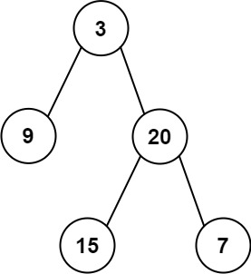

# 105. 从前序与中序遍历序列构造二叉树

## 题目

难度:

给定两个整数数组 preorder 和 inorder，其中 preorder 是二叉树的 **先序遍历**，inorder 是同一棵树的 **中序遍历**，请构造二叉树并返回其根节点。

**示例 1:**



```
输入: preorder = [3,9,20,15,7], inorder = [9,3,15,20,7]
输出: [3,9,20,null,null,15,7]

```

**示例 2:**

```
输入: preorder = [-1], inorder = [-1]
输出: [-1]

```

> 来源: 力扣（LeetCode）  
> 链接: <https://leetcode.cn/problems/construct-binary-tree-from-preorder-and-inorder-traversal/?favorite=2cktkvj>  
> 著作权归领扣网络所有。商业转载请联系官方授权，非商业转载请注明出处。

## 答案

### 1. 递归

> 注意这里的 helper 参数就是在解决规模不同但求解思路相同的问题。

```c++
/**
 * Definition for a binary tree node.
 * struct TreeNode {
 *     int val;
 *     TreeNode *left;
 *     TreeNode *right;
 *     TreeNode() : val(0), left(nullptr), right(nullptr) {}
 *     TreeNode(int x) : val(x), left(nullptr), right(nullptr) {}
 *     TreeNode(int x, TreeNode *left, TreeNode *right) : val(x), left(left), right(right) {}
 * };
 */
class Solution {
public:
    std::unordered_map<int, int> inorder_value_index;

    // 递归就是将n规模的问题转成n-1规模的问题, 存在递归终止条件
    // 0) 循环终止条件
    // 1) 先建立根结点
    // 2) 递归去建立左子树和右子树

    // !!!因此递归的主要函数需要包含条件, 即先序和后序的片段!!!
    TreeNode* helper(vector<int>& preorder, vector<int>& inorder, int preorder_left, int preorder_right, int inorder_left, int inorder_right) {
        // 循环退出条件
        if (preorder_left > preorder_right) {
            return nullptr;
        }

        // 先建立根节点
        int root_value = preorder[preorder_left];
        TreeNode* root = new TreeNode(root_value);

        // 找到根节点所在的inorder_left根节点索引, 左边的就是左子树， 右边的就是右子树
        int inorder_root_index = inorder_value_index[root_value];
        // 左子树结点数量
        int left_tree_node_num = inorder_root_index - inorder_left;
        // 右子树结点数量
        int right_tree_node_num = inorder_right - inorder_root_index;\
    
        // 将问题拆解成建立左子树和右子树
        root->left = helper(preorder, inorder, preorder_left + 1, preorder_left + left_tree_node_num, inorder_left, inorder_root_index - 1);
        root->right = helper(preorder, inorder, preorder_left + left_tree_node_num + 1, preorder_right, inorder_root_index + 1, inorder_right);

        return root;
    }

    TreeNode* buildTree(vector<int>& preorder, vector<int>& inorder) {
        // 先序遍历: 先遍历根节点; 随后递归地遍历左子树; 最后递归地遍历右子树
        // 即： [ 根节点, [左子树的前序遍历结果], [右子树的前序遍历结果] ]
        // 中序遍历就是[ [左子树的中序遍历结果], 根节点, [右子树的中序遍历结果] ]
        
        int n = preorder.size();
        for (int i = 0; i < n; i++) {
            inorder_value_index[inorder[i]] = i;
        }

        return helper(preorder, inorder, 0, n-1, 0, n-1);
    }
};
```
