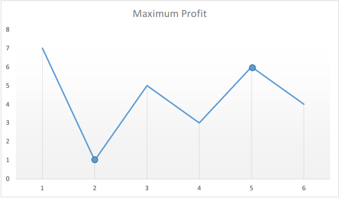

# 121. 买卖股票的最佳时机

## 题目

难度:

给定一个数组 prices，它的第 i 个元素 prices[i] 表示一支给定股票第 i 天的价格。

你只能选择 **某一天** 买入这只股票，并选择在 **未来的某一个不同的日子** 卖出该股票。设计一个算法来计算你所能获取的最大利润。

返回你可以从这笔交易中获取的最大利润。如果你不能获取任何利润，返回 0。

**示例 1：**

```
输入：[7,1,5,3,6,4]
输出：5
解释：在第 2 天（股票价格 = 1）的时候买入，在第 5 天（股票价格 = 6）的时候卖出，最大利润 = 6-1 = 5 。
     注意利润不能是 7-1 = 6, 因为卖出价格需要大于买入价格；同时，你不能在买入前卖出股票。

```

**示例 2：**

```
输入：prices = [7,6,4,3,1]
输出：0
解释：在这种情况下, 没有交易完成, 所以最大利润为 0。

```

> 来源: 力扣（LeetCode）  
> 链接: <https://leetcode.cn/problems/best-time-to-buy-and-sell-stock/?favorite=2cktkvj>  
> 著作权归领扣网络所有。商业转载请联系官方授权，非商业转载请注明出处。

## 答案

### 1. 暴力求解

```c++
class Solution {
public:
    int maxProfit(vector<int>& prices) {
        int ans = 0;
        for (int i = 0; i < prices.size(); i++) {
            for (int j = i + 1; j < prices.size(); j++) {
                ans = std::max(ans, prices[j] - prices[i]);
            }
        }
        return std::max(ans, 0);
    }
};
```

### 2. 一次遍历

> 总而言之，就是遍历时每天的最大收益就是今天价格减去到今天为止的最低价格。

假设给定的数组为：`[7, 1, 5, 3, 6, 4]`

如果我们在图表上绘制给定数组中的数字，我们将会得到：



我们来假设自己购买股票，按照时间的推移，每天我们都可以选择出售股票与否，那么假设在第 i 天，如果我们要在今天卖股票，那么我们能赚多少钱呢？

显然如果我们真的在买卖股票，我们肯定会想：如果我是在历史最低点买股票就好了！太好了，在题目中我们只要用一个变量记录一个历史最低值 `minprice`，我们就可以假设自己的股票是在那天买的，然后我们在第 i 天卖出股票的利润就是 `prices[i] - minprice`。

因此我们只需要遍历价格数组一次，记录历史最低点，然后在每一台呢考虑这么一个问题：如果我是在历史最低点买的，那么我今天卖能赚多少钱？当考虑完所有的天数之后，我们就得到了答案。

```c++
class Solution {
public:
    int maxProfit(vector<int>& prices) {
        int res = 0;
        int min_price = INT_MAX;

        for (int i = 0; i < prices.size(); ++i) {
            min_price = std::min(prices[i], min_price);
            res = std::max(res, prices[i] - min_price);
        }
        
        return res;
    }
};
```
