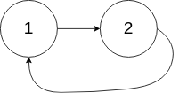
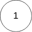

# 142. 环形链表 II

## 题目

难度：中等

给定一个链表的头节点 head，返回链表开始入环的第一个节点。 *如果链表无环，则返回 null。*

如果链表中有某个节点，可以通过连续跟踪 next 指针再次到达，则链表中存在环。为了表示给定链表中的环，评测系统内部使用整数 pos 来表示链表尾连接到链表中的位置（**索引从 0 开始**）。如果 pos 是 -1，则在该链表中没有环。**注意：pos 不作为参数进行传递**，仅仅是为了标识链表的实际情况。

**不允许修改** 链表。

**示例 1：**


```
输入：head = [3,2,0,-4], pos = 1
输出：返回索引为 1 的链表节点
解释：链表中有一个环，其尾部连接到第二个节点。

```

**示例 2：**



```
输入：head = [1,2], pos = 0
输出：返回索引为 0 的链表节点
解释：链表中有一个环，其尾部连接到第一个节点。

```

**示例 3：**



```
输入：head = [1], pos = -1
输出：返回 null
解释：链表中没有环。

```

**进阶**：你是否可以使用 O(1) 空间解决此题？

> 来源: 力扣（LeetCode）  
> 链接: <https://leetcode.cn/problems/linked-list-cycle-ii/?favorite=2cktkvj>  
> 著作权归领扣网络所有。商业转载请联系官方授权，非商业转载请注明出处。

## 答案

### 1. 额外空间复杂度

```c++
/**
 * Definition for singly-linked list.
 * struct ListNode {
 *     int val;
 *     ListNode *next;
 *     ListNode(int x) : val(x), next(NULL) {}
 * };
 */
class Solution {
public:
    ListNode *detectCycle(ListNode *head) {
        // 即返回出现两次的节点
        std::unordered_set<ListNode*> node_set;

        while (head) {
            if (node_set.count(head)) {
                return head;
            }
            node_set.insert(head);
            head = head->next;
        }

        return nullptr;
    }
};
```

### 2. 快慢指针（龟兔赛跑算法）

比较复杂的数学推导，面试应该不会考，跳过。
