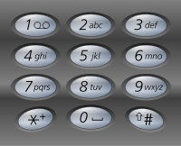

# 17. 电话号码的字母组合

## 题目

难度: 中等

给定一个仅包含数字 2-9 的字符串，返回所有它能表示的字母组合。答案可以按 **任意顺序** 返回。

给出数字到字母的映射如下（与电话按键相同）。注意 1 不对应任何字母。



**示例 1：**

```
输入：digits = "23"
输出：["ad","ae","af","bd","be","bf","cd","ce","cf"]

```

**示例 2：**

```
输入：digits = ""
输出：[]

```

**示例 3：**

```
输入：digits = "2"
输出：["a","b","c"]

```

> 来源: 力扣（LeetCode）  
> 链接: <https://leetcode.cn/problems/letter-combinations-of-a-phone-number/?favorite=2cktkvj>
> 著作权归领扣网络所有。商业转载请联系官方授权，非商业转载请注明出处。

## 答案

### 1. 解法一：DFS

```c++
class Solution {
public:
    std::unordered_map<int, std::vector<char>> digit2chars= {
        {2, {'a', 'b', 'c'}},
        {3, {'d', 'e', 'f'}},
        {4, {'g', 'h', 'i'}},
        {5, {'j', 'k', 'l'}},
        {6, {'m', 'n', 'o'}},
        {7, {'p', 'q', 'r', 's'}},
        {8, {'t', 'u', 'v'}},
        {9, {'w', 'x', 'y', 'z'}}
    };

    std::vector<std::string> res;

    void dfs(const std::string& digits, std::string cur, int idx) {
        // 递归退出条件
        if (idx == digits.size()) {
            res.push_back(cur);
            return;
        }

  // 需要注意 digits 是一个字符串
        int num = digits[idx] - '0';
        for (auto c : digit2chars[num]) {
            dfs(digits, cur + c, idx + 1);
        }
    }

    vector<string> letterCombinations(string digits) {
        if (digits.size() == 0) {
            return {};
        }

        dfs(digits, "", 0);
        return res;
    }
};
```
