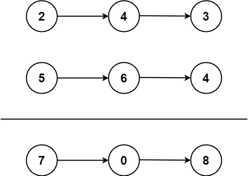

# 2. 两数相加

## 题目

难度: 中等

给你两个 **非空** 的链表，表示两个非负的整数。它们每位数字都是按照 **逆序** 的方式存储的，并且每个节点只能存储 **一位** 数字。

请你将两个数相加，并以相同形式返回一个表示和的链表。

你可以假设除了数字 0 之外，这两个数都不会以 0 开头。

**示例 1：**



```
输入：l1 = [2,4,3], l2 = [5,6,4]
输出：[7,0,8]
解释：342 + 465 = 807.

```

**示例 2：**

```
输入：l1 = [0], l2 = [0]
输出：[0]

```

**示例 3：**

```
输入：l1 = [9,9,9,9,9,9,9], l2 = [9,9,9,9]
输出：[8,9,9,9,0,0,0,1]

```

> 来源: 力扣（LeetCode）  
> 链接: <<https://leetcode.cn/problems/add-two-numbers/>?  favorite=2cktkvj>
> 著作权归领扣网络所有。商业转载请联系官方授权，非商业转载请注明出处。

## 答案

```c++
/**
 * Definition for singly-linked list.
 * struct ListNode {
 *     int val;
 *     ListNode *next;
 *     ListNode() : val(0), next(nullptr) {}
 *     ListNode(int x) : val(x), next(nullptr) {}
 *     ListNode(int x, ListNode *next) : val(x), next(next) {}
 * };
 */
class Solution {
public:
    ListNode* addTwoNumbers(ListNode* l1, ListNode* l2) {
        // use dummy && cur to handle ListNode problem
        ListNode* dummy = new ListNode();
        ListNode* cur = dummy;

        int carry = 0;
        int sum = 0;
        while (l1 && l2) {
            sum = l1->val + l2->val + carry;
            if (sum >= 10) {
                carry = 1;
                sum = sum % 10;
            } else {
                carry = 0;
            }
            
            cur->next = new ListNode(sum);
            l1 = l1->next;
            l2 = l2->next;
            cur = cur->next;
        }

        // lambda expression
        auto adder = [&](ListNode* l) {
            while (l) {
                sum = l->val + carry;
                if (sum >= 10) {
                    carry = 1;
                    sum = sum % 10;
                } else {
                    carry = 0;
                }

                cur->next = new ListNode(sum);
                l = l->next;
                cur = cur->next;
            }
        };

        adder(l1);
        adder(l2);

        if (carry > 0) {
            cur->next = new ListNode(1);
        }

        return dummy->next;
    }
};
```
