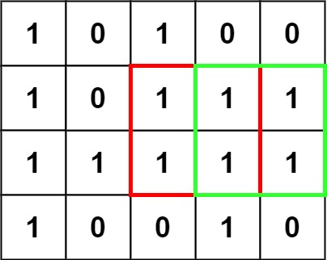
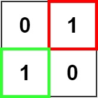

# 221. 最大正方形

## 题目

难度：中等

在一个由 '0' 和 '1' 组成的二维矩阵内，找到只包含 '1' 的最大正方形，并返回其面积。

**示例 1：**



```
输入：matrix = [["1","0","1","0","0"],["1","0","1","1","1"],["1","1","1","1","1"],["1","0","0","1","0"]]
输出：4

```

**示例 2：**



```
输入：matrix = [["0","1"],["1","0"]]
输出：1

```

**示例 3：**

```
输入：matrix = [["0"]]
输出：0

```

> 来源: 力扣（LeetCode）  
> 链接: <https://leetcode.cn/problems/maximal-square/?favorite=2cktkvj>  
> 著作权归领扣网络所有。商业转载请联系官方授权，非商业转载请注明出处。

## 答案

### 1. 暴力法 + 剪枝

```c++
class Solution {
public:
    int res = 0;

public:
    // 好像迭代就行, 不需要进行DFS
    // 返回当前位置的最大正方形
    int helper(int row, int col, vector<vector<char>>& matrix) {
        if (matrix[row][col] == '0') {
            return 0;
        }

        // 边长
        int length = 1;

        while (true) {
            // 递归退出条件
            if (row + length >= matrix.size()) {
                return length;
            }
            if (col + length >= matrix[0].size()) {
                return length;
            }

            // 判断边长是否可以+1
            for (int i = 0; i < length + 1; i++) {
                if (matrix[row + i][col + length] == '0') {
                    return length;
                }
                if (matrix[row + length][col + i] == '0') {
                    return length;
                }
            }

            length++;
        }
        return length;
    }

    int maximalSquare(vector<vector<char>>& matrix) {
        // 和岛屿问题一样都是DFS?
        // 这里由于不需要回溯, 因此迭代即可

        int res = 0;
        // 返回结果
        for (int i = 0; i < matrix.size(); i++) {
            // !!!提前剪枝!!!
            // 这表示后面已经没法获得更好的边长
            if (i + res >= matrix.size()) {
                return res * res;
            }

            for (int j = 0; j < matrix[0].size(); j++) {
                res = std::max(res, helper(i, j, matrix));
            }
        }

        return res * res;
    }
};
```

### 2. 动态规划

```c++
class Solution {
public:
    int maximalSquare(vector<vector<char>>& matrix) {
        // dp[i, j]表示以[i,j]为右下角的最大边长
        // 转移方程: dp[i, j] = std::min(dp[i-1][j-1], std::min(dp[i-1][j], dp[i][j-1])) + 1
        int m = matrix.size();
        int n = matrix[0].size();
        vector<vector<int>> dp(m, vector<int>(n));

        // 結果
        int res;

        // 初始化边界条件
        for (int i = 0; i < m; i++) {
            dp[i][0] = matrix[i][0] - '0';
            res = std::max(dp[i][0], res);
        }

        for (int i = 0; i < n; i++) {
            dp[0][i] = matrix[0][i] - '0';
            res = std::max(dp[0][i], res);
        }

        // 建立dp, 注意临界条件从0开始, 那么这里就是访问1开始
        for (int i = 1; i < m; i++) {
            for (int j = 1; j < n; j++) {
                if (matrix[i][j] == '1') {
                    dp[i][j] = std::min(dp[i-1][j-1], std::min(dp[i-1][j], dp[i][j-1])) + 1;
                }
                
                res = std::max(res, dp[i][j]);
            }
        }

        return res * res;
    }
};
```
