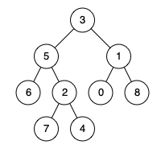
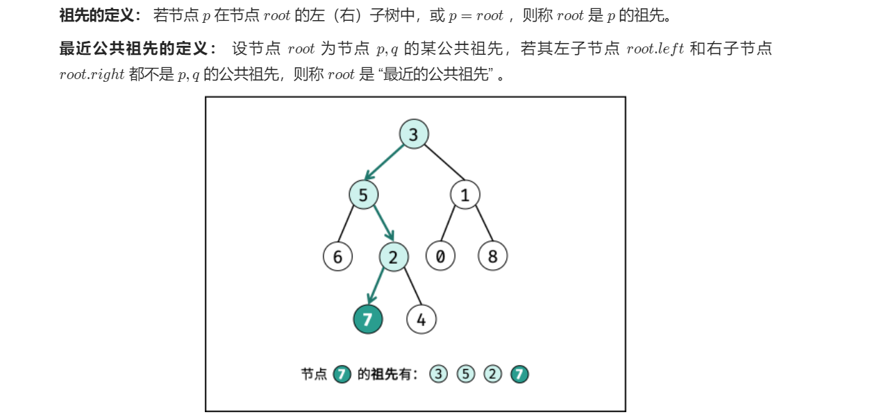
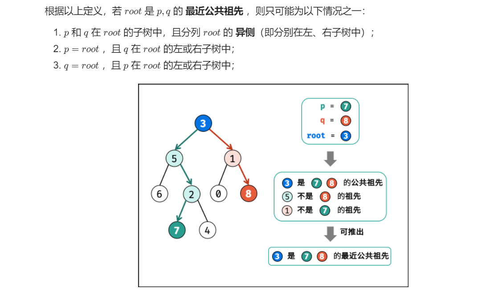
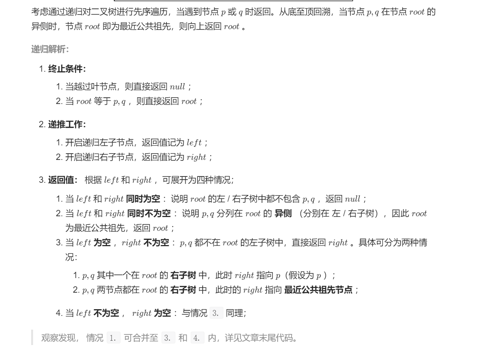

# 236. 二叉树的最近公共祖先

## 题目

难度：中等

给定一个二叉树,找到该树中两个指定节点的最近公共祖先。

百度百科中最近公共祖先的定义为：“对于有根树 T 的两个节点 p、q，最近公共祖先表示为一个节点 x，满足 x 是 p、q 的祖先且 x 的深度尽可能大（**一个节点也可以是它自己的祖先**）。”

**示例 1：**



```
输入：root = [3,5,1,6,2,0,8,null,null,7,4], p = 5, q = 1
输出：3
解释：节点 5 和节点 1 的最近公共祖先是节点 3 。

```

**示例 2：**


```
输入：root = [3,5,1,6,2,0,8,null,null,7,4], p = 5, q = 4
输出：5
解释：节点 5 和节点 4 的最近公共祖先是节点 5 。因为根据定义最近公共祖先节点可以为节点本身。

```

**示例 3：**

```
输入：root = [1,2], p = 1, q = 2
输出：1

```

> 来源: 力扣（LeetCode）  
> 链接: <https://leetcode.cn/problems/lowest-common-ancestor-of-a-binary-tree/?favorite=2cktkvj>  
> 著作权归领扣网络所有。商业转载请联系官方授权，非商业转载请注明出处。

## 答案

### 1. DFS







```c++
/**
 * Definition for a binary tree node.
 * struct TreeNode {
 *     int val;
 *     TreeNode *left;
 *     TreeNode *right;
 *     TreeNode(int x) : val(x), left(NULL), right(NULL) {}
 * };
 */
class Solution {
public:
    // 典型递归, 不要当作DFS去做即可
    TreeNode* lowestCommonAncestor(TreeNode* root, TreeNode* p, TreeNode* q) {
        if (root == nullptr || root == p || root == q) {
            return root;
        }

        // 左子树找两者的公共祖先
        TreeNode* left = lowestCommonAncestor(root->left, p, q);
        TreeNode* right = lowestCommonAncestor(root->right, p, q);

        if (left == nullptr && right == nullptr) {
            return nullptr;
        }
        if (left == nullptr) {
            return right;
        }
        if (right == nullptr) {
            return left;
        }

        return root;  // lfet != nullptr && right != nullptr
    }
};
```

面试时如下方法比较好理解：

```c++
/**
 * Definition for a binary tree node.
 * struct TreeNode {
 *     int val;
 *     TreeNode *left;
 *     TreeNode *right;
 *     TreeNode(int x) : val(x), left(NULL), right(NULL) {}
 * };
 */
class Solution {
public:
    TreeNode* lowestCommonAncestor(TreeNode* root, TreeNode* p, TreeNode* q) {
        if (root == nullptr) {
            return root;
        }

        // 1) 如果根节点是p或者q, 那么说明找到了最近公共祖先
        if (root == p || root == q) {
            return root;
        }

        // 2) 如果两个节点都在左子树, 那么进行递归
        if (isAncestor(root->left, p) && isAncestor(root->left, q)) {
            return lowestCommonAncestor(root->left, p, q);
        }

        // 3) 如果两个节点都在右子树， 那么进行递归
        if (isAncestor(root->right, p) && isAncestor(root->right, q)) {
            return lowestCommonAncestor(root->right, p, q);
        }

        // 4) 这意味着一个在左， 一个在右, 直接返回即可
        return root;

    }

    // 判断root是否是p的祖先
    bool isAncestor(TreeNode* root, TreeNode* p) {
        if (!root) {
            return false;
        }

        if (root == p) {
            return true;
        }

        return isAncestor(root->left, p) || isAncestor(root->right, p);
    }
};
```

写出上面方法后和面试官说一下好像还有优化空间，这里迭代了两次，然后改成刚才那种算法。

### 2. 哈希表

> 关键思路：使用 hash 表存储所有节点的父结点，然后找到 p 的所有祖先（包括它自己）放到 set 中，然后再挨个遍历 q 的祖先，第一个公共祖先就是两者的公共祖先。

```c++
/**
 * Definition for a binary tree node.
 * struct TreeNode {
 *     int val;
 *     TreeNode *left;
 *     TreeNode *right;
 *     TreeNode(int x) : val(x), left(NULL), right(NULL) {}
 * };
 */
class Solution {
private:
    std::unordered_map<TreeNode*, TreeNode*> father;  // key是子结点 val是父结点

public:
    TreeNode* lowestCommonAncestor(TreeNode* root, TreeNode* p, TreeNode* q) {
        // 哈希表存储所有的父结点
        father[root] = nullptr;
        findAllFather(root);
        
        // 对于p, 找到它的所有祖先结点, 包括它自己
        std::unordered_set<TreeNode*> p_ancestor;
        p_ancestor.insert(p);
        TreeNode* cur = p;

        while (father[cur]) {   // TODO: 这里应该用map的迭代器, 否则就是三次查找
            p_ancestor.insert(father[cur]);
            cur = father[cur];
        }

        // 挨个查找q的祖先, 如果查到了说明是公共祖先结点
        cur = q;
        while (cur) {
            if (p_ancestor.count(cur)) {
                return cur;
            }
            cur = father[cur];
        }

        return nullptr;
    }

    // 通过dfs遍历二叉树
    // 二路dfs本质上就是二路递归
    void findAllFather(TreeNode* root) {
        if (!root) {
            return;
        }

        if (root->left) {
            father[root->left] = root;
            findAllFather(root->left);
        }
        if (root->right) {
            father[root->right] = root;
            findAllFather(root->right);
        }
    }
};
```
