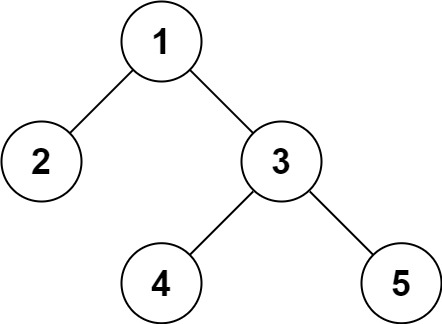

# 297. 二叉树的序列化与反序列化

## 题目

难度：困难

序列化是将一个数据结构或者对象转换为连续的比特位的操作，进而可以将转换后的数据存储在一个文件或者内存中，同时也可以通过网络传输到另一个计算机环境，采取相反方式重构得到原数据。

请设计一个算法来实现二叉树的序列化与反序列化。这里不限定你的序列/反序列化算法执行逻辑，你只需要保证一个二叉树可以被序列化为一个字符串并且将这个字符串反序列化为原始的树结构。

**示例 1：**



```
输入：root = [1,2,3,null,null,4,5]
输出：[1,2,3,null,null,4,5]

```

**示例 2：**

```
输入：root = []
输出：[]

```

**示例 3：**

```
输入：root = [1]
输出：[1]

```

**示例 4：**

```
输入：root = [1,2]
输出：[1,2]

```

> 来源: 力扣（LeetCode）  
> 链接: <https://leetcode.cn/problems/serialize-and-deserialize-binary-tree/?favorite=2cktkvj>  
> 著作权归领扣网络所有。商业转载请联系官方授权，非商业转载请注明出处。

## 答案

```c++
/**
 * Definition for a binary tree node.
 * struct TreeNode {
 *     int val;
 *     TreeNode *left;
 *     TreeNode *right;
 *     TreeNode(int x) : val(x), left(NULL), right(NULL) {}
 * };
 */
class Codec {
public:
    // 将一棵数序列化成字符串
    // 先序遍历
    void reserialize(TreeNode* root, string& res) {
        if (root == nullptr) {
            res += "null,";
            return;
        }

        res += std::to_string(root->val) + ",";
        reserialize(root->left, res);
        reserialize(root->right, res);
    }

    // Encodes a tree to a single string.
    string serialize(TreeNode* root) {
        std::string res;
        reserialize(root, res);
        // std::cout << "res: " << res << std::endl;
        return res;
    }

    TreeNode* redeserialize(std::vector<std::string>& data_list, int& pos) {
        if (data_list[pos] == "null") {
            return nullptr;
        }

        auto root = new TreeNode();
        root->val = std::stoi(data_list[pos]);

        // 这里不判断了, 假设pos位置是非 "null" 字符串, 则pos + 1 和 pos + 2一定合法
        pos++;
        root->left = redeserialize(data_list, pos);
        pos++;
        root->right = redeserialize(data_list, pos);

        return root;
    }

    // Decodes your encoded data to tree.
    TreeNode* deserialize(string data) {
        // 将数据转成字符串列表
        std::vector<std::string> data_list;

        std::string temp;
        for (auto c : data) {
            // 找到","作为分隔符
            if (c != ',') {
                temp.push_back(c);
            } else {
                data_list.push_back(temp);
                temp.clear();
            }
        }

        int pos = 0;
        return redeserialize(data_list, pos);
    }
};

// Your Codec object will be instantiated and called as such:
// Codec ser, deser;
// TreeNode* ans = deser.deserialize(ser.serialize(root));
```
