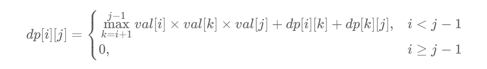

# 312. 戳气球

## 题目

难度：困难

有 n 个气球，编号为 0 到 n-1，每个气球上都标有一个数字，这些数字存在数组 nums 中。

现在要求你戳破所有的气球。戳破第 i 个气球，你可以获得 `nums[i-1]*nums[i]*nums[i+1]` 枚硬币。这里的 i-1 和 i+1 代表和 i 相邻的两个气球的序号。如果 i-1 或 i+1 超出了数组的边界，那么就当它是一个数字为 1 的气球。

求所能获得硬币的最大数量。

**示例 1：**

```
输入：nums = [3,1,5,8]
输出：167
解释：
nums = [3,1,5,8] --> [3,5,8] --> [3,8] --> [8] --> []
coins =  3*1*5    +   3*5*8   +  1*3*8  + 1*8*1 = 167
```

**示例 2：**

```
输入：nums = [1,5]
输出：10

```

> 来源: 力扣（LeetCode）  
> 链接: <https://leetcode.cn/problems/burst-balloons/?favorite=2cktkvj>  
> 著作权归领扣网络所有。商业转载请联系官方授权，非商业转载请注明出处。

## 答案

为了方便处理我们对 nums 数组稍作处理，将其两边各加上题目中假设存在的 `nums[-1]` 和 `nums[n]`，并保存在 val 数组中。即 `val[i] = nums[i-1]`，之所以这样处理是为了处理 `nums[-1]` 防止下标越界。

### 1. 动态规划

令 `dp[i][j]` 表示填满开区间 `(i,j)` 能得到的最多硬币数，那么边界条件 `i >= j-1`，此时有 `dp[i][j] = 0`。

可以写出状态转移方程为：



```cpp
class Solution {
public:
    int maxCoins(vector<int>& nums) {
        int n = nums.size();
        std::vector<std::vector<int>> dp(n + 2, std::vector<int>(n + 2));
        
        std::vector<int> val(n + 2);
        val[0] = val[n + 1] = 1;
        for (int i = 1; i <= n; ++i) {
            val[i] = nums[i - 1];
        }
        for (int i = n - 1; i >= 0; --i) {
            for (int j = i + 2; j <= n + 1; ++j) {
                for (int k = i + 1; k < j; ++k) {
                    int sum = val[i] * val[k] * val[j];
                    sum += dp[i][k] + dp[k][j];
                    dp[i][j] = std::max(dp[i][j], sum);
                }
            }
        }

        return dp[0][n + 1];
    }
};
```
