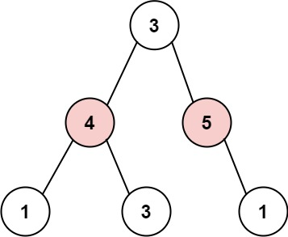

# 337. 打家劫舍 III

## 题目

难度：中等

小偷又发现了一个新的可行窃的地区。这个地区只有一个入口，我们称之为 `root`。

除了 `root` 之外，每栋房子有且只有一个“父“房子与之相连。一番侦察之后，聪明的小偷意识到“这个地方的所有房屋的排列类似于一棵二叉树”。如果 **两个直接相连的房子在同一天晚上被打劫**，房屋将自动报警。

给定二叉树的 root。返回 **在不触动警报的情况下**，小偷能够盗取的最高金额。

**示例 1:**


```
输入: root = [3,2,3,null,3,null,1]
输出: 7 
解释: 小偷一晚能够盗取的最高金额 3 + 3 + 1 = 7
```

**示例 2:**



```
输入: root = [3,4,5,1,3,null,1]
输出: 9
解释: 小偷一晚能够盗取的最高金额 4 + 5 = 9

```

> 来源: 力扣（LeetCode）  
> 链接: <https://leetcode.cn/problems/house-robber-iii/?favorite=2cktkvj>  
> 著作权归领扣网络所有。商业转载请联系官方授权，非商业转载请注明出处。

## 答案

### 1. DFS

> 通过了 122/124 个用例，但是超时了。

```c++
/**
 * Definition for a binary tree node.
 * struct TreeNode {
 *     int val;
 *     TreeNode *left;
 *     TreeNode *right;
 *     TreeNode() : val(0), left(nullptr), right(nullptr) {}
 *     TreeNode(int x) : val(x), left(nullptr), right(nullptr) {}
 *     TreeNode(int x, TreeNode *left, TreeNode *right) : val(x), left(left), right(right) {}
 * };
 */
class Solution {
public:
    // root: 根节点
    // can_steal: 是否能偷
    // cur_amount: 当前抢劫的钱
    int dfs(TreeNode* root, bool can_steal) {
        // 递归退出条件
        if (!root) {
            return 0;
        }

        // 能偷的话有两种选择: 偷或者不偷
        if (can_steal) {
            // 偷
            int steal_amount = root->val + dfs(root->left, false) + dfs(root->right, false);
            // 不偷
            int not_steal_amount = dfs(root->left, true) + dfs(root->right, true);
            return std::max(steal_amount, not_steal_amount);
        } else {
            // 不能偷
            return dfs(root->left, true) + dfs(root->right, true);
        }

    }

    // 二叉树习惯使用递归, 这是n路递归所以自然是DFS
    int rob(TreeNode* root) {
        return dfs(root, true);
    }
};
```

### 2. 动态规划

> 牢记 DFS 有可能可以用动态规划写，只不过一个是从上到下遍历，一个是从下到上遍历罢了。

这里更巧妙的是利用了 DFS 实现动态规划。

```c++
/**
 * Definition for a binary tree node.
 * struct TreeNode {
 *     int val;
 *     TreeNode *left;
 *     TreeNode *right;
 *     TreeNode() : val(0), left(nullptr), right(nullptr) {}
 *     TreeNode(int x) : val(x), left(nullptr), right(nullptr) {}
 *     TreeNode(int x, TreeNode *left, TreeNode *right) : val(x), left(left), right(right) {}
 * };
 */
class Solution {
public:
    // 分别表示选中和不选中该结点时的最大值
    std::unordered_map<TreeNode*, int> steal;
    std::unordered_map<TreeNode*, int> not_steal;

    void dfs(TreeNode* root) {
        if (!root) {
            return;
        }

        dfs(root->left);
        dfs(root->right);

        steal[root] = root->val + not_steal[root->left] + not_steal[root->right];
        not_steal[root] = std::max(steal[root->left], not_steal[root->left]) + std::max(steal[root->right], not_steal[root->right]);
    }

    int rob(TreeNode* root) {
        dfs(root);
        return std::max(steal[root], not_steal[root]);
    }
};
```
