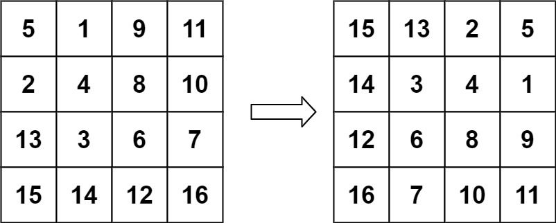

# 48. 旋转图像

## 题目

难度: 中等

给定一个 *n* × *n* 的二维矩阵 matrix 表示一个图像。请你将图像顺时针旋转 90 度。

你必须在原地旋转图像，这意味着你需要直接修改输入的二维矩阵。**请不要** 使用另一个矩阵来旋转图像。

**示例 1：**


```
输入：matrix = [[1,2,3],[4,5,6],[7,8,9]]
输出：[[7,4,1],[8,5,2],[9,6,3]]

```

**示例 2：**



```
输入：matrix = [[5,1,9,11],[2,4,8,10],[13,3,6,7],[15,14,12,16]]
输出：[[15,13,2,5],[14,3,4,1],[12,6,8,9],[16,7,10,11]]

```

> 来源: 力扣（LeetCode）
> 链接: <https://leetcode.cn/problems/rotate-image/description/>
> 著作权归领扣网络所有。商业转载请联系官方授权，非商业转载请注明出处。

## 答案

```c++
class Solution {
public:
    void rotate(vector<vector<int>>& matrix) {
        // 使用 std::swap 来避免构造新的图像
        // 根据题意, 每个元素等价于先对角线翻转，再左右翻转

        int row_cnt = matrix.size();
        // 1. 对角线翻转
        for (int i = 0; i < row_cnt; i++) {
            for (int j = 0; j < i; j++) {
                std::swap(matrix[i][j], matrix[j][i]);
            }
        }

        // 2. 左右翻转
        for (int i = 0; i < row_cnt; i++) {
            for (int j = 0; j < row_cnt / 2; j++) {
                std::swap(matrix[i][j], matrix[i][row_cnt - 1 - j]);
            }
        }
    }
};
```
