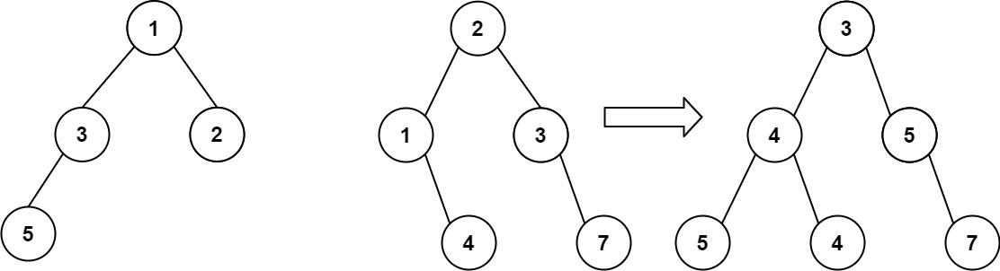

# 617. 合并二叉树

## 题目

难度：简单

给你两棵二叉树：root1 和 root2。

想象一下，当你将其中一棵覆盖到另一棵之上时，两棵树上的一些节点将会重叠（而另一些不会）。你需要将这两棵树合并成一棵新二叉树。合并的规则是：如果两个节点重叠，那么将这两个节点的值相加作为合并后节点的新值；否则，**不为**null 的节点将直接作为新二叉树的节点。

返回合并后的二叉树。

**注意**：合并过程必须从两个树的根节点开始。

**示例 1：**



```
输入：root1 = [1,3,2,5], root2 = [2,1,3,null,4,null,7]
输出：[3,4,5,5,4,null,7]

```

**示例 2：**

```
输入：root1 = [1], root2 = [1,2]
输出：[2,2]

```

**提示：**

* 两棵树中的节点数目在范围 `[0, 2000]` 内
* `-104 <= Node.val <= 104`

> 来源: 力扣（LeetCode）  
> 链接: <https://leetcode.cn/problems/merge-two-binary-trees/?favorite=2cktkvj>  
> 著作权归领扣网络所有。商业转载请联系官方授权，非商业转载请注明出处。

## 答案

```c++
/**
 * Definition for a binary tree node.
 * struct TreeNode {
 *     int val;
 *     TreeNode *left;
 *     TreeNode *right;
 *     TreeNode() : val(0), left(nullptr), right(nullptr) {}
 *     TreeNode(int x) : val(x), left(nullptr), right(nullptr) {}
 *     TreeNode(int x, TreeNode *left, TreeNode *right) : val(x), left(left), right(right) {}
 * };
 */
class Solution {
public:
    TreeNode* mergeTrees(TreeNode* root1, TreeNode* root2) {
        TreeNode* res = new TreeNode();

        if (!root1) {
            return root2;
        }

        if (!root2) {
            return root1;
        }

        // root1 和 root2 都非空
        res->val = root1->val + root2->val;
        res->left = mergeTrees(root1->left, root2->left);
        res->right = mergeTrees(root1->right, root2->right);
        return res;
    }
};
```
