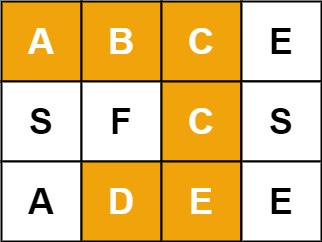
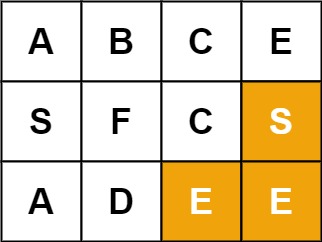

# 79. 单词搜索

## 题目

难度: 中等

给定一个 mxn 二维字符网格 board 和一个字符串单词 word。如果 word 存在于网格中，返回 true；否则，返回 false。

单词必须按照字母顺序，通过相邻的单元格内的字母构成，其中“相邻”单元格是那些水平相邻或垂直相邻的单元格。同一个单元格内的字母不允许被重复使用。

**示例 1：**



```
输入：board = [["A","B","C","E"],["S","F","C","S"],["A","D","E","E"]], word = "ABCCED"
输出：true

```

**示例 2：**



```
输入：board = [["A","B","C","E"],["S","F","C","S"],["A","D","E","E"]], word = "SEE"
输出：true

```

**示例 3：**


```
输入：board = [["A","B","C","E"],["S","F","C","S"],["A","D","E","E"]], word = "ABCB"
输出：false

```

**进阶**：你可以使用搜索剪枝的技术来优化解决方案，使其在 board 更大的情况下可以更快解决问题？

> 来源: 力扣（LeetCode）
> 链接: <https://leetcode.cn/problems/word-search/?favorite=2cktkvj>
> 著作权归领扣网络所有。商业转载请联系官方授权，非商业转载请注明出处。

## 答案

经典 DFS：

* 四叉树
* 提前返回 true/false
* main 函数 for 循环执行 dfs

```c++
class Solution {
public:
    std::vector<std::vector<bool>> visited;

    // x, y: 搜索的起点
    // idx: 当前在查找字符串第几位
    bool dfs(const std::vector<std::vector<char>>& board, const std::string& word, int idx, int x, int y) {
        int row_cnt = board.size();
        int col_cnt = board[0].size();

        // 递归结束条件
        if (word[idx] != board[x][y]) {
            return false;
        }
        if (idx == word.size() - 1) {
            return true;
        }

        visited[x][y] = true;

        // 四叉树: 四种方向
        std::vector<std::pair<int, int>> directions = {{0, 1}, {0, -1}, {1, 0}, {-1, 0}};
        // 递归 + 回溯
        for (auto && p : directions) {
            int new_x = x + p.first;
            int new_y = y + p.second;

            if (new_x >= 0 && new_x < row_cnt && new_y >= 0 && new_y < col_cnt) {
                if (!visited[new_x][new_y] && dfs(board, word, idx+1, new_x, new_y)) {
                    return true;
                }
            }
        }

        visited[x][y] = false;  // 回溯
        return false;
    }

    bool exist(vector<vector<char>>& board, string word) {
        int row_cnt = board.size();
        int col_cnt = board[0].size();

        visited = std::vector<std::vector<bool>>(row_cnt, std::vector<bool>(col_cnt));

        for (int i = 0; i < row_cnt; i++) {
            for (int j = 0; j < col_cnt; j++) {
               if (dfs(board, word, 0, i, j)) {
                   return true;
               }
            }
        }
        return false;
    }
};
```
