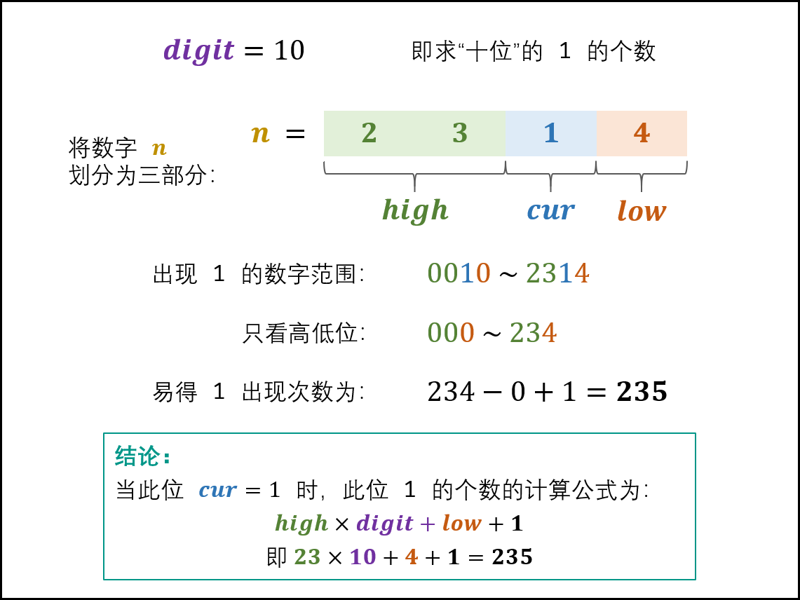

# 剑指 Offer 43. 1～n 整数中 1 出现的次数

## 题目

难度: 困难

输入一个整数 n ，求 1～n 这 n 个整数的十进制表示中1出现的次数。

例如，输入12，1～12这些整数中包含1 的数字有1、10、11和12，1一共出现了5次。

**示例 1：**

```
输入：n = 12
输出：5

```

**示例 2：**

```
输入：n = 13
输出：6
```

**限制：**

- 1 <= n < 2^31

注意：本题与主站 233 题相同：<https://leetcode-cn.com/problems/number-of-digit-one/>

> 来源: 力扣（LeetCode）  
> 链接: <https://leetcode.cn/problems/1nzheng-shu-zhong-1chu-xian-de-ci-shu-lcof/>  
> 著作权归领扣网络所有。商业转载请联系官方授权，非商业转载请注明出处。

## 思路

将 1 ~ n 的个位、十位、百位、...的 1 出现次数相加，即为 1 出现的总次数。

设数字 n 是一个 x 位数，记 n 的第 i 位为 $n_i$，则可将 n 写成 $n_xn_{x-1}...n_2n_1$

- 称 $n_i$ 为当前位，记为 cur
- 称 $n_{i-1}n_{i-2}...n_2n_1$ 称为低位，记为 low
- 称 $n_xn_{x-1}...n_{i+2}n_{i+1}$ 为高位， 记为 high
- 称 $10^i$ 为位因子，记为digit

根据当前位 cur 值不同，可以分成如下三种情况

### 1. cur为0

此时该位 1 出现的次数只由高位high决定，计算公式为：
$$
high \times digit
$$
以 n = 2304 为例，求 digit = 10 （即十位）的 1 出现次数：


### 2. cur = 1

 此位 1 的出现次数由高位 high 和低位 low 决定，计算公式为：
$$
high \times digit + low + 1
$$
如下图所示，以 n = 2314 为例，求 digit = 10 （即十位）的 1 出现次数。



### 3. cur >= 2

此位 11 的出现次数只由高位 high 决定，计算公式为：
$$
(high + 1) \times digit
$$
如下图所示，以 n = 2324 为例，求 digit = 10 （即十位）的 1 出现次数。


## 答案

```c++
class Solution {
public:
    int countDigitOne(int n) {
        // 位数 1, 10, 100
        int64_t digit = 1;
        // 结果
        int res = 0;

        int high = n / 10;
        int cur = n % 10;
        int low = 0;

        while (high != 0 || cur != 0) {
            if (cur == 0) {
                res += high * digit;
            } else if (cur == 1) {
                res += high * digit + low + 1;
            } else {
                res += (high + 1) * digit;
            }

            low += cur * digit;
            cur = high % 10;
            high /= 10;
            digit *= 10;
        }

        return res;
    }
};
```
