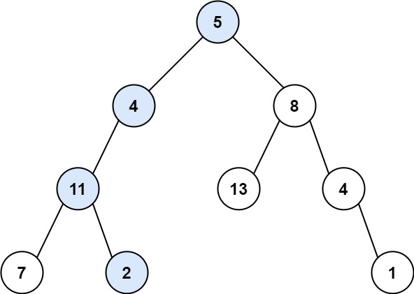
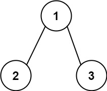

# 112. 路径总和

## 题目

难度: 简单

给你二叉树的根节点 root 和一个表示目标和的整数 targetSum 。判断该树中是否存在 **根节点到叶子节点** 的路径，这条路径上所有节点值相加等于目标和 targetSum 。如果存在，返回 true ；否则，返回 false 。

**叶子节点** 是指没有子节点的节点。

**示例 1：**



```
输入：root = [5,4,8,11,null,13,4,7,2,null,null,null,1], targetSum = 22
输出：true
解释：等于目标和的根节点到叶节点路径如上图所示。

```

**示例 2：**



```
输入：root = [1,2,3], targetSum = 5
输出：false
解释：树中存在两条根节点到叶子节点的路径：
(1 --> 2): 和为 3
(1 --> 3): 和为 4
不存在 sum = 5 的根节点到叶子节点的路径。
```

**示例 3：**

```
输入：root = [], targetSum = 0
输出：false
解释：由于树是空的，所以不存在根节点到叶子节点的路径。

```

> 来源: 力扣（LeetCode）  
> 链接: <https://leetcode.cn/problems/path-sum/>  
> 著作权归领扣网络所有。商业转载请联系官方授权，非商业转载请注明出处。

## 答案

```c++
class Solution {
public:
    bool hasPathSum(TreeNode* root, int targetSum) {
        if (!root) {
            return false;
        }
        if (!root->left && !root->right) {
            return targetSum == root->val;
        }
        return hasPathSum(root->left, targetSum - root->val) || hasPathSum(root->right, targetSum - root->val);
    }
};
```
