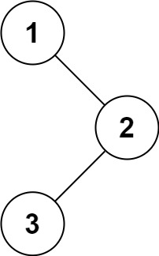

# 94. 二叉树的中序遍历

## 题目

难度: 简单

给定一个二叉树的根节点 root ，返回 它的 **中序** 遍历。

**示例 1：**



```
输入：root = [1,null,2,3]
输出：[1,3,2]

```

**示例 2：**

```
输入：root = []
输出：[]

```

**示例 3：**

```
输入：root = [1]
输出：[1]

```

**提示：**

- 树中节点数目在范围 [0, 100] 内
- -100 <= Node.val <= 100

**进阶:** 递归算法很简单，你可以通过迭代算法完成吗？

> 来源: 力扣（LeetCode）  
> 链接: <https://leetcode.cn/problems/binary-tree-inorder-traversal/>  
> 著作权归领扣网络所有。商业转载请联系官方授权，非商业转载请注明出处。

## 答案

```c++
class Solution {
public:
    vector<int> res;
    void helper(TreeNode* root) {
        if (!root) {
            return;
        }
        helper(root->left);
        res.push_back(root->val);
        helper(root->right);
    }
    vector<int> inorderTraversal(TreeNode* root) {
        helper(root);
        return res;
    }
};
```
