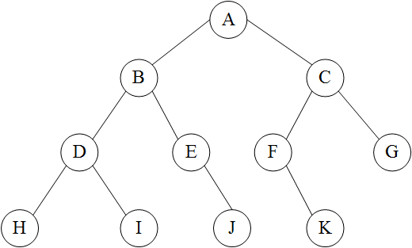

# 二叉树

## 定义

```c++
struct TreeNode {
    int val;
    TreeNode *left;
    TreeNode *right;
    TreeNode() : val(0), left(nullptr), right(nullptr) {}
    TreeNode(int x) : val(x), left(nullptr), right(nullptr) {}
    TreeNode(int x, TreeNode *left, TreeNode *right) : val(x), left(left), right(right) {}
};
```

## 遍历方式

> 根节点在第一个为前序遍历、根节点在第二个为中序遍历、根节点在第三个为后序遍历。

 二叉树的遍历是指从根结点触发，按照某种次序依次访问二叉树中所有结点，使得每个结点被访问一次且仅被访问一次。

### 1. 前(先)序遍历

> 遍历方式：根结点-左子树-右子树

若二叉树为空，则空操作返回，否则先访问根结点，然后前序遍历左子树，再前序遍历右子书。

### 2. 中序遍历

> 遍历方式：左子树-根结点-右子树

若二叉树为空，则空操作返回，否则从根结点开始（注意并不是先访问根结点），中序遍历根结点的左子树，然后访问根结点，最后中序遍历右子树。

### 3. 后序遍历

> 遍历方式：左子树-右子树-根节点

若二叉树为空，则空操作返回，否则从左到右先叶子结点后结点的方式遍历访问左右子树，最后访问根结点。

### 4. 层序遍历

> 遍历方式：从左到右，从上到下
>
> ==使用队列实现==

若二叉树为空，则空返回，否则从树的第一层，即根结点开始访问，从上而下逐层遍历，在同一层中，按从左到右的顺序对结点逐个访问。

#### 5. 例子



* 前序遍历：`ABDHIEJCFKG`
* 中序遍历：`HDIBEJAFKCG`
* 后序遍历：`HIDJEBKFGCA`
* 层序遍历：`ABCDEFGHIJK`

## 判断某个节点是不是另一个节点的祖先

> 在二叉树这种搜索场景下，使用递归是最好的。

```c++
// 判断root是否是p的祖先
bool isAncestor(TreeNode* root, TreeNode* p) {
    if (!root) {
        return false;
    }

    if (root == p) {
        return true;
    }

    return isAncestor(root->left, p) || isAncestor(root->right, p);
}
```

## 存储二叉树的所有父子关系

使用hash表存储：

```c++
// 通过dfs遍历二叉树
// 二路dfs本质上就是二路递归
void findAllFather(TreeNode* root) {
    if (!root) {
        return;
    }

    if (root->left) {
        father[root->left] = root;
        findAllFather(root->left);
    }
    if (root->right) {
        father[root->right] = root;
        findAllFather(root->right);
    }
}

int main() {
    std::unordered_map<TreeNode*, TreeNode*> father;  // key是子结点 val是父结点
    
    // 注意还需要单独存储root节点的父结点为nullptr
    father[root] = nullptr;
    findAllFather(root);
}
```

## 找到二叉树某个节点所有的祖先结点

先遍历二叉树，将二叉树所有的父子结点存入hash表中。

然后从该结点开始往上跳，找到所有的祖先结点。

LeetCode236：二叉树公共祖先

## 二叉树直径

LeetCode543：二叉树的直径

> 递归：定义`depth(node)`返回以该结点为根的子树的深度，最终答案就是`depth(root->left) + depth(root->right) -1`

```c++
/**
 * Definition for a binary tree node.
 * struct TreeNode {
 *     int val;
 *     TreeNode *left;
 *     TreeNode *right;
 *     TreeNode() : val(0), left(nullptr), right(nullptr) {}
 *     TreeNode(int x) : val(x), left(nullptr), right(nullptr) {}
 *     TreeNode(int x, TreeNode *left, TreeNode *right) : val(x), left(left), right(right) {}
 * };
 */
class Solution {
public:
    int ans = 0;

    // 计算子树的深度
    int depth(TreeNode* root) {
        if (!root) {
            return 0;
        }

        int left_depth = depth(root->left);
        int right_depth = depth(root->right);

        ans = std::max(ans, left_depth + right_depth + 1);

        return std::max(left_depth, right_depth) + 1;
    }

    int diameterOfBinaryTree(TreeNode* root) {
        // 递归
        depth(root);
        return ans - 1;
    }
};
```

## 序列化和反序列化

LeetCode297：二叉树的序列化和反序列化

> 主要思路是利用递归。

```c++
/**
 * Definition for a binary tree node.
 * struct TreeNode {
 *     int val;
 *     TreeNode *left;
 *     TreeNode *right;
 *     TreeNode(int x) : val(x), left(NULL), right(NULL) {}
 * };
 */
class Codec {
public:
    // 将一棵数序列化成字符串
    // 先序遍历
    void reserialize(TreeNode* root, string& res) {
        if (root == nullptr) {
            res += "null,";
            return;
        }

        res += std::to_string(root->val) + ",";
        reserialize(root->left, res);
        reserialize(root->right, res);
    }

    // Encodes a tree to a single string.
    string serialize(TreeNode* root) {
        std::string res;
        reserialize(root, res);
        std::cout << "res: " << res << std::endl;
        return res;
    }

    TreeNode* redeserialize(std::vector<std::string>& data_list, int& pos) {
        if (data_list[pos] == "null") {
            return nullptr;
        }

        auto root = new TreeNode();
        root->val = std::stoi(data_list[pos]);

        // 这里不判断了, 假设pos位置是非 "null" 字符串, 则pos + 1 和 pos + 2一定合法
        pos++;
        root->left = redeserialize(data_list, pos);
        pos++;
        root->right = redeserialize(data_list, pos);

        return root;
    }

    // Decodes your encoded data to tree.
    TreeNode* deserialize(string data) {
        // 将数据转成字符串列表
        std::vector<std::string> data_list;

        std::string temp;
        for (auto c : data) {
            // 找到","作为分隔符
            if (c != ',') {
                temp.push_back(c);
            } else {
                data_list.push_back(temp);
                temp.clear();
            }
        }

        int pos = 0;
        return redeserialize(data_list, pos);
    }
};

// Your Codec object will be instantiated and called as such:
// Codec ser, deser;
// TreeNode* ans = deser.deserialize(ser.serialize(root));
```

## 二叉树的镜像

也是递归写法：

```c++
// 获取镜像树
TreeNode* getMirrorTree(TreeNode* root) {
    if (!root) {
        return nullptr;
    }

    auto left = root->left;
    root->left = getMirrorTree(root->right);
    root->right = getMirrorTree(left);
    return root;
}
```

## 相同的树

通过递归判断两棵树是否相同：

```c++
class Solution {
public:
    bool isSameTree(TreeNode* p, TreeNode* q) {
        if (p == nullptr && q == nullptr) {
            return true;
        }
        if (!p || !q) {
            return false;
        }

        if (p->val != q->val) {
            return false;
        }

        return isSameTree(p->left, q->left) && isSameTree(p->right, q->right);
    }
};
```

## 二叉树是否对称

```c++
    // 判断左树和右树是否镜像
    bool helper(TreeNode* t1, TreeNode* t2) {
        if (!t1 && !t2) {
            return true;
        }
        if (!t1 || !t2) {
            return false;
        }

        if (t1->val != t2->val) {
            return false;
        }

        return helper(t1->left, t2->right) && helper(t1->right, t2->left);
    }

    bool isSymmetric(TreeNode* root) {
        if (!root) {
            return true;
        }

        return helper(root->left, root->right);
    }
```

## Reference

[1] <https://blog.csdn.net/android_cmos/article/details/52887028>
