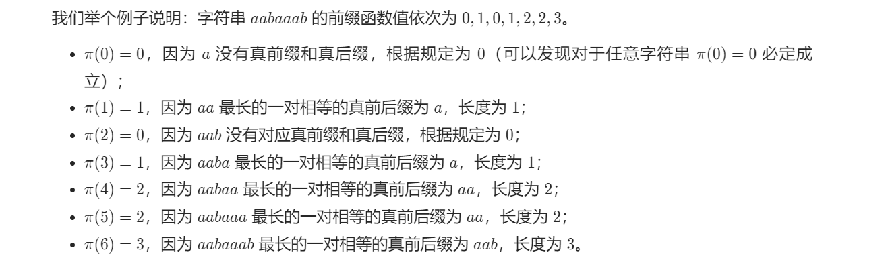
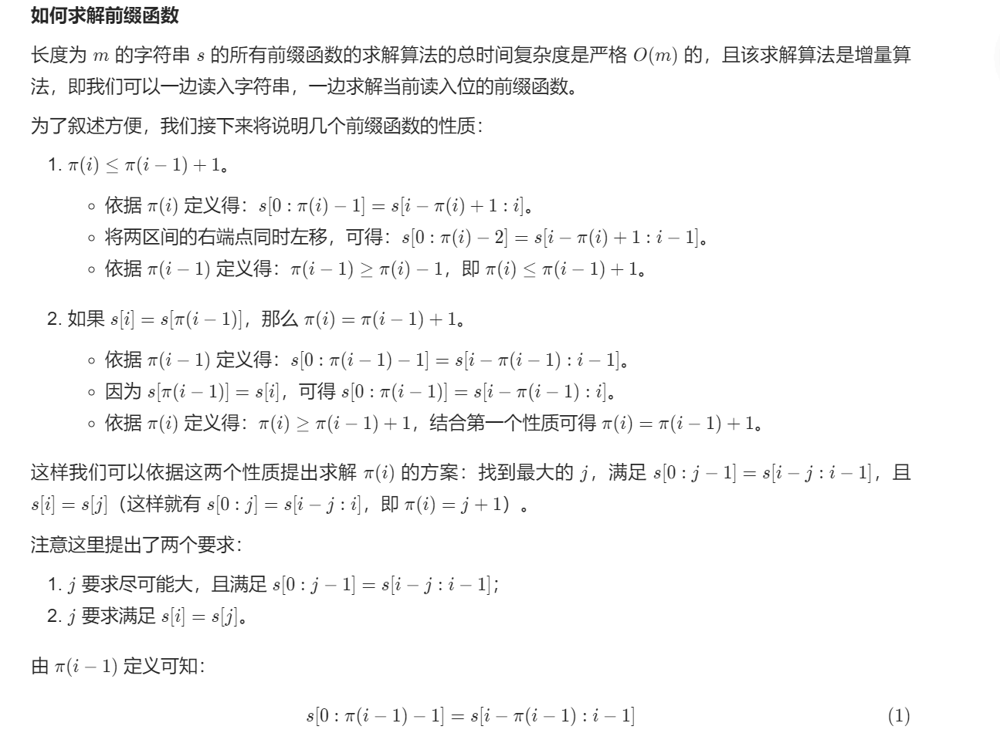
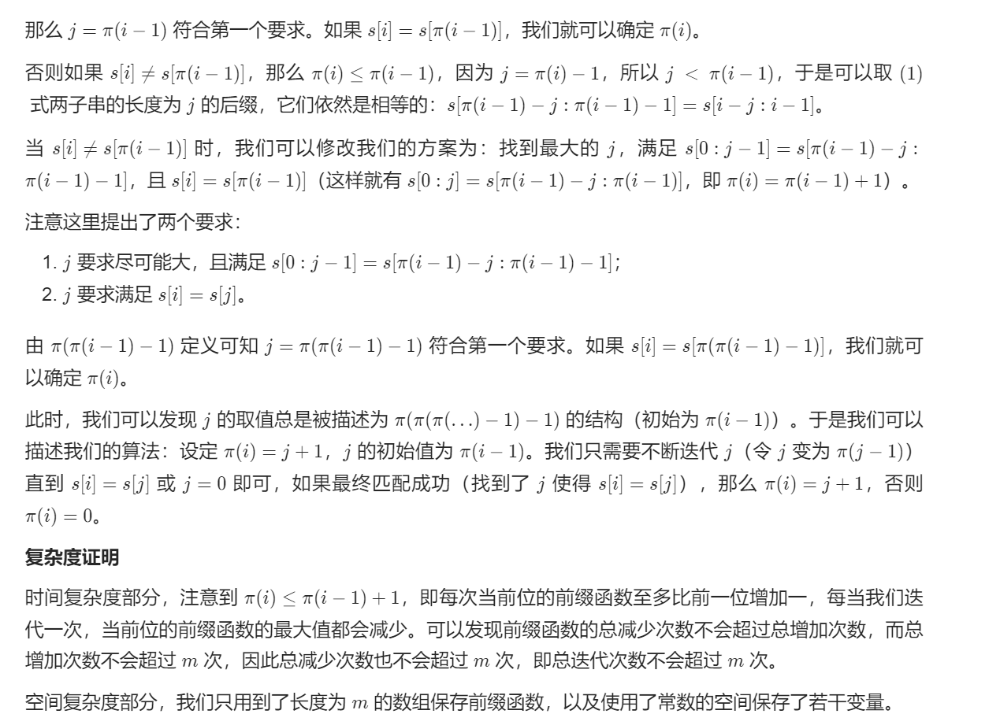
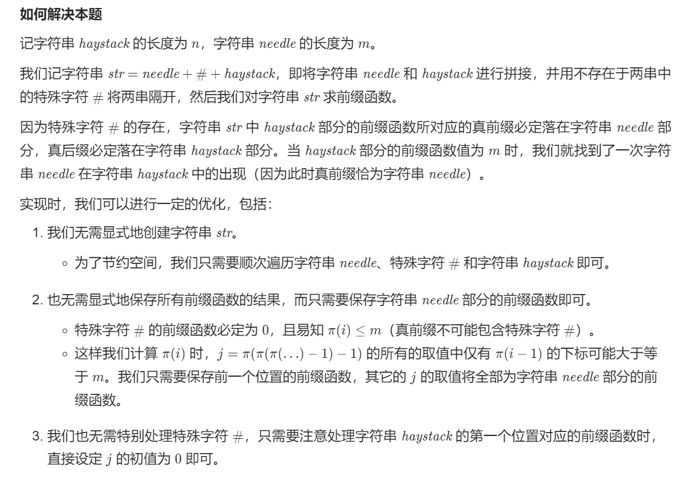
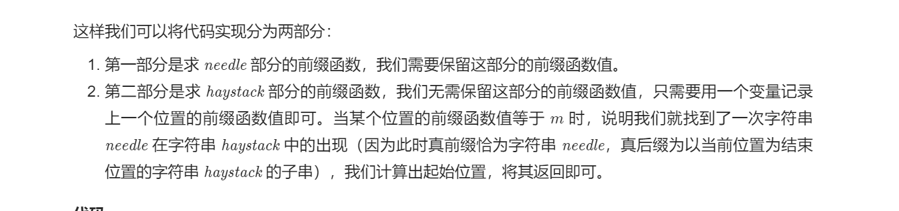

# 28. 实现 strStr()
 ## 题目 
难度: 简单

实现 <a href="https://baike.baidu.com/item/strstr/811469">strStr()</a> 函数。

给你两个字符串 haystack 和 needle ，请你在 haystack 字符串中找出 needle 字符串出现的第一个位置（下标从 0 开始）。如果不存在，则返回  -1** **。

**说明：**

当 needle 是空字符串时，我们应当返回什么值呢？这是一个在面试中很好的问题。

对于本题而言，当 needle 是空字符串时我们应当返回 0 。这与 C 语言的 <a href="https://baike.baidu.com/item/strstr/811469">strstr()</a> 以及 Java 的 <a href="https://docs.oracle.com/javase/7/docs/api/java/lang/String.html#indexOf(java.lang.String)">indexOf()</a> 定义相符。

 

**示例 1：**

```
输入：haystack = "hello", needle = "ll"
输出：2

```


**示例 2：**

```
输入：haystack = "aaaaa", needle = "bba"
输出：-1

```


**提示：**

- 1 <= haystack.length, needle.length <= 10<sup>4</sup>
- haystack 和 needle 仅由小写英文字符组成

来源: 力扣（LeetCode）
链接: https://leetcode.cn/problems/implement-strstr/
著作权归领扣网络所有。商业转载请联系官方授权，非商业转载请注明出处。

## 答案

#### 1. 暴力求解

```c++
class Solution {
public:
    int strStr(string haystack, string needle) {
        for (int i = 0; i < haystack.size(); i++) {
            if (i + needle.size() -1 >= haystack.size()) {
                continue;
            }
            bool is_match = true;
            for (int j = 0; j < needle.size(); j++) {
                if (needle[j] != haystack[i+j]) {
                    is_match = false;
                    break;
                }
            }
            if (is_match) {
                return i;
            }
        }

        return -1;
    }
};
```

#### 2. KMP 算法

Knuth-Morris-Pratt 算法，简称 KMP 算法，由 Donald Knuth、James H. Morris 和 }Vaughan Pratt 三人于 1977 年联合发表。

Knuth-Morris-Pratt 算法的核心为前缀函数，记作 $$\pi(i)$$，其定义如下：

对于长度为 m 的字符串 s，其前缀函数 $$\pi(i)(0 \leq i < m)$$表示 s 的子串 $$s[0:i]$$ 的最长的相等的真前缀与真后缀的长度。特别地，如果不存在符合条件的前后缀，那么 $$\pi(i) = 0$$。其中真前缀与真后缀的定义为不等于自身的的前缀与后缀。











```c++
class Solution {
public:
    int strStr(string haystack, string needle) {
        int n = haystack.size(), m = needle.size();
        if (m == 0) {
            return 0;
        }
        vector<int> pi(m);
        for (int i = 1, j = 0; i < m; i++) {
            while (j > 0 && needle[i] != needle[j]) {
                j = pi[j - 1];
            }
            if (needle[i] == needle[j]) {
                j++;
            }
            pi[i] = j;
        }
        for (int i = 0, j = 0; i < n; i++) {
            while (j > 0 && haystack[i] != needle[j]) {
                j = pi[j - 1];
            }
            if (haystack[i] == needle[j]) {
                j++;
            }
            if (j == m) {
                return i - m + 1;
            }
        }
        return -1;
    }
};
```

