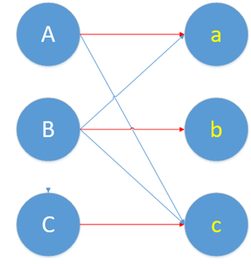

# KM 算法

## 概念

二分图是一类特殊的图，它可以被划分成两个部分，每个部分内的点互不相连。


可以看到上面的二分图中，每条边的端点都分别处于点集 X 和 Y 中。匈牙利算法主要用来解决两个问题：

* 求二分图的最大匹配数
* 求二分图的最小点覆盖数

### 1. 二分图

二分图是图论中的一种特殊模型。若能将无向图 $$G=(V,E)$$ 的顶点V划分为两个交集为空的顶点集，并且任意边的两个端点都分属于两个集合，则称图 G 为一个为二分图。

一张图要是二分图，需要满足以下几个要求：

* **无向图**：意思就是没有方向，一旦 AB 两人有连线，就说明两个人互相喜欢配对成功，不存在 A 单方面喜欢 B 的情况。
* **交集为空**：意思就是男的是一个集合，女的是一个集合，不存在交集。
* **任意边的两个端点分属于两个集合**：意思就是，男的只能和女的配对。任何男的不能和男的配对，任何女的不能和女的配对。

以下是二分图和非二分图的例子：


### 2. 匹配

在 G 的一个子图 M 中，M 的边集中的任意两条边都不依附于同一个顶点，则称 M 是一个匹配。

结合情侣配对问题，男生女生之间互生情愫的有很多，甚至有的人对多个人都有意向，因此潜在的情侣组合方式有很多种。所谓的「任意两条边都不依附于同一个顶点」，意思就是只要我们撮合的时候，不要给某个人安排两个对象就行。作为牵线人，我们可以撮合一对，也可以撮合两对，这样每一种撮合方式，都叫一个匹配。撮合成功的这些情侣就是所谓的子图 M。

### 3. 最大匹配

按照上面的撮合方式，我们既不能把没有意向的两个人撮合在一起，有的人又对多个人有意向，因此可以花一点心思，尽可能地协调一下大家的意向，做到多撮合成功几对。这样，成功撮合的情侣最多的这种撮合方式，就叫最大匹配。

### 4. 最优匹配/完美匹配

如果非常幸运，在我们的安排下，每个人都找到了自己心仪的对象。这种撮合方式，叫做最优匹配或完美匹配。

### 5. **交替路和增广路**

交替路和增广路是用来解决新配对的时候发生冲突的问题。这里要结合具体问题解释才能更清楚。那么我们来结合具体问题，看看这个交替路和增广路有啥用处。

考虑一个下面这个二分图，怎么找到最大的匹配呢？


一个自然的思路是，一个一个的配对。首先给A配对。一看A和a有意向，那就先把他俩撮合到一起。

现在效果就变成这样了：


好了，A 的问题暂时性解决了，轮到 B 了。结果 B 也想和 a 配对。

**这时候，谁才能和a在一起呢？交替路和增广路就是解决这个冲突的。**

这时候，我们要找一条交替路，就是依次经过非匹配边（蓝线）、匹配边（红线）。那么我们从B出发，开始找交替路了。我们找到了：

```bash
B ------------------------ a ------------------------ A ------------------------ c
         (非匹配边)                    (匹配边)                    (非匹配边)
```

B 和 c 都是没有被匹配过的点，而它又是这条交替路的起点和终点。**这条交替路就是增广路**。

现在我们要做一个取反操作，怎么取呢，就是将上面这条增广路的匹配边变成不匹配边，不匹配边变成匹配边。

```bash
B ------------------------ a ------------------------ A ------------------------ c
         (匹配边)                    (非匹配边)                    (匹配边)
```

还是用红色表示匹配边，蓝色表示非匹配边。画在图上，现在的匹配变成这样。


然后，我们发现，刚刚的冲突问题解决了。由 B 和 a 在一起，A 和 c 在一块。

回过头来，再想一下增广路是怎么解决冲突问题的。增广路的核心特点就是“起点终点都是非匹配点”，这样就导致非匹配边比匹配边多了一条。增广路建立连接时，必须建立在两者有意向的基础上。这样我们取反，也就是交换匹配和非匹配边的身份。我们就多得到了一条匹配边。这个取反的过程，就是把原本匹配上的两个人拆散，给第三个人腾位置。

最后，我们把上图的配对问题彻底解决完。

A 和 B 的问题都解决了，轮到 C 了。C 要和 c 配对，又发生冲突了。于是，又要使用增广路来增加一个匹配了。

```bash
C -------- c -------- A -------- a -------- B -------- b
    (非)        (匹)       (非)       (匹)        (非)
```

取个反得到：

```bash
C -------- c -------- A -------- a -------- B -------- b
    (匹)        (非)       (匹)       (非)        (匹)
```

画成图长这样：



至此我们找到了最大匹配。由于所有元素都找到了自己的心仪对象。因此，这个最大匹配也是完美匹配。

## 匈牙利算法

上述利用增广路径找最大匹配的算法，就叫做匈牙利算法。

### 1. 定义

个点从另一个集合里挑对象，没冲突的话就先安排上，要是冲突了就用增广路径重新匹配。重复上述思路，直到所有的点都找到对象，或者找不到对象也找不到增广路。

### 2. 深度优先和广度优先

上述是**深度优先匈牙利算法**。就是冲突了立刻用增广路来解决。

另外一种是**广度优先匈牙利算法**。思路是，冲突了就换一个心仪对象，看另一个心仪对象是不是也配对了，要是都配对了，再用增广路来解决。

广度优先流程如下：

1. **A 和 a 连上。**
2. B 也想连 a，但是 a 被连了，就找下一个心仪对象 b。
3. b 没有被连上，**B 和 b 就连在一起**。
4. 轮到 C 的时候，C 找心仪对象c。
5. c 也没被连上，**所以 C 和 c 连一起。**

## 最大匹配问题


现在 Boys 和 Girls 分别是两个点集，里面的点分别是男生和女生，边表示他们之间存在“暧昧关系"。最大匹配问题相当于，**假如你是红娘，可以撮合任何一对有暧昧关系的男女，那么你最多能成全多少对情侣**？

> 数学表述：在二分图中最多能找到多少条没有公共端点的边

现在我们来看看匈牙利算法是怎么运作的：

我们从 B1 看起，他与 G2 有暧昧，那我们就先暂时把他与 G2 连接（注意这时只是你作为一个红娘在纸上构想，你没有真正行动，此时的安排都是暂时的）。


来看 B2，B2 也喜欢 G2，这时 G2 已经“名花有主”了（虽然只是我们设想的），那怎么办呢？我们倒回去看 G2 目前被安排的男友，是 B1，B1 有没有别的选项呢？有，G4，G4 还没有被安排，那我们就给 B1 安排上 G4。


然后 B3，B3 直接配上 G1 就好了，这没什么问题。至于 B4，他只钟情于 G4，G4 目前配的是 B1。B1 除了 G4 还可以选 G2，但是呢，如果 B1 选了 G2，G2 的原配 B2 就没得选了。我们绕了一大圈，发现 B4 只能注定单身了，可怜。（其实从来没被考虑过的G3更可怜）


这就是匈牙利算法的流程，至于具体实现，我们来看看代码：

```c++
#include <cstring>

#define MAXM 1000
#define MAXN 1000

int M, N;             // M, N分别表示左、右侧集合的元素数量
int Map[MAXM][MAXN];  // 邻接矩阵存图
int p[MAXN];          // 记录当前右侧元素所对应的左侧元素
bool vis[MAXN];       // 记录右侧元素是否已被访问过

bool match(int i) {
    for (int j = 1; j <= N; ++j)
        if (Map[i][j] && !vis[j])  {  // 有边且未访问
            vis[j] = true;                   // 记录状态为访问过
            if (p[j] == 0 || match(p[j])) {  // 如果暂无匹配，或者原来匹配的左侧元素可以找到新的匹配
                p[j] = i;     // 当前左侧元素成为当前右侧元素的新匹配
                return true;  // 返回匹配成功
            }
        }
    return false;  // 循环结束，仍未找到匹配，返回匹配失败
}

int Hungarian() {
    int cnt = 0;
    for (int i = 1; i <= M; ++i) {
        ::memset(vis, 0, sizeof(vis));  // 重置 vis 数组
        if (match(i)) {
            cnt++;
        }
    }
    return cnt;
}
```

## 最小点覆盖问题

另外一个关于二分图的问题就是求最小点覆盖：我们想要找到**最少的一些点**，使二分图所有的边都至少有一个端点在这些点之中。倒过来说就是删除这些点的边，可以删掉所有边。


这为什么用匈牙利算法可以解决呢？你如果以为我要长篇大论很久就错了，我们只需要一个定理：

> **König定理**：一个二分图中的最大匹配数**等于**这个图中的最小点覆盖数。

## KM 算法

要知道，最大匹配不是唯一的，不同的人用匈牙利算法，可能找到不同的匹配结果。那么怎么评估这些不同的匹配呢？还是拿情侣配对举例子，一种评价方法就是，看情侣彼此的满意程度。比如，有的人当媒人，介绍的每一对情侣都极其满意，有的人当媒人，虽然把情侣都凑在了一起，介绍的每一对情侣只是略微有意向，但是没和最喜欢的在一起。

这个喜欢程度，就是给原本的二分图，加了一个权重。


**在权重的前提下，该如何寻找最大匹配，且使得权重最大呢**？KM 算法就是为了解决这个问题的。

### 1. 权重问题的转化 / KM算法和匈牙利算法的关系

我刚开始学习的时候，根本没有想明白，KM算法和匈牙利算法的关系。

遇到不会的问题，一个思路就是想办法转换成自己会的问题。我们现在知道匈牙利算法能解决最大匹配的问题，现在加了权重，KM算法实际上就是想了个办法，将问题转换成了匈牙利算法可以解决的形式。

现在二分图带了权重，可以理解为加了一种约束，这种约束让我们优先选择那些权重大的边出来进行匹配。

因此我们要先把权重最大的边都挑出来，学术一点，就是挑一个子图出来。**因为我们挑出来的都是权重最大的边，我们只要在这个子图中，找到最大匹配，这个最大匹配一定是权重最大的（很重要，意思就是这个子图里，在上面随便找都是权重最大的匹配，这样我们就能用匈牙利算法解决问题了）。**

流程就是：

1. 找到权重最大的边组成的子图
2. 在这个子图上找最大匹配

上述流程很简单吧，有一个问题是，我们都找最大权重的边组成子图，这个子图很小，很容易冲突。形象来说，大家找对象的要求都太高了，很可能会没法满足他们的要求。众所周知，找不到对象是很惨的，因此对象还是得找的。这时候只能委屈一部分人，让他稍微降低一下的要求，让他从别的人里挑对象。

因此目前的流程变成了：

```bash
                                                        -----------→ 找到最大匹配（结束）
                                                        ↑
找权重最大的边组成的子图--------→在这个子图上找最大匹配----------→冲突发生，不能调和-----
                                        ↑                                          ↓
                                  扩大择偶范围（子图）←-----降低要求←----------------- 
```

这个KM算法的流程，核心思想就是：优先选择最满意的，因为要求太高找不到对象的那些人，降低标准扩大择偶范围，直到找到对象为止。

这个问题中，找最大匹配的那一部分我们会了呀，用匈牙利算法就搞定了。剩下就是两个问题了：

1. 怎么找到这个所谓的「权重最大的子图」

2. 怎么扩大择偶范围。既不能降得太低，也不能不降

上述两个问题，就是KM算法的精髓。

这个权重最大的子图，就是“相等子图”。扩大择偶范围，就是「**顶标的更新---建立新的相等子图**」的过程。

> 要注意的是，上面说的权重最大，并不是整个图的范围内权重越大越好，而是目前能力范围内我们能选的最大的权重边（毕竟有些人需要降低标准才能找到对象）。

接下来就要讲如何解决上面提出的两个问题。

### 2. 第一个问题 如何寻找「权重最大的」子图？

首先强调一点，我们的这个子图的目的，是为了实现一个效果：**在这个子图上，不考虑权重找到最大匹配** 等价于 **在带权重的图上找权重最大的最大匹配**。

我们挑一伙人出来，这些人彼此的满意度都比较高，那些低的暂时不考虑。在这伙人里找对象。找不到了再考虑加人进来。

为了实现这个目标，我们给每个人，增加一个顶标。我们暂不考虑这个顶标是怎么加的，将在下一步中再详细讲这个问题。现在假设我们已经有一个顶标了。

这个顶标是我们决定一条边是否加入子图的依据。顶标可以理解为择偶的「最高」标准，如果双方的适配程度达到了这个最高标准，就加入到择偶范围内来，就是加入到子图中。

因此，比如说小王择偶的「最高」标准是 $$S_{wang}$$、小李择偶的「最高」标准是$$S_{li}$$。小王和小李的喜欢程度是 W（即二分图中小王和小李的连线权重），若：
$$
S_{wang} + S_{li} = W
$$
小王和小李的连线就加入子图中，进入择偶候选人范围。注意到上面这个等式，于是这样选出来的子图，叫做相等子图。

然而这个「最高」标准，是不断变化的。也就是下一个问题，如何不断地调整「最高」标准，让择偶范围不断变化。

### 3. 第二个问题 如何扩大择偶范围？

我们这里拿一个具体的例子来看。

这里有 5 个女生 x1-x5， 5 个男生 y1-y5。他们之间为 0 就是没有连线，大于 0 的数是权重，就是他们相互喜欢的程度。


#### 3.1 **第一步，最高标准初始化。**

需要注意的是，我们是一个无向的二分图，意思就是权重是双方共同的喜欢程度，因此可以选一个人作为代表就行了。于是，我们让女生做单方面的选择。

**于是男生们的顶标都设为0。**

一开始女生们都想找最喜欢的对象，我们将她们的最高标准都设为她们最喜欢的那个。比如，x1 对所有男生都有意向，喜欢程度分别是 3,5,5,4,1。那小王目前的最高标准就是5。

在第一次选择中，y2、y3加入择偶范围，其他三人暂不考虑。**所有女生都这样，选出自己最喜欢的加入择偶范围。**

我们就得到了子图：


这样的好处就是，这样挑出来的子图中，彼此喜欢程度一定是最大的。这样我们就不用考虑权重的问题了，问题就变成了一个在局部子图上，挑选最大匹配的问题，就可以用匈牙利算法解决了。

接下来，我们就用匈牙利算法来给她们分配对象。红线表示匹配好了。


x1 和 x2 都成功找到了对象。但是 x3 也愿意和 y2 一起。冲突了。一开始有了矛盾，我们先用匈牙利算法给她们尝试解决一下。

我们找到一条增广路，x3---y2---x1----y3。取个反，冲突就解决了。x3也找到了自己最满意的对象。


轮到x4了。x4最满意的是y2和y3，但是都被挑走了。我们先用匈牙利算法，给她也试一下。开始找增广路。x4----y2----x3----y3------x1----y2----????，发现到了y2，找不下去了，又回到y3了。 我们优先广度，试试另一条路。 x4----y3-----x1------y2-----x3------y3----???，发现又找不下去了。

此时此刻，匈牙利算法也解决不了了，就要开始扩大择偶范围了。

#### 3.2 最高标准调整

我们随便选择一条上面没走下去的交替路（由于没有成功找到另一个未匹配的对象，所以这条交替路没有资格被称为增广路）比如就选这条：

x4----y2----x3----y3------x1----y2----????

这条路线，在很多文章里也会被成为交替树。一旦找到增广路，我们就能扩大匹配范围，给x4也找到对象。但是现在失败了，这个失败的本质是和路线上的人发生了冲突。

于是我们看看，有哪些人和x4的失败有关。女生：x1，x3，x4。男生：y2，y3。

现在我们要协调这几个人的择偶最高标准（也就是他们的顶标），扩大择偶范围了。

首先，我们不能破坏原有的关系，原来的顶标都是设计好的，能保证选到自己最喜欢的对象。所以要保证他们之间最高标准不变，这样保证原来的匹配不会发生变化。

这里让上面和 x4 冲突的这些人里：女生的顶标减少，男生顶标增加，这样他俩合起来标准不变。

但是，女生的顶标减小了，其他人的机会就来了。

再回到刚刚我们挑子图的公式，就是小王配小李的这个等式，
$$
S_{wang} + S_{li} = W
$$
现在小王因为和别人冲突了，降低了标准，W 就减小了，也就是有些权重没那么大的边，现在有机会被加进子图里了。

现在女生：x1，x3，x4 都喜欢 y2 和 y3，发生冲突了，而 y1,y4,y5 还没被他们考虑。原本 x1 的标准是 5，现在她要考虑 y1 的话，x1y1 权重是 3，需要降低 2 个标准。

同理，x1y4 需要降低 1； x3y1 需要降低 2， x3y4 需要降低 4-1=3；x3y5 需要降低 4-0=4。x4 也一样算法。

所以考虑到最大权重，最少要降低 1 个标准。

因此我们把 x1，x3，x4 的标准 -1，y2，y3 对应 +1。


在这个标准下，我们依旧要挑满足“两人顶标和=两人连线权重”的边。


可以看出来，x4 同学降低标准后，所有男同学都满足她的标准了。


这时候按照匈牙利算法，x4和y1配对，冲突了，找到增广路x4---y1---x2---y4。取反后，x4和y1配对，x2和y4配对。


再给x5找对象。x5也找到了y5作为对象。（画错了，这里应该是 x5 与 y4）


现在所有人都有对象了。

此时他们的权重为4+2+3+0+3+0+1+1 +0+0 =14。

## KM 算法概念

### 1. 顶标

每一个点有一个顶标，左边点的顶标为 $$lx[i]$$，右边点的顶标为 $$ly[i]$$。

**性质**：保证对于算法进行的任意时刻，对于属于此二分图的任意一条边 $$e(u, v)$$都有 $$lx[u] + ly[v] >= w(u, v)$$

### 2. 可行边

$$u$$ 和 $$v$$ 满足 $$lx[u] + ly[v] = w(u, v)$$ 的边。

### 3. 增广路

全部由「可行边」构成，类似于匈牙利算法那边，由一条匹配边，一条非匹配边构成的，且两端都是非匹配边的一条路，这样我们反转匹配边和非匹配边，就会增加一条可行边，使得我们得到的权值更大。

### 4. 交错树

当我们从某个左部节点触发寻找增广路失败时，那么在 DFS 过程中，所有访问过的节点，以及为了访问这些节点经过的边共同构成一棵树。这棵树的根节点是左部节点，**所有叶子节点也是左部节点（因为最终匹配失败了）**，且**这棵树具有偶数条边（奇数个节点）**，并且树上第 1、3、5、... 层的边都是非匹配边，第 2、4、6、... 层都是匹配边，这棵树被称为交错树。

## KM 做法

如果我们能够在二分图中找到一种全部由可行边构成的完备匹配，使得任意 $$u$$ 和 $$v$$ 都满足 $$lx[u] + ly[v] = w(u, v)$$，那么我们就可以证明这个完备匹配是最优的。（参见顶标的性质）

既然我们可以这样来求出最优匹配，那么就要构造这样的顶标集合满足上面的所有条件。

**初始的时候我们把每个左边的点的顶标设为和它相连的权值最大的边的权值**，然后用匈牙利算法去一遍一遍地跑增广路，直到是全部由可行边构成的完备匹配为止。

> Q：但是数据给的图不一定有完备匹配怎么办？
>
> A：我们可以构造一个完全图，原图中没有的边将它的权值设为 0 即可。

显然这样不一定可以找到满足条件的完备匹配，所以我们要在满足性质的情况下修改点的顶标使得可以找到满足条件的完备匹配。

==修改顶标也正是 KM 算法的核心所在。==

通过修改顶标来增加可行边，即增加我们的匹配。考虑修改目前在交错树中的边，如果将左边的点的顶标减去 $$delta$$，那么相应地右边对应点的顶标要加上 $$delta$$，这样原来的边的可行性才不会发生变化。

* 两端都在交错树中的边 $$(u,v)$$：$$lx[u] + ly[v]$$ 的值没有变化，这意味着它原来是可行边，现在依然是可行边。
* 两端都不在交错树中的边 $$(u,v)$$：$$lx[u]$$ 和 $$ly[v]$$ 都没变化，这意味着这条边的可行性没有改变。
* $$u$$ 端不在交错树中，$$v$$ 端在交错树中的边 $$(u,v)$$，它的 $$lx[u] + ly[v]$$ 值有所增大。它原来不是可行边，现在依然不是可行边。
* $$u$$ 端在交错树中，$$v$$ 端不在交错树中的边 $$(u,v)$$，它的 $$lx[u] + ly[v]$$ 值有所减小。它原来不是可行边，现在有可能成为了可行边。

所以为了找到由可行边构成的增广路，我们要尽量修改顶标使得可行边的条数增加。对应上面的第四点，修改量即为 $$delta = lx[u] + ly[v] -va[u][v]$$。修改顶标使得可行边增多，同样会使得我们最大匹配的答案减小，并且 $$delta$$ 就是我们增加可行边后减少的最大匹配的值。为了让整个图都满足限制条件，同时使答案最大，修改量越小越好。即为所有满足 $$u$$ 端在交错树中，而 $$v$$ 端不在交错树中的 $$min(lx[u] + ly[v] -va[u][v])$$ 。

## KM 过程

通过上面的证明和分析，可以得到 KM 算法的步骤：

1. 用匈牙利算法给每一个左端点找增广路
2. 如果找不到增广路，记录下修改量的最小值，修改访问过的点的顶标，重复第一步
3. 换下一个点来找增广路

## KM 时间复杂度

我们按照上面的方法，外层循环中为每一个点匹配一条边，时间上一个 $$n$$，对于每一次寻找，可能要将 $$n$$ 个点添加进目前的可行边，时间上又一个 $$n$$。每一次匈牙利算法最多访问 $$n^2$$ 条边，所以时间复杂度是 $$O(n^4)$$。

## 题目

> <https://uoj.ac/problem/80>

### 1. 描述

从前一个和谐的班级，有 $$n_l$$ 个是男生，有 $$n_r$$ 个是女生。编号分别为 $$1,2,...,n_l$$ 和 $$1, 2, ..., n_r$$。

有若干个这样的条件：第 $$v$$ 个男生和第 $$u$$ 个女生愿意结为配偶，且结为配偶后幸福程度为 $$w$$。

请问这个班级里幸福程度之和最大为多少？

### 2. 输入格式

第一行三个整数：$$n_l$$、$$n_r$$ 和 $$m$$

接下来 $$m$$ 行，每行三个整数 $$u$$、$$v$$ 和 $$w$$ 表示第 $$v$$ 个男生和第 $$u$$ 个女生愿意结为配偶，且幸福程度为 $$w$$。保证 $$ 1 \leq v \leq n_l$$，$$1 \leq u \leq n_r$$，保证同一对 $$(v, u)$$ 不会出现两次。

### 3. 输出格式

第一行一个整数，表示幸福程度之和的最大值。

接下来一行 $$n_l$$ 个整数，描述一组最优方案。第 $$v$$ 个整数表示 $$v$$ 号男生配偶的编号。如果 $$v$$ 号男生没配偶则输出 0。

### 4. 样例

input：

```bash
2 2 3
1 1 100
1 2 1
2 1 1
```

output：

```c++
100
1 0
```

### 5. 限制与约定

$$1 \leq n_l, n_r \leq 400$$，$$ 1 \leq m \leq 160000$$，$$ 1 \leq w \leq 10^9$$

时间限制：1s

空间限制：256 MB

## 答案

### 1. 答案一

复杂度为 $$O(n^4)$$，仅能通过部分测试用例。

```c++
#include <signal.h>
#include <execinfo.h>
#include <climits>
#include <iostream>
#include <cstdio>
#include <cstdlib>
#include <cstring>

const int N = 400 + 10;

int nl;  // 男生数量
int nr;  // 女生数量
int m;   // 矩阵元素数量: m = nl * nr
int n;   // n = std::max(nl, nr)

int weight_matrix[N][N];  // 二分图权重矩阵
int lx[N], ly[N];         // 左右顶标
int slack[N];             //
int match[N];             // 是否匹配
int mb[N];                // 表示匹配结果, key 是男生索引, val 是女生索引
bool vx[N], vy[N];        // 是否访问过
int delta;

const int inf = 0x3f3f3f3f;

bool dfs(int u) {
    vx[u] = 1;
    for (int i = 1; i <= n; ++i) {
        if (!vy[i]) {
            int val = lx[u] + ly[i] - weight_matrix[u][i];
            if (val == 0) {
                vy[i] = 1;
                if (!match[i] || dfs(match[i])) {
                    match[i] = u;
                    return true;
                }
            } else {
                slack[i] = std::min(slack[i], val);
            }
        }
    }
    return false;
}

void KM() {
    for (int i = 1; i <= n; i++) {
        lx[i] = -inf;
        for (int j = 1; j <= n; j++) {
            lx[i] = std::max(lx[i], weight_matrix[i][j]);
        }
    }

    for (int i = 1; i <= n; i++) {
        ::memset(slack, inf, sizeof(slack));
        while (true) {
            ::memset(vx, 0, sizeof(vx));
            ::memset(vy, 0, sizeof(vy));
            delta = inf;
            if (dfs(i)) {
                break;
            }
            for (int j = 1; j <= n; j++) {
                if (!vy[j]) {
                    delta = std::min(delta, slack[j]);
                }
            }
            for (int j = 1; j <= n; j++) {
                if (vx[j]) {
                    lx[j] -= delta;
                }
            }
            for (int j = 1; j <= n; j++) {
                if (vy[j]) {
                    ly[j] += delta;
                } else {
                    slack[j] -= delta;
                }
            }
        }
    }
}

int main() {
    scanf("%d %d %d", &nl, &nr, &m);
    n = std::max(nr, nl);

    int u, v, w;
    while (m--) {
        scanf("%d %d %d", &v, &u, &w);
        weight_matrix[v][u] = w;
    }

    KM();

    int64_t total_weight = 0;
    for (int i = 1; i <= n; i++) {
        if (match[i]) {
            total_weight += weight_matrix[match[i]][i];
            mb[match[i]] = i;
        }
    }
    printf("%ld\n", total_weight);
    for (int i = 1; i <= nl; i++) {
        printf("%d ", weight_matrix[i][mb[i]] ? mb[i] : 0);
    }
    return 0;
}
```

### 2. 答案二（DFS）

我们接受不了 $$O(n^4)$$ 如此高的复杂度，因此需要进行优化。我们发现修改了顶标之后再从最开始的点去跑匈牙利算法会浪费很多次无用的循环。因为当前修改了之后可能最少只增加了一条可行边，所以我们可以在修改之后只取顶标的最小修改量所在的那个点进行下一次匈牙利算法。

这样对于每一个要增广的点，访问的总的边数便至多是 $$n^2$$ 条。但是这样会有一个问题，我们无法在回溯的时候修改匹配，这里用一个数组保存其前驱，然后在交错树上利用这个前驱不断修改即可。

同时再次强调，我们所找的每一条边都是可行边。

下面是 DFS 版本的，代码中有注释。

```c++
#include <bits/stdc++.h>
#define eps 1e-6
#define ls (rt << 1)
#define rs (rt << 1 | 1)
#define lowbit(x) (x & (-x))
#define SZ(v) ((int)(v).size())
#define All(v) (v).begin(), (v).end()
#define mp(x, y) make_pair(x, y)
#define fast ios::sync_with_stdio(0), cin.tie(0), cout.tie(0)
using namespace std;
typedef long long ll;
typedef unsigned long long ull;
typedef pair<int, int> P;
const int N = 4e2 + 10;
const int M = 1e5 + 10;
const int mod = 1e9 + 7;
const int inf = 0x3f3f3f3f;
const int INF = 2e9;
int nl, nr, n, m ,match[N] , mb[N];
int a[N][N]  , slack[N] , fa[N];//fa其实是二级祖先
int la[N] , lb[N];//左右顶标
bool va[N] , vb[N];
int delta;
bool dfs(int py)//u是右部节点
{
    vb[py] = 1;
    int x = match[py];//找到右部节点py的匹配x,x为左部节点
    if(!x) //找到增广路
    {
        //此时要把整个增光路取反
        while(py){//借助二级祖先，修改匹配
            match[py] = match[fa[py]];//fa[py] 一定被匹配过了，修改当前节点的匹配
            py = fa[py];
        }
        return 1;
    }
    //左部节点x存在，继续寻找增光路
    for(int y = 1; y <= n; ++ y)//尝试匹配右部节点y
    {
        if(!vb[y])//x-y为非匹配边,y未被尝试去匹配过(右部节点y可能之前已经有了匹配,即match[y]不为0), 尝试x - y
        {
            int val = la[x] + lb[y] - a[x][y];
            if(val == 0) 
            {  
                fa[y] = py;//记录二级祖先，此时py一定被匹配过了，因为match[py]不为0
                if( dfs(y) ) return 1;
            }else if(val < slack[y]){
                slack[y] = val;
                fa[y] = py; //这里同样要修改前驱
            }
        }
    }
    return 0;
}
void KM()
{
    for(int i = 1; i <= n; ++ i) {
        la[i] = - inf;
        for(int j = 1; j <= n; ++ j) {
            la[i] = max(la[i] , a[i][j]);
        }
    }
    for(int x = 1; x <= n; ++ x)
    {
        memset(slack,inf,sizeof(slack));
        memset(vb, 0, sizeof(vb));
        match[0] = x;//虚拟一个右部节点0
        int py = 0;
        while(1)
        {
         
            if (dfs(py) ) break;
            int delta = inf;
            for(int j = 1; j <= n; ++ j) {
                if(!vb[j] && slack[j] < delta )  {
                    delta = slack[j];
                    py = j;
                }
            }
            for(int j = 0; j <= n; ++ j) {
                if(vb[j]) la[match[j]] -= delta, lb[j] += delta;
                else slack[j] -= delta;
            }
        }
    }
  
}
int main()
{
    scanf("%d%d%d",&nl,&nr,&m);
    int u , v, w , op = 1;
    n = max(nl,nr);
    while(m --)
    {
        scanf("%d%d%d",&v,&u,&w);
        a[v][u] = w;
    }
    KM();
    ll ans = 0;
    for(int i = 1; i <= n; ++ i){
        if(match[i]) {
            ans += a[match[i]][i];
            mb[match[i]] = i;
        }
    }
    printf("%lld\n",ans);
    for(int i = 1; i <= nl; ++ i) printf("%d ", a[i][mb[i]] ? mb[i] : 0);
    return 0;
}
```

画个图来理解一下fa数组,红色边是匹配边，蓝色边是非匹配边，我们找到了增广路 ①②③：


### 3. 答案三（BFS）

下面是BFS版本的，并且不需要再初始la数组(即lx),我们每次需要用到最小的slack[i]对应的点, 不需要其具体值。

```c++
#include <bits/stdc++.h>
#define eps 1e-6
#define ls (rt << 1)
#define rs (rt << 1 | 1)
#define lowbit(x) (x & (-x))
#define SZ(v) ((int)(v).size())
#define All(v) (v).begin(), (v).end()
#define mp(x, y) make_pair(x, y)
#define fast ios::sync_with_stdio(0), cin.tie(0), cout.tie(0)
using namespace std;
typedef long long ll;
typedef unsigned long long ull;
typedef pair<int, int> P;
const int N = 4e2 + 10;
const int M = 1e5 + 10;
const int mod = 1e9 + 7;
const int inf = 0x3f3f3f3f;
const int INF = 2e9;
int nl, nr, n, m ,match[N] , mb[N];
int a[N][N]  , slack[N] , fa[N];//fa其实是二级祖先
int la[N] , lb[N];//左右顶标
bool va[N] , vb[N];
void bfs(int u)//左部节点u
{
    memset(slack,inf,sizeof(slack));
    memset(vb, 0, sizeof(vb));
    int py , x , p, delta;
    //虚拟一个右部节点
    for(match[py = 0] = u; match[py]; py = p)
    {
        vb[py] = 1, x = match[py] , delta = inf;
        for(int y = 1; y <= n; ++ y) {
            if(vb[y]) continue ;
            if(la[x] + lb[y] - a[x][y] < slack[y])
            {
                slack[y] = la[x] + lb[y] - a[x][y];
                fa[y] = py;//二级祖先
            }
            if(slack[y] < delta) {
                delta = slack[y];
                p = y;
            }
        }
        for(int y = 0; y <= n; ++ y ) {
            if(vb[y]) la[match[y]] -=  delta , lb[y] += delta;
            else slack[y] -= delta;
        }
    }
    for(; py ; py = fa[py]) match[py] = match[fa[py]];
}
void KM()
{
    for(int x = 1; x <= n; ++ x) bfs(x);
}
int main()
{
    scanf("%d%d%d",&nl,&nr,&m);
    int u , v, w , op = 1;
    n = max(nl,nr);
    while(m --)
    {
        scanf("%d%d%d",&v,&u,&w);
        a[v][u] = w;
    }
    KM();
    ll ans = 0;
    for(int i = 1; i <= n; ++ i){
        ans += a[match[i]][i];
        mb[match[i]] = i;
    }
    printf("%lld\n",ans);
    for(int i = 1; i <= nl; ++ i) printf("%d ", a[i][mb[i]] ? mb[i] : 0);
    return 0;
}
```

## Reference

[1] <https://zhuanlan.zhihu.com/p/96229700>

[2] <https://zhuanlan.zhihu.com/p/208596378>

[3] <https://akwing.cn/archives/98/>

[4] <https://blog.csdn.net/ylsoi/article/details/80531322>
