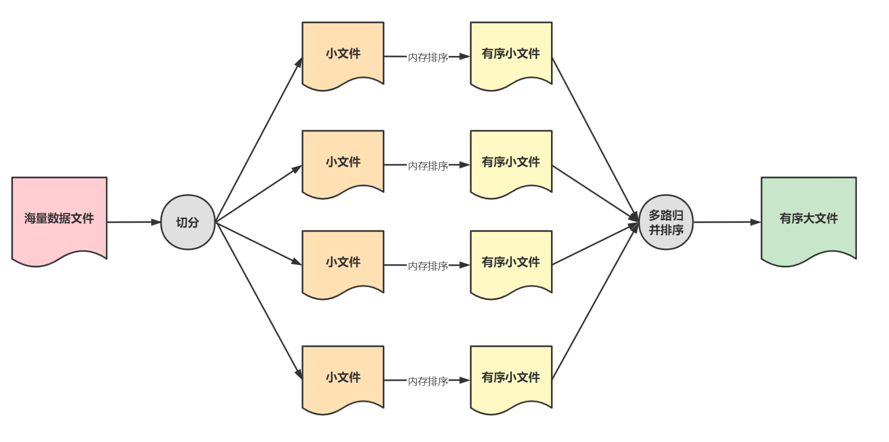

# 10亿数据排序

## 简介

一般提到海量数据排序都默认计算机内存不足以同时放下所有数据。因此海量数据排序需要使用到分治的思想，最常见的就是多路归并排序和位图法。

> 基础排序算法中的归并排序是二路归并的内排序算法，即通过二分法将序列划分为长度相同的两个子序列，当无法继续划分时（子序列中只有一个数据时）就开始对子序列进行有序合并，后续的问题就转化成合并两个有序序列的问题。

## 问题描述

给定一个存有10亿乱序浮点数的文件，需要得到这十10亿数据升序排列的文件。由于计算机内存有限，因此不能将10亿数据加载到内存中进行排序。

## 外部排序

大文件排序时数据无法一次性载入内存，需要在内存和外部存储器之间进行多次数据交换以实现整个文件的排序。外部排序最常用的算法是多路归并排序，即将大文件切分成多份能一次性载入内存的小文件，对每一个小文件进行内存排序，然后再对已排好序的多个小文件进行归并排序。

## 多路归并排序

### 1. 简介

海量数据排序中单机内存无法存储所有数据，因此需要将原始数据集切分多个子数据集分发到不同的机器上进行内存排序（map过程），然后进行多路归并排序将各个有序的子数据集合并成一份有序数据集（reduce过程）。

> 按照数据来源，多路归并排序可以分为：
>
> * 流式多路归并排序：将海量数据切分后分发到多台机器，数据源来自于网络套接字
> * 磁盘多路归并排序：将海量数据拆分成多个磁盘子文件，数据源来自于磁盘

### 2. 思路

将大文件中的n个数据分散到k个小文件中，对每一个小文件进行内存排序，归并时取出每个小文件中最小的记录需要比较$$k-1$$次，取出所有的数据需要比较的次数为$$(n-1)(k-1)$$。

改进：使用小根堆，从k个元素中挑选最小的元素仅需要$$log_2k$$次比较，总的比较次数可以下降为$$(n-1)log_2k$$。

#### 2.1 小文件内部排序

根据计算机内存的限制确定单个小文件的大小，将数据量为n的大文件切分成k个小文件，每个小文件进行内存排序，如此得到k个有序的小文件。

#### 2.2 多路归并排序

* step1：读取每个有序文件中的第一个数（即该文件的最小数）及其文件索引，存放在大小为k的小根堆中
* step2：取出小根堆中的根节点写入缓冲区（缓冲区满自动写入目标文件），同时读取根节点索引对应的小文件下一个数作为新的根节点，调整小根堆
* step3：重复step2，如果某个小文件为空则小根堆长度减一，直到取出所有的小文件中的数

## 位图法

### 1. 原理

假设文件中的数据都是小于1000万的正整数（即数据范围为1~1000万），那我们可以用一个长度为1000万的字符串来表示这个文件，当整数x在文件中存在时就将字符串的第x位设为1。

具体步骤为：

* step1：将字符串所有位置为0
* step2：遍历文件中的正整数，将字符串中对应位设为1
* step3：遍历字符串中的每一个字符，如果该字符为1则输出对应的正整数

### 2. 局限性

位图法对数据要求比较严格，需要满足：

* 数据有明确范围，且范围相对较小（范围太大时需要的字符串长度也会更多，需要的内存也就更多）
* 数据没有重复
* 数据要求是正整数或者能转化成正整数

## Reference

[1] <https://www.jianshu.com/p/dce6a43d4678>

[2] <http://blog.itpub.net/31561269/viewspace-2564096/>
