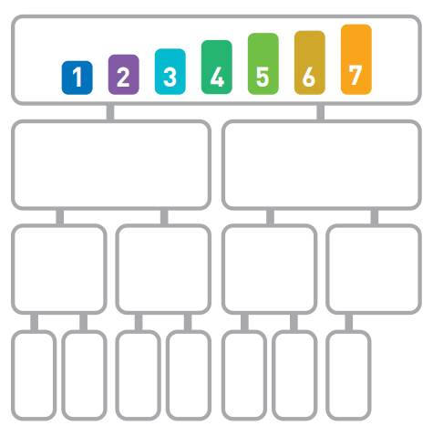
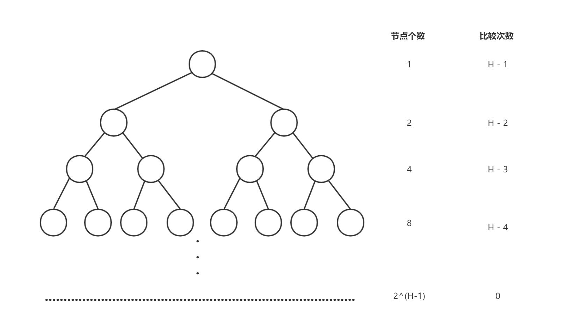
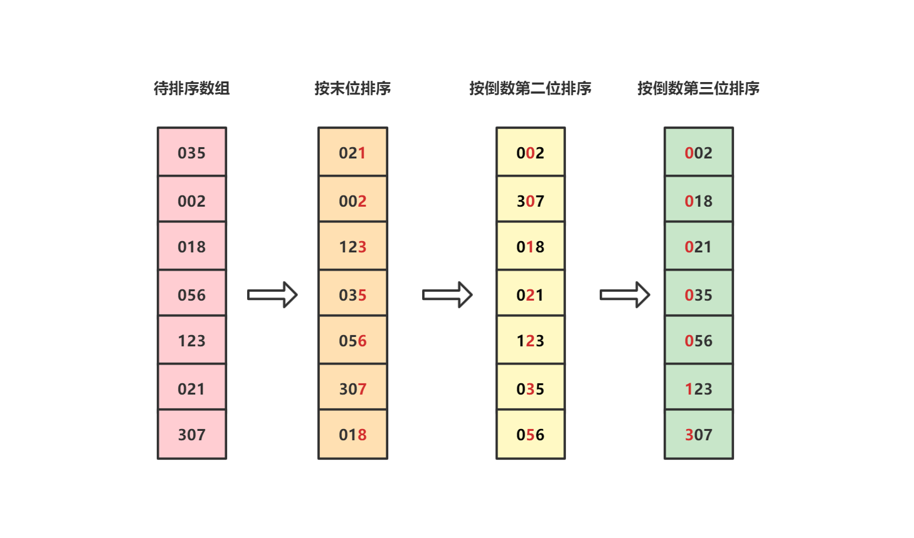

# 0. 排序算法总结

## 基础概念

### 1. 排序

不失一般性，我们假设所有待排序的数据都是乱序整数数组，我们的目的是将其转化成升序（从小到大）数组。

### 2. 稳定/非稳定排序

假设数组存在多个相同的元素，如果经过排序后这些元素的相对次序仍能保持不变，则称这种排序算法是稳定的。

### 3.内部/外部排序

内部排序指的是在原始数组的内存地址上直接排序，仅占用如变量声明等的常数级别内存；外部排序指的是需要占用额外内存存储数组排序结果。

### 4. 复杂度

复杂度包括时间复杂度和空间复杂度，前者指的是运行算法需要的时间，后者指的是运行算法需要的额外内存空间。

## 总结

| 排序算法 | 平均时间复杂度         | 最好情况          | 最坏情况          | 空间复杂度    | 排序方式 | 稳定性 |
| -------- | ---------------------- | ----------------- | ----------------- | ------------- | -------- | ------ |
| 冒泡排序 | $O(n^2)$             | $O(n)$          | $O(n^2)$        | $O(1)$      | 内部排序 | 稳定   |
| 选择排序 | $O(n^2)$             | $O(n^2)$        | $O(n^2)$        | $O(1)$      | 内部排序 | 不稳定 |
| 插入排序 | $O(n^2)$             | $O(n)$          | $O(n^2)$        | $O(1)$      | 内部排序 | 稳定   |
| 希尔排序 | $O(nlog_2n)$         | $O(nlog_2n)$    | $O(n^2)$        | $O(1)$      | 内部排序 | 不稳定 |
| 归并排序 | $O(nlog_2n)$         | $O(nlog_2n)$    | $O(nlog_2n)$    | $O(n)$      | 外部排序 | 稳定   |
| 快速排序 | $O(nlog_2n)$         | $O(nlog_2n)$    | $O(n^2)$        | $O(log_2n)$ | 内部排序 | 不稳定 |
| 堆排序   | $O(nlog_2n)$         | $O(nlog_2n)$    | $O(nlog_2n)$    | $O(1)$      | 内部排序 | 不稳定 |
| 计数排序 | $O(n+k)$             | $O(n+k)$        | $O(n+k)$        | $O(k)$      | 外部排序 | 稳定   |
| 桶排序   | $O(nlog\frac{n}{k})$ | $O(n)$          | $O(n^2)$        | $O(n+k)$    | 外部排序 | 稳定   |
| 基数排序 | $O(n \times k)$      | $O(n \times k)$ | $O(n \times k)$ | $O(n+k)$    | 外部排序 | 稳定   |

注：对于计数排序、桶排序和基数排序而言，k表示桶的数量，是一个常数。

## 联系

### 1. 希尔排序与插入排序

由于插入排序在数据趋于有序时时间复杂度可以降低到$O(n)$，希尔排序通过递减增量的方式让序列逐渐趋近于有序，从而降低每轮插入排序的时间复杂度。

### 2. 选择排序与堆排序

选择排序和堆排序一样都是每一轮从当前数组中选出最小的数字，选出所有的数字后就得到有序数组。只不过堆排序使用了堆的数据结构，复用了前面选择轮次的信息，因此可以降低时间复杂度。

### 3. 比较排序与非比较排序

比较排序指的是元素之间的顺序依赖于元素之间的比较，每个元素必须和所有其他数进行比较后才能确定自己的位置。冒泡排序、选择排序和插入排序中，n个元素都需要和另外n-1个元素比较，因此时间复杂度为$O(n^2)$。归并排序、快速排序和堆排序中，我们利用了之前轮次比较的信息，通过分治法将问题规模削减为$log_2n$，因此它们的时间复杂度为$O(nlog_2n)$。

计数排序、桶排序和基数排序则属于非比较排序，每个元素仅需要确定自己前面包含多少个元素即可（每个元素确定自己所在的桶，每个桶中再进行排序，前面桶中所有的元素都应该排在该元素前面），一次遍历后便可知道每个元素所在的桶，因此时间复杂度为$O(n)$。

## 冒泡排序

### 1. 原理

冒泡排序指的是从数组左侧开始两两比较相邻的数字，如果右侧的数字小于左侧的数字则交换两个数字的位置，如此一轮后**最右侧肯定是最大的数字**。第二轮我们重新从数组右侧开始两两比较元素，此轮结束后倒数第二个数字肯定是第二大的数字。如此循环一直到n-1轮时我们仅需要比较最左侧的两个数字就可以得到排序后的数组。


由于在排序过程中，数字会像泡泡一样慢慢从左边浮到右边，因此被形象地称为“冒泡排序”。

### 2. 时间复杂度

在冒泡排序中第一轮需要比较n-1次，第二轮需要比较n-2次，以此类推第n-1轮需要比较1次。总的比较次数为：
$$
(n-1) + (n-2) + ... + 1 = \frac{n(n-1)}{2}
$$
因此冒泡排序的时间复杂度为$O(n^2)$。

### 2.1 最好情况

假设一开始数组就是升序的，那么我们仅需要比较第一轮（n-1次），也无须交换任何元素。因此最好情况下的时间复杂度为$O(n)$。

> 优化方法：在当前轮次发现数组已经是升序时提前结束算法。

#### 2.2 最坏情况

假设一开始数组就是降序的，那么我们不仅必须比较$\frac{n(n-1)}{2}$次，而且每次都需要交换元素。因此最坏情况下的时间复杂度为$O(n^2)$。

#### 2.3 总结

由上可知，当数组的初始状态越接近于升序时冒泡排序算法的性能越好。

### 3. 空间复杂度

由于冒泡排序算法属于原址排序，只需要常数级别的额外空间，因此空间复杂度为$O(1)$。

### 4. 代码实现

```c++
#include <vector>
#include <algorithm>
#include <random>
#include <iostream>

std::vector<int> test_array = {1, 2, 3, 4, 5, 6, 7, 8, 9, 10, 11, 12, 13, 14, 15, 16, 17, 18, 19, 20, 21, 22, 23, 24, 25};

// 打印vector内容
void printVector(const std::string prefix, const std::vector<int> &vi) {
    std::cout << prefix;
    for (auto i : vi) {
        std::cout << " " << i;
    }
    std::cout << std::endl;
}

// 冒泡排序
void bubbleSort(std::vector<int> &vi) {
    int len = vi.size();

    // 轮次: 从1到n-1轮
    for (int i = 0; i < len - 1; ++i) {
        // 优化: 判断本轮是否有交换元素, 如果没交换则可直接退出
        bool is_exchange = false;

        for (int j = 0; j < len - i - 1; ++j) {
            if (vi[j] > vi[j+1]) {
                std::swap(vi[j], vi[j+1]);
                is_exchange = true;
            }
        }

        // 如果本轮无交换, 则可以直接退出
        if (!is_exchange) {
            return;
        }
    }

    return;
}

int main() {
    // 乱排有序vector
    auto rng = std::default_random_engine {};
    std::shuffle(std::begin(test_array), std::end(test_array), rng);

    // 排序前
    printVector("before:", test_array);

    // 排序
    bubbleSort(test_array);

    // 排序后
    printVector("after:", test_array);

    return 0;
}
```

## 选择排序

### 1. 原理

选择排序步骤如下：

* 第一轮：在未排序数组中找到最小值，和数组最左侧元素交换
* 第二轮：从剩余未排序元素中找到最小值，然后和数组第二个元素交换
* 重复第二轮操作直到第n-1轮结束


由于在算法的每轮操作我们都是选择最小的元素放到已排序数组的末尾，因此被形象地称为“选择排序”。

### 2. 时间复杂度

选择排序在第一轮中需要比较n-1次，在第二轮中需要比较n-2次，...，在第n-1轮时只需要比较一次。总的比较轮次为：
$
(n-1) + (n-2) + ... + 1 = \frac{n(n-1)}{2}
$
因此时间复杂度为$O(n^2)$。

### 3. 空间复杂度

显而易见仅需要常数级别的额外空间，空间复杂度为$O(1)$。

### 4. 稳定性

选择排序是不稳定排序，例如当乱序数组为`[6, 6*, 1, 9]`时，排序后的数组为：`[1, 6*, 6, 9]`。

### 5. 代码实现

```c++
#include <vector>
#include <algorithm>
#include <random>
#include <iostream>

std::vector<int> test_array = {1, 2, 3, 4, 5, 6, 7, 8, 9, 10, 11, 12, 13, 14, 15, 16, 17, 18, 19, 20, 21, 22, 23, 24, 25};

// 打印vector内容
void printVector(const std::string prefix, const std::vector<int> &vi) {
    std::cout << prefix;
    for (auto i : vi) {
        std::cout << " " << i;
    }
    std::cout << std::endl;
}

// 选择排序
void selectSort(std::vector<int> &vi) {
    // 需要进行 n-1 轮
    for (int i = 0; i < vi.size() - 1; ++i) {
        // 找到此轮的最小值下标
        int min_index = i;
        for (int j = i + 1; j < vi.size(); ++j) {
            if (vi[j] < vi[min_index]) {
                min_index = j;
            }
        }

        std::swap(vi[i], vi[min_index]);
    }
}

int main() {
    // 乱排有序vector
    auto rng = std::default_random_engine {};
    std::shuffle(std::begin(test_array), std::end(test_array), rng);

    // 排序前
    printVector("before:", test_array);

    // 排序
    selectSort(test_array);

    // 排序后
    printVector("after:", test_array);

    return 0;
}
```

## 插入排序

### 1. 原理

插入排序步骤如下：

* 初始时将第一个元素当做有序序列，第二个元素到最后一个元素当做是未排序序列
* 从头到尾遍历未排序序列，将每个元素插入到有序序列的适当位置（如果遇到相等的元素则插入到相等元素后面，保证算法稳定性）


### 2. 时间复杂度

在插入排序中，需要遍历未排序数组中每一个元素与其左边的元素比较（当然如果左边的数字更小则无须继续比较）。

最差情况下（未排序数组为降序数组）第一轮不需要操作，第二轮需要比较一次，第三轮需要比较两次，...，第n轮需要比较n-1次。总共需要比较的次数为：
$$
1 + 2 + 3 + ...+ (n-1) = \frac{n(n-1)}{2}
$$

最终的时间复杂度为$O(n^2)$。

最好情况下（未排序数组为升序数组）第一轮不需要操作，后续的每一轮都仅比较一次。最终需要的总次数为n-1次，因此时间复杂度为$O(n)$。

### 3. 空间复杂度

显而易见仅需要常数级别的额外空间，空间复杂度为$O(1)$。

### 4. 代码实现

```c++
#include <vector>
#include <algorithm>
#include <random>
#include <iostream>

std::vector<int> test_array = {1, 2, 3, 4, 5, 6, 7, 8, 9, 10, 11, 12, 13, 14, 15, 16, 17, 18, 19, 20, 21, 22, 23, 24, 25};

// 打印vector内容
void printVector(const std::string prefix, const std::vector<int> &vi) {
    std::cout << prefix;
    for (auto i : vi) {
        std::cout << " " << i;
    }
    std::cout << std::endl;
}

// 插入排序
void insertSort(std::vector<int> &vi) {
    // 第一轮不需要操作, 第二轮比较一次, 第n轮比较 n-1 次
    for (int i = 1; i < vi.size(); ++i) {
        // 存储待插入的值和下标
        int insert_value = vi[i];
        int j = i - 1;

        while (j >= 0 && vi[j] > insert_value) {
            vi[j + 1] = vi[j];  // 如果左侧的已排序元素比目标值大, 那么右移
            j--;
        }

        // 注意这里insert_index 需要+1
        vi[j + 1] = insert_value;
    }
}

int main() {
    // 乱排有序vector
    auto rng = std::default_random_engine {};
    std::shuffle(std::begin(test_array), std::end(test_array), rng);

    // 排序前
    printVector("before:", test_array);

    // 排序
    insertSort(test_array);

    // 排序后
    printVector("after:", test_array);

    return 0;
}
```

## 希尔排序

### 1. 原理

希尔排序也被称为递减增量排序算法，它将整个序列划分为若干个子序列进行插入排序，当整个序列基本有序时插入排序的效率可以趋近于$O(n)$。

### 2. 时间复杂度

 希尔排序中选择增量的合理性会对算法性能产生决定性的影响，具体的时间复杂度计算也比较复杂。通过大量的实验可以证实，当数组长度n较大时，比较和移动的次数约在$n^{1.25}$和$(1.6n)^{1.25}$之间。一般可以认为：

* n较小时：希尔排序对插入排序提升不大，时间复杂度约为$O(n^2)$
* n较大时：平均复杂度约为$O(nlog_2n)$

### 3. 空间复杂度

由于希尔排序算法属于原址排序，只需要常数级别的额外空间，因此空间复杂度为$O(1)$。

### 4. 代码实现

```c++
#include <vector>
#include <algorithm>
#include <random>
#include <iostream>
#include <climits>

std::vector<int> test_array = {1, 2, 3, 4, 5, 6, 7, 8, 9, 10, 11, 12, 13, 14, 15, 16, 17, 18, 19, 20, 21, 22, 23, 24, 25};

// 打印vector内容
void printVector(const std::string prefix, const std::vector<int> &vi) {
    std::cout << prefix;
    for (auto i : vi) {
        std::cout << " " << i;
    }
    std::cout << std::endl;
}

// 希尔排序
void shellSort(std::vector<int> &vi) {
    int len = vi.size();
    if (len <= 1) {
        return;
    }

    // 声明一个参数gap, 一般初始值设置为len/2, 然后缩小方式为gap/2, 直到gap等于1转化为插入排序
    int gap = len / 2;
    while (gap >= 1) {
        // 将数据分成gap组, 然后每组内进行插入排序
        for (int i = gap; i < len; ++i) {
            int insert_value = vi[i];
            int j = i - gap;
            while (j >= 0 && vi[j] > insert_value) {
                vi[j + gap] = vi[j];
                j -= gap;
            }
            vi[j + gap] = insert_value;
        }

        gap /= 2;
    }
}

int main() {
    // 乱排有序vector
    auto rng = std::default_random_engine {};
    std::shuffle(std::begin(test_array), std::end(test_array), rng);

    // 排序前
    printVector("before:", test_array);

    // 排序
    shellSort(test_array);

    // 排序后
    printVector("after:", test_array);

    return 0;
}
```

## 归并排序

### 1. 原理

归并排序算法递归将序列划分为长度相同的两个子序列，当无法继续划分时（子序列中只有一个数据时）就开始对子序列进行有序合并，后续的问题就转化成合并两个有序序列的问题。

归并排序是使用分治法的典型应用，有两种实现方式：

* 自上而下的递归（递归都可以写成迭代）
* 自上而下的迭代


### 2. 时间复杂度

假设我们初始序列如下：


归并排序的划分结果如下：



可以看到无论是哪一行都是n个数据，所以每一行的运行时间为$O(n)$，将长度为n的序列二分直到只有一个数据时可以分成$log_2n$行，因此总的时间复杂度为$O(nlog_2n)$。

### 3. 空间复杂度

归并排序非原址排序，需要的最大额外空间为n，因此空间复杂度是$O(n)$。

### 4. 代码实现

```c++
#include <vector>
#include <algorithm>
#include <random>
#include <iostream>
#include <climits>

std::vector<int> test_array = {1, 2, 3, 4, 5, 6, 7, 8, 9, 10, 11, 12, 13, 14, 15, 16, 17, 18, 19, 20, 21, 22, 23, 24, 25};

// 打印vector内容
void printVector(const std::string prefix, const std::vector<int> &vi) {
    std::cout << prefix;
    for (auto i : vi) {
        std::cout << " " << i;
    }
    std::cout << std::endl;
}

// 合并两个有序数组
void merge(std::vector<int> &vi, int start, int mid, int end) {
    // 注意vi[start:mid] 和 vi[mid+1, end]已经是有序的了
    // 将其拷贝出来到额外的空间
    std::vector<int> leftSubArray(vi.begin() + start, vi.begin() + mid + 1);
    std::vector<int> rightSubArray(vi.begin() + mid + 1, vi.begin() + end + 1);

    // 双指针法对vi[start, end]区域进行排序
    int leftIndex = 0;
    int rightIndex = 0;

    leftSubArray.insert(leftSubArray.end(), INT_MAX);
    rightSubArray.insert(rightSubArray.end(), INT_MAX);

    for (int i = start; i <= end; ++i) {
        if (leftSubArray[leftIndex] < rightSubArray[rightIndex]) {
            vi[i] = leftSubArray[leftIndex];
            leftIndex++;
        } else {
            vi[i] = rightSubArray[rightIndex];
            rightIndex++;
        }
    }
}

// 归并排序
void mergeSort(std::vector<int> &vi, int start, int end) {
    // 仅剩下一个数据时递归结束
    if (start >= end) {
        return;
    }

    int mid = (start + end) / 2;
    mergeSort(vi, start, mid);
    mergeSort(vi, mid + 1, end);
    merge(vi, start, mid, end);
}

int main() {
    // 乱排有序vector
    auto rng = std::default_random_engine {};
    std::shuffle(std::begin(test_array), std::end(test_array), rng);

    // 排序前
    printVector("before:", test_array);

    // 排序
    mergeSort(test_array, 0, test_array.size() - 1);

    // 排序后
    printVector("after:", test_array);

    return 0;
}
```

## 快速排序

### 1. 原理

快速排序算法使用分治法将一个序列划分为两个子序列，它会在序列中随机选择一个基准值，然后按照元素的大小将除了基准值之外的数分为“小于基准值的数”和“大于基准值的数”：

```
[小于基准值的序列]基准值[大于基准值的序列]
```

对于两个子序列的排序依然应用快速排序，直到序列有序。


### 2. 时间复杂度

快速排序中如果每次选择的基准值都能使两个子序列的长度为原来的一半，那么运行时间和归并排序一样都为$O(nlog_2n)$。在最坏的情况下每次都选择最小值作为基准值，那么运行时间就会和选择排序一样达到$O(n^2)$。

当数据中每个数字被选为基准值的概率都相等时，快速排序需要的平均运行时间为$O(nlog_2n)$，且常数因子小于时间复杂度稳定等于$O(nlog_2n)$的归并排序。因此对于大多数顺序性较弱的随机数列，快速排序总是优于归并排序。

### 3. 空间复杂度

原址排序，但是需要$log_2n$层递归，因此空间复杂度是$O(log_2n)$。

### 4. 代码实现

```c++
#include <vector>
#include <algorithm>
#include <random>
#include <iostream>
#include <climits>

std::vector<int> test_array = {1, 2, 3, 4, 5, 6, 7, 8, 9, 10, 11, 12, 13, 14, 15, 16, 17, 18, 19, 20, 21, 22, 23, 24, 25};

// 打印vector内容
void printVector(const std::string prefix, const std::vector<int> &vi) {
    std::cout << prefix;
    for (auto i : vi) {
        std::cout << " " << i;
    }
    std::cout << std::endl;
}

// 快速排序
void quickSort(std::vector<int> &vi, int start, int end) {
    if (start >= end) {
        return;
    }

    // 以最后一个数作为基准值
    int base = vi[end];

    int left = start;
    int right = end - 1;
    while (left < right) {
        // 从左到右找到第一个 >= base 的下标
        while (left < right && vi[left] < base) {
            left++;
        }

        // 从右到左找到第一个 < base的下标
        while (left < right && vi[right] >= base) {
            right--;
        }

        std::swap(vi[left], vi[right]);
    }

    // 执行到此步时, 满足:
    // 1) left = right
    // 2) [start, left - 1]都小于 base
    // 3) [left + 1, end]都大于等于 base

    // 将基准值base放到中间, 再递归处理左右两个子序列
    if (vi[left] >= vi[end]) {
        std::swap(vi[left], vi[end]);
    } else {
        left++;
    }
    if (start < left - 1) {
        quickSort(vi, start, left - 1);
    }
    if (left + 1 < end) {
        quickSort(vi, left + 1, end);
    }

    return;
}

int main() {
    // 乱排有序vector
    auto rng = std::default_random_engine {};
    std::shuffle(std::begin(test_array), std::end(test_array), rng);

    // 排序前
    printVector("before:", test_array);

    // 排序
    quickSort(test_array, 0, test_array.size() - 1);

    // 排序后
    printVector("after:", test_array);

    return 0;
}
```

## 堆排序

### 1. 原理

堆排序利用了数据结构中的堆进行排序。步骤如下：

* 将无序数组组织成一个大根堆
* 取出堆首元素（数组最大值）放在数组末尾，然后重建前面n-1个元素的大根堆
* 重复第二步，直到大根堆中所有元素都被取出

### 2. 时间复杂度

堆排序包括初始化建堆和堆排序。

#### 2.1 初始化建堆复杂度

假设数组包含N个元素，完全二叉树的高度H。前面我们提到初始化建堆时是从最后一个非叶子结点从右到左，从下到上将完全二叉树调整为大根堆的。那么每一层的节点个数和比较次数如下（注意我们是从最后一个非叶子结点开始比较的，所以最后一层比较次数为0）：



由此可知，初始化建堆时总的比较次数为：
$$
s = 1 \times (H - 1) + 2 \times (H-2) + ... + 2^{H-2} \times 1 + 2^{H-1} * 0
$$
根据等比数列求和，我们将等号左右两侧乘上2，得到：
$$
2s = 2^1 \times (H - 1) + 2^2 \times (H-2) + ... + 2^{H-1} \times 1 + 2^{H} * 0
$$
后者减去前者得到：
$$
\begin{aligned}
s &\quad = -(H-1) + 2^1 + 2^2 + ... + 2^{H-1}   \\
  &\quad = -H + 2^0 + 2^1 + 2^2 + ... + 2^{H-1} \\
  &\quad = 2^H -H -1
\end{aligned}
$$

对于完全二叉树而言结点个数N等于$2^H - 1$，因此在完全二叉树场景下H等于$log_2{N+1}$（对于一般情形而言H等于$log_{2}N + 1$向下取整），代入H后得：
$
s = N - log_{2}(N+1)
$
因此初始化建堆的时间复杂度近似为$O(N)$。

#### 2.2 堆排序时间复杂度

堆排序时我们每次将堆首和堆尾元素互换，然后重建堆。每一轮操作都意味着堆中会减少一个结点，重建时对应的时间复杂度（取决于堆的层数$log_2{N}$）也会下降。

对于N个结点的堆而言，二叉树高度H为$log_{2}N + 1$后向下取整，我们总共需要N-1次重建堆的操作。为了考虑取整带来的影响，我们倒推重建堆过程中的比较次数：

* 第N-1次重建堆时堆中仅剩下一个结点，高度为1，因此不需要额外的比较操作
* 第N-2和N-3次重建堆时，堆中包含2个结点，高度为2，因此需要1次额外的比较操作
* 第N-4~N-7次重建堆时，堆中包含4个结点，高度为3，因此需要2次额外的比较操作
* ...
* 第1次重建堆时，堆中包含N-1个结点，高度为H，因此需要H-1次额外的比较操作

由此可得，N-1次重建堆总的比较次数s满足：
$$
\begin{aligned}
s &\quad \lt 0 \times 2^0 + 1 \times 2^1 + 2 \times 2^2 +... + (H - 1) \times 2^{H-1} \\
  &\quad = (H-2) 2^H + 2\\
\end{aligned}
$$
另外s满足：
$$
\begin{aligned}
s &\quad \gt 0 \times 2^0 + 1 \times 2^1 + 2 \times 2^2 +... + (H - 2) \times 2^{H-2} \\
  &\quad = (H-3) 2^{H-1} + 2\\
\end{aligned}
$$
代入H可以得到时间复杂度为$O(Nlog_{2}N)$。

### 3. 空间复杂度

显而易见仅需要常数级别的额外空间，空间复杂度为$O(1)$。

### 4. 代码实现

```c++
#include <vector>
#include <algorithm>
#include <random>
#include <iostream>

std::vector<int> test_array = {1, 2, 3, 4, 5, 6, 7, 8, 9, 10, 11, 12, 13, 14, 15, 16, 17, 18, 19, 20, 21, 22, 23, 24, 25};

// 打印vector内容
void printVector(const std::string prefix, const std::vector<int> &vi) {
    std::cout << prefix;
    for (auto i : vi) {
        std::cout << " " << i;
    }
    std::cout << std::endl;
}

// 递归方式调整完全二叉树的根节点, 使其符合大根堆特性
// start和end描述了堆点在数组vi中的下标
void maxHeapify(std::vector<int> &vi, int start, int end) {
    // 求出左右子结点下标
    int left = 2 * start + 1;
    int right = left + 1;

    // 求出{vi[start], vi[left], vi[right]}三者中的最大值下标
    int maxIndex = start;
    if (left <= end && vi[left] > vi[maxIndex]) {
        maxIndex = left;
    }
    if (right <= end && vi[right] > vi[maxIndex]) {
        maxIndex = right;
    }

    // 如果根结点不是最大的, 交换父子结点后则继续递归调整下一层
    if (maxIndex != start) {
        std::swap(vi[maxIndex], vi[start]);
        maxHeapify(vi, maxIndex, end);
    }
}

// 堆排序
void heapSort(std::vector<int> &vi) {
    // 初始化建堆: 从最后一个叶子结点开始, 从右到左从下到上调整二叉树成大根堆
    for (int i = vi.size() / 2 - 1; i >= 0; --i) {
        maxHeapify(vi, i, vi.size() - 1);
    }

    // 堆排序: 交换首尾元素后调整根节点使其符合大根堆特性
    for (int i = vi.size() - 1; i >= 1; --i) {
        std::swap(vi[0], vi[i]);
        maxHeapify(vi, 0, i - 1);
    }
}

int main() {
    // 乱排有序vector
    auto rng = std::default_random_engine {};
    std::shuffle(std::begin(test_array), std::end(test_array), rng);

    // 排序前
    printVector("before:", test_array);

    // 排序
    heapSort(test_array);

    // 排序后
    printVector("after:", test_array);

    return 0;
}
```

## 计数排序

### 1. 原理

假设输入的数组长度为n，计数排序的步骤如下：

* 找到数组中最大值和最小值
* 统计数组中每个值出现的次数，存入数组中
* 填充目标数组


### 2. 时间复杂度

当输入的数组长度为n时，且元素范围跨度为k时（max-min+1），那么运行时间复杂度为$O(n+k)$。

### 3. 空间复杂度

需要一个额外数组存储每个元素出现的次数，因此空间复杂度为$O(k)$。

### 4. 代码实现

```c++
#include <vector>
#include <algorithm>
#include <random>
#include <iostream>

std::vector<int> test_array = {1, 2, 3, 4, 5, 6, 7, 8, 9, 10, 11, 12, 13, 14, 15, 16, 17, 18, 19, 20, 21, 22, 23, 24, 25};

// 打印vector内容
void printVector(const std::string prefix, const std::vector<int> &vi) {
    std::cout << prefix;
    for (auto i : vi) {
        std::cout << " " << i;
    }
    std::cout << std::endl;
}

// 计数排序
void countSort(std::vector<int> &vi) {
    if (vi.size() <= 1) {
        return;
    }

    // 找到最大值和最小值
    int min = vi[0];
    int max = vi[0];
    for (int i : vi) {
        max = std::max(i, max);
        min = std::min(i, min);
    }

    if (max == min) {
        return;
    }

    // 构造一个数组存储每个数字以及其对应次数, 下标0的value表示min出现的次数
    const int sz = max - min + 1;  // 数组长度
    std::vector<int> num2cnt(sz, 0);
    for (auto i : vi) {
        num2cnt[i-min] += 1;
    }

    // 修改传入的数组
    int index = 0;
    for (int i = 0; i < num2cnt.size(); ++i) {
        int cnt = num2cnt[i];
        while (cnt) {
            vi[index] = i + min;
            index++;
            cnt--;
        }
    }
}


int main() {
    // 乱排有序vector
    auto rng = std::default_random_engine {};
    std::shuffle(std::begin(test_array), std::end(test_array), rng);

    // 排序前
    printVector("before:", test_array);

    // 排序
    countSort(test_array);

    // 排序后
    printVector("after:", test_array);

    return 0;
}
```

## 桶排序

### 1. 原理

对于计数排序而言，即使待排序数组长度较短，当整数的范围跨度较大时就会使得算法时空间复杂度急剧扩张。桶排序正是计数排序的优化版本。它使用映射函数将N个数据均匀地分配到K个**有序**桶中，然后在每个桶中排完序后再组合起来。

对于待排序序列`[8, 22, 38, 5, 17, 24, 23, 36]`而言，首先将它们放置到桶中：


将每个桶中的元素排好序：


最后再按顺序将桶组合起来即可得到有序数组：`[5, 8, 17, 22, 23, 24, 36, 38]`。

### 2. 注意事项

* 在空间充足的情况下，尽可能增大桶的数量
* 使用的映射函数可以将输入的N个数据均匀分配到K个桶中
* 桶中的排序算法会影响整体性能
* 桶与桶之间需要有大小顺序
* 输入的数据可以均匀地分配到每个桶中时性能最佳，输入的数据被分配同一个桶中时性能最差

### 3. 时间复杂度

假设需要排序的数据有N个，我们将它们**均匀**分到K个桶中，如此每个桶中的数据就是M=N/K。我们在每个桶内使用其他排序算法（比如快排），那么每个桶内排序的时间复杂度就是$O(MlogM)$，总的时间复杂度为：
$$
K \times O(MlogM) = K  \times O(\frac{N}{K}log(\frac{N}{K})) = O(Nlog(\frac{N}{K}))
$$
由此可见，当桶的数量K足够大时，$log(\frac{N}{K})$就是一个较小的常数，因此时间复杂度趋近于$O(N)$。

> 总结：当桶数量K足够大且桶内的数据足够均匀的假设成立时，桶排序的时间复杂度趋近于$O(N)$。

### 4. 空间复杂度

需要创建K个桶存储总共N个数据，因此空间复杂度是$O(N)$。

### 5. 代码实现

#### 5.1 无序桶 + 归并排序

> 之所以要提到这个“伪桶排序”，是因为一方面它确实用hash桶实现了排序，另一方面网上有不少桶排序的代码都是如此实现的。
>
> 优化方向：这里桶与桶之间并没有顺序关系，类似于hash到不同的桶中然后归并排序。一种做法是找到数组最大值和最小值，然后根据设定的桶数将数据丢到不同的桶中，最后按照顺序合并桶。

这种情况下我们使用链表来实现“桶排序”（每个链表表示一个桶），虽然也是将N个数据分到K个桶中进行排序，但是：

* 桶与桶之间是无序的，数据相当于被hash到不同的桶中
* 往桶中插入数据时会遍历链表找到合适的位置插入，插入完后桶内自然是有序的
* 最终合并桶时使用的是归并排序

```c++
#include <vector>
#include <algorithm>
#include <random>
#include <iostream>

std::vector<int> test_array = {1, 2, 3, 4, 5, 6, 7, 8, 9, 10, 11, 12, 13, 14, 15, 16, 17, 18, 19, 20, 21, 22, 23, 24, 25};

// 打印vector内容
void printVector(const std::string prefix, const std::vector<int> &vi) {
    std::cout << prefix;
    for (auto i : vi) {
        std::cout << " " << i;
    }
    std::cout << std::endl;
}

// 桶数量
const int BUCKET_NUM = 10;

// 链表结构体: 表示一个桶
struct ListNode {
    explicit ListNode(int i = 0) : value_(i), next_(nullptr) {}
    int value_;
    ListNode *next_;
};

// 往链表(桶)中插入结点, 插入时已经排好序了
ListNode* insert(ListNode* head, int val) {
    ListNode dummyNode;
    ListNode *newNode = new ListNode(val);
    ListNode *pre, *curr;

    dummyNode.next_ = head;
    pre = &dummyNode;
    curr = head;
    while (curr != nullptr && curr->value_ <= val) {
        pre = curr;
        curr = curr->next_;
    }

    newNode->next_ = curr;
    pre->next_ = newNode;
    return dummyNode.next_;
}

// 合并两个有序链表
ListNode* merge(ListNode *l1, ListNode *l2) {
    ListNode dummyNode;
    ListNode *dummy = &dummyNode;
    while (l1 && l2) {
        if (l1->value_ <= l2->value_) {
            dummy->next_ = l1;
            l1 = l1->next_;
        } else {
            dummy->next_ = l2;
            l2 = l2->next_;
        }
        dummy = dummy->next_;
    }

    // 要么l1为空, 要么l2为空
    if (l1) {
        dummy->next_ = l1;
    }
    if (l2) {
        dummy->next_ = l2;
    }

    return dummyNode.next_;
}

// 桶排序
void bucketSort(std::vector<int> &vi) {
    int len = vi.size();

    std::vector<ListNode*> buckets(BUCKET_NUM, reinterpret_cast<ListNode*>(0));
    for (int i = 0; i < len; ++i) {
        int index = vi[i] / BUCKET_NUM;  // 进哪个桶
        ListNode *head = buckets[index];
        buckets[index] = insert(head, vi[i]);
    }

    // 合并所有的桶
    ListNode *head = buckets[0];
    for (int i = 1; i < BUCKET_NUM; ++i) {
        head = merge(head, buckets[i]);
    }

    // 填充原始数组
    for (int i = 0; i < len; ++i) {
        vi[i] = head->value_;
        head = head->next_;
    }
}


int main() {
    // 乱排有序vector
    auto rng = std::default_random_engine {};
    std::shuffle(std::begin(test_array), std::end(test_array), rng);

    // 排序前
    printVector("before:", test_array);

    // 排序
    bucketSort(test_array);

    // 排序后
    printVector("after:", test_array);

    return 0;
}
```

#### 5.2 有序桶 + 快速排序

实现思路：

* 求出数组的最大值max和最小值min
* 将每个元素按照大小分到不同的桶中（桶的数量可配置）
* 桶内使用系统自带排序（快速排序）
* 按照桶的顺序输出

```c++
#include <vector>
#include <algorithm>
#include <random>
#include <iostream>

std::vector<int> test_array = {1, 2, 3, 4, 5, 6, 7, 8, 9, 10, 11, 12, 13, 14, 15, 16, 17, 18, 19, 20, 21, 22, 23, 24, 25};

// 打印vector内容
void printVector(const std::string prefix, const std::vector<int> &vi) {
    std::cout << prefix;
    for (auto i : vi) {
        std::cout << " " << i;
    }
    std::cout << std::endl;
}

// 桶数量
const int BUCKET_NUM = 10;

// 桶排序
void bucketSort(std::vector<int> &vi) {
    int len = vi.size();
    if (len <= 1) {
        return;
    }

    // 获取最大值和最小值, 构造合适的桶
    int max = vi[0];
    int min = vi[0];
    for (auto i : vi) {
        max = std::max(i, max);
        min = std::min(i, min);
    }

    // 桶数量不应该超过数组长度, 等于数组长度时变成计数排序
    int bucket_num = std::min(BUCKET_NUM, len);
    // 每个桶中应该放的数据跨度
    int num_per_bucket = std::ceil((max - min) * 1.0 / bucket_num);

    // 创建BUCKET_NUM个桶, 桶与桶之间有序
    std::vector<std::vector<int>> buckets(bucket_num);

    // 将数据放到桶中
    for (int i = 0; i < len; ++i) {
        // 计算数据该放在哪个桶中
        int bucket_index = (vi[i] - min) / num_per_bucket;
        std::cout << "value: " << vi[i] << ", bucket_index: " << bucket_index << std::endl;
        buckets[bucket_index].push_back(vi[i]);
    }

    // 对每个桶调用系统排序并且输出
    int insert_index = 0;
    for (int i = 0; i < buckets.size(); ++i) {
        auto bucket = buckets[i];
        std::sort(bucket.begin(), bucket.end());
        for (int j = 0; j < bucket.size(); ++j) {
            vi[insert_index] = bucket[j];
            insert_index++;
        }
    }
}


int main() {
    // 乱排有序vector
    auto rng = std::default_random_engine {};
    std::shuffle(std::begin(test_array), std::end(test_array), rng);

    // 排序前
    printVector("before:", test_array);

    // 排序
    bucketSort(test_array);

    // 排序后
    printVector("after:", test_array);

    return 0;
}
```

## 基数排序

### 1. 原理

基数排序是桶排序的扩展，它将数组中所有整数视作统一长度的数字（位数较小的数字前面补零），然后从低位到高位依次排序。

举个例子，假设待排序数组是：`[35, 2, 18, 56, 123, 21, 307]`，那么基数排序的过程如下：



### 2. 时间复杂度

尽管基数排序有多种实现方式，但其本质都是按照位数进行排序然后再组合起来。

假设数组中最大值的位数为k，那么在k次排序中需要如下两步：

* 将数组元素分配到桶中：遍历数组即可，时间复杂度为$O(n)$
* 将桶中元素收集起来：遍历每个桶即可，时间复杂度为$O(n)$

因此总的时间复杂度为$O(k \times n)$，其中k是常数

### 3. 空间复杂度

该算法在按照每个位数排序时需要使用10个桶，所有桶中元素加起来数量等于数组数量n，因此空间复杂度为$O(n)$。

### 4. 代码实现

```c++
#include <vector>
#include <algorithm>
#include <random>
#include <iostream>

std::vector<int> test_array = {1, 2, 3, 4, 5, 6, 7, 8, 9, 10, 11, 12, 13, 14, 15, 16, 17, 18, 19, 20, 21, 22, 23, 24, 25};

// 打印vector内容
void printVector(const std::string prefix, const std::vector<int> &vi) {
    std::cout << prefix;
    for (auto i : vi) {
        std::cout << " " << i;
    }
    std::cout << std::endl;
}

// 对数组按照位数排序: 例如exp = 1表示按个位排序, exp = 10表示按十位排序
void countSort(std::vector<int> &vi, int exp) {
    // 存储排序结果
    std::vector<int> temp;
    // 十个桶, 每个桶中存储位数上的值的索引, 例如bucket[0]表示exp位数为0的数字在vi中的索引
    std::vector<std::vector<int>> buckets(10);

    for (int i = 0; i < vi.size(); ++i) {
        // 计算exp位数上的值
        int bucket_index = (vi[i]/exp) % 10;
        buckets[bucket_index].push_back(i);
    }

    // 将桶中的数据迁移到临时数组
    for (int i = 0; i < buckets.size(); ++i) {
        for (int j = 0; j < buckets[i].size(); ++j) {
            int value_index = buckets[i][j];
            temp.push_back(vi[value_index]);
        }
    }

    printVector("temp: ", temp);
    // 更新数组
    vi = temp;
}


// 基数排序
void radixSort(std::vector<int> &vi) {
    if (vi.size() <= 1) { return; }

    // 获取数组最大值
    int max = vi[0];
    for (auto i : vi) {
        max = std::max(i, max);
    }

    // 依次按照个位、十位、百位...进行排序
    for (int exp = 1; max / exp > 0; exp *= 10) {
        countSort(vi, exp);
    }
}


int main() {
    // 乱排有序vector
    auto rng = std::default_random_engine {};
    std::shuffle(std::begin(test_array), std::end(test_array), rng);

    // 排序前
    printVector("before:", test_array);

    // 排序
    radixSort(test_array);

    // 排序后
    printVector("after:", test_array);

    return 0;
}
```
