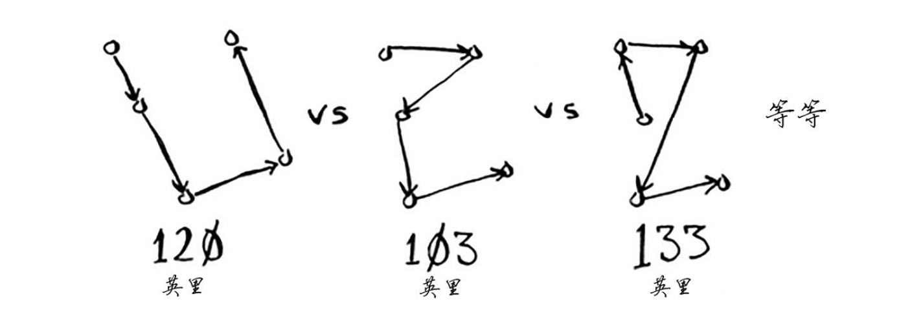

# 旅行商问题

## 问题描述

有一个旅行商需要前往 5 个城市，同时需要确保旅程最短。为此可以考虑前往这些城市的各种可能顺序。

所有的可能性即数组里的排列组合，共计 $$n!$$ 种可能。

 这意味着 5 个城市有120 种不同的排列方式。因此，在涉及5 个城市时，解决这个问题需要执行120 次操作。涉及6 个城市时，需要执行 720 次操作（有 720 种不同的排列方式）。涉及 7 个城市时，需要执行 5040 次操作！

## 总结

涉及 n 个城市时，需要执行 $n!$ （n 的阶乘）次操作才能计算出结果。因此运行时间为 $O(n!)$ ，即阶乘时间。除非涉及的城市数很少，否则需要执行非常多的操作。如果涉及的城市数超过 100 ，根本就不能在合理的时间内计算出结果。
