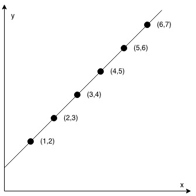
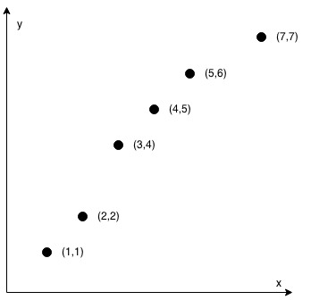

# 1232. 缀点成线

## 题目

难度: 简单

给定一个数组 coordinates ，其中 coordinates[i] = [x, y] ， [x, y] 表示横坐标为 x、纵坐标为 y 的点。请你来判断，这些点是否在该坐标系中属于同一条直线上。

**示例 1：**



```
输入：coordinates = [[1,2],[2,3],[3,4],[4,5],[5,6],[6,7]]
输出：true

```

**示例 2：**



```
输入：coordinates = [[1,1],[2,2],[3,4],[4,5],[5,6],[7,7]]
输出：false

```

> 来源: 力扣（LeetCode）  
> 链接: <https://leetcode.cn/problems/check-if-it-is-a-straight-line/>  
> 著作权归领扣网络所有。商业转载请联系官方授权，非商业转载请注明出处。

## 思路

首先将第一个点偏移到原点上，然后将所有的点做相同的偏移。

要证明[0, 0]、[x1, x2]和[y1, y2]共线：

$$ \frac{y_1}{x_1} = \frac{y_2}{x_2}$$

为了防止除零问题，转化为：

$$x_1 \times y_2 = x_2 \times y_1$$

## 答案

```c++
class Solution {
public:
    bool checkStraightLine(vector<vector<int>> &coordinates) {
        int deltaX = coordinates[0][0], deltaY = coordinates[0][1];
        int n = coordinates.size();
        for (int i = 0; i < n; ++i) {
            coordinates[i][0] -= deltaX;
            coordinates[i][1] -= deltaY;
        }
        int A = coordinates[1][1], B = -coordinates[1][0];
        for (int i = 2; i < n; ++i) {
            int x = coordinates[i][0], y = coordinates[i][1];
            if (A * x + B * y != 0) {
                return false;
            }
        }
        return true;
    }
};
```
