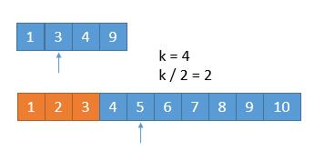
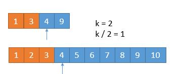
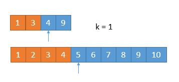
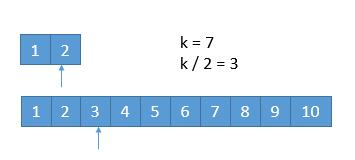
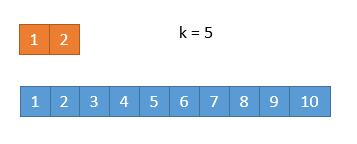

# 第 K 小数

## 原理

举个例子，有A和B两个数组，我们取每个数组的前 `k/2` 个数，即：

```
A[1], A[2], ..., A[k/2], ...
B[1], B[2], ..., B[k/2], ...
```

如果 `A[k/2] < B[k/2]`，那么 `A[1]~A[k/2]` 这 `k/2` 个数都肯定比第 `k` 小数要小，所以我们可以排除掉。

> 原理：A数组中比 `A[k/2]` 小的数有 `k/2-1` 个，假设极端情况下 `B[1]~B[k/2 - 1]` 都比 `A[k/2]`小，那么比 `A[k/2]` 小的数最多有 `(k/2-1) + (k/2) = k - 1` 个，因此 `A[k/2]` 最大也只能是第 `k-1` 小数。`A[1]~A[k/2]` 都不可能是`k`小数，所以我们一次性排除掉。

## 代码样例

* 注意递归退出条件
* 注意考虑到某个数组长度小于 `k/2` 的情况

```c++
#include <thread>
#include <iostream>
#include <atomic>
#include <vector>

using std::vector;

// 两个正序数组的第k小数查找算法
// nums1: 第一个有序数组
// nums2: 第二个有序数组
// start1, end1: 第一个有序数组的下标范围, 分别初始化为0和len1-1
// start2, end2: 第二个有序数组的下标范围, 分别初始化为0和len2-1
int getKth(vector<int>& nums1, int start1, int end1, vector<int>& nums2, int start2, int end2, int k) {
    int len1 = end1 - start1 + 1;
    int len2 = end2 - start2 + 1;

    // 保证len1 <= len2, 这样保证如果有数组空了肯定是第一个数组
    if (len1 > len2) {
        return getKth(nums2, start2, end2, nums1, start1, end1, k);
    }

    // 递归结束: 第一个数组为空则返回第二个数组第k个数
    if (len1 == 0) {
        return nums2[start2 + k - 1];
    }

    // 递归结束: 若k为1时直接返回两个数组第一个数中较小的即可
    if (k == 1) {
        return std::min(nums1[start1], nums2[start2]);
    }

    // 比较两个有序数组第k/2个数的大小(k不考虑奇偶数)
    // 需要考虑到数组长度比k/2还小的情况
    int i = start1 + std::min(k/2 - 1, len1 - 1);
    int j = start2 + std::min(k/2 - 1, len2 - 1);

    // 注意数组长度可能小于k/2带来的问题
    if (nums1[i] < nums2[j]) {
        return getKth(nums1, i + 1, end1, nums2, start2, end2, k - std::min(k / 2, len1));
    } else {
        return getKth(nums1, start1, end1, nums2, j + 1, end2, k - std::min(k / 2, len2));
    }
}


class Solution {
public:
    double findMedianSortedArrays(vector<int>& nums1, vector<int>& nums2) {
        int n = nums1.size();
        int m = nums2.size();

        int len = n + m;
        // 计算中位数对应的k:
        // 1) len为奇数时k等于len+1/2
        // 2) len为偶数时k等于len/2 和 len/2 + 1
        if (len % 2 == 1) {
            return getKth(nums1, 0, n - 1, nums2, 0, m - 1, len/2 + 1);
        } else {
            return (getKth(nums1, 0, n - 1, nums2, 0, m - 1, len/2) + getKth(nums1, 0, n - 1, nums2, 0, m - 1, len/2 + 1)) * 0.5;
        }
    }
};

int main() {
    vector<int> nums1 = {1, 2, 3};
    vector<int> nums2 = {4, 5, 6, 7};
    Solution s;
    std::cout << s.findMedianSortedArrays(nums1, nums2) << std::endl;
}
```

## 复杂度

* 时间复杂度：每一次循环我们都减少 `k/2` 个元素, 因此时间复杂度是 $O(log(k))$，由于 `k=(m+n)/2`，因此时间复杂度是 $O(log(m+n))$

* 空间复杂度：虽然我们使用了递归，但是这个递归属于尾递归，所以编译器不需要不停地堆栈，所以空间复杂度为 $O(1)$

## 例子

假设我们要找第 7 小的数字。

我们先比较两个数组的前 `k / 2` 个数（奇数向下取整即3），发现第二个数组第3位数小于第一个数组第3位数，因此我们把第二个数组的前三个数排除掉（用橙色表示去掉的数字）。此时 `k = 7-3 = 4`，继续比较两个数组的前 `k/2` 个数（即2）。



同理，我们把第一个数组的前 2 个数排除掉，此时 $k$ 更新成 2，第一个数组和第二个数组的第 `k/2` 个数都是 4，此时我们去掉第二个数组的第 `k/2` 个数。



当 `k=1`时，我们仅需要判断两个数组中第一位数哪个比较小即可，可以看到第一个数组头一位数是4，第二个数组头一位数是5，因此最终的第 7 小数就是 4。



## 特殊情况

我们每次都是取 `k/2` 的数进行比较，有时候可能会遇到数组长度小于 `k/2` 的时候。



此时 `k / 2` 等于 3，而上边的数组长度是 2，我们此时将箭头指向它的末尾就可以了。由于 2<3，因此我们直接将第一个数组都排除掉。



由于排除了 2 个元素，因此 `k` 更新为 5，我们只需要返回下面数组的第 5 个元素即可。

## 注意事项

由于我们采用递归做法，为了防止数组长度小于 `k/2`，我们每次比较 `min(k/2, len(数组))` 对应的数字。递归出口就是当 `k=1` 或者其中一个数组的长度为0。

## 真题

* LeetCode4：寻找两个正序数组的中位数

## Reference

[1] <https://leetcode-cn.com/problems/median-of-two-sorted-arrays/solution/xiang-xi-tong-su-de-si-lu-fen-xi-duo-jie-fa-by-w-2/>
