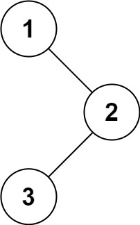

# 94. 二叉树的中序遍历

## 题目

难度: 简单

给定一个二叉树的根节点 root ，返回 它的 **中序** 遍历。

**示例 1：**



```
输入：root = [1,null,2,3]
输出：[1,3,2]

```

**示例 2：**

```
输入：root = []
输出：[]

```

**示例 3：**

```
输入：root = [1]
输出：[1]

```

**进阶:** 递归算法很简单，你可以通过迭代算法完成吗？

> 来源: 力扣（LeetCode）  
> 链接: <https://leetcode.cn/problems/binary-tree-inorder-traversal/>  
> 著作权归领扣网络所有。商业转载请联系官方授权，非商业转载请注明出处。

## 答案

### 1. 递归

```c++
/**
 * Definition for a binary tree node.
 * struct TreeNode {
 *     int val;
 *     TreeNode *left;
 *     TreeNode *right;
 *     TreeNode() : val(0), left(nullptr), right(nullptr) {}
 *     TreeNode(int x) : val(x), left(nullptr), right(nullptr) {}
 *     TreeNode(int x, TreeNode *left, TreeNode *right) : val(x), left(left), right(right) {}
 * };
 */
class Solution {
public:

    vector<int> res;

    void dfs(TreeNode* root) {
        if (root == nullptr) {
            return;
        }
        dfs(root->left);
        res.push_back(root->val);
        dfs(root->right);
    }

    vector<int> inorderTraversal(TreeNode* root) {
        dfs(root);
        return res;
    }
};
```

### 2. 迭代

```c++
/**
 * Definition for a binary tree node.
 * struct TreeNode {
 *     int val;
 *     TreeNode *left;
 *     TreeNode *right;
 *     TreeNode() : val(0), left(nullptr), right(nullptr) {}
 *     TreeNode(int x) : val(x), left(nullptr), right(nullptr) {}
 *     TreeNode(int x, TreeNode *left, TreeNode *right) : val(x), left(left), right(right) {}
 * };
 */
class Solution {
public:
    vector<int> inorderTraversal(TreeNode* root) {
        std::stack<TreeNode*> s;
        std::vector<int> res;

        // 先把所有的左节点推入栈
        while (root || !s.empty()) {
            while (root) {
                s.push(root);
                root = root->left;
            }
            root = s.top();
            s.pop();
            res.push_back(root->val);
            root = root->right;
        }

        return res;
    }
};
```
