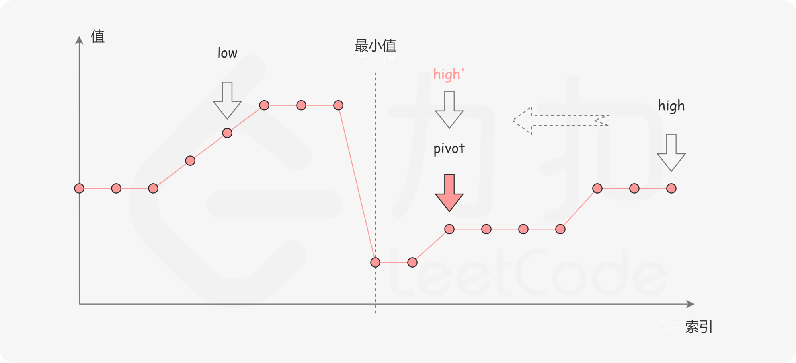

# 剑指 Offer 11. 旋转数组的最小数字

## 题目

难度: 简单

把一个数组最开始的若干个元素搬到数组的末尾，我们称之为数组的旋转。

给你一个可能存在 **重复** 元素值的数组 numbers ，它原来是一个升序排列的数组，并按上述情形进行了一次旋转。请返回旋转数组的**最小元素**。例如，数组 [3,4,5,1,2] 为 [1,2,3,4,5] 的一次旋转，该数组的最小值为 1。  

注意，数组 `[a[0], a[1], a[2], ..., a[n-1]]` 旋转一次 的结果为数组 `[a[n-1], a[0], a[1], a[2], ..., a[n-2]]` 。

**示例 1：**

```
输入：numbers = [3,4,5,1,2]
输出：1

```

**示例 2：**

```
输入：numbers = [2,2,2,0,1]
输出：0

```

注意：本题与主站 154 题相同：<https://leetcode-cn.com/problems/find-minimum-in-rotated-sorted-array-ii/>

> 来源: 力扣（LeetCode）  
> 链接: <https://leetcode.cn/problems/xuan-zhuan-shu-zu-de-zui-xiao-shu-zi-lcof/>  
> 著作权归领扣网络所有。商业转载请联系官方授权，非商业转载请注明出处。

## 思路

一个包含重复值的数组旋转后可能如下：


其中横轴表示数组元素的下标，纵轴表示数组元素的值。图中标出了最小值的位置，是我们需要查找的目标。

在最小值右侧的元素，它们的值一定都小于等于 x；而在最小值左侧的元素，它们的值一定都大于等于 x。因此，我们可以根据这一条性质，通过二分查找的方法找出最小值。

在二分查找的每一步中，左边界为 low，右边界为 high，区间的中点为 pivot，最小值就在该区间内。我们将中轴元素 *numbers*[*pivot*] 与右边界元素 *numbers*[*high*] 进行比较，可能会有以下的三种情况：

### 1. 情况一：numbers[pivot] < numsbers[high]

第一种情况是 numbers[pivot] < numsbers[high]。如下图所示，这说明 `[pivot + 1, high]`中肯定不存在最小值元素，因此我们可以忽略二分查找区间的右半部分。



#### 2. 情况二：numbers[pivot] > numsbers[high]

第二种情况是 numbers[pivot] > numsbers[high]。如下图所示，这说明 numbers[pivot] 是最小值左侧的元素，因此我们可以忽略二分查找区间的左半部分。


#### 3. 情况三：numbers[pivot] == numsbers[high]

第三种情况是 numbers[pivot] == numsbers[high]。如下图所示，由于重复元素的存在，我们并不能确定 numbers[pivot] 究竟在最小值的左侧还是右侧，因此我们不能莽撞地忽略某一部分的元素。我们唯一可以知道的是，由于它们的值相同，所以无论 numsbers[high] 是不是最小值，都有一个它的「替代品」numbers[pivot]，因此我们可以忽略二分查找区间的右端点。


## 答案

> 考试时画图。

```c++
class Solution {
public:
    int minArray(vector<int>& numbers) {
        int left = 0;
        int right = numbers.size() - 1;

        while (left < right) {
            int mid = (right - left) / 2 + left;
            int mid_val = numbers[mid];

            if (mid_val < numbers[right]) {
                right = mid;
            } else if (mid_val > numbers[right]) {
                left = mid + 1;
            } else {
                // 3) mid_val == numbers[right]
                right--;
            }
        }

        // 此时 left == right
        return numbers[left];
    }
};
```
