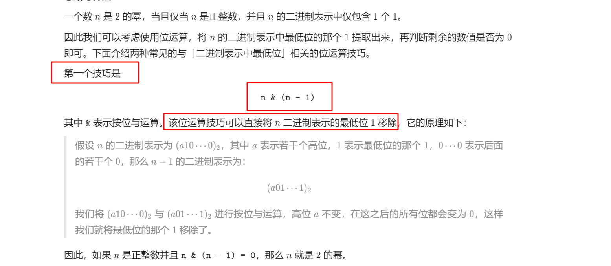
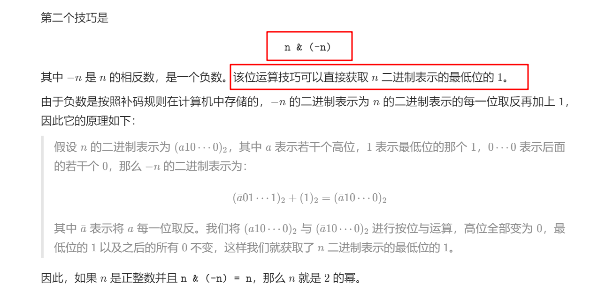

# 231. 2 的幂

## 题目

难度: 简单

给你一个整数 n，请你判断该整数是否是 2 的幂次方。如果是，返回 true ；否则，返回 false 。

如果存在一个整数 x 使得 `n == 2^x` ，则认为 n 是 2 的幂次方。

**示例 1：**

```
输入：n = 1
输出：true
解释：20 = 1

```

**示例 2：**

```
输入：n = 16
输出：true
解释：24 = 16

```

**示例 3：**

```
输入：n = 3
输出：false

```

**示例 4：**

```
输入：n = 4
输出：true

```

**示例 5：**

```
输入：n = 5
输出：false

```

**进阶：** 你能够不使用循环/递归解决此问题吗？

> 来源: 力扣（LeetCode）  
> 链接: <https://leetcode.cn/problems/power-of-two/>  
> 著作权归领扣网络所有。商业转载请联系官方授权，非商业转载请注明出处。

## 答案

### 1. 方法一

逐位检查：

```c++
class Solution {
public:
    // 原理: 2的幂二进制只有最高位是1
    bool isPowerOfTwo(int n) {
        if (n <= 0) {
            return false;
        }

        while (n != 1) {
            if (n % 2 == 1) {
                return false;
            }
            n = n >> 1;
        }

        return true;
    }
};
```

### 2. 方法二：位运算



```c++
class Solution {
public:
    // 原理: 2的幂二进制只有最高位是1
    bool isPowerOfTwo(int n) {
        // 将最低位的1移除, 如果等于0返回true
        return n > 0 && (n & (n - 1)) == 0;
    }
};
```

### 3. 方法三：位运算



```c++
class Solution {
public:
    // 原理: 2的幂二进制只有最高位是1
    bool isPowerOfTwo(int n) {
        return n > 0 && (n & (-n)) == n;
    }
};
```
