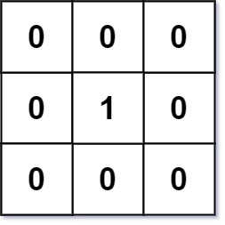
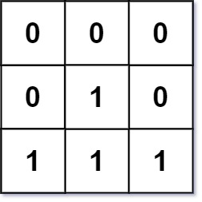

# 542. 01 矩阵

## 题目

难度: 中等

给定一个由 0 和 1 组成的矩阵 mat ，请输出一个大小相同的矩阵，其中每一个格子是 mat 中对应位置元素到最近的 0 的距离。

两个相邻元素间的距离为 1 。

**示例 1：**



```
输入：mat = [[0,0,0],[0,1,0],[0,0,0]]
输出：[[0,0,0],[0,1,0],[0,0,0]]

```

**示例 2：**



```
输入：mat = [[0,0,0],[0,1,0],[1,1,1]]
输出：[[0,0,0],[0,1,0],[1,2,1]]

```

> 来源: 力扣（LeetCode）  
> 链接: <https://leetcode.cn/problems/01-matrix/>  
> 著作权归领扣网络所有。商业转载请联系官方授权，非商业转载请注明出处。

## 答案

```c++
class Solution {
public:
    vector<vector<int>> updateMatrix(vector<vector<int>>& mat) {
        int m = mat.size();
        int n = mat[0].size();

        vector<vector<int>> dp(m, vector<int>(n, INT_MAX / 2));  // 防止溢出

        for (int i = 0; i < m; i++) {
            for (int j = 0; j < n; j++) {
                if (mat[i][j] == 0) {
                    dp[i][j] = 0;
                    continue;
                }

                // mat[i][j] == 1
                if (j  - 1 >= 0) {
                    dp[i][j] = std::min(dp[i][j], dp[i][j - 1] + 1);
                }
                if (i - 1 >= 0) {
                    dp[i][j] = std::min(dp[i][j], dp[i - 1][j] + 1);
                }
            }
        }

        for (int i = m - 1; i >= 0; --i) {
            for (int j = n - 1; j >= 0; --j) {
                if (j + 1 < n) {
                    dp[i][j] = std::min(dp[i][j], dp[i][j + 1] + 1);
                }
                if (i + 1 < m) {
                    dp[i][j] = std::min(dp[i][j], dp[i + 1][j] + 1);
                }
            }
        }

        return dp;
    }
};
```
