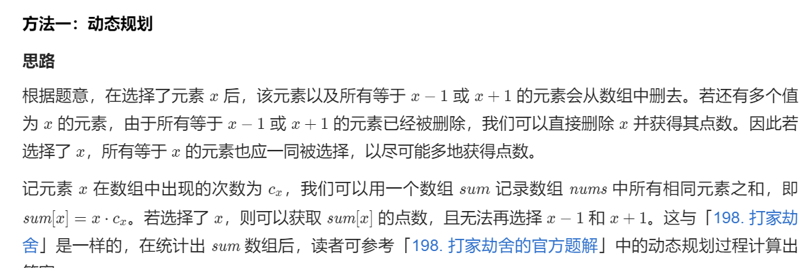

# 740. 删除并获得点数

## 题目

难度: 中等

给你一个整数数组 nums ，你可以对它进行一些操作。

每次操作中，选择任意一个 nums[i] ，删除它并获得 nums[i] 的点数。之后，你必须删除 **所有**等于 nums[i] - 1 和 nums[i] + 1 的元素。

开始你拥有 0 个点数。返回你能通过这些操作获得的最大点数。

**示例 1：**

```
输入：nums = [3,4,2]
输出：6
解释：
删除 4 获得 4 个点数，因此 3 也被删除。
之后，删除 2 获得 2 个点数。总共获得 6 个点数。

```

**示例 2：**

```
输入：nums = [2,2,3,3,3,4]
输出：9
解释：
删除 3 获得 3 个点数，接着要删除两个 2 和 4 。
之后，再次删除 3 获得 3 个点数，再次删除 3 获得 3 个点数。
总共获得 9 个点数。

```

> 来源: 力扣（LeetCode）  
> 链接: <https://leetcode.cn/problems/delete-and-earn/>  
> 著作权归领扣网络所有。商业转载请联系官方授权，非商业转载请注明出处。

## 答案

### 1. 动态规划

==重点在于转化成打家劫舍问题==。



```c++
class Solution {
public:
    // 这里退化成和 打家劫舍 一样的逻辑
    int rob(const std::vector<int>& nums) {
        int n = nums.size();  // n >= 2

        // dp[i] 表示到第 i 家为止最大的抢劫金额
        std::vector<int> dp(n);
        dp[0] = nums[0];
        dp[1] = std::max(nums[0], nums[1]);
        for (int i = 2; i < n; i++) {
            dp[i] = std::max(dp[i - 2] + nums[i], dp[i - 1]);
        }
        return dp[n - 1];
    }

    int deleteAndEarn(vector<int>& nums) {
        // 获取最大值
        int max_value = 0;
        for (int val : nums) {
            max_value = std::max(max_value, val);
        }

        // 获取每个元素的总和的 hash 数组
        std::vector<int> val2sum(max_value + 1);
        for (int val : nums) {
            val2sum[val] += val;
        }

        return rob(val2sum);
    }
};
```
