# 并查集

## 简介

并查集主要用于解决元素分组的问题，它管理了一系列 **不相交的集合**，并支持两种操作：

* 合并（Union）：把两个不相交的集合合并为一个集合。
* 查询（Find）：查询两个元素是否在同一个集合中。

## 例子

以 **（洛谷 P1551）亲戚** 为例：

### 1. 背景

若某个家族人员过于庞大，要判断两个是否是亲戚，确实还很不容易，现在给出某个亲戚关系图，求任意给出的两个人是否具有亲戚关系。

### 2. 题目描述

规定：x 和 y 是亲戚，y 和 z 是亲戚，那么 x 和 z 也是亲戚。如果 x 和 y 是亲戚，那么 x 的亲戚都是 y 的亲戚，y 的亲戚也都是 x 的亲戚。

### 3. 输入格式

第一行：三个整数 n,m,p，（n<=5000,m<=5000,p<=5000），分别表示有 n 个人，m 个亲戚关系，询问 p 对亲戚关系。  
以下 m 行：每行两个数 Mi，Mj，1<=Mi，Mj<=N，表示 Mi 和 Mj 具有亲戚关系。  
接下来 p 行：每行两个数 Pi，Pj，询问 Pi 和 Pj 是否具有亲戚关系。

### 4. 输出格式

P 行，每行一个’Yes’或’No’。表示第 i 个询问的答案为“具有”或“不具有”亲戚关系。

### 5. 题目分析

这其实是一个很有现实意义的问题。我们可以建立模型，把所有人划分到若干个不相交的集合中，每个集合里的人彼此是亲戚。为了判断两个人是否为亲戚，只需看它们是否属于同一个集合即可。因此，这里就可以考虑用并查集进行维护了。

## 并查集的引入

并查集的重要思想在于，**用集合中的一个元素代表集合**。我曾看过一个有趣的比喻，把集合比喻成 **帮派**，而代表元素则是 **帮主**。接下来我们利用这个比喻，看看并查集是如何运作的。

一开始所有的大侠各自为战，他们各自的帮主自然就是自己。

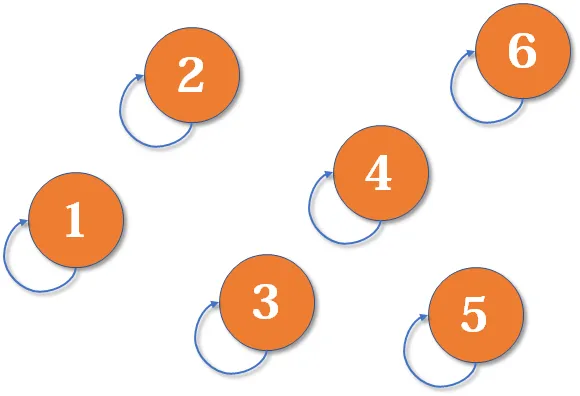

现在 1 号和 3 号比武，假设 1 号赢了（这里并不关心谁赢），那么 3 号就认 1 号作帮主（合并 1 号和 3 号所在的集合， 1 号为代表元素）。

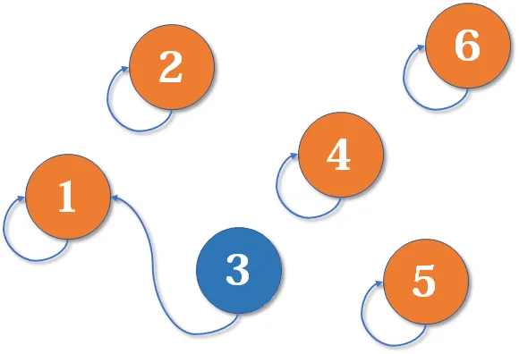

现在 2 号想和 3 号比武（合并 3 号和 2 号所在的集合），但 3 号表示：别和我打，让我帮主来收拾你（合并代表元素）。不妨设这次又是 1 号赢了，那么 2 号也认 1 号做帮主。

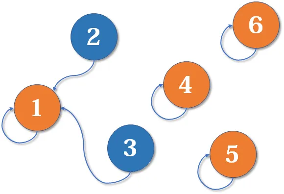

现在我们假设 4、5、6 号也进行了一番帮派合并，江湖局势变成下面这样：

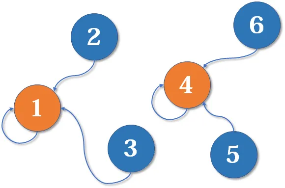

现在假设 2 号想和 6 号比，和刚刚说的一样，喊帮主 1 号和 4 号出来打一架。1 号胜利后，4 号认 1 号为帮主，当然他的手下也都跟着投降了。

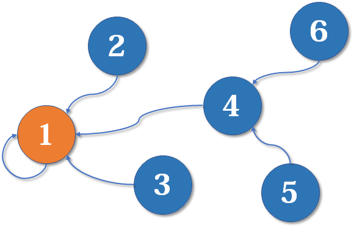

到此比喻结束了。如果你有一点图论基础，相信你已经察觉到这是一个 **树状结构**，要寻找到集合的代表元素，只需要一层一层往上访问 **父结点**（图中箭头所指的圆），直达树的 **根节点**（图中橙色圆）即可。**根节点的父结点是它自己，我们可以直接把它画成一棵树**：

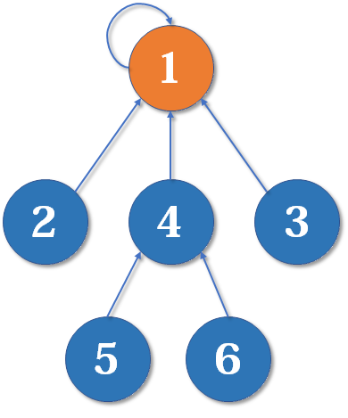

## 简单版本的并查集代码

基于上述讨论，我们可以写出最简单版本的并查集代码。

### 1. 初始化

假设有 n 个元素，我们用一个数组 `fa[]` 来存储每个元素的父结点（因为每个元素有且只有一个父结点，所以这是可行的）。**初始化时我们将每个节点的父结点设置成它自己**。

```c++
int fa[MAXN];
inline void init(int n)
{
    for (int i = 1; i <= n; ++i)
        fa[i] = i;
}
```

### 2. 查询

我们用递归方法实现 **对代表元素的查询**：一层一层地访问父结点直到根节点（根节点的父结点是它自己）。

> 要判断两个元素是否属于同一个集合，只需要看他们的根节点是否相同即可。

```c++
int find(int x)
{
    if(fa[x] == x)
        return x;
    else
        return find(fa[x]);
}
```

### 3. 合并

合并操作也比较简单，首先找到两个集合的代表元素，然后将前者的父结点设为后者即可。当然也可以将后者的父结点设为前者，这里并不重要。后续会给出来一个更合理的比较方法。

```c++
inline void merge(int i, int j)
{
    fa[find(i)] = find(j);
}
```

## 路径压缩

最简单的并查集效率是比较低的。

例如看下面这个场景：

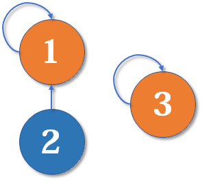

现在我们要 `merge(2, 3)` ，于是从 2 找到根节点 1，令 `fa[1] = 3`，于是变成了这样：


同理我们再找来一个元素 4，并需要执行 `merge(2, 4)`：

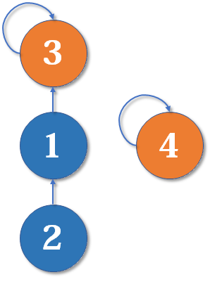

从 2 找到根节点 3，然后 `f[3] = 4`，此时树结构变成这样：


这种做法会让树结构编程一条长链，我们想要从底部找到根节点的时间会越来越长。

既然我们只关心一个元素对应的根节点，那我们希望每个元素到根节点的路径尽可能短，最好只需要一步（这也被称为 **路径压缩**）：

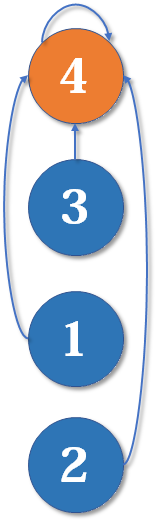

其实这说来也很好实现。只要我们在查询的过程中，**把沿途的每个节点的父节点都设为根节点** 即可。下一次再查询时，我们就可以省很多事。这用递归的写法很容易实现：

```c++
int find(int x)
{
    if(x == fa[x])
        return x;
    else{
        fa[x] = find(fa[x]);  //父节点设为根节点
        return fa[x];         //返回父节点
    }
} 
```

以上代码往往简写成一行：

```c++
int find(int x)
{
     # 注意 = 运算符优先级没有三元运算符 ? 高, 因此这里要加括号
    return x == fa[x] ? x : (fa[x] = find(fa[x]));
}
```

## 按秩合并

### 1. 介绍

路径压缩优化后，并查集的时间复杂度已经很低了，绝大多数不相交集合的合并查询问题都能够解决。然而对于某些时间卡得很紧的题目，我们还可以进一步优化。

有些人可能有一个误解，以为路径压缩优化后，并查集始终都是一个 **菊花图**（只有两层的树的俗称）。但其实，由于路径压缩只在查询时进行，也只压缩一条路径，所以并查集最终的结构仍然可能是比较复杂的。例如，现在我们有一棵较复杂的树需要与一个单元素的集合合并：

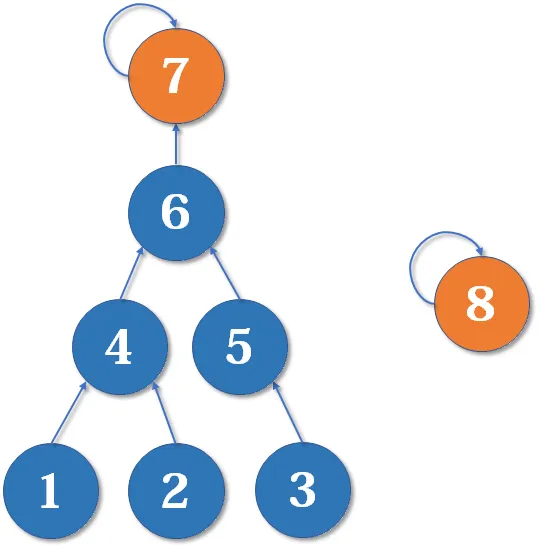

假如这时我们要 `merge(7, 8)`，如果我们可以选择的话，还是把 7 的父结点设为 8 好，还是把 8 的父结点设为 7 呢？

当然是后者，因为如果把 7 的父节点设为 8，会使树的 **深度**（树中最长链的长度）加深，原来的树中每个元素到根节点的距离都变长了，之后我们寻找根节点的路径也就会相应变长。虽然我们有路径压缩，但路径压缩也是会消耗时间的。而把 8 的父节点设为 7，则不会有这个问题，因为它没有影响到不相关的节点。

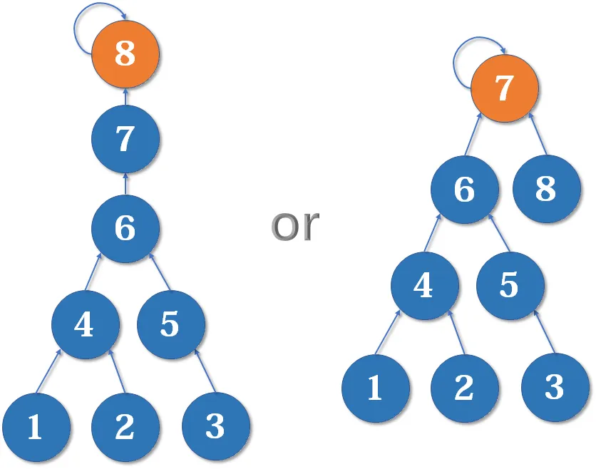

这启发我们：应该把简单的树往复杂的树上合并，而不是相反。因为这样合并后，到根节点距离变长的节点个数比较少。

我们用一个数组 `rank[]` 记录每个根节点对应的树的深度（如果不是根节点，其 rank 相当于以它作为根节点的 **子树** 的深度）。一开始，把所有元素的 rank（**秩**）设为 1。合并时比较两个根节点，把 rank 较小者往较大者上合并。

路径压缩和按秩合并如果一起使用，时间复杂度接近 $O(n)$ ，但是很可能会破坏 rank 的准确性。

### 2. 初始化（按秩合并）

```c++
inline void init(int n)
{
    for (int i = 1; i <= n; ++i)
    {
        fa[i] = i;
        rank[i] = 1;
    }
}
```

### 3. 合并（按秩合并）

```c++
inline void merge(int i, int j)
{
    int x = find(i), y = find(j);    //先找到两个根节点
    if (rank[x] <= rank[y])
        fa[x] = y;
    else
        fa[y] = x;
    if (rank[x] == rank[y] && x != y)
        rank[y]++;                   //如果深度相同且根节点不同，则新的根节点的深度+1
}
```

为什么深度相同，新的根节点深度要+1？如下图，我们有两个深度均为2的树，现在要`merge(2, 5)`：

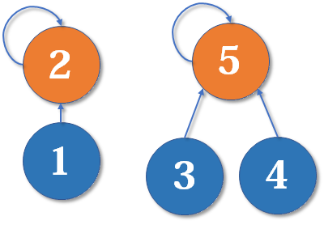
这里把 2 的父结点设为 5，或者把 5 的父结点设为 2 其实没多大区别。我们选择前者：

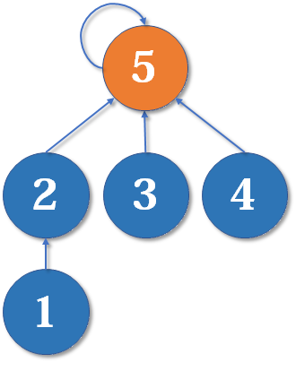

显然树的深度增加了 1，另一种合并方式同样会让树的深度 + 1。

## 亲戚问题的 AC 代码

```c++
#include <cstdio>
#define MAXN 5005
int fa[MAXN], rank[MAXN];
inline void init(int n)
{
    for (int i = 1; i <= n; ++i)
    {
        fa[i] = i;
        rank[i] = 1;
    }
}
int find(int x)
{
    return x == fa[x] ? x : (fa[x] = find(fa[x]));
}
inline void merge(int i, int j)
{
    int x = find(i), y = find(j);
    if (rank[x] <= rank[y])
        fa[x] = y;
    else
        fa[y] = x;
    if (rank[x] == rank[y] && x != y)
        rank[y]++;
}
int main()
{
    int n, m, p, x, y;
    scanf("%d%d%d", &n, &m, &p);
    init(n);
    for (int i = 0; i < m; ++i)
    {
        scanf("%d%d", &x, &y);
        merge(x, y);
    }
    for (int i = 0; i < p; ++i)
    {
        scanf("%d%d", &x, &y);
        printf("%s\n", find(x) == find(y) ? "Yes" : "No");
    }
    return 0;
}
```

## Reference

[1] <https://zhuanlan.zhihu.com/p/93647900>
