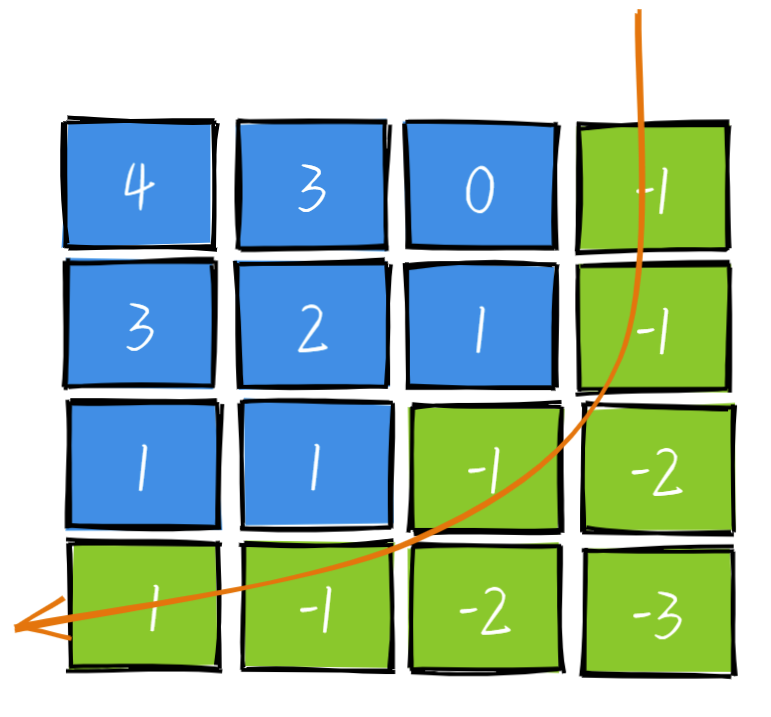

# 1351. 统计有序矩阵中的负数

## 题目

难度: 简单

给你一个 m * n 的矩阵 grid，矩阵中的元素无论是按行还是按列，都以非递增顺序排列。 请你统计并返回 grid 中 **负数** 的数目。

**示例 1：**

```
输入：grid = [[4,3,2,-1],[3,2,1,-1],[1,1,-1,-2],[-1,-1,-2,-3]]
输出：8
解释：矩阵中共有 8 个负数。

```

**示例 2：**

```
输入：grid = [[3,2],[1,0]]
输出：0

```

**进阶：** 你可以设计一个时间复杂度为 O(n + m) 的解决方案吗？

> 来源: 力扣（LeetCode）  
> 链接: <https://leetcode.cn/problems/count-negative-numbers-in-a-sorted-matrix/>  
> 著作权归领扣网络所有。商业转载请联系官方授权，非商业转载请注明出处。

## 思路



从右上角开始遍历：

* `grid[i][j] < 0`,说明第i列到第row - 1列都是0，所以 j--
* `grid[i][j] > 0`, 说明第0行到第j行都大于0，所以i++

## 答案

```c++
class Solution {
public:
    int countNegatives(vector<vector<int>>& grid) {
        int m = grid.size();
        int n = grid[0].size();

        int res = 0;
        // 从右上角开始搜索
        int i = 0;
        int j = n - 1;
        while (i < m && j >= 0) {
            if (grid[i][j] < 0) {
                res += m - i;
                j--;
            } else {
                i++;
            }
        }
        return res;
    }
};
```
